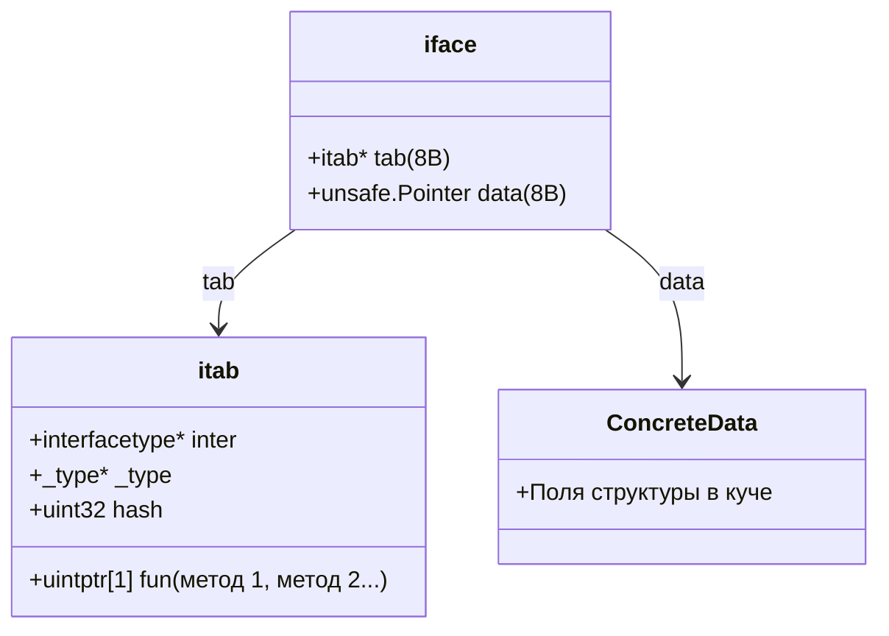
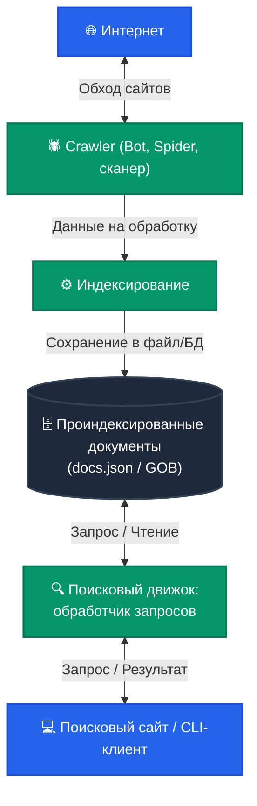

# Том 2: ООП в Go, Методы, Интерфейсы, Ввод-вывод и Обработка ошибок

> [!TIP]
> 📚 **Навигация:** [⬅️ Назад: Том 1](01-go-core-basics.md) | [📖 Главное оглавление](README.md) | [Вперед: Том 3 (Конкурентность) ➡️](03-go-core-concurrency.md)

> [!IMPORTANT]
> 💻 **Практика, примеры кода и домашние задания к этому тому:**
> - 📂 **Код лекций:** [05-io](file:///Users/user/workspace/golang_projects/go-core-4/go_course_4/05-io) (Файлы, `io.Reader/Writer`, буферизация, JSON/gob), [06-oop](file:///Users/user/workspace/golang_projects/go-core-4/go_course_4/06-oop) (Методы, структуры, композиция, DIP), [09-interfaces](file:///Users/user/workspace/golang_projects/go-core-4/go_course_4/09-interfaces) (Интерфейсы `iface`/`eface`, type assertions).
> - 🎯 **Задачник:** [homework-tasks.md (Уроки 8–9, Занятия 5–6, ДЗ 9)](file:///Users/user/workspace/golang_projects/go-core-4/go_course_4/go-documentation/homework-tasks.md#урок-8-структуры-указатели-и-методы-бизнес-модель-goflex).
> - 🛠️ **Решения домашних заданий:**
>   - [homework-05](file:///Users/user/workspace/golang_projects/go-core-4/go_course_4/homework-05) — Персистентность индекса GoSearch, сохранение и загрузка через `io.Writer`/`io.Reader`.
>   - [homework-06](file:///Users/user/workspace/golang_projects/go-core-4/go_course_4/homework-06) — ООП-рефакторинг GoSearch: сервисный слой `engine` и инверсия зависимостей.
>   - [homework-09](file:///Users/user/workspace/golang_projects/go-core-4/go_course_4/homework-09) — Контракты интерфейсов хранилища документов GoSearch.
> - 🗺️ **Сквозной путеводитель:** [course-codebase-guide.md (Этап 1: Уроки 05–06; Этап 2: Урок 09)](file:///Users/user/workspace/golang_projects/go-core-4/go_course_4/go-documentation/course-codebase-guide.md#урок-05-потоковый-ввод-вывод-файлы-и-json).

---

## 9. Методы и Интерфейсы (Methods & Interfaces)

> 🔗 **Практика и примеры кода:** [06-oop](file:///Users/user/workspace/golang_projects/go-core-4/go_course_4/06-oop), [09-interfaces](file:///Users/user/workspace/golang_projects/go-core-4/go_course_4/09-interfaces) | 🛠️ **Домашние задания:** [homework-06 (ООП)](file:///Users/user/workspace/golang_projects/go-core-4/go_course_4/homework-06), [homework-09 (Интерфейсы)](file:///Users/user/workspace/golang_projects/go-core-4/go_course_4/homework-09) | 🎯 **Задачи:** [homework-tasks.md (Урок 9)](file:///Users/user/workspace/golang_projects/go-core-4/go_course_4/go-documentation/homework-tasks.md#урок-9-интерфейсы-полиморфизм-и-type-switch), [homework-tasks.md (Занятие 6)](file:///Users/user/workspace/golang_projects/go-core-4/go_course_4/go-documentation/homework-tasks.md#занятие-6-ооп-в-go--структуры-методы-и-идиоматичный-рефакторинг), [homework-tasks.md (ДЗ 9)](file:///Users/user/workspace/golang_projects/go-core-4/go_course_4/go-documentation/homework-tasks.md#домашнее-задание-9-интерфейсы-в-go)

Интерфейсы в Go реализуются **неявно (Duck Typing)**: если тип содержит все методы интерфейса, он автоматически удовлетворяет контракту этого интерфейса без ключевых слов `implements`.

---

### 9.0. Парадигма ООП в Go: Методология, Stateful vs Stateless и Dependency Injection

В Go **нет ключевого слова `class`**, нет иерархий наследования типов (`extends`), нет перегрузки методов (`overloading`) и нет синтаксических конструкторов. Тем не менее, Go поддерживает ключевые принципы объектно-ориентированного программирования (ООП) в своей собственной, прагматичной парадигме.

#### 💡 Что такое ООП в понимании создателей Go:

> **ООП в Go** — это способ решения прикладных задач с помощью **структур данных** (`struct`) и **методов**, привязанных к этим данным через аргумент-получатель (`receiver`).

| Концепция классического ООП      | Реализация в Go                              | Описание                                                                                                  |
| -------------------------------- | -------------------------------------------- | --------------------------------------------------------------------------------------------------------- |
| **Класс (Class)**                | **Структура (`struct`)** или именованный тип | Описание полей данных и типов.                                                                            |
| **Объект (Object)**              | **Экземпляр структуры**                      | Переменная любого типа, имеющего методы.                                                                  |
| **Метод (Method)**               | **Функция с ресивером**                      | Функция, явно связанная с типом через аргумент-получатель: `func (u *User) Save()`.                       |
| **Инкапсуляция (Encapsulation)** | **Видимость на уровне пакета**               | Имена с маленькой буквы (`balance`) скрыты внутри пакета; имена с заглавной (`Balance`) доступны снаружи. |
| **Наследование (Inheritance)**   | **Композиция (Embedding)**                   | Встраивание одного типа в другой (`Person` внутри `Employee`) вместо иерархий классов.                    |
| **Полиморфизм (Polymorphism)**   | **Интерфейсы (Interfaces)**                  | Неявная реализация контракта (Duck Typing): тип реализует интерфейс, если имеет нужные методы.            |

#### ⚖️ Архитектурный выбор парадигмы: ООП (Stateful) vs Процедурный (Stateless) vs Функциональный стиль

Go — мультипарадигменный язык, предоставляющий свободу выбора стиля под конкретную задачу:

> [!IMPORTANT]
> **Золотое правило архитектуры в Go:**
>
> 1. **Если сущность ХРАНИТ И МУТИРУЕТ СОСТОЯНИЕ (Stateful) между вызовами $\rightarrow$ используем ООП-стиль (`struct` + методы).**  
>    _Что это значит:_ Код строится вокруг структуры-объекта, хранящей внутренние данные (баланс, список соединений, кэш), а методы меняют эти данные во времени (например, `cart.AddItem()`, `db.Connect()`).
> 2. **Если у пакета НЕТ СОБСТВЕННОГО СОСТОЯНИЯ (Stateless) $\rightarrow$ используем ПРОЦЕДУРНЫЙ стиль (обычные функции).**  
>    _Что это значит:_ Набор независимых функций-утилит. Приняли данные на вход $\rightarrow$ обработали $\rightarrow$ вернули результат. Функция ничего не «помнит» о предыдущих вызовах (например, `math.Sqrt(x)`, `strings.ToUpper(s)`).
> 3. **Если нужны ЧИСТЫЕ ПРЕОБРАЗОВАНИЯ, КОНВЕЙЕРЫ ДАННЫХ ИЛИ MIDDLEWARE $\rightarrow$ используем ФУНКЦИОНАЛЬНЫЙ стиль.**  
>    _Что это значит:_ Функции используются как обычные значения (first-class citizens): передаются в другие функции как аргументы или возвращаются из них (замыкания). Данные не меняются на месте, а преобразуются в новые (например, HTTP-middleware, предикаты `sort.Slice`, Functional Options `WithPort()`).

#### 📊 Сравнительная таблица трёх парадигм в Go:

| Критерий                            | ООП-стиль (Объектный)                                                                      | Процедурный стиль                                                                                    | Функциональный стиль                                                                            |
| :---------------------------------- | :----------------------------------------------------------------------------------------- | :--------------------------------------------------------------------------------------------------- | :---------------------------------------------------------------------------------------------- |
| **Основная единица**                | **Структура + Методы** (`type S struct`, `func (s *S)`)                                    | **Функция** (`func DoSomething(args)`)                                                               | **Чистая функция / Замыкание** (`func(T) R`, First-Class Funcs)                                 |
| **Работа с состоянием**             | **Stateful:** состояние инкапсулировано внутри полей структуры и мутируется между вызовами | **Stateless:** состояние не сохраняется; каждый вызов независим                                      | **Immutable:** состояние не мутируется, возвращаются новые копии данных                         |
| **Побочные эффекты (Side-Effects)** | Допустимы: изменение внутренних полей объекта                                              | Допустимы: печать, запись в файл, мутация переданных аргументов                                      | ❌ Строго запрещены (Pure Functions): результат зависит только от аргументов                    |
| **Управление потоком**              | Вызовы методов экземпляров (`cart.Add(item)`)                                              | Циклы `for`, ветвления `if/switch`, пошаговые инструкции                                             | `Map`, `Filter`, `Reduce`, композиция функций, рекурсия                                         |
| **Где применяется в Go**            | Поисковые движки (`Engine`), пулы БД (`pgxpool`), кэш, корзины, серверы                    | Математика (`math`), утилиты строк (`strings`), хэширование (`crypto`), ввод-вывод (`storage.Store`) | HTTP Middleware, компараторы (`sort.Slice`), Functional Options (`WithTimeout`), потоки событий |

#### 🎯 Практические примеры применения в Go:

1. **Когда СТРОГО нужен ООП-стиль (Stateful):**
   Пакет описывает сущность, которая живёт во времени и накапливает/изменяет данные между запросами:
   - **Поисковый движок `Engine`:** хранит индекс документов, размер базы, ссылки на сканеры.
   - **Кэш (`Cache`):** хранит хэш-таблицу в памяти и периодически очищает устаревшие ключи.
   - **Корзина покупок (`Cart`):** хранит товары пользователя на протяжении всей сессии.
   - **Пул соединений с БД (`DBPool`):** хранит активные TCP-сокеты и распределяет их между горутинами.

2. **Когда СТРОГО нужен Процедурный стиль (Stateless):**
   Пакет не хранит память между вызовами, а выполняет чистую пошаговую работу:
   - Библиотека `math`: функции `math.Sqrt(x)`, `math.Hypot(dx, dy)` — у них нет "состояния математики", они просто считают результат по формуле.
   - Библиотека `strings`: `strings.Contains(s, substr)`, `strings.ToLower(s)` — функции не помнят предыдущие вызовы.
   - Пакеты сериализации: `storage.Store(w, docs)` — просто сериализует срез в поток.

3. **Где функциональные элементы ДОПУСТИМЫ (точечное применение):**
   - **HTTP Middleware:** `func(http.Handler) http.Handler` — цепочки обработчиков запросов.
   - **Предикаты сортировки:** `sort.Slice(users, func(i, j int) bool { return users[i].Age < users[j].Age })`.
   - **Паттерн Functional Options:** гибкое конфигурирование `NewServer(WithPort(8080), WithTimeout(5*time.Second))`.

4. **🚫 Почему в Go НЕ РЕКОМЕНДУЕТСЯ писать в чисто функциональном стиле (FP как антипаттерн):**
   Попытка писать на Go как на Haskell, Clojure или Scala — частая ошибка разработчиков, пришедших из других языков:
   - **Утечки в кучу (Escape Analysis) и лишние аллокации:** Замыкания в Go часто приводят к тому, что захваченные переменные «убегают» в кучу (Heap), создавая дополнительную нагрузку на Garbage Collector. Простой процедурный цикл `for` обычно работает на стеке, быстро и **без аллокаций**.
   - **Отсутствие оптимизации хвостовой рекурсии (No Tail Call Optimization, TCO):** В функциональных языках вместо циклов используют рекурсию. Go **не гарантирует оптимизацию хвостовых вызовов** (компилятор её не делает). Стек горутины растёт динамически, но ограничен (по умолчанию 1 ГБ на 64-битных платформах), а его переполнение — это неперехватываемая фатальная ошибка `fatal error: stack overflow`.
   - **Конфликт с обработкой ошибок:** Идиома Go — явная проверка `val, err := fn()`. В цепочке `Map().Filter().Reduce()` невозможно идиоматично вернуть и обработать `error` на 3-м шаге без костылей (паник или чуждых языку монад).
   - **Философия Go («Clear is better than clever»):** Простой процедурный цикл `for` с `if` понятен любому разработчику мгновенно. Сложные функциональные нагромождения ухудшают читаемость и усложняют отладку.

5. **Пограничные сценарии (например, конвертер валют):**
   - _Процедурный стиль:_ если конвертер просто умножает рубли на фиксированный курс `Convert(rub, rate)` $\rightarrow$ достаточно одной функции.
   - _ООП-стиль:_ если конвертер обращается по сети к API ЦБ, кэширует курсы валют в памяти и обновляет их раз в сутки фоновым тикером $\rightarrow$ обязателен ООП-стиль `type RateConverter struct { cache map[string]float64; client *http.Client }`.

#### 🏛️ Внедрение зависимостей (Dependency Injection) на верхнем уровне системы

> **Зависимость** — любой внешний объект или сервис, необходимый для работы подсистемы (пул соединений с СУБД, Redis-кэш, логгер, сетевой робот-краулер или поисковый индекс).

##### 1. В чём проблема: как делать НЕЛЬЗЯ (Жёсткая связность / Tight Coupling)

Если структура внутри своего конструктора сама напрямую создаёт конкретную реализацию зависимости, код становится намертво привязан к внешнему миру:

```go
// ❌ АНТИПАТТЕРН: жестко зашитая зависимость внутри конструктора
type Engine struct {
    crawler *spider.Spider // жесткая привязка к конкретному сетевому пауку!
    index   *index.Service
}

func NewEngine() *Engine {
    return &Engine{
        crawler: spider.New(), // ⚠️ САМ полез в сеть и создал зависимость!
        index:   index.New(),
    }
}
```

**Последствия такой архитектуры:**
1. **Тесты ломаются без интернета:** Юнит-тест логики движка вынужден делать реальные HTTP-запросы в сеть. Если нет связи, упал DNS или изменилась разметка сайта `go.dev` — тесты упадут с ошибкой.
2. **Медленные тесты:** Вместо 1 миллисекунды запуск тестового набора занимает 10–30 секунд.
3. **Невозможность расширения (нарушение принципа Open/Closed):** Если завтра потребуется сканировать локальные PDF-файлы или sitemap, придётся переписывать весь код `Engine`.

---

##### 2. Архитектурное решение: Dependency Injection (DI) через интерфейсы

В Go применяется принцип: **«Принимай интерфейсы, возвращай структуры»** (*Accept interfaces, return structs*).

Движок `Engine` не должен зависеть от конкретного `Spider`. Он должен зависеть лишь от **абстрактного контракта (интерфейса)**:

```
┌────────────────────────────────────────────────────────┐
│                   Точка сборки (main)                  │
│                                                        │
│  var cr crawler.Interface                              │
│                                                        │
│    В Production:               В Unit-тестах:          │
│    cr = spider.New()           cr = membot.New()       │
│    (сетевой робот по HTTP)     (заглушка в RAM без сети)│
└───────────────────────┬────────────────────────────────┘
                        │
                        ▼ New(cr, idx)
┌────────────────────────────────────────────────────────┐
│                     Engine (Ядро)                      │
│                                                        │
│  Поле: cr crawler.Interface                            │
│  Ничего не знает о сети и реализации.                  │
│  Просто вызывает cr.Scan(...) через контракт.         │
└────────────────────────────────────────────────────────┘
```

---

##### 3. Полный пошаговый пример реализации

###### Шаг 1. Контракт (Интерфейс) в `pkg/crawler`:
```go
package crawler

// Document — доменная сущность скачанной страницы
type Document struct {
    ID    int
    URL   string
    Title string
}

// Interface — контракт: любой объект, умеющий Scan(), считается краулером
type Interface interface {
    Scan(url string, depth int) ([]Document, error)
}
```

###### Шаг 2. Движок `Engine` (зависит только от интерфейса):
```go
package engine

import (
    "fmt"
    "go-core-4/homework-06/pkg/crawler"
    "go-core-4/homework-06/pkg/index"
)

type Engine struct {
    cr    crawler.Interface // 👈 Зависимость: интерфейс, а не конкретный тип!
    idx   *index.Service
    docs  []crawler.Document
}

// New — идиоматичный конструктор с внедрением зависимостей (DI):
func New(cr crawler.Interface, idx *index.Service) *Engine {
    return &Engine{
        cr:   cr,
        idx:  idx,
        docs: make([]crawler.Document, 0),
    }
}

func (e *Engine) Scan(urls []string, depth int) error {
    for _, u := range urls {
        docs, err := e.cr.Scan(u, depth) // полиморфный вызов через интерфейс
        if err != nil {
            return fmt.Errorf("ошибка сканирования %s: %w", u, err)
        }
        e.docs = append(e.docs, docs...)
    }
    for _, doc := range e.docs {
        e.idx.Add(doc.ID, doc.Title)
    }
    return nil
}

func (e *Engine) Search(word string) []crawler.Document {
    ids := e.idx.Search(word)
    var results []crawler.Document
    for _, id := range ids {
        for _, doc := range e.docs {
            if doc.ID == id {
                results = append(results, doc)
            }
        }
    }
    return results
}
```

###### Шаг 3. Две взаимозаменяемые реализации:
```go
// 1. Боевой краулер spider (для продакшена, ходит в сеть по HTTP):
type Spider struct{}
func NewSpider() *Spider { return &Spider{} }
func (s *Spider) Scan(url string, depth int) ([]crawler.Document, error) {
    // Реальный сетевой вызов http.Get(...)
    return []crawler.Document{{ID: 1, URL: url, Title: "Страница из сети"}}, nil
}

// 2. Тестовый краулер membot (для юнит-тестов, возвращает данные из памяти):
type MemBot struct{}
func NewMemBot() *MemBot { return &MemBot{} }
func (m *MemBot) Scan(url string, depth int) ([]crawler.Document, error) {
    // Мгновенный ответ без сети за 0.001 мс!
    return []crawler.Document{
        {ID: 10, URL: "https://mock.test/go", Title: "Изучаем Go"},
        {ID: 20, URL: "https://mock.test/rust", Title: "Изучаем Rust"},
    }, nil
}
```

---

##### 4. Где всё собирается: Продакшен против Тестов

###### В продакшене (`cmd/main.go`):
```go
package main

import (
    "fmt"
    "go-core-4/homework-06/pkg/crawler/spider"
    "go-core-4/homework-06/pkg/engine"
    "go-core-4/homework-06/pkg/index"
)

func main() {
    // 1. Верхний уровень (main): создаем боевые сетевые зависимости
    cr := spider.New()       // боевой паук (сеть)
    idx := index.New()       // инвертированный индекс

    // 2. Внедрение зависимостей (DI) в подсистему:
    eng := engine.New(cr, idx)

    // 3. Работа с реальным интернетом:
    eng.Scan([]string{"https://go.dev"}, 1)
    results := eng.Search("Go")
    fmt.Println("Найдено результатов в сети:", len(results))
}
```

###### В быстрых юнит-тестах (`pkg/engine/engine_test.go`):
```go
package engine_test

import (
    "testing"
    "go-core-4/GoSearch/pkg/crawler/membot"
    "go-core-4/homework-06/pkg/engine"
    "go-core-4/homework-06/pkg/index"
)

func TestEngine_Search_Isolated(t *testing.T) {
    // 1. Создаем тестовую заглушку: НИКАКОГО интернета!
    mockCrawler := membot.New()
    idx := index.New()

    // 2. Внедряем заглушку в ТОТ ЖЕ САМЫЙ Engine:
    eng := engine.New(mockCrawler, idx)

    // 3. Тест работает 0.001 секунды и никогда не упадет из-за сети:
    err := eng.Scan([]string{"https://test.local"}, 1)
    if err != nil {
        t.Fatalf("Ошибка: %v", err)
    }

    res := eng.Search("Go")
    if len(res) != 1 {
        t.Fatalf("Ожидали 1 документ, получили %d", len(res))
    }
}
```

> [!TIP]
> **Золотое правило архитектуры Go:**
> - `main()` — единственный «директор завода»: только он знает конкретные типы и решает, какие детали собрать вместе.
> - `Engine` — «станок»: он не знает, откуда берутся данные, а просто принимает зависимости через интерфейс в `New(cr, idx)`.

---

### 9.1. Указатели в ресиверах методов (Pointer vs Value Receivers)

#### 💡 Фундаментальный принцип: Методы — это функции

> **Запомните: метод — это просто функция с аргументом-получателем.**  
> В Go нет классов. Однако вы можете определять методы для типов.  
> **Получатель (receiver)** указывается в собственном списке аргументов **между ключевым словом `func` и именем метода**.
>
> У обычных структур в Go нет скрытой таблицы виртуальных методов (`vtable`): метод компилируется в обычную функцию, первым аргументом которой передаётся ресивер.

Ниже приведён пример `Abs`, написанной как метод и как обычная функция, без изменения функциональности:

```go
package main

import (
    "fmt"
    "math"
)

type Vertex struct {
    X, Y float64
}

// 1. Метод: Vertex является аргументом-получателем (receiver)
func (v Vertex) Abs() float64 {
    return math.Sqrt(v.X*v.X + v.Y*v.Y)
}

// 2. Обычная функция: принимает Vertex как стандартный первый параметр
func Abs(v Vertex) float64 {
    return math.Sqrt(v.X*v.X + v.Y*v.Y)
}

func main() {
    v := Vertex{3, 4}

    // Вызов как метода:
    fmt.Println(v.Abs()) // 5

    // Вызов как обычной функции:
    fmt.Println(Abs(v))  // 5

    // Method Expression (выражение метода):
    // В Go можно получить функцию из метода напрямую от типа!
    // Сигнатура Vertex.Abs — это в точности func(Vertex) float64:
    fn := Vertex.Abs
    fmt.Println(fn(v))   // 5
}
```

---

#### 💡 Методы для неструктурных типов и Правило локальности пакета (Package-Local Type Rule)

В Go методы можно объявлять **не только для структур**, но и для **любых пользовательских типов** (псевдонимов и именованных типов, кроме указателей и интерфейсов):

```go
type MyFloat float64

// Метод для числового типа MyFloat:
func (f MyFloat) Abs() float64 {
    if f < 0 {
        return float64(-f)
    }
    return float64(f)
}

func main() {
    f := MyFloat(-math.Sqrt2)
    fmt.Println(f.Abs()) // 1.4142135623730951
}
```

> [!CAUTION]
> **Фундаментальное правило компилятора Go (Package-Local Type Rule):**  
> Вы можете объявить метод для типа **ТОЛЬКО в том же самом пакете**, в котором определён сам этот тип.
>
> - ❌ **Запрещено для встроенных типов:** `func (i int) Double() int` $\rightarrow$ Ошибка компиляции: `cannot define new methods on non-local type int`.
> - ❌ **Запрещено для типов из чужих пакетов:** `func (t time.Time) IsWeekend() bool` $\rightarrow$ Ошибка компиляции: `cannot define new methods on non-local type time.Time`.
> - ✅ **Идиоматичное решение:** Объявить в своём пакете собственный именованный тип (`type MyInt int`) или структуру с встраиванием (`type CustomTime struct { time.Time }`) и привязывать методы уже к ней.

---

#### 📝 Соглашения об именовании ресиверов и методов (Effective Go & Code Review Comments):

1. **Имя получателя метода (Receiver Name):**
   - Имя ресивера должно быть кратким — **одна или две буквы**, отражающие имя типа (`c` для `Course`, `p` для `Point`, `g` для `Geom`).
   - ❌ **Категорически запрещено** использовать имена `this`, `self` или `me` (Go — не Java и не Python).
   - ❌ **Не рекомендуется** использовать длинные описательные имена, дублирующие тип (`func (geom Geom)` $\rightarrow$ `func (g Geom)`).
2. **Имя методов (Method Naming):**
   - Для геттеров **НЕ используется префикс `Get`**: `user.Name()` вместо `user.GetName()`.
   - Для вычисляемых характеристик объекта **НЕ используются лишние глаголы**: `p.Distance(p2)` вместо `p.CalculateDistance(p2)`.

```go
type User struct {
    Name string
}

// Value receiver: работает с КОПИЕЙ структуры
func (u User) SetNameValue(name string) {
    u.Name = name // Не изменит Name у оригинальной структуры!
}

// Pointer receiver: работает с ОРИГИНАЛОМ структуры по указателю
func (u *User) SetNamePointer(name string) {
    u.Name = name // Изменит Name у оригинального объекта!
}
```

#### Когда выбирать Pointer Receiver (`*T`):

1. Метод должен изменять внутреннее состояние структуры.
2. Структура имеет большой размер (избегаем дорогостоящего копирования памяти при вызове).
3. Структура содержит некопируемые поля (например, `sync.Mutex`).

#### Автоматическое косвенное обращение (Pointer Indirection): методы vs функции

В обычных функциях Go требует **строгого** соответствия типов аргументов:

```go
func ScaleFunc(v *Vertex, f float64) { /* ... */ }

var v Vertex
ScaleFunc(v, 5)  // ❌ Ошибка компиляции: cannot use v (type Vertex) as *Vertex
ScaleFunc(&v, 5) // ✅ OK
```

Но для **методов** компилятор Go выполняет автоматическое косвенное обращение:

1. **Для методов с pointer receiver (`*T`):**  
   Если переменная `v` имеет тип `T`, вызов `v.Scale(5)` автоматически компилируется как `(&v).Scale(5)`.
2. **Для методов с value receiver (`T`):**  
   Если переменная `p` имеет тип `*T`, вызов `p.Abs()` автоматически компилируется как `(*p).Abs()`.

#### ⚖️ Правило консистентности ресиверов: не смешивайте Value и Pointer ресиверы у одного типа

> [!CAUTION]
> **Частая ловушка новичков:** Сделать метод-сеттер для указателя `func (u *User) SetName(...)`, а метод-геттер без указателя `func (u User) Name() string`, рассчитывая, что «геттер ведь ничего не меняет».

Хотя компилятор Go сглаживает синтаксис и автоматически подставляет разыменование `(*ptr).Name()` или взятие адреса `(&val).SetName()`, **смешивать ресиверы у одного типа — грубый антипаттерн**.

##### 4 причины, почему если хотя бы одному методу нужен `*T`, лучше сделать `*T` у всех методов типа (включая геттеры):

1. **Явность намерений (Explicit over Implicit):**
   Когда у всех методов стоит `*User`, любой читающий код инженер сразу понимает: тип `User` спроектирован как сущность, передаваемая по указателю. Не нужно гадать, мутирует ли данный конкретный метод объект или работает с копией.
2. **Защита от скрытого копирования памяти:**
   Если структура большая, вызов геттера со значением `func (u User) Name()` **копирует всю структуру** при каждом обращении, даже если вызывался у указателя `uPtr.Name()` (компилятор выполнит `(*uPtr).Name()`); компилятор может это оптимизировать (инлайнинг), но полагаться на это нельзя. Метод `func (u *User) Name()` передает лишь 8-байтный указатель.
3. **Критическая разница в наборах методов (Method Sets) и интерфейсах:**
   Это главная причина, приводящая к трудноуловимым ошибкам компиляции:
   - В `Method Set` для типа-значения `T` входят **только методы со значением (`T`)**.
   - В `Method Set` для типа-указателя `*T` входят **все методы (`T` и `*T`)**.

   ```go
   type Namer interface {
       SetName(string)
       Name() string
   }

   type User struct { name string }
   func (u *User) SetName(n string) { u.name = n } // Pointer receiver
   func (u User) Name() string      { return u.name } // Value receiver

   var u User
   // ❌ Ошибка компиляции: User does not implement Namer (SetName has pointer receiver):
   // var n Namer = u

   // ✅ Скомпилируется только для указателя:
   var n Namer = &u
   ```

   Если же все методы объявлены с `*User`, контракт интерфейса однозначен и предсказуем.

4. **Рекомендация Go Code Review Comments / Google Go Style Guide (пересказ):** не смешивайте типы ресиверов — выберите либо значения, либо указатели для всех методов типа. Если хотя бы одному методу нужен указатель (изменение состояния, мьютекс, большая структура), делайте указатели у всех методов.

> [!NOTE]
> **Обратное тоже верно:** для небольших неизменяемых типов (`time.Time`, `Point{X, Y}`, числовые типы вроде `MyFloat`, а также типы-обёртки над мапой/функцией/каналом) идиоматично использовать value receiver у **всех** методов. Ключевая мысль — единообразие, а не «всегда указатель».

---

#### ⚠️ Коварная ловушка: Неадресуемые значения (Non-Addressable Values)

Автоматическое взятие адреса `(&v).Method()` работает **только если значение адресуемо в памяти**! Компилятор упадет с ошибкой, если значение является временным или перемещаемым:

```go
// 1. Литерал структуры (временное значение):
Vertex{3, 4}.Scale(2)
// ❌ Ошибка: cannot call pointer method Scale on Vertex literal (cannot take address)

// 2. Элемент Map (значения в мапе не имеют постоянного адреса из-за эвакуации бакетов):
m := map[string]Vertex{"origin": {0, 0}}
m["origin"].Scale(2)
// ❌ Ошибка: cannot call pointer method Scale on m["origin"] (cannot take address)

// ✅ Решение: хранить в мапе указатели
mPtr := map[string]*Vertex{"origin": {0, 0}}
mPtr["origin"].Scale(2) // ✅ OK!
```

#### 💡 Вызов методов у `nil`-ресиверов (Nil Receivers)

В языках вроде Java, C# или Ruby вызов метода у `null`/`nil` объекта немедленно приводит к панике (`NullPointerException`, `NoMethodError`).

В Go метод — это просто функция, где ресивер передается первым неявным аргументом. Поэтому вызов метода у `nil`-указателя **НЕ падает в момент вызова**:

```go
type Node struct {
    val  int
    next *Node
}

// Метод корректно выполняется даже если ресивер n == nil!
func (n *Node) Value() int {
    if n == nil {
        return 0 // Безопасный возврат без паники
    }
    return n.val
}

func main() {
    var emptyNode *Node = nil
    fmt.Println(emptyNode.Value()) // ✅ Выведет 0, паники нет!
}
```

> [!IMPORTANT]
> Паника `nil pointer dereference` возникнет **только тогда**, когда внутри метода произойдет попытка прямого обращения к полю структуры (`n.val`), если перед этим не была выполнена проверка `if n == nil`.

#### ⚠️ Указатели в ресиверах для кастомных типов на основе слайсов (`type Path []byte`)

Классический паттерн из официальной статьи Роба Пайка _«Arrays, slices (and strings): The mechanics of 'append'»_:  
Что если пользовательский тип основан не на структуре, а на слайсе: `type Path []byte`?

```go
package main

import (
    "bytes"
    "fmt"
)

type Path []byte

// 1. Value Receiver (p Path):
// Достаточен, если метод только ЧИТАЕТ или МОДИФИЦИРУЕТ ЭЛЕМЕНТЫ в базовом массиве:
func (p Path) ToUpper() {
    for i, b := range p {
        if 'a' <= b && b <= 'z' {
            p[i] = b - ('a' - 'A') // меняет байты в разделяемом базовом массиве!
        }
    }
}

// 2. Pointer Receiver (p *Path):
// СТРОГО ОБЯЗАТЕЛЕН, если метод изменяет сам ЗАГОЛОВОК слайса (длину или указатель)!
func (p *Path) TruncateAtFinalSlash() {
    i := bytes.LastIndex(*p, []byte("/"))
    if i >= 0 {
        *p = (*p)[0:i] // изменяет поле len в заголовке слайса вызывающей стороны!
    }
}

func main() {
    pathName := Path("/usr/bin/tso")

    // Модификация элементов: value receiver работает
    pathName.ToUpper()
    fmt.Printf("%s\n", pathName) // "/USR/BIN/TSO"

    // Обрезка длины: pointer receiver обновляет заголовок у вызывающей стороны
    pathName.TruncateAtFinalSlash()
    fmt.Printf("%s\n", pathName) // "/USR/BIN"
}
```

> [!CAUTION]
> Если бы метод `TruncateAtFinalSlash` был объявлен с value receiver `func (p Path)`, выражение `p = p[0:i]` изменило бы только локальную копию 24-байтного заголовка внутри метода. У вызывающей функции `main` длина слайса осталась бы прежней, и обрезка пути не произошла бы!

---

### 9.2. Что такое интерфейс: Контракт требований, Duck Typing и сравнение с Ruby

> **Интерфейс в Go — это контракт поведения.**  
> Он не хранит данные, а только объявляет **список сигнатур методов**, которые должен реализовать тип.

#### 💡 Сравнение с Ruby (Duck Typing vs Compile-Time Contract):

В динамических языках вроде Ruby используется **утиная типизация (Duck Typing)**: _«Если объект крякает как утка — значит, это утка»_. В Ruby разработчик надеется на наличие метода или делает ручную проверку:

```ruby
# Ruby: проверка метода в Runtime
def notify(notifier, text)
  # Ручная проверка через respond_to?:
  raise ArgumentError, "Ожидался send_message" unless notifier.respond_to?(:send_message)
  notifier.send_message(text)
end
```

**3 проблемы подхода Ruby по сравнению с интерфейсами Go:**

1. **Время проверки (Runtime vs Compile-Time):** `respond_to?` срабатывает на работающем сервере, когда реальный пользователь нажал кнопку. В Go интерфейс проверяется **компилятором до запуска** — код с ошибкой невозможно даже скомпилировать и задеплоить.
2. **Ловушка сигнатуры аргументов:** В Ruby `respond_to?(:send_message)` проверяет только имя, но **НЕ проверяет аргументы** (если метод ожидает 3 параметра `send_message(a, b, c)`, а вы передали 1 — `respond_to?` вернёт `true`, а программа упадёт с `ArgumentError: wrong number of arguments`). В Go интерфейс строго фиксирует типы и количество параметров.
3. **Производительность:** `respond_to?` в Ruby при каждом вызове инспектирует таблицу методов объекта. В Go вызов метода интерфейса оптимизирован рантаймом до быстрого перехода по таблице `itab`.

---

#### 💻 Как это работает в Go (Неявная реализация / Implicit Implementation):

В Go **НЕ НУЖНО** писать `implements Notifier` (как в Java или TypeScript). Если тип имеет все методы интерфейса с подходящей сигнатурой — он **автоматически** считается реализующим этот интерфейс:

```go
// 1. Объявляем интерфейс (контракт требований):
type Notifier interface {
    SendMessage(text string) error
}

// 2. Первая структура (Email):
type EmailNotifier struct {
    Email string
}

func (e EmailNotifier) SendMessage(text string) error {
    fmt.Printf("Email на %s: %s\n", e.Email, text)
    return nil
}

// 3. Вторая структура (SMS):
type SMSNotifier struct {
    Phone string
}

func (s SMSNotifier) SendMessage(text string) error {
    fmt.Printf("SMS на %s: %s\n", s.Phone, text)
    return nil
}

// 4. Полиморфная функция: принимает ЛЮБОЙ тип, удовлетворяющий контракту Notifier
func SendAlert(n Notifier, msg string) {
    _ = n.SendMessage(msg) // Компилятор гарантирует: метод 100% есть и принимает string!
}

func main() {
    email := EmailNotifier{Email: "alex@example.com"}
    sms := SMSNotifier{Phone: "+79991234567"}

    SendAlert(email, "Сервер перегружен!") // ✅ Работает
    SendAlert(sms, "Сервер перегружен!")   // ✅ Работает

    // SendAlert(42, "Привет")
    // ❌ Ошибка компиляции: cannot use 42 (type int) as Notifier value:
    // int does not implement Notifier (missing method SendMessage)
}
```

#### 🧩 Встраивание и композиция интерфейсов (Interface Embedding)

В Go интерфейсы могут **встраивать другие интерфейсы**, формируя более крупные составные контракты поведения из мелких атомарных блоков (в полном соответствии с принципом разделения интерфейсов — Interface Segregation Principle):

```go
// 1. Два базовых интерфейса из стандартной библиотеки (Single Responsibility):
type Reader interface {
    Read(p []byte) (n int, err error)
}

type Writer interface {
    Write(p []byte) (n int, err error)
}

// 2. Композиция: ReadWriter объединяет контракты Reader и Writer в единый интерфейс:
type ReadWriter interface {
    Reader // встраивание интерфейса Reader
    Writer // встраивание интерфейса Writer
}

// 3. Тройная композиция:
type ReadWriteCloser interface {
    Reader
    Writer
    Closer
}
```

Любой тип, реализующий методы `Read()` и `Write()`, автоматически удовлетворяет составному интерфейсу `ReadWriter` без каких-либо явных объявлений.

#### 🧩 Встраивание интерфейса в структуру (Паттерн Декоратор / Middleware / Заглушки)

В Go структура может встраивать не только другие структуры, но и **интерфейс**:

```go
// Декоратор io.Writer, который подсчитывает количество переданных байт:
type CountingWriter struct {
    io.Writer // Встраивание интерфейса io.Writer
    Total     int
}

// Переопределяем (затеняем) только метод Write:
func (cw *CountingWriter) Write(p []byte) (int, error) {
    n, err := cw.Writer.Write(p) // Делегируем вызов вложенной реализации
    cw.Total += n
    return n, err
}
```

> [!TIP]
> **Где это применяется на практике:**
>
> 1. **HTTP Middleware:** Обертка над `http.ResponseWriter` для перехвата статус-кода ответа и размера тела.
> 2. **Тестирование и Моки:** Если интерфейс содержит 20 методов, а в тесте проверяется только один, можно создать структуру со встроенным интерфейсом и переопределить только 1 нужный метод, не реализуя остальные 19 вручную! (Осторожно: вызов неопределённого метода на `nil`-интерфейсе вызовет панику `nil pointer dereference`.)
>
> ⚠️ **Ловушка обёртки над `http.ResponseWriter`:** обёртка скрывает необязательные интерфейсы (`http.Flusher`, `http.Hijacker`, `io.ReaderFrom`), которые реализовал оригинал. Для доступа к ним используйте `http.NewResponseController(w)` (Go 1.20+) и реализуйте у обёртки метод `Unwrap() http.ResponseWriter`.

---

> [!TIP]
> **Золотое правило архитектуры Go:**  
> 🌟 _«Accept interfaces, return structs»_ (Принимайте интерфейсы в качестве аргументов функций, но возвращайте конкретные структуры).

#### Почему интерфейсы ДОЛЖНЫ быть аргументами функций?

Это один из главных архитектурных принципов в Go (принцип инверсии зависимостей, Dependency Inversion). Вот 4 фундаментальные причины:

##### 1. Принцип минимальных требований (Consumer-Driven Interfaces)

Когда функция принимает конкретную структуру (например, `*os.File`), она требует от внешнего мира слишком многого: у `*os.File` есть десятки методов (`Chmod`, `Chown`, `Readdir`, `Truncate`, `Fd`...).  
Но если вашей функции нужно только записать данные, зачем ей требовать права доступа или файловые дескрипторы?  
Принимая интерфейс `io.Writer`, функция говорит:

> _«Мне не важен твой тип и остальные 50 твоих методов. Мне нужен всего один контракт: метод `Write([]byte)`. Если он у тебя есть — я смогу с тобой работать»_.

##### 2. Максимальная свобода вызывающего кода (Гибкость)

Если аргумент функции — интерфейс, то решение о конкретной реализации принимает **тот, кто вызывает функцию**, а не тот, кто её написал:

```go
// Функция объявляет контракт в аргументе:
func SaveReport(w io.Writer, report []byte) error {
    _, err := w.Write(report)
    return err
}

// Вызывающий код сам выбирает приёмник:
SaveReport(os.Stdout, data)        // Вывод на экран
SaveReport(file, data)             // Запись в файл на диске
SaveReport(httpResponseWriter, data) // Отправка клиенту по HTTP в веб-браузер
SaveReport(gzipWriter, data)       // Сжатие на лету в zip/gzip
```

##### 3. Легкость модульного тестирования (Mocking без фреймворков)

Если функция принимает `*sql.DB` или `*os.File`, чтобы протестировать её, вам придётся поднимать настоящую базу данных или создавать файлы на SSD-диске.  
Если же функция принимает интерфейс (например, `UserReader` или `io.Reader`), в тесте вы передаёте простейший `bytes.Buffer` или фейковую структуру-заглушку прямо в оперативной памяти — тест отработает за micro-секунды.

##### 4. Почему возвращать нужно конкретные СТРУКТУРЫ, а не интерфейсы?

Если функция вернёт интерфейс `io.Reader`, вызывающий код потеряет доступ ко всем остальным полезным методам конкретного типа (например, не сможет вызвать `f.Close()`, `f.Stat()`, `f.Sync()`), и ему придётся делать небезопасный `type assertion`.  
Возвращая конкретную структуру (например, `*os.File`), вы даёте вызывающему коду всю полноту возможностей типа, а если он захочет передать его дальше — Go сам неявно приведёт структуру к любому нужному интерфейсу.

> [!NOTE]
> «Accept interfaces, return structs» — эвристика, а не закон. Стандартная библиотека возвращает интерфейсы там, где реализация намеренно скрывается или их несколько: `errors.New` → `error`, `context.WithCancel` → `context.Context`, `io.MultiWriter` → `io.Writer`, `rand.NewSource`. Возвращайте интерфейс, если у пакета действительно несколько взаимозаменяемых реализаций или нужно скрыть детали.

---

### 9.3. Пустой интерфейс (`any` / `interface{}`), Type Assertion и Type Switch

#### Что такое пустой интерфейс:

Пустой интерфейс объявляется как `interface{}` (начиная с Go 1.18 появился официальный синоним `any`).
В нём определено **0 методов**. Так как у него нет требований к поведению, **любой существующий тип в Go автоматически удовлетворяет пустому интерфейсу**: примитивные типы (`int`, `string`), структуры, указатели, слайсы и функции.

#### Для чего он используется:

1. **Функции, принимающие аргументы любых типов:**
   Классический пример — `fmt.Println(a ...any)` или `fmt.Sprintf`. В них можно передать любое количество аргументов произвольных типов.

2. **Работа с динамическими данными (например, произвольный JSON):**
   Когда структура входящего JSON заранее неизвестна:

   ```go
   var data map[string]any // ключ — строка, значение — что угодно
   jsonData := []byte(`{"name": "Alex", "age": 25, "active": true}`)
   _ = json.Unmarshal(jsonData, &data)
   ```

3. **Универсальные хранилища и кэши:**
   Контейнеры общего назначения (например, потокобезопасная `sync.Map`), где требуется хранить разнородные данные.

---

#### Как достать значение: Type Assertion и Type Switch

Так как у `any` нет методов, напрямую обращаться к полям или операциям нельзя. Для доступа к исходному типу применяют:

```go
var i any = "Hello"

// 1. Type Assertion (безопасное извлечение с флагом ok):
s, ok := i.(string)
if ok {
    fmt.Println("Длина строки:", len(s))
} else {
    fmt.Println("Значение не является строкой")
}

// ⚠️ Без проверки (i.(string)) при несовпадении типов произойдет runtime panic!

// 2. Type Switch (множественная проверка типов):
switch v := i.(type) {
case int:
    fmt.Println("Целое число:", v*2)
case string:
    fmt.Println("Строка:", v)
default:
    fmt.Println("Неизвестный тип")
}

// 3. Interface-to-Interface Type Assertion (Capability Querying / Проверка возможностей):
// Проверка, удовлетворяет ли переданный интерфейс более специализированному контракту:
func ProcessReader(r io.Reader) {
    // Безопасно проверяем: поддерживает ли переданный r закрытие ресурса (io.Closer)?
    if closer, ok := r.(io.Closer); ok {
        defer closer.Close() // Расширили набор доступных методов!
    }
    // ... чтение данных ...
}
```

---

#### ⚠️ Мудрость Go (Go Proverbs) и почему не стоит злоупотреблять `any`:

> [!NOTE]
>
> - 💬 **«interface{} says nothing»** (_Роб Пайк_) — пустой интерфейс не дает компилятору никакой информации о поведении типа, перекладывая всю проверку на рантайм.
> - 💬 **«The bigger the interface, the weaker the abstraction»** (_Go Proverbs_) — чем больше методов в интерфейсе, тем слабее абстракция. Старайтесь делать интерфейсы одно-двухметодными (`Reader`, `Writer`, `Closer`).
> - 💬 **«Don't design with interfaces, discover them»** (_Роб Пайк_) — не создавайте интерфейсы заранее («на будущее»). Создавайте их только тогда, когда появляется реальная потребность в полиморфизме или мокировании зависимостей.

1. **Потеря безопасности типов:** Ошибки несоответствия типов обнаруживаются в Runtime (при панике), а не во время компиляции.
2. **Накладные расходы (Boxing & Escape Analysis):** Упаковка значения в интерфейс создаёт пару `(type, data)` (16 байт), где `data` указывает на копию значения, которая во многих случаях размещается в куче (heap) и создаёт работу для GC.
3. **Современная альтернатива — Дженерики (Go 1.18+):** Если вам нужна универсальная функция или коллекция (срез, стек, дерево), используйте параметры типов `[T any]`. Дженерики работают без потери статической типизации и без упаковки в рантайм-интерфейсы:
   ```go
   // С дженериком: тип известен компилятору, нет boxing
   func First[T any](list []T) T {
       return list[0]
   }
   ```

---

### 9.4. Внутреннее устройство интерфейсов и коварная ловушка `nil != nil`

> [!WARNING]
> **Классический вопрос на Middle/Senior собеседовании:**  
> Почему проверка `err != nil` возвращает `true`, даже если переменная ошибки равна `nil`?

```go
type MyError struct{}
func (m *MyError) Error() string { return "boom" }

func getError() error {
    var myErr *MyError = nil // типизированный nil-указатель
    return myErr             // упаковывается в интерфейс error
}

func main() {
    err := getError()
    if err != nil {
        fmt.Println("Произошла ошибка!") // ⚠️ ЭТОТ КОД СРАБОТАЕТ!
    }
}
```

#### Внутреннее устройство интерфейса: eface vs iface

В runtime Go существует **две разные структуры интерфейсов** (обе занимают ровно **16 байт** на 64-битной системе):

1. **`eface` (empty interface):** для пустого интерфейса `interface{}` / `any`. Не содержит методов.
2. **`iface` (non-empty interface):** для интерфейсов с объявленными методами (`io.Reader`, `error`).

```go
// 1. Пустой интерфейс: any / interface{} (runtime/runtime2.go)
type eface struct {
    _type *_type         // Метаданные о конкретном типе (размер, хеш, флаги, вид)
    data  unsafe.Pointer // Указатель на копию данных в памяти
}

// 2. Непустой интерфейс (runtime/runtime2.go)
type iface struct {
    tab  *itab          // Таблица методов (интерфейсная таблица) + тип
    data unsafe.Pointer // Указатель на копию данных в памяти
}

// Устройство itab (Interface Table):
type itab struct {
    inter *interfacetype // Статический тип интерфейса (например, error)
    _type *_type         // Динамический (конкретный) тип реализации (например, *MyError)
    hash  uint32         // Хеш конкретного типа (скопирован из _type для O(1) type assertions)
    _     [4]byte        // Выравнивание памяти
    fun   [1]uintptr     // Массив адресов методов для динамического диспатчинга
}
```



#### Ключевые тонкости работы интерфейсов для собеседований:

1. **Динамический диспатчинг (Dynamic Dispatch):**
   При вызове `reader.Read(p)` компилятор не может выполнить прямой вызов функции (`direct call`) и не может заинлайнить метод (`inlining`). Вызов транслируется в разыменование адреса метода из таблицы: `iface.tab.fun[0](iface.data, p)`. Это накладывает небольшой оверхед (порядка единиц наносекунд) по сравнению со статическим вызовом конкретного метода, а главное — мешает инлайнингу. (В отдельных случаях компилятор может «девиртуализировать» вызов, если статически знает конкретный тип, в том числе с помощью PGO.)

2. **Аллокации при упаковке в интерфейс (Boxing):**
   Поле `data` хранит **указатель**. Если передать в `any` примитивное значение (например, `var x any = 42`), компилятору необходимо выделить память в куче (`heap allocation`), скопировать туда число `42` и поместить указатель на него в `data`. Исключения, когда аллокации нет: значения-указатели (сам указатель кладётся прямо в `data`), значения нулевого размера, небольшие однобайтные значения и целые 0–255 (рантайм использует готовую статическую таблицу), константы (лежат в read-only данных), а также случаи, когда escape-анализ доказал, что интерфейс не «утекает» из стека.

3. **Быстрый Type Assertion за $O(1)$:**
   Проверка `val, ok := i.(MyType)` не ищет методы по именам: достаточно сравнить указатель динамического типа. Для проверки на интерфейс (`i.(io.Closer)`) рантайм ищет пару `(interface, concrete_type)` в глобальной хеш-таблице `itabTable`, куда пары кэшируются после первого вычисления, поэтому повторные проверки выполняются за $O(1)$ в среднем.

$$\text{Interface} = (\text{type / itab}, \text{data pointer})$$

#### Золотое правило равенства интерфейса с `nil`:

Интерфейс равен `nil` **ТОЛЬКО тогда, когда ОБА его поля равны `nil`**:

- `(nil, nil) == nil` $\rightarrow$ **`true`**
- `(*MyError, nil) == nil` $\rightarrow$ **`false`** (тип известен, хоть значения и нет!)

#### 💡 Значения интерфейсов с nil базовыми значениями (по мотивам A Tour of Go)

> **Ключевой принцип:**  
> Если конкретное значение внутри интерфейса равно `nil`, метод **всё равно будет успешно вызван с `nil`-получателем**.  
> В других языках (например, Java или C++) вызов метода по нулевой ссылке всегда приводит к `NullPointerException`. В Go же **принято писать методы, которые корректно обрабатывают вызов с `nil`-получателем** без паники.

```go
package main

import "fmt"

type Describer interface {
    Describe()
}

type User struct {
    Name string
}

// Метод безопасно обрабатывает nil-ресивер:
func (u *User) Describe() {
    if u == nil {
        fmt.Println("<nil user>")
        return
    }
    fmt.Printf("User: %s\n", u.Name)
}

func main() {
    var d Describer
    var u *User = nil // u равен nil

    // 1. Упаковка nil-указателя в интерфейс:
    d = u
    fmt.Printf("(%v, %T)\n", d, d)     // (<nil>, *main.User)
    fmt.Println("d == nil?", d == nil) // false! Интерфейс содержит тип *User

    // Метод успешно вызывается, потому что таблица itab известна!
    d.Describe() // Выведет: "<nil user>" (НЕТ паники!)

    // 2. Чистый nil-интерфейс:
    var nilD Describer // (tab=nil, data=nil)
    fmt.Println("nilD == nil?", nilD == nil) // true!

    // nilD.Describe()
    // ❌ ПАНИКА: runtime error: invalid memory address or nil pointer dereference
    // Причина: рантайм не знает, из какой таблицы методов брать функцию!
}
```

##### Фундаментальная разница между двумя состояниями:

| Состояние интерфейса                  | Внутренний кортеж `(tab, data)` | `i == nil`  | Вызов метода `i.Method()`                                          |
| :------------------------------------ | :------------------------------ | :---------: | :----------------------------------------------------------------- |
| **Чистый nil-интерфейс**              | `(nil, nil)`                    | **`true`**  | ❌ **Паника рантайма** (нет таблицы методов)                       |
| **Интерфейс с nil базовым значением** | `(*ConcreteType, nil)`          | **`false`** | ✅ **Метод успешно вызывается** (в метод передаётся `nil`-ресивер) |

#### Как писать безопасно:

Никогда не объявляйте локальные переменные конкретных типов ошибок перед возвратом интерфейса `error`. Возвращайте чистый `nil`:

```go
// ❌ ОПАСНО:
func doWork() error {
    var err *MyError = nil
    if bad { err = &MyError{} }
    return err // Если bad == false, вернет (*MyError, nil) != nil!
}

// ✅ ПРАВИЛЬНО:
func doWork() error {
    if bad { return &MyError{} }
    return nil // Вернет чистый (nil, nil) == nil!
}
```

#### 🧩 Коварная викторина на собеседовании: упаковка nil в `...any`:

Рассмотрим показательный пример упаковки различных неинициализированных типов:

```go
func cycle(ifaces ...any) {
    for i, iface := range ifaces {
        if iface == nil {
            fmt.Println("Равен nil индекс:", i)
        }
    }
}

func main() {
    var iface any        // 0: неинициализированный интерфейс (tab=nil, data=nil)
    var f func()         // 1: неинициализированная функция (nil)
    var m map[string]int // 2: неинициализированная мапа (nil)
    var p *int = nil     // 3: неинициализированный указатель (nil)
    var iface2 any = p   // 4: указатель упакованный в any

    cycle(iface, f, m, p, iface2)
}
```

> **Вопрос:** Какие индексы будут напечатаны?  
> **Ответ:** Будет напечатан **ТОЛЬКО индекс 0**!  
> **Почему?**  
> При передаче `f`, `m`, `p`, `iface2` в вариативный аргумент `...any` компилятор упаковывает каждое значение в структуру `eface`. Поле `eface._type` заполняется метаданными конкретного типа (`func()`, `map`, `*int`), даже если поле `data == nil`. А интерфейс равен `nil` **только тогда, когда ОБА поля `(_type, data)` равны `nil`**!

---

#### 📋 Сводная таблица важнейших интерфейсов стандартной библиотеки Go:

| Интерфейс                 |      Пакет      | Сигнатура методов                                      | Назначение                                        |
| :------------------------ | :-------------: | :----------------------------------------------------- | :------------------------------------------------ |
| **`error`**               |    `builtin`    | `Error() string`                                       | Базовый контракт любой ошибки в Go.               |
| **`io.Reader`**           |      `io`       | `Read(p []byte) (n int, err error)`                    | Потоковое чтение байт (файлы, сокеты, HTTP).      |
| **`io.Writer`**           |      `io`       | `Write(p []byte) (n int, err error)`                   | Потоковая запись байт.                            |
| **`io.Closer`**           |      `io`       | `Close() error`                                        | Освобождение системных дескрипторов.              |
| **`fmt.Stringer`**        |      `fmt`      | `String() string`                                      | Кастомное форматирование в `%s`, `%v`, `Println`. |
| **`sort.Interface`**      |     `sort`      | `Len() int`, `Less(i, j int) bool`, `Swap(i, j int)`   | Сортировка любых коллекций алгоритмами Go.        |
| **`net.Conn`**            |      `net`      | `Read`, `Write`, `Close`, `LocalAddr`, `RemoteAddr`... | Сетевое TCP/UDP соединение.                       |
| **`http.Handler`**        |   `net/http`    | `ServeHTTP(ResponseWriter, *Request)`                  | Маршрутизация и обработка HTTP-запросов.          |
| **`http.ResponseWriter`** |   `net/http`    | `Header()`, `Write([]byte)`, `WriteHeader(int)`        | Формирование ответа HTTP-клиенту.                 |
| **`json.Marshaler`**      | `encoding/json` | `MarshalJSON() ([]byte, error)`                        | Пользовательская сериализация в JSON.             |
| **`context.Context`**     |    `context`    | `Deadline()`, `Done()`, `Err()`, `Value(key)`          | Управление отменой, таймаутами и трейсингом.      |

---

### 9.5. Встроенный интерфейс `fmt.Stringer` (Кастомный строковый вывод)

Один из самых распространенных интерфейсов в Go — `fmt.Stringer`, определенный в пакете `fmt`:

```go
type Stringer interface {
    String() string
}
```

Любой тип, реализующий метод `String() string`, автоматически используется функциями `fmt.Println()`, `fmt.Printf("%v")` и `fmt.Sprintf()` для вывода:

```go
type IPAddr [4]byte

func (ip IPAddr) String() string {
    return fmt.Sprintf("%d.%d.%d.%d", ip[0], ip[1], ip[2], ip[3])
}

func main() {
    hosts := map[string]IPAddr{
        "loopback":  {127, 0, 0, 1},
        "googleDNS": {8, 8, 8, 8},
    }
    for name, ip := range hosts {
        fmt.Printf("%v: %v\n", name, ip) // "loopback: 127.0.0.1" (порядок строк не гарантирован — это мапа)
    }
}
```

---

> [!WARNING]
> **Смертельная ловушка на собеседовании: Бесконечная рекурсия в `String()`**  
> Если внутри метода `String()` попытаться напечатать саму структуру через `%v` или `%s`:
>
> ```go
> type User struct { Name string }
> func (u User) String() string {
>     return fmt.Sprintf("User: %v", u) // ❌ fatal error: stack overflow (goroutine stack exceeds 1000000000-byte limit)
> }
> ```
>
> `fmt.Sprintf("%v", u)` снова неявно вызывает метод `u.String()`, порождая бесконечную рекурсию и фатальную ошибку `stack overflow` (её нельзя перехватить через `recover`).  
> **✅ Правильно:** форматировать конкретные поля (`u.Name`) либо временно приводить структуру к базовому типу: `fmt.Sprintf("%v", struct{ Name string }(u))`.

---

#### 💡 Встроенный интерфейс `image.Image` (Пакет image)

Ещё один канонический интерфейс стандартной библиотеки Go — `image.Image` (пакет `image`), определяющий двумерное растровое изображение:

```go
package image

import "image/color"

type Image interface {
    ColorModel() color.Model // возвращает цветовую модель (например, color.RGBAModel)
    Bounds() Rectangle       // возвращает габариты изображения (Rectangle с точками Min и Max)
    At(x, y int) color.Color // возвращает цвет пикселя в координатах (x, y)
}
```

Любой пользовательский тип, реализующий эти 3 метода, может напрямую передаваться в кодировщики `png.Encode(w, img)` и `jpeg.Encode(w, img, nil)` для сохранения картинки в файл или передачи по HTTP без копирования в промежуточные буферы.

---

### 9.6. Потоковый ввод-вывод: интерфейсы `io.Reader` и `io.Writer`

> 🔗 **Практика и примеры кода:** [05-io](file:///Users/user/workspace/golang_projects/go-core-4/go_course_4/05-io) | 🛠️ **Домашнее задание:** [homework-05](file:///Users/user/workspace/golang_projects/go-core-4/go_course_4/homework-05) (Файловый кэш, JSON/GOB) | 🎯 **Задачи:** [homework-tasks.md (Занятие 5: Ввод-вывод)](file:///Users/user/workspace/golang_projects/go-core-4/go_course_4/go-documentation/homework-tasks.md#занятие-5-ввод-вывод-в-go--персистентность-поисковых-данных-ioreader-iowriter-jsongob-кеширование) | 🗺️ **Путеводитель:** [course-codebase-guide.md (Урок 05)](file:///Users/user/workspace/golang_projects/go-core-4/go_course_4/go-documentation/course-codebase-guide.md#урок-05-потоковый-ввод-вывод-файлы-и-json)

#### 1. Концепция ввода-вывода (I/O) в ОС и Go:

Под **вводом-выводом (I/O)** понимается перемещение данных:

- **Ввод (Input):** считывание данных в программу из внешнего источника (дисковый файл, пользовательский терминал, входящий сетевой сокет, пайп).
- **Вывод (Output):** передача данных во внешний приёмник (файл на диске, экран консоли, исходящий сетевой запрос).

В операционных системах семейств Linux и Unix фундаментальным является принцип **Unix Pipeline (конвейер)** — вывод одной утилиты передаётся на вход другой (`cmd1 | cmd2`). Для обеспечения такой интероперабельности требуются два условия:

1. Данные должны быть преобразованы в универсальный формат — **сериализованы** в поток байт.
2. Должен существовать **универсальный метод передачи** сериализованных данных, абстрагированный от конкретного физического носителя.

> [!IMPORTANT]
> **Слайс байт (`[]byte`) — фундамент I/O в Go:**  
> Вся работа с вводом-выводом в стандартной библиотеке Go строится вокруг типа `[]byte`. Это низкоуровневая, непрерывная последовательность байт памяти, с которой напрямую взаимодействуют системные вызовы операционной системы (`read(2)`, `write(2)`).
>
> Преобразование структурированных данных (структур, срезов, карт) в последовательность байт называется **сериализацией (маршалингом, кодированием)**, а обратное восстановление структуры из байт — **десериализацией (демаршалингом, декодированием)**.

---

#### 2. Интерфейсы `io.Reader` и `io.Writer` — два главных интерфейса языка:

Для абстрагирования операций ввода-вывода от конкретных физических устройств (файлы в `os`, сокеты в `net`, буферы в `bytes`) стандартный пакет `io` ([pkg.go.dev/io](https://pkg.go.dev/io)) объявляет два ключевых контракта:

```go
// Reader оборачивает базовый метод Read.
type Reader interface {
    Read(p []byte) (n int, err error)
}

// Writer оборачивает базовый метод Write.
type Writer interface {
    Write(p []byte) (n int, err error)
}
```

##### Архитектурные достоинства контрактов:

- **Идиоматичное именование:** В Go интерфейсы с одним методом именуются по названию метода с добавлением суффикса `-er` (`Reader`, `Writer`, `Closer`, `Stringer`).
- **Минимальный контракт:** Всего один метод обеспечивает предельную гибкость и максимальную степень абстракции.
- **Повсеместная интеграция:** Практически все пакеты стандартной библиотеки (`os`, `net`, `http`, `bufio`, `compress`, `encoding/json`, `crypto`) принимают или возвращают `io.Reader` и `io.Writer`.
- **Разделение ответственности:** Использование `io.Reader` и `io.Writer` в качестве аргументов функций позволяет разработчику полностью сосредоточиться на написании **чистой бизнес-логики**, не заботясь о том, откуда приходят и куда уходят байты.

---

#### 3. Базовые функции пакета `io` и работа с бинарными протоколами:

Пакет `io` предоставляет готовые вспомогательные функции, построенные поверх этих двух интерфейсов:

1. **`io.Copy(dst io.Writer, src io.Reader) (written int64, err error)`**:  
   Эффективно копирует данные из источника в приёмник через буфер (32 КБ). Если источник или приёмник реализуют `io.WriterTo` / `io.ReaderFrom` (например, `*os.File`, `*net.TCPConn`), копирование может выполняться оптимизированными системными вызовами ядра (`copy_file_range`, `sendfile`, `splice` в Linux) без прохода данных через пользовательскую память.
2. **`io.ReadFull(r io.Reader, buf []byte) (n int, err error)`**:  
   Считывает из `r` **ровно** `len(buf)` байт. Если поток завершился раньше (`EOF`), возвращает ошибку `io.ErrUnexpectedEOF`. Незаменим при разработке сетевых и бинарных протоколов с заголовками фиксированной длины (например, чтение 4-байтовой длины пакета перед телом сообщения).
3. **`io.ReadAll(r io.Reader) ([]byte, error)`**:  
   Вычитывает все байты из ридера до конца потока `io.EOF` (под капотом использует технику циклического чтения в буфер).
4. **`strings.NewReader(str)` / `bytes.NewBuffer(b)`**:  
   Превращают статическую строку или срез байт в полноценный `io.Reader` для передачи в любые функции I/O.

> [!NOTE]
> 📖 **Полезные материалы:**  
> Подробный русскоязычный разбор архитектуры и нюансов контрактов: [Интерфейсы io.Reader и io.Writer в Go (Habr)](https://habr.com/ru/articles/306914/).

---

#### 4. Канонические паттерны использования:

##### Пример 1: Базовая запись через `io.Writer` (`store`):

```go
// store инкапсулирует логику записи байт в произвольный приёмник
func store(w io.Writer, b []byte) error {
    // Здесь выполняется бизнес-логика обработки/подготовки
    _, err := w.Write(b)
    return err
}
```

##### Пример 2: Ручное чтение потока порциями (Chunked Reading / `get`):

```go
// get считывает данные из io.Reader буферизованными чанками до io.EOF
func get(r io.Reader) ([]byte, error) {
    var result []byte
    buf := make([]byte, 10) // читаем порциями по 10 байт
    for {
        n, err := r.Read(buf)
        if n > 0 {
            result = append(result, buf[:n]...) // сохраняем только реально прочитанные n байт
        }
        if err == io.EOF {
            break // конец потока данных (успешное завершение)
        }
        if err != nil {
            return nil, fmt.Errorf("ошибка чтения из потока: %w", err)
        }
    }
    return result, nil
}
```

##### Пример 3: Создание собственного генератора потока данных (`MyReader` из A Tour of Go):

Интерфейс `io.Reader` не обязан читать данные только с диска или из сети. Он может генерировать данные на лету:

```go
type MyReader struct{}

// Read непрерывно заполняет переданный срез байт символом 'A':
func (r MyReader) Read(b []byte) (int, error) {
    for i := range b {
        b[i] = 'A'
    }
    return len(b), nil // генерирует бесконечный поток, никогда не возвращая io.EOF
}
```

> [!TIP]
> **Паттерн «Декоратор» поверх `io.Reader`:**  
> Реализацией `io.Reader` можно оборачивать другой `io.Reader`, создавая цепочки потоковой обработки (например, подсчёт хеша, сжатие `gzip` или потоковое шифрование `rot13Reader`, разобранное в [Задача 24: rot13Reader](go-livecoding-guide.md#задача-24-потоковый-шифратор-rot13reader-декоратор-ioreader)).

---

#### Архитектурный кейс: Персистентность поисковых данных (Урок 05-IO)

В реальных проектах (например, учебном поисковике **GoSearch**) интерфейсы `io.Reader` и `io.Writer` являются основой принципа инверсии зависимостей (Dependency Inversion) при работе с файловым хранилищем и кэшем.

##### 1. Архитектура учебного Интернет-поисковика:

Взаимодействие компонентов поисковой системы делится на два контура: **контур сбора/индексации данных** (фоновый процесс) и **контур обработки поисковых запросов** (рантайм пользователя):



##### 2. Зачем функции сохранения и загрузки обязаны принимать `io.Writer` и `io.Reader`?

> [!TIP]
> **Архитектурное правило Clean Architecture в Go:**  
> Функции персистентности данных **никогда не должны принимать конкретные пути к файлам (`string`) или указатели `*os.File`**.  
> Они должны принимать абстрактные интерфейсы:
>
> - Запись: `func Store(w io.Writer, data []Document) error`
> - Чтение: `func Load(r io.Reader) ([]Document, error)`

**Преимущества такого подхода:**

1. **Тестируемость без диска (In-Memory Tests):** В юнит-тестах вместо медленного создания и удаления временных файлов на диске (`os.CreateTemp`) передается легковесный `bytes.Buffer`.
2. **Универсальность источника/приемника:** Один и тот же код может писать в файл на диске (`*os.File`), отправлять данные по HTTP (`http.ResponseWriter`), транслировать в сетевой TCP-сокет (`net.Conn`), сжимать на лету через `gzip.NewWriter(w)` или логировать в `os.Stdout`.
3. **Отсутствие избыточных аллокаций памяти:** Потоковые кодировщики `json.NewEncoder(w)` и декодеры `json.NewDecoder(r)` пишут и читают данные порционно через чанки, не загружая весь файл целиком в оперативную память в виде `[]byte` (в отличие от `json.Marshal` / `json.Unmarshal`).

---

##### 3. Реализация механизма персистентности (Задачи №1 и №2 из урока):

```go
package storage

import (
    "encoding/json"
    "fmt"
    "io"
)

// Document описывает единицу проиндексированных поисковых данных
type Document struct {
    ID    int    `json:"id"`
    URL   string `json:"url"`
    Title string `json:"title"`
    Body  string `json:"body"`
}

// Store сериализует документы и записывает их в io.Writer.
// Задача №1 урока 05-io: Механизм записи данных сканера в файл через io.Writer.
func Store(w io.Writer, docs []Document) error {
    if w == nil {
        return fmt.Errorf("storage.Store: writer не может быть nil")
    }

    encoder := json.NewEncoder(w)
    encoder.SetIndent("", "  ") // Форматированный человекочитаемый JSON
    if err := encoder.Encode(docs); err != nil {
        return fmt.Errorf("storage.Store: ошибка кодирования данных: %w", err)
    }
    return nil
}

// Load считывает и десериализует срез документов из io.Reader.
// Задача №2 урока 05-io: Загрузка данных из файла при старте поисковика через io.Reader.
func Load(r io.Reader) ([]Document, error) {
    if r == nil {
        return nil, fmt.Errorf("storage.Load: reader не может быть nil")
    }

    var docs []Document
    decoder := json.NewDecoder(r)
    if err := decoder.Decode(&docs); err != nil {
        return nil, fmt.Errorf("storage.Load: ошибка декодирования данных: %w", err)
    }
    return docs, nil
}
```

---

##### 4. Логика умного старта поисковика (Кэширование и пропуск сетевого сканирования):

Если файл данных существует на диске — сканировать интернет не требуется; данные мгновенно восстанавливаются из файла через `io.Reader`. Если файла нет — краулер обходит сайты и сохраняет индекс через `io.Writer`:

```go
package main

// Для краткости функции Load/Store и тип Document показаны без префикса пакета
// (в реальном проекте: storage.Load, storage.Store, storage.Document).
import (
    "errors"
    "fmt"
    "log"
    "os"
)

const dumpFile = "docs.json"

func main() {
    var docs []Document

    // 1. Проверяем существование сохраненного файла индекса:
    if _, err := os.Stat(dumpFile); err == nil {
        // Файл существует -> восстанавливаем данные из кэша через io.Reader
        fmt.Println("Найден кэш поисковых данных. Загрузка из файла...")
        file, err := os.Open(dumpFile)
        if err != nil {
            log.Fatalf("Не удалось открыть файл кэша: %v", err)
        }
        defer file.Close()

        // file (*os.File) удовлетворяет интерфейсу io.Reader:
        docs, err = Load(file)
        if err != nil {
            log.Fatalf("Ошибка загрузки данных: %v", err)
        }
        fmt.Printf("Успешно загружено %d документов из файла.\n", len(docs))
    } else if errors.Is(err, os.ErrNotExist) {
        // Файла нет -> запускаем краулер для сетевого обхода сайтов:
        fmt.Println("Кэш не найден. Запуск сетевого сканера (Crawler)...")
        docs = runCrawler() // сканирование сайтов

        // Создаем файл и сохраняем результаты через io.Writer:
        file, err := os.Create(dumpFile)
        if err != nil {
            log.Fatalf("Не удалось создать файл для сохранения: %v", err)
        }
        defer file.Close()

        // file (*os.File) удовлетворяет интерфейсу io.Writer:
        if err := Store(file, docs); err != nil {
            log.Fatalf("Ошибка сохранения данных в файл: %v", err)
        }
        fmt.Printf("Сканирование завершено. %d документов сохранено в кэш.\n", len(docs))
    } else {
        // Любая другая ошибка Stat (например, нет прав доступа) — не игнорируем
        log.Fatalf("Не удалось проверить файл кэша: %v", err)
    }

    // 2. Запуск поискового движка по готовым данным:
    startSearchEngine(docs)
}
```

---

##### 5. Модульное тестирование I/O без обращения к жесткому диску (`bytes.Buffer`):

```go
package storage // внутренний тест в том же пакете (в storage_test пришлось бы писать storage.Document и т.д.)

import (
    "bytes"
    "reflect"
    "testing"
)

func TestStoreAndLoad_InMemory(t *testing.T) {
    initialDocs := []Document{
        {ID: 1, URL: "https://golang.org", Title: "The Go Programming Language"},
        {ID: 2, URL: "https://pkg.go.dev", Title: "Go Packages Documentation"},
    }

    // bytes.Buffer реализует одновременно io.Writer и io.Reader:
    var buf bytes.Buffer

    // Тест записи (Задача №1):
    if err := Store(&buf, initialDocs); err != nil {
        t.Fatalf("Store вернул ошибку: %v", err)
    }

    // Тест чтения (Задача №2):
    loadedDocs, err := Load(&buf)
    if err != nil {
        t.Fatalf("Load вернул ошибку: %v", err)
    }

    if !reflect.DeepEqual(initialDocs, loadedDocs) {
        t.Errorf("Загруженные данные не совпадают с исходными.\nОжидалось: %+v\nПолучено: %+v", initialDocs, loadedDocs)
    }
}
```

### 9.7. Работа с файлами и буферизованный ввод-вывод (`os`, `bufio.Scanner`, `io.Copy`)

#### 1. Архитектура работы с файлами в пакете `os`:

Для манипуляций с файловой системой на уровне операционной системы (создание, удаление, перемещение, чтение каталогов, смена прав) используется стандартный пакет `os` ([pkg.go.dev/os](https://pkg.go.dev/os)):

- **Кроссплатформенность:** Пакет `os` абстрагирует системные вызовы конкретных операционных систем (хотя семантика прав доступа `os.FileMode` отличается в Windows и POSIX/Linux).
- **Дескриптор `*os.File`:** Представляет открытый файловый дескриптор в ядре ОС. На низком уровне тип `*os.File` реализует фундаментальные контракты **`io.Reader`**, **`io.Writer`**, **`io.Closer`** и **`io.Seeker`**.
- **Разделение задач:** Для файловых операций (создание, права) применяется пакет `os`, а для непосредственного чтения и записи байт — абстракции пакета `io`.

---

#### 2. Пакет буферизованного ввода-вывода `bufio`:

Пакет `bufio` ([pkg.go.dev/bufio](https://pkg.go.dev/bufio)) решает главную проблему производительности I/O — **минимизацию системных вызовов (syscalls)** к ядру операционной системы:

- Объявляет структуры `bufio.Reader` и `bufio.Writer`, которые оборачивают любой базовый `io.Reader` или `io.Writer` и выделяют внутренний буфер в памяти (по умолчанию 4 КБ).
- Выполняет контракты `io.Reader` и `io.Writer`.
- Идеально подходит для потокового чтения строк целиком (`ReadString('\n')`, `ReadBytes`; низкоуровневый `ReadLine` использовать не рекомендуется) или парсинга текстовых протоколов через `bufio.Scanner`.

##### Канонический паттерн чтения строк потока через `bufio.Scanner` (`get`):

```go
// getWithScanner считывает строки из любого io.Reader с автоматической буферизацией
func getWithScanner(r io.Reader) ([]byte, error) {
    // Внутренний буфер уже инкапсулирован внутри структуры сканера
    scanner := bufio.NewScanner(r)
    var result []byte

    for scanner.Scan() {
        // scanner.Text() возвращает текущую строку без символа \n
        result = append(result, []byte(scanner.Text()+"\n")...)
    }

    // Обязательная проверка ошибки после завершения цикла итерации:
    if err := scanner.Err(); err != nil {
        return nil, fmt.Errorf("ошибка при сканировании потока: %w", err)
    }
    return result, nil
}
```

---

#### 3. Чтение огромных файлов построчно без Out of Memory (`bufio.Scanner`):

> [!WARNING]
> **Лимит `bufio.Scanner`:** по умолчанию максимальная длина одной строки (токена) — **64 КБ** (`bufio.MaxScanTokenSize`). Если строка длиннее, `scanner.Scan()` вернёт `false`, а `scanner.Err()` — `bufio.ErrTooLong` (`token too long`). Для длинных строк увеличьте буфер до вызова `Scan`: `scanner.Buffer(make([]byte, 0, 64*1024), 10*1024*1024)`, либо читайте через `bufio.Reader.ReadString('\n')`.

```go
package main

import (
    "bufio"
    "fmt"
    "os"
)

func ReadLineByLine(filepath string) error {
    file, err := os.Open(filepath) // Открытие только на чтение (read-only)
    if err != nil {
        return err
    }
    defer file.Close()

    scanner := bufio.NewScanner(file)
    for scanner.Scan() {
        line := scanner.Text() // Читаем по одной строке, не загружая файл целиком в память!
        _ = line
    }

    if err := scanner.Err(); err != nil {
        return fmt.Errorf("ошибка при сканировании файла: %w", err)
    }
    return nil
}
```

#### 4. Потоковое копирование файлов (`io.Copy`):

```go
func CopyFile(srcPath, dstPath string) error {
    src, err := os.Open(srcPath)
    if err != nil {
        return err
    }
    defer src.Close()

    dst, err := os.Create(dstPath)
    if err != nil {
        return err
    }
    defer dst.Close()

    // Потоковое копирование блоками (для файл→файл на Linux может использоваться copy_file_range(2)):
    if _, err := io.Copy(dst, src); err != nil {
        return err
    }

    // Принудительный сброс кэша ОС на физический диск перед закрытием:
    // (Важно: ошибку dst.Close() для файла, в который писали, тоже нужно проверять —
    // при записи она может сообщить о сбое. Здесь ради краткости используется defer.)
    return dst.Sync()
}
```

---

### 9.8. Эволюция `io/ioutil`: миграция на пакеты `io` и `os` (Go 1.16+)

> [!IMPORTANT]
> **Устаревание `io/ioutil` (Go 1.16+):**  
> Пакет `io/ioutil` исторически содержал разрозненные вспомогательные функции. Начиная с Go 1.16 он объявлен **устаревшим (deprecated)**, а все его функции перенесены в пакеты `io` и `os`. На собеседованиях и code review использование `ioutil` считается признаком устаревшей кодовой базы.

| Старая функция (`io/ioutil`)         | Современный аналог (Go 1.16+)        | Назначение                                                                                     |
| :----------------------------------- | :----------------------------------- | :--------------------------------------------------------------------------------------------- |
| `ioutil.ReadAll(r)`                  | **`io.ReadAll(r)`**                  | Чтение всех байт из `io.Reader` до `io.EOF`                                                    |
| `ioutil.ReadFile(path)`              | **`os.ReadFile(path)`**              | Чтение файла целиком в срез `[]byte`                                                           |
| `ioutil.WriteFile(path, data, perm)` | **`os.WriteFile(path, data, perm)`** | Запись среза байт в файл целиком (файл создаётся или усекается; сама операция **не атомарна**) |
| `ioutil.ReadDir(path)`               | **`os.ReadDir(path)`**               | Чтение содержимого каталога (возвращает легкие `[]os.DirEntry`)                                |
| `ioutil.Discard`                     | **`io.Discard`**                     | «Чёрная дыра» (`io.Writer`), игнорирующая любые записываемые байты                             |
| `ioutil.TempFile(dir, pattern)`      | **`os.CreateTemp(dir, pattern)`**    | Создание временного файла с уникальным именем                                                  |
| `ioutil.TempDir(dir, pattern)`       | **`os.MkdirTemp(dir, pattern)`**     | Создание временной директории                                                                  |
| `ioutil.NopCloser(r)`                | **`io.NopCloser(r)`**                | Обёртка `io.Reader` в `io.ReadCloser` с пустым `Close()`                                       |

---

### 9.9. Консольный ввод (`os.Stdin`) и флаги командной строки (пакет `flag`)

#### 1. Ввод из консоли (`os.Stdin`)

Консоль в Go представлена стандартным объектом **`os.Stdin`**:

- `os.Stdin` является файловым дескриптором типа `*os.File`.
- Поскольку `*os.File` выполняет контракт **`io.Reader`**, консольный ввод подчиняется тем же законам, что и чтение из дискового файла или сетевого сокета.
- Существует **3 основных способа** чтения данных из консоли:

##### Способ 1: Буферизованное построчное чтение (`bufio.NewScanner` / `bufio.NewReader`)

Наиболее рекомендуемый и безопасный способ для считывания целых строк с пробелами:

```go
package main

import (
    "bufio"
    "fmt"
    "os"
    "strings"
)

func readConsoleWithScanner() {
    fmt.Print("Введите строку: ")
    scanner := bufio.NewScanner(os.Stdin)
    if scanner.Scan() {
        text := strings.TrimSpace(scanner.Text())
        fmt.Printf("Вы ввели: %q\n", text)
    }
    if err := scanner.Err(); err != nil {
        fmt.Fprintln(os.Stderr, "Ошибка чтения:", err)
    }
}
```

##### Способ 2: Форматированное чтение (`fmt.Scan`, `fmt.Scanln`, `fmt.Scanf`)

Удобно для парсинга чисел и отдельных слов, разделенных пробелами или переносами строк:

```go
func readConsoleWithFmt() {
    var name string
    var age int

    fmt.Print("Введите имя и возраст (через пробел): ")
    // fmt.Scan читает до первого пробельного символа
    // Также доступны fmt.Scanln (до \n) и fmt.Fscan(os.Stdin, ...)
    _, err := fmt.Scan(&name, &age)
    if err != nil {
        fmt.Println("Ошибка ввода:", err)
        return
    }
    fmt.Printf("Пользователь: %s, возраст: %d\n", name, age)
}
```

##### Способ 3: Прямой вызов метода `Read()` интерфейса `io.Reader`

Низкоуровневое чтение напрямую в буфер (`Read` может вернуть **меньше** байт, чем размер буфера, — даже если в потоке есть ещё данные; для «ровно N байт» используйте `io.ReadFull`):

```go
func readConsoleRaw() {
    buf := make([]byte, 64)
    fmt.Print("Введите до 64 байт: ")
    n, err := os.Stdin.Read(buf)
    if err != nil {
        fmt.Println("Ошибка чтения:", err)
        return
    }
    fmt.Printf("Прочитано %d байт: %s\n", n, string(buf[:n]))
}
```

---

#### 2. Разбор аргументов и флагов командной строки (пакет `flag`)

Пакет `flag` ([pkg.go.dev/flag](https://pkg.go.dev/flag)) предназначен для декларативного парсинга CLI-флагов.

##### Два основных варианта объявления:

1. **Функция, создающая и возвращающая указатель на флаг:**
   ```go
   func String(name string, value string, usage string) *string
   func Int(name string, value int, usage string) *int
   func Bool(name string, value bool, usage string) *bool
   ```
2. **Функция, принимающая существующую переменную (Var-вариант):**
   ```go
   func StringVar(p *string, name string, value string, usage string)
   func IntVar(p *int, name string, value int, usage string)
   func BoolVar(p *bool, name string, value bool, usage string)
   ```

##### Полный канонический пример:

```go
package main

import (
    "flag"
    "fmt"
)

func main() {
    // Вариант 1: возвращает указатель (*int, *string)
    portPtr := flag.Int("port", 8080, "порт для запуска HTTP сервера")
    envPtr := flag.String("env", "development", "окружение (development/production)")

    // Вариант 2: принимает указатель на существующую переменную
    var verbose bool
    flag.BoolVar(&verbose, "v", false, "включить подробное логирование")

    // ⚠️ КРИТИЧЕСКИ ВАЖНО: вызвать flag.Parse() после объявления ВСЕХ флагов!
    flag.Parse()

    // ⚠️ ФЛАГИ — УКАЗАТЕЛИ! Для получения значения их необходимо разыменовывать (*):
    fmt.Printf("Сервер запущен на :%d [env=%s, verbose=%t]\n", *portPtr, *envPtr, verbose)

    // Доступ к позиционным аргументам, переданным после флагов:
    tailArgs := flag.Args()
    fmt.Printf("Остальные аргументы (%d): %v\n", len(tailArgs), tailArgs)
}
```

> [!TIP]
> **Синтаксис передачи флагов в Go: Одинарный (`-`) vs Двойной (`--`) дефис:**  
> В стандартном пакете `flag` для длинных параметров **разрешены ОБА варианта**:
>
> - `-port=9000` и `--port=9000` — **абсолютно эквивалентны**!
> - `-env production` и `--env production` — также работают одинаково.
> - ⚠️ **Булевы флаги** нельзя задавать через пробел: `-v false` не сработает (`false` станет позиционным аргументом). Пишите `-v=false`, либо просто `-v` (значение `true`).
>
> **Почему в Go везде пишут с одним дефисом (`-flag`)?**  
> Это историческая традиция операционной системы **Plan 9**, созданной авторами Go (Кен Томпсон, Роб Пайк). В самом тулчейне Go все команды используют один дефис: `go test -v -run TestFoo -race`, `go build -o app`.
>
> ⚠️ **Главные отличия стандартного `flag` от стандарта Linux (GNU getopt):**
>
> 1. **Двойной дефис `--flag` не обязателен**, но полностью поддерживается парсером.
> 2. **НЕТ склейки однобуквенных флагов:** В Linux можно написать `tar -xvf` (объединение флагов `-x`, `-v`, `-f`). В стандартном пакете `flag` Go запись `-xvf` попытается найти **один флаг с именем `"xvf"`** и вернет ошибку `flag provided but not defined: -xvf`!
> 3. **Разделитель `--`:** Одиночный токен `--` сообщает парсеру об окончании флагов. Всё, что идёт после него, считается не флагами, а позиционными аргументами (`flag.Args()`).
> 4. **Если нужен строгий стандарт GNU/POSIX:** Для создания CLI-утилит с короткими и длинными флагами (`-p, --port`) и поддержкой склейки в Go используют библиотеки **`spf13/pflag`** и **`spf13/cobra`** (на них написаны `kubectl`, `docker CLI`, `hugo`).

---

### 9.10. Бинарная сериализация GOB (`encoding/gob`) и форматы данных

**Сериализация** — приведение структурированных данных к последовательности байт (кодирование, маршалинг) для передачи по сети или записи в файл.  
**Десериализация** — восстановление исходной структуры данных из последовательности байт (декодирование, демаршалинг).

#### 🌐 Почему по сети передаётся только срез байт (`[]byte`)?

Компьютерная сеть (сетевые карты, роутеры, TCP/IP-пакеты) **ничего не знает про типы данных, структуры и объекты в Go**. На физическом уровне передаются исключительно потоки нулей и единиц, упакованные в байты.  
Именно поэтому:

1. Структура в памяти Go не может уйти в сеть «как есть» (в ней есть локальные адреса указателей и выравнивание памяти).
2. Любые данные перед передачей по сети упаковываются в **`[]byte`** (поэтому `json.Marshal` возвращает `[]byte`, а `net.Conn` реализует контракт **`io.Writer`** / **`io.Reader`** с методами `Write([]byte)` и `Read([]byte)`).

---

#### ⚖️ Почему JSON неэкономичен в Highload-системах?

1. **Текстовый оверхед чисел:** Число `1000000000` в JSON передаётся как строка символов и занимает **10 байт**, в то время как в бинарном формате оно занимает ровно **4 байта** (`uint32`).
2. **Многократное дублирование ключей:** При передаче массива из 10 000 объектов имя поля `"user_identifier"` повторится ровно 10 000 раз, раздувая трафик мегабайтами бесполезного текста.
3. **Нагрузка на CPU:** Парсинг текста в JSON требует сложного разбора строк, экранирования кавычек и конвертации строк в числа, что тратит такты процессора по сравнению с прямым считыванием бинарных байт.

---

#### ⚠️ Ловушка собеседований: GOB (`net/rpc`) vs Protobuf (`gRPC`)

| Критерий             | **GOB (`encoding/gob`)**                                                            | **Protobuf (`google.golang.org/protobuf`)**                                    |
| :------------------- | :---------------------------------------------------------------------------------- | :----------------------------------------------------------------------------- |
| **Кросс-язычность**  | ❌ **Только Go (Go-to-Go)**. В других языках поддержки нет.                         | ✅ **Полиглотный (100%)**: Go, Java, Python, C++, Rust, Swift, C#.             |
| **Схема данных**     | Схема типов передаётся **на лету** в первом потоке байт. Файлы схем не нужны.       | Требует отдельного файла описания схемы **`.proto`** и кодогенерации `protoc`. |
| **Где используется** | Встроенный в стандартную библиотеку **`net/rpc`**, сохранение кэша на диск/в Redis. | Индустриальный стандарт **`gRPC`** для межсервисного общения микросервисов.    |

> [!NOTE]
> 📖 **Официальные статьи и спецификации:**
>
> - [Gobs of data (The Go Blog)](https://go.dev/blog/gob) — фундаментальная статья от авторов Go о преимуществах формата GOB.
> - Официальный пакет протобуфа: [google.golang.org/protobuf](https://pkg.go.dev/google.golang.org/protobuf) (заменил устаревший `github.com/golang/protobuf`).

#### Практическое использование `encoding/gob`:

> [!NOTE]
> `gob`, как и `json`, кодирует только **экспортируемые** (с заглавной буквы) поля структуры. Не используйте `gob` для данных из недоверенных источников без ограничений на размер и без валидации, а также для долгоживущих форматов обмена между разными сервисами — для этого лучше Protobuf/JSON. Пакет `net/rpc` (см. Том 5, раздел 20) заморожен и не развивается.

Формат **GOB** разработан специально для Go. Он кодирует типы данных на лету без необходимости писать отдельные `.proto` файлы схемы:

```go
package main

import (
    "bytes"
    "encoding/gob"
    "fmt"
)

type UserCache struct {
    ID    int
    Name  string
    Roles []string
}

func main() {
    var buffer bytes.Buffer // bytes.Buffer реализует io.Writer и io.Reader

    // 1. Кодирование структуры в GOB через io.Writer:
    encoder := gob.NewEncoder(&buffer)
    orig := UserCache{ID: 101, Name: "Антон", Roles: []string{"admin", "editor"}}
    if err := encoder.Encode(orig); err != nil {
        panic(err)
    }

    fmt.Printf("Размер бинарных GOB данных: %d байт\n", buffer.Len())

    // 2. Декодирование структуры из GOB через io.Reader:
    decoder := gob.NewDecoder(&buffer)
    var restored UserCache
    if err := decoder.Decode(&restored); err != nil {
        panic(err)
    }

    fmt.Printf("Восстановленный объект: %+v\n", restored)
}
```

---

### 9.11. Интерфейсы как ограничения типов (Constraint Interfaces): Method Sets vs Type Sets

С релизом **Go 1.18** концепция интерфейсов претерпела фундаментальное расширение:

| Эпоха             | Что определяет интерфейс       | Где можно использовать                                            |
| :---------------- | :----------------------------- | :---------------------------------------------------------------- |
| **Go 1.0 — 1.17** | **Набор методов (Method Set)** | Везде: переменные, параметры функций, поля структур               |
| **Go 1.18+**      | **Набор типов (Type Set)**     | Базовые — везде; Интерфейсы-ограничения — **только в дженериках** |

#### 1. Смена парадигмы: от Method Sets к Type Sets

В классическом Go интерфейс определял список методов:

```go
type Reader interface {
    Read(p []byte) (n int, err error)
}
```

С точки зрения теории множеств, интерфейс `Reader` задает **множество всех существующих типов**, у которых есть метод `Read`.

В Go 1.18 разработчики языка осознали: чтобы поддержать дженерики без введения нового ключевого слова (вроде `trait` в Rust или `concept` в C++), достаточно расширить понятие интерфейса — разрешить ему определять множество типов **напрямую**, а не только через методы.

#### 2. Базовые интерфейсы (Basic Interfaces) vs Интерфейсы ограничений (Constraint Interfaces)

1. **Базовый интерфейс (Basic Interface):**
   - Содержит **только методы** (или пустой `any`).
   - Может использоваться как **тип обычной переменной** (`var r io.Reader`) и как **ограничение типа** (`func ReadAll[T io.Reader](r T)`).

2. **Интерфейс-ограничение (Constraint Interface / General Interface):**
   - Содержит элементы типов: объединение через пайп (`|`), оператор тильды (`~T`) или конкретные базовые типы (`int`, `string`, `struct`).
   - **Строжайшее правило компилятора:** такой интерфейс разрешено использовать **ТОЛЬКО** в качестве ограничения параметра типа (`type parameter constraint`) в дженериках.

> [!CAUTION]
> **Ограничение компилятора Go:**  
> Интерфейс, содержащий элементы типов (`~`, `|`), **НЕЛЬЗЯ** объявлять в качестве типа переменной, аргумента обычной функции или поля структуры:
>
> ```go
> type Number interface {
>     ~int | ~float64
> }
>
> // ❌ ОШИБКА КОМПИЛЯЦИИ:
> // cannot use type Number outside a type constraint: interface contains type constraints
> var x Number
> func Print(n Number) {}
>
> // ✅ РАЗРЕШЕНО (только в квадратных скобках дженерика):
> func Add[T Number](a, b T) T {
>     return a + b
> }
> ```
>
> **Почему это запрещено?**  
> Обычная интерфейсная переменная в рантайме представлена структурой `iface` (указатель на таблицу методов `itab` + указатель на данные). Но у типа `~int | ~float64` **нет методов** — для него невозможно построить таблицу вызовов `itab`. Операция `+` разрешается компилятором при инстанцировании дженерик-функции под конкретный тип `T` (а не через динамическую диспетчеризацию по таблице методов).

#### 3. Синтаксические элементы интерфейса-ограничения

1. **Объединение типов (Union `|`):**
   ```go
   type SignedInteger interface {
       int | int8 | int16 | int32 | int64
   }
   ```
2. **Оператор аппроксимации (`~` тильда):**
   Означает: сам тип и **любой производный именованный тип**, базовым типом (`underlying type`) которого он является:

   ```go
   type UserID int

   type Numeric interface {
       int // Без тильды: UserID НЕ подойдет!
   }

   type ApproxNumeric interface {
       ~int // С тильдой: и int, и UserID подойдут!
   }
   ```

   _Правило:_ в `~T` тип `T` должен быть типом, чей базовый (underlying) тип — он сам: `~int`, `~string`, `~[]byte`, `~struct{...}`. Нельзя написать `~UserID` (у него базовый тип `int`) и нельзя ставить `~` перед интерфейсом.

3. **Композиция: Пересечение типов и методов (Intersection):**
   Каждая новая строка или встраиваемый интерфейс работают как логическое **И**:
   ```go
   type StringableNumber interface {
       ~int | ~float64 // Должен быть int или float64
       fmt.Stringer    // И ОБЯЗАН реализовывать метод String() string
   }
   ```

---

## 10. Обработка ошибок (Error Handling)

> 🔗 **Практика и примеры кода:** [02-syntax/6-errors](file:///Users/user/workspace/golang_projects/go-core-4/go_course_4/02-syntax/6-errors), [05-io/1-files](file:///Users/user/workspace/golang_projects/go-core-4/go_course_4/05-io/1-files) | 🗺️ **Путеводитель:** [course-codebase-guide.md (Урок 02: Ошибки)](file:///Users/user/workspace/golang_projects/go-core-4/go_course_4/go-documentation/course-codebase-guide.md#урок-02-фундаментальный-синтаксис-и-модель-памяти)

В Go нет исключений (`try / catch`). Ошибки — это обычные значения, передаваемые первым классом через множественный возврат.

---

### 10.1. Ошибки как обычные значения и встроенный интерфейс `error`

В Go ошибки — это **обычные значения**, реализующие встроенный интерфейс `error`:

```go
type error interface {
    Error() string
}
```

Любой тип, реализующий метод `Error() string`, считается ошибкой.

> [!TIP]
> **Соглашение о текстах ошибок:** строка ошибки начинается со строчной буквы, не заканчивается точкой или переводом строки и не содержит лишних префиксов вроде `error:` или `failed to` в каждом слое (`fmt.Errorf("open config: %w", err)`, а не `"Error: Failed to open config."`) — тексты сообщений склеиваются в цепочку через `: `. В примерах ниже для наглядности используются русские сообщения.

#### 1. Создание кастомного типа ошибки (структура с контекстом):

```go
type MyError struct {
    When time.Time
    What string
}

func (e *MyError) Error() string {
    return fmt.Sprintf("ошибка в %v: %s", e.When, e.What)
}

func run() error {
    return &MyError{
        When: time.Now(),
        What: "сервис базы данных временно недоступен",
    }
}
```

#### 2. ⚠️ Смертельная ловушка на собеседовании: Бесконечная рекурсия в `Error()` (A Tour of Go: Exercise Errors)

Если объявить тип ошибки поверх базового типа (например, числа) и попытаться напечатать его через `fmt.Sprintf("%v", e)` внутри самого метода `Error()`:

```go
type ErrNegativeSqrt float64

// ❌ Бесконечная рекурсия и fatal error: stack overflow!
func (e ErrNegativeSqrt) Error() string {
    return fmt.Sprintf("нельзя извлечь корень из отрицательного числа: %v", e)
}
```

> [!CAUTION]
> **Почему это происходит:**  
> Функция `fmt.Sprintf("%v", e)` проверяет, реализует ли параметр интерфейс `error`. Поскольку `e` реализует `Error()`, функция `fmt.Sprintf` снова вызывает `e.Error()`, замыкая бесконечный цикл вызовов до фатальной ошибки переполнения стека (`fatal error: stack overflow`, её нельзя перехватить через `recover`)!  
> **✅ Правильное решение:** явно привести `e` к базовому типу `float64`, у которого нет метода `Error()`:
>
> ```go
> func (e ErrNegativeSqrt) Error() string {
>     return fmt.Sprintf("нельзя извлечь корень из отрицательного числа: %v", float64(e)) // ✅ OK!
> }
> ```

---

### 10.2. Создание и Оборачивание ошибок (Error Wrapping с `%w`)

Начиная с **Go 1.13**, ошибки оборачивают в стек контекста с помощью директивы `%w` в `fmt.Errorf`:

```go
import (
    "errors"
    "fmt"
)

var ErrNotFound = errors.New("not found")

func findUser(id int) error {
    return fmt.Errorf("findUser(%d) failed: %w", id, ErrNotFound) // оборачиваем через %w
}
```

> [!IMPORTANT]
> Директива `%w` **сохраняет** исходную ошибку в цепочке (доступна через `errors.Is`, `errors.As`, `errors.Unwrap`). Если написать `%v` или `%s`, текст сообщения будет тот же, но цепочка **разорвётся**: `errors.Is(err, ErrNotFound)` вернёт `false`. Оборачивайте через `%w` только тогда, когда вы готовы сделать исходную ошибку частью публичного контракта вашей функции; иначе используйте `%v`.

---

### 10.3. Проверка ошибок: `errors.Is` и `errors.As`

> [!IMPORTANT]
> **Топ-вопрос на собеседовании:** Почему нельзя проверять обёрнутые ошибки через `err == ErrNotFound`?  
> **Ответ:** Потому что `fmt.Errorf("%w", ...)` создаёт новую обёртку (`wrapError`), и прямое сравнение через `==` вернёт `false`.

```go
err := findUser(42)

// 1. errors.Is() — проверяет наличие конкретной ошибки в цепочке (аналог == для wrapped error):
if errors.Is(err, ErrNotFound) {
    fmt.Println("Пользователь не найден") // ✅ СРАБОТАЕТ!
}

// 2. errors.As() — ищет в цепочке ошибку конкретного ТИПА и распаковывает её:
type ValidationError struct {
    Field string
}
func (v *ValidationError) Error() string { return "invalid " + v.Field }

var valErr *ValidationError
if errors.As(err, &valErr) {
    fmt.Println("Ошибка валидации в поле:", valErr.Field)
}
```

> ⚠️ Вторым аргументом `errors.As` должен быть **непустой указатель** на переменную типа, реализующего `error` (или на интерфейс). Если передать не указатель (`errors.As(err, valErr)`), функция вызовет `panic` (а `go vet` выдаст предупреждение).

**Что выбрать для своих ошибок:**

| Ситуация                                                                   | Инструмент                                                                 |
| :------------------------------------------------------------------------- | :------------------------------------------------------------------------- |
| Нужно только сообщить «случилось X», вызывающему достаточно проверить факт | Sentinel-ошибка: `var ErrNotFound = errors.New("not found")` + `errors.Is` |
| Вызывающему нужны данные об ошибке (поле, код, HTTP-статус)                | Собственный тип с методом `Error()` + `errors.As`                          |
| Ошибка нужна только для лога, разбирать её никто не будет                  | `fmt.Errorf("...: %w", err)` без специальных типов                         |

---

### 10.4. Объединение нескольких ошибок: `errors.Join` (Go 1.20+)

Начиная с **Go 1.20**, стандартная библиотека позволяет объединять произвольное количество ошибок в одну с помощью `errors.Join`:

```go
package main

import (
    "errors"
    "fmt"
)

var (
    ErrInvalidEmail = errors.New("некорректный email")
    ErrShortPassword = errors.New("пароль слишком короткий")
)

func validateUser(email, pass string) error {
    var errs []error
    if len(email) < 5 {
        errs = append(errs, ErrInvalidEmail)
    }
    if len(pass) < 8 {
        errs = append(errs, ErrShortPassword)
    }
    // Объединяем срез ошибок в одну (если срез пуст, вернет nil):
    return errors.Join(errs...)
}

func main() {
    err := validateUser("a@b", "123")
    if err != nil {
        fmt.Println("Ошибки валидации:\n", err)

        // errors.Is и errors.As умеют заглядывать ВНУТРЬ составной ошибки:
        if errors.Is(err, ErrInvalidEmail) {
            fmt.Println("-> Проблема с email обнаружена!")
        }
        if errors.Is(err, ErrShortPassword) {
            fmt.Println("-> Проблема с паролем обнаружена!")
        }
    }
}
```

> [!NOTE]
> **Множественный `%w` в `fmt.Errorf` (Go 1.20+):**  
> Теперь можно оборачивать сразу несколько ошибок в одном вызове:  
> `fmt.Errorf("ошибка обработки: %w и %w", err1, err2)`. Каждая из ошибок останется доступной для `errors.Is` и `errors.As`.

---

### 10.5. Паника и Восстановление: `panic`, `recover`, `defer`

- **`panic`:** Аварийная остановка обычного выполнения: функция прекращает работу, выполняются отложенные `defer`, и паника «всплывает» вверх по стеку горутины. Если её никто не перехватил через `recover`, **падает весь процесс**. Возникает как при программных ошибках рантайма (выход за границы массива, разыменование `nil`), так и при явном вызове `panic(...)`.
- **`recover`:** Функция, которая **может быть вызвана ТОЛЬКО внутри `defer`**, останавливает панику и возвращает ошибку.

> [!CAUTION]
> **Правило Go-разработки:** `panic` **НЕЛЬЗЯ** использовать для обычной обработки ошибок в бизнес-логике (как `throw/catch` в других языках). `panic` — только для непростительных багов и ошибок инициализации (например, `template.Must`).

```go
func safeOperation() {
    defer func() {
        if r := recover(); r != nil {
            fmt.Println("Перехвачена паника:", r)
            fmt.Println(string(debug.Stack())) // пакет runtime/debug: стек вызовов в момент паники
        }
    }()

    panic("критический сбой") // паника будет перехвачена defer
}
```

> [!NOTE]
>
> - С Go 1.21 вызов `panic(nil)` порождает `*runtime.PanicNilError`, поэтому `recover()` теперь всегда возвращает не-`nil` при панике.
> - **Где `recover` уместен:** на границе горутины/запроса, чтобы одна ошибка не роняла весь сервис (стандартный `http.Server` делает это для каждого запроса сам), и при преобразовании внутренней паники пакета в обычный `error` на его границе. В остальном коде предпочитайте возврат `error`.

---

#### 🛡️ Три железных правила `recover()`, о которых спрашивают на собеседованиях:

1. **`recover()` работает ТОЛЬКО непосредственно внутри `defer`:**  
   Вызов `recover()` в обычной строке функции (вне `defer`) или во вложенной функции, вызванной из отложенной, вернёт `nil` и ничего не перехватит. Работает только тогда, когда `recover()` вызвала **сама отложенная функция**:

   ```go
   // ❌ НЕ СРАБОТАЕТ: recover вызван не самой отложенной функцией, а из вложенного вызова
   func helper() { recover() }
   defer func() { helper() }()

   // ✅ СРАБОТАЕТ: recover вызывается напрямую отложенной функцией
   defer func() {
       if r := recover(); r != nil {
           fmt.Println("Паника нейтрализована:", r)
       }
   }()

   // ✅ Тоже сработает: сама helper является отложенной функцией и вызывает recover напрямую
   defer helper()
   ```

2. **`recover()` перехватывает панику ТОЛЬКО внутри СВОЕЙ горутины:**  
   Если в дочерней фоновой горутине возникнет паника, а `defer recover()` находится в функции `main()`, **программа моментально рухнет**:

   ```go
   func main() {
       defer func() {
           if r := recover(); r != nil {
               fmt.Println("Перехвачено!") // ❌ СЮДА НИКОГДА НЕ ДОЙДЕТ!
           }
       }()

       go func() {
           panic("катастрофа в горутине") // 💥 ПРОЦЕСС УПАДЕТ ЦЕЛИКОМ!
       }()

       time.Sleep(100 * time.Millisecond)
   }
   ```

   > [!IMPORTANT]
   > **Правило:** Каждая запускаемая горутина обязана иметь свой собственный `defer recover()`, если требуется защитить процесс от падения!

3. **`recover()` НЕ ловит фатальные ошибки рантайма Go:**  
   Фатальные сбои рантайма не являются паниками. Рантайм Go аварийно завершает весь процесс операционной системы без раскрутки стека:
   - Конкурентная запись в мапу (`fatal error: concurrent map writes`);
   - Переполнение стека (`fatal error: stack overflow`);
   - Критическое исчерпание системной памяти (`fatal error: out of memory`);
   - Взаимоблокировка всех горутин (`fatal error: all goroutines are asleep - deadlock!`).

   К той же категории «не спасёт `recover`» относятся `os.Exit()` и `log.Fatal()`: они завершают процесс сразу, без паники и без выполнения `defer`.

---

### 10.6. Контракт возврата при ошибке: Идиома Zero Value и частичные результаты

В Go сигнатура функции со множественным возвратом `(T, error)` обязывает возвращать все объявленные значения. При возникновении ошибки действует строгий стандарт сообщества и стандартной библиотеки.

#### 1. Идиома Zero Value при ошибке:

Если функция возвращает `err != nil`, в качестве полезного значения `T` возвращается **значение по умолчанию (Zero Value)** для этого типа:

| Тип возвращаемого значения `T`       |  Возврат при ошибке   | Пример                 |
| :----------------------------------- | :-------------------: | :--------------------- |
| **Указатели** (`*User`, `*os.File`)  |      `nil, err`       | `return nil, err`      |
| **Интерфейсы** (`io.Reader`, `any`)  |      `nil, err`       | `return nil, err`      |
| **Слайсы** (`[]byte`, `[]string`)    |      `nil, err`       | `return nil, err`      |
| **Карты** (`map[string]int`)         |      `nil, err`       | `return nil, err`      |
| **Каналы** (`chan int`)              |      `nil, err`       | `return nil, err`      |
| **Числа** (`int`, `float64`)         | `0, err` / `0.0, err` | `return 0, err`        |
| **Строки** (`string`)                |       `"", err`       | `return "", err`       |
| **Булевы флаги** (`bool`)            |     `false, err`      | `return false, err`    |
| **Структуры по значению** (`Config`) |    `Config{}, err`    | `return Config{}, err` |

```go
func FindUser(id int) (*User, error) {
    if id <= 0 {
        // Указатель возвращаем как nil
        return nil, errors.New("invalid user id")
    }
    // ...
    return user, nil
}
```

> [!IMPORTANT]
> **Золотое правило вызывающего кода:**  
> Если `err != nil`, вызывающая сторона **НЕ ДОЛЖНА доверять** первому возвращенному значению и не должна его использовать. Обращение к возвращенному значению до проверки ошибки считается грубой ошибкой (anti-pattern) и для указателей неминуемо приводит к `panic: runtime error: nil pointer dereference`.

```go
// ❌ ГРУБАЯ ОШИБКА: использование значения до проверки ошибки
user, err := FindUser(-1)
fmt.Println(user.Name) // 💥 ПАНИКА! user == nil

// ✅ ИДИОМАТИЧНО: немедленная проверка ошибки (Guard Clause)
user, err := FindUser(-1)
if err != nil {
    return fmt.Errorf("find user: %w", err)
}
fmt.Println(user.Name) // Безопасно
```

#### 2. Исключение: Частичные результаты (Partial Success)

Существуют редкие архитектурные сценарии, когда вместе с ошибкой намеренно возвращаются полезные данные:

1. **Контракт `io.Reader`**:
   ```go
   Read(p []byte) (n int, err error)
   ```
   Метод `Read` может успешно прочитать $n > 0$ байт в буфер и одновременно вернуть ошибку `io.EOF` (достигнут конец потока). Вызывающий код обязан сначала обработать прочитанные $n$ байт, и лишь затем обрабатывать `err`.
2. **Пакетная обработка и парсеры**:
   Если функция обрабатывает массив элементов или AST-дерево и падает на середине, она может вернуть `(processedCount, err)` или `(partialAST, err)`, чтобы вызывающая сторона могла залогировать прогресс или сохранить частично обработанные данные.

> [!TIP]
> 📚 **Навигация:** [⬅️ Назад: Том 1](01-go-core-basics.md) | [📖 Главное оглавление](README.md) | [Вперед: Том 3 (Конкурентность) ➡️](03-go-core-concurrency.md)
