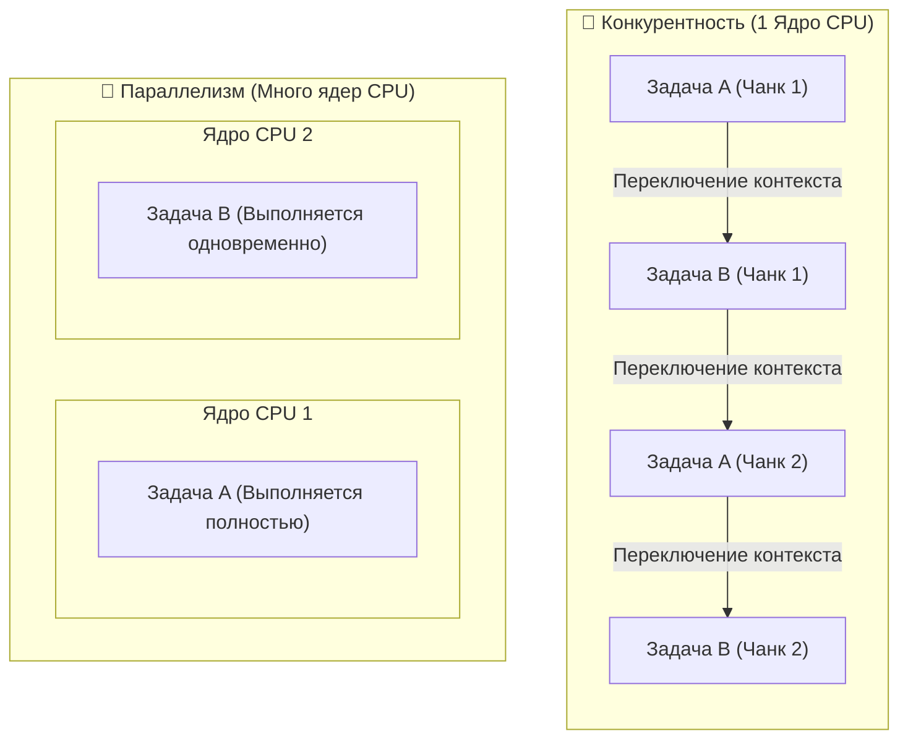
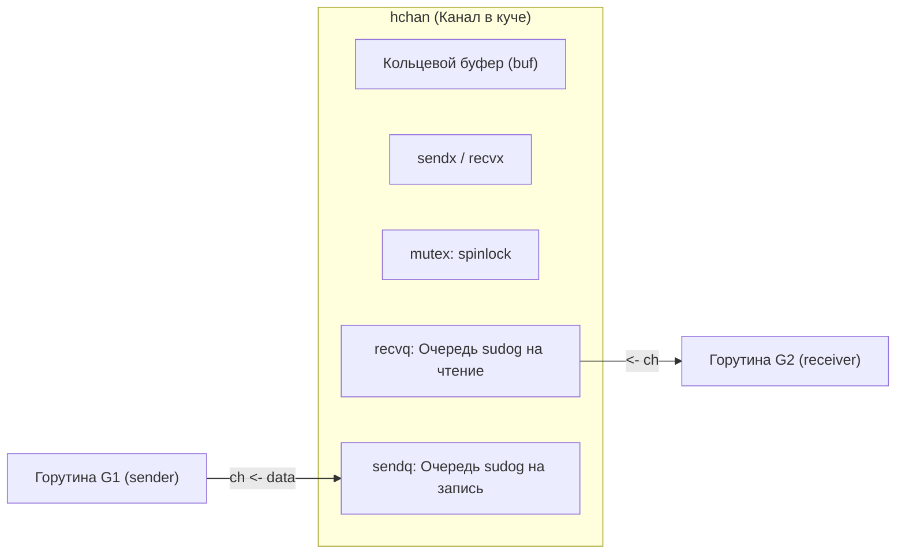
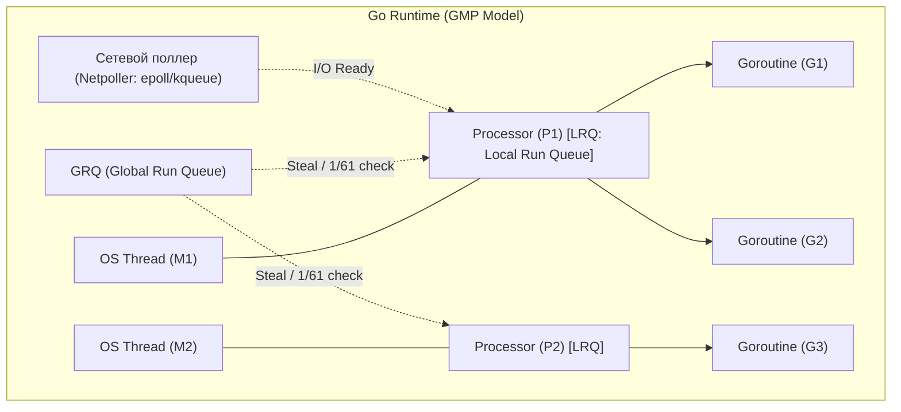
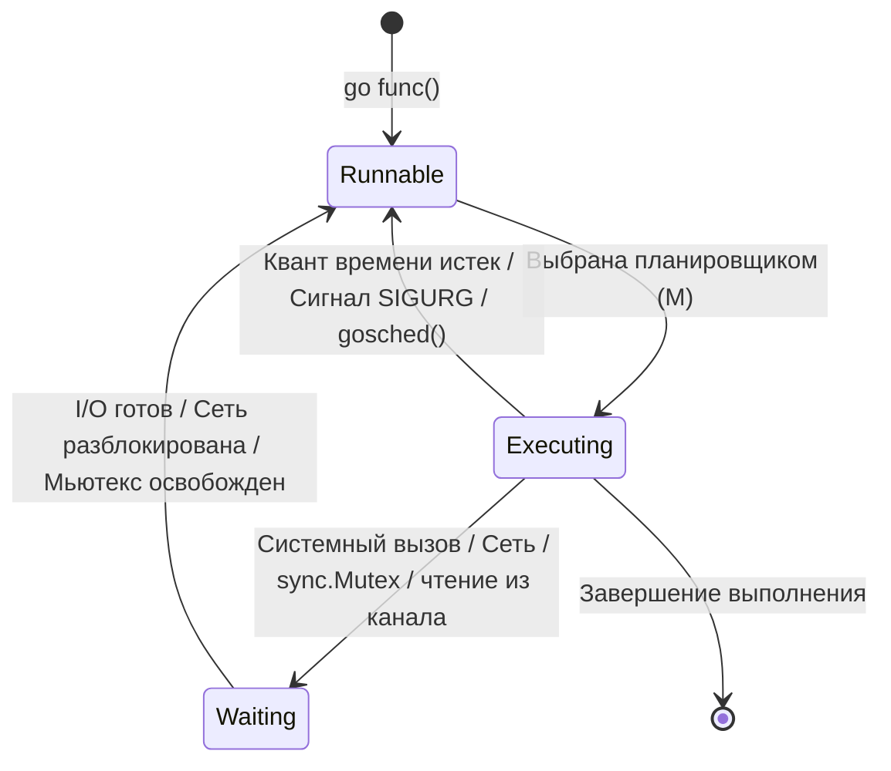
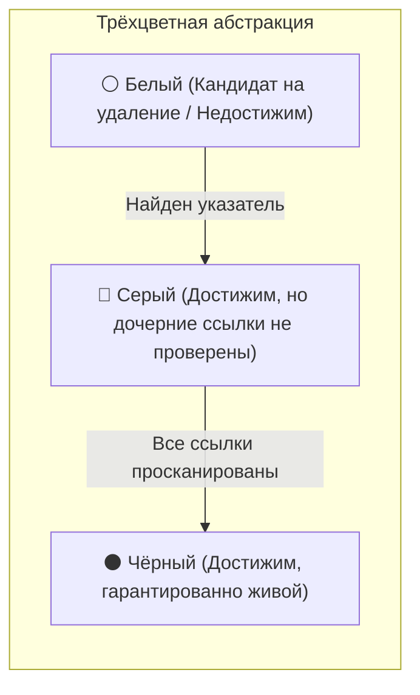
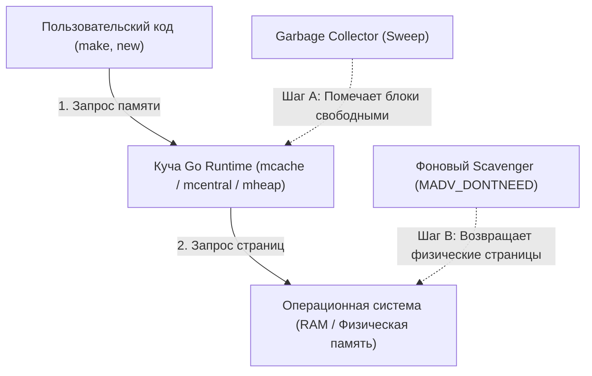
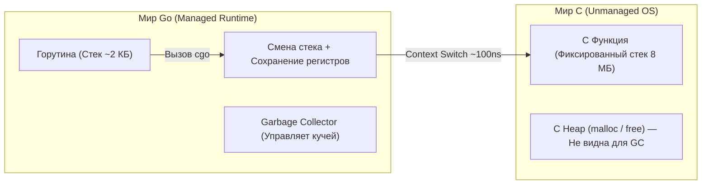
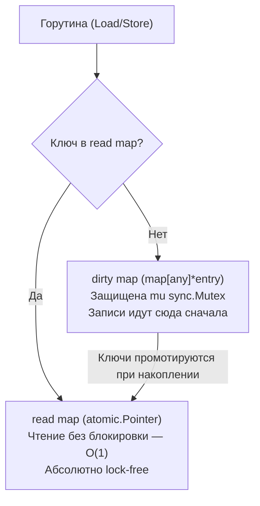
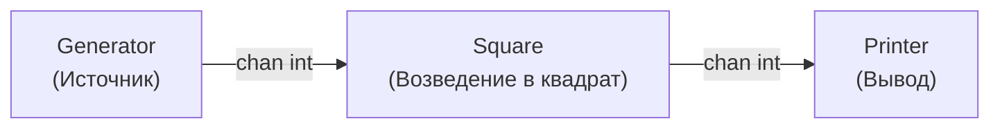
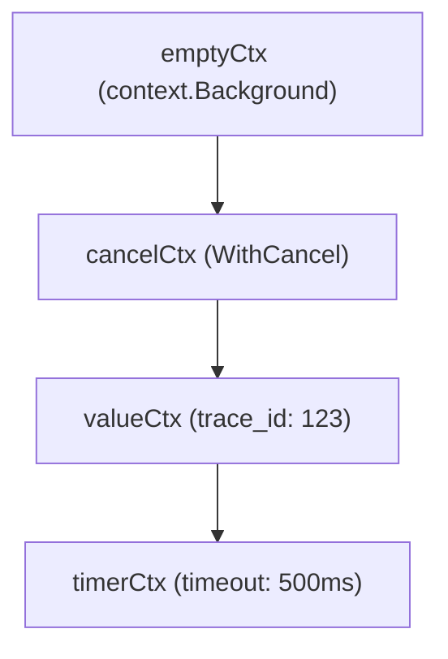

# Том 3: Конкурентность, Многопоточность и Внутреннее устройство Go Runtime

> [!TIP]
> 📚 **Навигация:** [⬅️ Назад: Том 2](02-go-core-oop-methods.md) | [📖 Главное оглавление](README.md) | [Вперед: Том 4 (Бэкенд и Сети) ➡️](04-go-core-backend-web.md)

> [!IMPORTANT]
> 💻 **Практика, примеры кода и домашние задания к этому тому:**
> - 📂 **Код лекций:** [10-concurrency](file:///Users/user/workspace/golang_projects/go-core-4/go_course_4/10-concurrency) (Горутины, каналы, `sync.Mutex`, `sync.WaitGroup`, Worker Pool, `context`), [21-interview](file:///Users/user/workspace/golang_projects/go-core-4/go_course_4/21-interview) (Live-задачи на каналы: pipeline, fan-in, генераторы), [08-prof_debug](file:///Users/user/workspace/golang_projects/go-core-4/go_course_4/08-prof_debug) (Диагностика горутин и планировщика).
> - 🎯 **Задачник:** [homework-tasks.md (Урок 10: Конкурентность)](file:///Users/user/workspace/golang_projects/go-core-4/go_course_4/go-documentation/homework-tasks.md#урок-10-конкурентность-горутины-каналы-sync-worker-pool-context), [homework-tasks.md (ДЗ 10: Пинг-Понг)](file:///Users/user/workspace/golang_projects/go-core-4/go_course_4/go-documentation/homework-tasks.md#домашнее-задание-10-конкурентное-программирование-игра-в-пинг-понг).
> - 🛠️ **Решение домашнего задания:** [homework-10](file:///Users/user/workspace/golang_projects/go-core-4/go_course_4/homework-10) — Синхронизация двух горутин по каналам (игра «Пинг-понг») и параллельная обработка.
> - 💡 **Live-Coding:** [go-livecoding-guide.md](file:///Users/user/workspace/golang_projects/go-core-4/go_course_4/go-documentation/go-livecoding-guide.md) — 43 практические задачи с собеседований (Worker Pool, Semaphore, Rate Limiter).
> - 🗺️ **Сквозной путеводитель:** [course-codebase-guide.md (Этап 2: Урок 10)](file:///Users/user/workspace/golang_projects/go-core-4/go_course_4/go-documentation/course-codebase-guide.md#урок-10-конкурентность-горутины-и-каналы).

---

## 11. Конкурентность: Горутины и Каналы (Concurrency)

> 🔗 **Практика и примеры кода:** [10-concurrency](file:///Users/user/workspace/golang_projects/go-core-4/go_course_4/10-concurrency), [21-interview](file:///Users/user/workspace/golang_projects/go-core-4/go_course_4/21-interview) | 🛠️ **Домашнее задание:** [homework-10](file:///Users/user/workspace/golang_projects/go-core-4/go_course_4/homework-10) | 🎯 **Задачи:** [homework-tasks.md (Урок 10)](file:///Users/user/workspace/golang_projects/go-core-4/go_course_4/go-documentation/homework-tasks.md#урок-10-конкурентность-горутины-каналы-sync-worker-pool-context), [homework-tasks.md (ДЗ 10)](file:///Users/user/workspace/golang_projects/go-core-4/go_course_4/go-documentation/homework-tasks.md#домашнее-задание-10-конкурентное-программирование-игра-в-пинг-понг) | 💻 **Live-Coding:** [go-livecoding-guide.md](file:///Users/user/workspace/golang_projects/go-core-4/go_course_4/go-documentation/go-livecoding-guide.md)

> _«Do not communicate by sharing memory; instead, share memory by communicating.»_ — Роб Пайк  
> _«Concurrency is not parallelism.»_ (Конкурентность — это не параллелизм) — Роб Пайк

---

### 11.0. Конкурентность vs Параллелизм (Concurrency is not Parallelism)

Это один из самых частых вопросов на собеседованиях любого уровня (Junior/Middle/Senior Go Developer). Многие разработчики ошибочно считают эти понятия синонимами, однако между ними существует фундаментальная концептуальная разница.

#### 💡 Теоретический фундамент: Модель CSP (Тони Хоар, 1978)

В основе многопоточной модели языка Go лежит математическая теория **CSP (Communicating Sequential Processes — Взаимодействующие последовательные процессы)**, сформулированная британским учёным Тони Хоаром в 1978 году.

В отличие от традиционной модели потоков ОС с разделяемой памятью и мьютексами (shared memory & locks), модель CSP утверждает:
- Программа состоит из независимых **последовательных процессов** (в Go это **горутины**).
- Процессы **не разделяют общее состояние**, а взаимодействуют исключительно путем **передачи сообщений через каналы связи** (в Go это **каналы `chan`**).
- Это снижает риск состояний гонки (Data Race), но не устраняет его полностью, и не защищает от взаимных блокировок (Deadlocks).

> [!NOTE]
> Go не запрещает разделяемую память: наряду с каналами в языке есть `sync.Mutex`, `sync/atomic` и т.д. Каналы — предпочтительный инструмент для передачи владения данными и координации, мьютексы — для защиты общего состояния. Гонки и дедлоки возможны и с каналами.

> [!NOTE]
> 📚 **Рекомендуемая литература и первоисточники:**
> - Книга: *«Effective Concurrency in Go»*, Burak Serdar.
> - Статьи: *«Scheduling in Go»* (Parts I & II), William Kennedy (Ardan Labs).
> - Спецификация: *«The Go Memory Model»* (`https://go.dev/ref/mem`).

> [!IMPORTANT]
> **Ключевое различие в одном предложении:**
>
> - **Конкурентность (Concurrency)** — это про **структуру программы** (_«Dealing with a lot of things at once»_ — управление множеством задач одновременно).
> - **Параллелизм (Parallelism)** — это про **физическое исполнение** (_«Doing a lot of things at once»_ — одновременное физическое выполнение множества задач).



#### 🍳 Наглядная аналогия: Повар на кухне

- **Конкурентность (1 повар):**  
  Один повар готовит обед из трёх блюд: поставил вариться пасту, пока закипает вода — режет овощи для салата, услышал свисток таймера — подошёл помешать соус.  
  В каждый конкретный момент времени повар физически делает **только одно действие**, но общая структура его работы — **конкурентная**: он управляет прогрессом нескольких независимых задач одновременно. Если вода медленно закипает (ожидание I/O), повар не стоит без дела, а переключается на нарезку лука.
- **Параллелизм (3 повара на кухне):**  
  На кухне работают 3 повара одновременно: первый непрерывно варит пасту, второй жарит стейк, третий режет салат. Задачи выполняются **физически одновременно в одну и ту же миллисекунду**.

---

#### ⚖️ Сравнительная таблица:

| Критерий                     | Конкурентность (Concurrency)                                                       | Параллелизм (Parallelism)                                                                       |
| :--------------------------- | :--------------------------------------------------------------------------------- | :---------------------------------------------------------------------------------------------- |
| **Что это?**                 | Свойство **архитектуры и кода** программы.                                         | Свойство **вычислительного оборудования и рантайма**.                                           |
| **Главный фокус**            | Декомпозиция сложной системы на независимые выполняемые части.                     | Увеличение скорости вычислений за счёт использования множества вычислителей.                    |
| **Требования к железу**      | Работает даже на **одноядерном процессоре** (CPU Core = 1).                        | Требует **несколько физических ядер CPU** (CPU Cores $\ge 2$) или GPU.                          |
| **Как реализуется в Go**     | Ключевое слово `go func()`, каналы `chan`, оператор `select`.                      | Планировщик Go распределяет горутины по системным потокам на разных ядрах при `GOMAXPROCS > 1`. |
| **Проблема, которую решает** | Эффективное скрытие задержек I/O (диск, сеть, база данных, пользовательский ввод). | Ускорение ресурсоёмких вычислений (CPU-bound: криптография, видео, сжатие, ML).                 |

---

#### ⚙️ Как это связано в Go: `GOMAXPROCS` и Планировщик

1. **Конкурентная программа не обязательно параллельна:**  
   Если запустить миллион горутин на одноядерной машине (или установить переменную окружения `GOMAXPROCS=1`), программа будет **100% конкурентной**, но **0% параллельной**. Планировщик Go (`GMP-модель`) будет быстро переключаться между горутинами при операциях ожидания I/O, блокировках и через вытеснение (preemption).
2. **Конкурентный дизайн делает параллелизм бесплатным бонусом:**  
   Если вы написали программу конкурентно (разбили код на независимые горутины, общающиеся через каналы), то на многоядерном сервере рантайм **сможет выполнять эти горутины параллельно** без переписывания кода (начиная с Go 1.5 значение `GOMAXPROCS` по умолчанию равно количеству логических ядер процессора; начиная с Go 1.25 оно к тому же учитывает лимит CPU контейнера, заданный через cgroup). Реальное ускорение зависит от того, насколько задачи независимы и как много времени уходит на синхронизацию.

---

### 11.1. Горутины (Goroutines) vs Системные потоки (OS Threads)

| Характеристика             | Системный поток (OS Thread)              | Горутина (Goroutine)                            |
| :------------------------- | :--------------------------------------- | :---------------------------------------------- |
| **Размер стека**           | Фиксированный: **1–8 МБ**                | Динамический: начинается примерно с **2 КБ** и растёт по мере необходимости (до 1 ГБ по умолчанию на 64-бит) |
| **Переключение контекста** | В ядре ОС (Kernel space, порядка единиц мкс) | Планировщиком Go в Userspace (порядка сотен нс) |
| **Количество**             | Тысячи                                   | **Сотни тысяч и миллионы** одновременно         |

---

#### Безопасный запуск горутин (Safe Goroutine Runner):

Чтобы случайная паника в фоновом воркере не роняла весь бэкенд, используют паттерн защитной обертки:

```go
func SafeGo(fn func()) {
    go func() {
        defer func() {
            if r := recover(); r != nil {
                log.Printf("[PANIC RECOVERED] в горутине: %v\nСтек:\n%s", r, debug.Stack())
            }
        }()
        fn()
    }()
}
```

---

### 11.2. Каналы (Channels): Буферизованные и Небуферизованные

Канал — это типобезопасная очередь для передачи данных между горутинами.

```go
// Небуферизованный (unbuffered): блокирует отправителя, пока получатель не готов
ch := make(chan int)

// Буферизованный (buffered): отправка не блокирует, пока буфер (3) не заполнен
bufCh := make(chan int, 3)
```

#### 🚨 Матрица поведения каналов (Топ-вопрос собеседований):

| Действие                   | Неинициализированный канал (`nil chan`)    | Открытый канал           | Закрытый канал (`close(ch)`)                             |
| :------------------------- | :----------------------------------------- | :----------------------- | :------------------------------------------------------- |
| **Чтение (`<-ch`)**        | **Блокировка навсегда** (Deadlock)         | Читает значение или ждет | Сначала отдаёт оставшиеся в буфере значения, затем **возвращает zero value** (`v, ok := <-ch`, `ok==false`) |
| **Запись (`ch <- v`)**     | **Блокировка навсегда** (Deadlock)         | Записывает или ждет      | **ПАНИКА (`panic: send on closed channel`)**             |
| **Закрытие (`close(ch)`)** | **ПАНИКА (`panic: close of nil channel`)** | Успешно закрывается      | **ПАНИКА (`panic: close of closed channel`)**            |

> [!TIP]
> **Кто должен закрывать канал?**  
> Канал закрывает **только пишущая сторона (Sender)**, и никогда — читающая: у получателя нет способа узнать, что кто-то ещё собирается писать, а запись в закрытый канал — паника. Если пишущих горутин несколько, закрытие координируют отдельно (например, дожидаются всех через `sync.WaitGroup` и закрывают канал в одной специально выделенной горутине).
>
> Закрывать канал обязательно **не всегда**: `close` нужен, когда получателям надо сообщить «данных больше не будет» (`for range ch`); канал, на который больше никто не ссылается, соберёт GC.

**Направленные каналы и служебные функции.** Тип `chan<- T` — канал только для отправки, `<-chan T` — только для получения (в сигнатурах функций это документирует намерение и проверяется компилятором; обычный `chan T` неявно приводится к обоим). `len(ch)` — число элементов в буфере, `cap(ch)` — размер буфера (для небуферизованного канала оба равны 0).

---

### 11.3. Конструкция `select` и Таймауты

`select` позволяет горутине ожидать событий из нескольких каналов одновременно:

```go
select {
case msg := <-ch1:
    fmt.Println("Получено из ch1:", msg)
case ch2 <- 42:
    fmt.Println("Отправлено в ch2")
case <-time.After(2 * time.Second):
    fmt.Println("Таймаут ожидания 2 секунды!")
default:
    fmt.Println("Ни один канал не готов (неблокирующий select)")
}
```

- Если готовы сразу несколько `case`, выбирается **случайный** из них (порядок в коде не важен).
- `select` без `default` блокируется, пока не станет готов хотя бы один `case`; с `default` — никогда не блокируется.
- ⚠️ `time.After` внутри цикла с частыми итерациями создаёт новый таймер на каждой итерации; до Go 1.23 неиспользованные таймеры жили до срабатывания, что давало заметную нагрузку на память. С Go 1.23 такие таймеры собираются GC, но в горячих циклах всё равно предпочтительнее `time.NewTimer` + `Reset` или `context.WithTimeout`.

---

### 11.4. Синхронизация: `sync.WaitGroup`

Используется для ожидания завершения группы параллельных горутин:

```go
import "sync"

func main() {
    var wg sync.WaitGroup

    for i := 1; i <= 3; i++ {
        wg.Add(1) // увеличиваем счетчик горутин

        go func(workerID int) {
            defer wg.Done() // уменьшаем счетчик при выходе
            fmt.Printf("Воркер %d завершил работу\n", workerID)
        }(i)
    }

    wg.Wait() // Блокирует main, пока счетчик не станет равен 0
    fmt.Println("Все воркеры завершили работу!")
}
```

> [!WARNING]
> - `wg.Add(1)` нужно вызывать **до** оператора `go` (в текущей горутине), а не внутри запускаемой горутины — иначе `Wait()` может отработать раньше, чем горутина успеет вызвать `Add`.
> - `WaitGroup` нельзя копировать после первого использования: в функцию его передают только по указателю (`*sync.WaitGroup`).
> - Каждому `Add(1)` должен соответствовать ровно один `Done()`; отрицательный счётчик вызывает панику.

> [!TIP]
> **Go 1.25+:** появился метод `wg.Go(func())`, который сам вызывает `Add(1)` и `Done()`: `wg.Go(func() { fmt.Println("работа") })` — меньше шансов ошибиться с `Add`/`Done`.

---

### 11.5. Паттерн Worker Pool (Пул воркеров)

Используется для ограничения параллелизма, чтобы не перегрузить процессор или базу данных миллионом горутин:

```go
func worker(id int, jobs <-chan string, results chan<- string) {
    for movie := range jobs {
        // обработка задачи
        results <- fmt.Sprintf("worker %d processed %s", id, movie)
    }
}

func main() {
    jobs := make(chan string, 100)
    results := make(chan string, 100)

    // Запускаем фиксированный пул из 3 воркеров:
    for w := 1; w <= 3; w++ {
        go worker(w, jobs, results)
    }

    // Отправляем задачи:
    for _, movie := range []string{"Matrix", "Inception", "Interstellar"} {
        jobs <- movie
    }
    close(jobs) // закрываем канал задач, сигнализируя воркерам о завершении

    // Читаем результаты (здесь мы заранее знаем, что их ровно 3):
    for a := 1; a <= 3; a++ {
        fmt.Println(<-results)
    }
}
```

> Если число результатов заранее неизвестно, используйте `sync.WaitGroup`: запустите отдельную горутину `go func() { wg.Wait(); close(results) }()` и читайте результаты через `for r := range results`.

---

### 11.6. Пакет `context`: Отмена операций и таймауты (`Context`)

Пакет `context` передаётся **первым аргументом** во все долгие операции (сеть, база данных, горутины) для своевременной отмены:

```go
import (
    "context"
    "time"
)

// 1. context.WithTimeout — автоматическая отмена через время:
ctx, cancel := context.WithTimeout(context.Background(), 200*time.Millisecond)
defer cancel() // ОБЯЗАТЕЛЬНО вызывать cancel для освобождения ресурсов таймера!

select {
case res := <-longRunningQuery(ctx):
    fmt.Println("Успех:", res)
case <-ctx.Done():
    fmt.Println("Таймаут или отмена:", ctx.Err()) // context deadline exceeded
}

// 2. context.WithCancel — ручная отмена по сигналу (например, при Graceful Shutdown):
ctxCancel, cancelFunc := context.WithCancel(context.Background())
// ... в другой горутине вызываем cancelFunc()
```

### 11.7. Анатомия каналов: структура hchan, очереди sudog, прямой стек-в-стек copy и матрица состояний

> [!IMPORTANT]
> **Как канал устроен в исходниках Go (`runtime/chan.go`):**  
> Канал в Go — это не примитив операционной системы, а обычная структура языка `hchan`, которая **всегда аллоцируется в куче** при вызове `make(chan T, bufSize)`. Переменная канала типа `chan T` — это обычный указатель на эту структуру (`*hchan`), именно поэтому каналы безопасно передавать в функции по значению без взятия адреса `&ch`.

#### 1. Структура `hchan` под капотом:

```go
type hchan struct {
    qcount   uint           // Количество элементов, находящихся в буфере прямо сейчас
    dataqsiz uint           // Размер кольцевого буфера (емкость cap канала)
    buf      unsafe.Pointer // Указатель на непрерывный кольцевой буфер данных в памяти
    elemsize uint16         // Размер одного элемента в байтах
    closed   uint32         // Флаг: 0 - канал открыт, 1 - канал закрыт (close)
    elemtype *_type         // Метаданные о типе передаваемых данных (для GC и копирования)
    sendx    uint           // Индекс кольцевого буфера, куда будет записан следующий элемент
    recvx    uint           // Индекс кольцевого буфера, откуда будет прочитан следующий элемент
    recvq    waitq          // Очередь заблокированных горутин, ожидающих чтения (FIFO очередь *sudog)
    sendq    waitq          // Очередь заблокированных горутин, ожидающих записи (FIFO очередь *sudog)
    lock     mutex          // Внутренний лёгкий мьютекс рантайма (не sync.Mutex), защищающий операции с каналом!
}
```



#### 2. Что такое `sudog` и как происходит парковка горутин:

Когда горутина пытается записать в полный канал или прочитать из пустого:

1. Она не крутится в активном цикле ожидания (spin-wait) и не нагружает CPU.
2. Рантайм создает структуру `sudog`, которая связывает дескриптор текущей горутины (`g`), адрес переменной для записи/чтения (`elem`) и указатель на канал.
3. `sudog` добавляется в конец очереди `recvq` или `sendq`.
4. Рантайм вызывает `gopark()`, переводя горутину из статуса `_Grunning` в статус `_Gwaiting` и освобождая системный поток $M$ для выполнения других горутин.

#### 3. Оптимизация Direct Stack-to-Stack Copy (передача без промежуточного буфера):

В небуферизованном канале (`make(chan int)`) буфер `buf` равен `nil`.  
Если горутина $G_1$ спит в очереди `recvq` в ожидании значения `x := <-ch`, а горутина $G_2$ выполняет `ch <- 42`:

- Рантайм Go не использует промежуточный буфер (значение копируется один раз, а не дважды).
- Функция `sendDirect()` выполняет **прямое копирование байт из стека горутины $G_2$ напрямую в стек спящей горутины $G_1$** (`memmove`).
- После этого вызывается `goready(g1)`, и планировщик GMP переводит $G_1$ в статус `_Grunnable` для запуска на свободном процессоре $P$.

#### 4. Матрица состояний каналов (Топ-вопрос любого технического интервью):

| Состояние канала / Операция          | Чтение (`<-ch`)                                                                 | Запись (`ch <- val`)                         | Закрытие (`close(ch)`)                  |
| :----------------------------------- | :------------------------------------------------------------------------------ | :------------------------------------------- | :-------------------------------------- |
| **`nil` канал** (не инициализирован) | **Вечная блокировка** (падение в `gopark`)                                      | **Вечная блокировка** (падение в `gopark`)   | 💥 **`panic: close of nil channel`**    |
| **Открытый канал с данными**         | Успешно читает значение мгновенно                                               | Записывает (если есть место) или блокируется | Закрывает канал, переводит `closed = 1` |
| **Открытый пустой канал**            | Блокируется до появления данных (`recvq`)                                       | Записывает значение мгновенно                | Закрывает канал, переводит `closed = 1` |
| **Закрытый канал** (`closed`)        | **Возвращает `zero-value` и `ok = false`** (сначала дочитывает остатки буфера!) | 💥 **`panic: send on closed channel`**       | 💥 **`panic: close of closed channel`** |

> [!TIP]
> **Использование `nil`-каналов в паттерне `select`:**  
> Вечная блокировка на `nil`-канале — это не ошибка, а фича языка! При динамическом отключении ветки в `select` достаточно приравнять канал к `nil` (`ch = nil`), и рантайм навсегда перестанет опрашивать эту ветку, не требуя выхода из бесконечного цикла.

---

### 11.8. Типовые ошибки конкурентного программирования (Common Concurrency Pitfalls)

Конкурентный код в Go лаконичен, но таит в себе классические грабли, с которыми сталкиваются как новички, так и опытные разработчики.

#### 1. Захват переменной цикла через замыкание (Loop Variable Capture)

Самая известная историческая ловушка Go (до версии 1.22):

```go
// ❌ ГРУБАЯ ОШИБКА (в Go < 1.22):
names := []string{"Алиса", "Боб", "Чарли"}
for _, name := range names {
    go func() {
        fmt.Println(name) // Все горутины захватывали один и тот же указатель на переменную name!
    }()                   // Результат: Чарли Чарли Чарли
}

// ✅ ИДИОМАТИЧНО: явная передача переменной как аргумента горутины
for _, name := range names {
    go func(n string) {
        fmt.Println(n) // Копируется значение на момент вызова
    }(name)
}
```
> [!NOTE]
> Начиная с **Go 1.22**, семантика цикла `for` была изменена: компилятор автоматически создает новую переменную на каждой итерации цикла. Однако знание этой ловушки обязательно для поддержки проектов на старых версиях Go и прохождения технических интервью.

#### 2. Использование `time.Sleep` для синхронизации потоков (Flaky Anti-Pattern)

Попытка «подождать», пока фоновая горутина отработает, через `time.Sleep` — грубейшая ошибка проектирования:

```go
// ❌ АНТИПАТТЕРН: надежда на случайность
go doHeavyWork()
time.Sleep(100 * time.Millisecond) // "Наверное, успеет..."

// Если сервер нагружен, GC заблокировал горутину или диск тормозит — программа завершится ДО окончания работы!
```
*Правильное решение:* Всегда использовать детерминированные примитивы синхронизации — **`sync.WaitGroup`**, каналы (`chan struct{}`) или **`context.Context`**.

#### 3. Отсутствие контроля за завершением потоков и Утечки горутин (Goroutine Leaks)

Помните три фундаментальных правила горутин:
1. Горутины **не возвращают значений** напрямую (вызывающий код уже ушел вперед).
2. Выход из функции `main()` **немедленно уничтожает весь процесс**, обрывая все горутины без выполнения их отложенных функций `defer`.
3. Забытая горутина, заблокированная на чтении из пустого канала или на записи в канал без читателя, **никогда не будет собрана Garbage Collector**. Она навсегда останется в памяти, вызывая утечку оперативной памяти (Goroutine Leak).

```go
// ❌ УТЕЧКА ГОРУТИНЫ: запись в небуферизованный канал без читателя при ошибке
func queryFirst(ctx context.Context) string {
    ch := make(chan string) // небуферизованный канал
    go func() { ch <- queryA() }()
    go func() { ch <- queryB() }()
    return <-ch // Прочитан только первый результат! Вторая горутина зависнет на вечной записи навечно!
}

// ✅ ИДИОМАТИЧНО: буферизованный канал на размер воркеров
ch := make(chan string, 2) // Вторая горутина запишет в буфер и завершится без утечки
```

#### 4. Неатомарность операций с общей памятью (Read-Modify-Write)

Операция `count++` в Go кажется неделимой, но на уровне ассемблера CPU состоит из 3 независимых инструкций:
1. `MOV`: чтение текущего значения из RAM в регистр CPU.
2. `ADD`: увеличение значения в регистре на 1.
3. `MOV`: запись нового значения из регистра обратно в RAM.

Если две горутины выполняют `count++` одновременно без синхронизации, их инструкции перемешиваются, и одно из обновлений бесследно теряется (**Data Race**). Для защиты необходимо использовать `sync.Mutex` или атомарные примитивы пакета `sync/atomic`.

#### 5. Копирование мьютексов по значению (Mutex Copying Trap / `-copylocks`)

> [!WARNING]
> `sync.Mutex` содержит внутреннее бинарное состояние (флаг блокировки и очередь ожидания). Если передать структуру с мьютексом в функцию **по значению** (не по указателю), Go скопирует мьютекс. Копия будет жить своей отдельной жизнью, а критическая секция останется незащищенной!

```go
type SafeCounter struct {
    mu    sync.Mutex
    value int
}

// ❌ ОШИБКА: передача по значению копирует мьютекс
func increment(c SafeCounter) {
    c.mu.Lock()
    defer c.mu.Unlock()
    c.value++ // Меняется копия, оригинальный мьютекс не блокируется!
}

// ✅ ПРАВИЛЬНО: передача строго по указателю
func incrementSafe(c *SafeCounter) {
    c.mu.Lock()
    defer c.mu.Unlock()
    c.value++
}
```
*Инструмент ловли:* штатный анализатор `go vet` автоматически находит такие ошибки (анализатор `copylocks`); `go vet` запускается и как часть `go test`.

#### 6. Вызов `defer` внутри длинных или бесконечных циклов (Defer in Loops)

`defer` привязан к жизненному циклу **функции**, а не тела цикла `for`:

```go
// ❌ УТЕЧКА РЕСУРСОВ: файловые дескрипторы закроются только после завершения ВСЕЙ функции
func processAll(files []string) error {
    for _, f := range files {
        file, err := os.Open(f)
        if err != nil { return err }
        defer file.Close() // На 100 000 файлах приложение упадет: "too many open files"!
    }
    return nil
}

// ✅ РЕШЕНИЕ: вынести тело итерации в отдельную (анонимную) функцию для изоляции defer
func processAllSafe(files []string) error {
    for _, f := range files {
        if err := func() error {
            file, err := os.Open(f)
            if err != nil { return err }
            defer file.Close() // Закроется СРАЗУ на каждой итерации
            return processFile(file)
        }(); err != nil {
            return err
        }
    }
    return nil
}
```

---

## 14. Устройство Go Runtime: GMP, Память и GC

> 🔗 **Практика и диагностика:** [08-prof_debug](file:///Users/user/workspace/golang_projects/go-core-4/go_course_4/08-prof_debug) (Анализ trace и блокировок горутин) | 🗺️ **Путеводитель:** [course-codebase-guide.md (Урок 08)](file:///Users/user/workspace/golang_projects/go-core-4/go_course_4/go-documentation/course-codebase-guide.md#урок-08-профилирование-бенчмарки-и-трейсинг)

### 14.1. Модель планировщика GMP (Goroutine, Machine, Processor)

Go реализует кооперативно-вытесняющий планировщик пространства пользователя (User-space $M:N$ Scheduler). Он решает фундаментальную задачу: отображение $M$ пользовательских горутин ($G$) на $N$ реальных системных потоков ОС ($M$), исполняющихся на доступных логических ядрах процессора ($P$).



#### 1. Ключевые сущности планировщика

- **`G` (Goroutine):** Легковесный поток выполнения в пространстве пользователя. Содержит собственный динамический стек (начинается с 2 КБ), программный счетчик (PC, Program Counter), регистры процессора и текущее состояние.
- **`M` (Machine / OS Thread):** Реальный системный поток операционной системы (kernel thread), управляемый ядром ОС (`pthread_create` в Linux/macOS). Именно поток $M$ физически исполняет инструкции на процессорном ядре.
- **`P` (Processor / Logical Context):** Логический контекст выполнения, ресурс, необходимый для выполнения Go-кода. Количество `P` по умолчанию строго равно количеству виртуальных ядер процессора на машине (`GOMAXPROCS` = `runtime.NumCPU()`, с учетом технологии Hyper-Threading). Поток $M$ не может выполнять Go-код, не захватив доступный контекст $P$.
- **`LRQ` (Local Run Queue):** Локальная очередь выполнения каждого процессора `P`. Вмещает до 256 горутин в статусе `Runnable`. Доступ к `LRQ` со стороны своего потока $M$ происходит без глобальных блокировок (lock-free), что минимизирует конкуренцию между ядрами.
- **`GRQ` (Global Run Queue):** Глобальная очередь горутин, ожидающих выполнения, еще не назначенных на конкретный `P` (или сброшенных при переполнении `LRQ`). Доступ к `GRQ` защищен глобальным мьютексом рантайма.

---

#### 2. Три фундаментальных состояния горутины (Goroutine States)

Подобно системным потокам ОС, горутина в любой момент времени находится в одном из трех ключевых состояний, определяющих поведение планировщика:



1. **Waiting (Ожидание):**
   - Горутина остановлена и не может продолжать работу, пока не произойдет внешнее событие.
   - **Причины:** ожидание сетевого I/O (netpoller), блокирующий системный вызов (чтение/запись файла на диск), примитивы синхронизации (`sync.Mutex.Lock()`, ожидание записи/чтения в `chan`, `sync.WaitGroup.Wait()`), таймеры (`time.Sleep()`).
   - **Влияние на производительность:** Время нахождения в `Waiting` напрямую формирует задержку отклика приложения (**Latency**).
2. **Runnable (Готова к выполнению):**
   - Горутина содержит валидный код и готова к исполнению, но ожидает выделения процессорного времени на системном потоке $M$.
   - Находится в очереди: либо в локальной `LRQ` определенного $P$, либо в глобальной `GRQ`.
   - **Влияние на производительность:** Если горутин в статусе `Runnable` слишком много, возникает конкуренция за потоки $M$ (Scheduling Latency). Горутины дольше ждут очереди, а время непрерывного кванта их работы сокращается.
3. **Executing (Исполнение):**
   - Горутина привязана к системному потоку $M$, который в свою очередь назначен ядром ОС на аппаратное ядро CPU.
   - Выполняются полезные инструкции Go-программы.

---

#### 3. Четыре триггера переключения контекста (Context Switch Triggers)

Планировщик Go действует в пространстве пользователя в строго определенных безопасных точках (**Safe Points**), ассоциированных с системными событиями и вызовами функций.

Планировщик Go анализирует возможность переключения контекста при возникновении 4 классов событий:

1. **Использование ключевого слова `go`:**
   - Создание новой горутины порождает новый дескриптор $G$, помещаемый в локальную очередь `LRQ` текущего $P$. Это дает планировщику непосредственный повод принять решение о переключении или передаче работы другому свободному $P$.
2. **Сборка мусора (Garbage Collection):**
   - Фоновые воркеры GC запускаются как специальные высокоприоритетные горутины. Часть процессоров $P$ временно отдаётся под фоновые воркеры GC (по умолчанию примерно 25% ресурсов), а горутины, активно аллоцирующие память, могут быть привлечены к помощи сборщику (GC assist), чтобы быстрее завершить фазу Concurrent Mark.
3. **Системные вызовы (System Calls):**
   - Обращение к операционной системе. Планировщик разделяет системные вызовы на **асинхронные** (обрабатываемые через сетевой поллер) и **синхронные блокирующие** (диск, cgo).
4. **Синхронизация и координация (Synchronization & Orchestration):**
   - Вызовы примитивов пакета `sync` (`Mutex`, `RWMutex`), блокировка на каналах (`ch <- data`, `<-ch`), таймеры `time.Sleep()`, атомики. Если горутина не может продолжить работу, она переводится в статус `Waiting`, освобождая поток $M$ для других задач.

---

#### 4. Обработка системных вызовов: Сетевой поллер vs Блокирующие вызовы ОС

Поведение планировщика кардинально различается в зависимости от того, способен ли системный вызов быть выполнен асинхронно:

##### А. Асинхронные системные вызовы: Сетевой поллер (Network Poller)
Для сетевых сокетов современные ОС предоставляют механизмы мультиплексирования ввода-вывода с нотификацией о готовности дескриптора: `epoll` (Linux), `kqueue` (macOS), `IOCP` (Windows).

```mermaid
flowchart TD
    G1["Горутина G1 (на M1)"] -->|Вызов conn.Read()| NetPoll["Сетевой поллер (epoll / kqueue)"]
    NetPoll -->|G1 переведена в Waiting| UnblockM1["Поток M1 НЕ блокируется!"]
    UnblockM1 -->|M1 берет G2 из LRQ| G2["Горутина G2 исполняется на M1"]
    NetPoll -->|Данные в сокете готовы!| Wakeup["G1 переводится в Runnable"]
    Wakeup -->|G1 возвращается в LRQ| LRQ["LRQ процессора P"]
```

1. Когда горутина $G_1$ выполняет сетевое чтение (`conn.Read()`), рантайм Go не блокирует поток ОС.
2. Горутина $G_1$ отсоединяется от $M_1$ и регистрируется в **сетевом поллере** (`netpoller`), переходя в состояние `Waiting`.
3. Поток $M_1$ **не засыпает на уровне ОС**: он немедленно достает следующую готовую горутину $G_2$ из своей локальной очереди `LRQ` и продолжает вычисления.
4. Когда ОС через `epoll`/`kqueue` сигнализирует о поступлении байт в сокет, сетевой поллер пробуждает $G_1$, переводит ее в `Runnable` и помещает обратно в `LRQ` доступного процессора $P$.
5. **Результат:** Для обслуживания тысяч конкурентных сетевых соединений Go не создает дополнительных системных потоков ОС — все соединения мультиплексируются на едином пуле $P = runtime.NumCPU()$.

##### Б. Синхронные блокирующие системные вызовы (File I/O, CGO)
Файловые операции в операционных системах семейства Unix (ext4, APFS и др.) традиционно не поддерживают эффективный неблокирующий интерфейс через `epoll` (дескриптор обычного файла всегда считается ядром ОС «готовым к чтению/записи», из-за чего поток физически блокируется в ядре в ожидании дискового накопителя).

```mermaid
flowchart TD
    G1["Горутина G1"] -->|Блокирующий syscall (File I/O, CGO)| M1["Поток M1 блокируется в ядре ОС"]
    P["Процессор P"] -.->|Планировщик отсоединяет P от M1| M1
    P -->|P захватывает новый поток M2| M2["Поток M2 (из пула или новый)"]
    M2 -->|M2 исполняет горутину G2| G2["Горутина G2 из LRQ"]
    M1 -->|Системный вызов G1 завершен| Return["G1 возвращается в LRQ"]
    M1 -.->|M1 паркуется в спящий пул| Pool["Пул простаивающих потоков M"]
```

1. Горутина $G_1$ вызывает операцию чтения файла с диска (`os.ReadFile`) или си-функцию через `cgo`.
2. Поток $M_1$ неизбежно блокируется на уровне ядра ОС на время ожидания ответа контроллера накопителя.
3. Планировщик (фоновый поток `sysmon`, если вызов длится дольше ~20 мкс) фиксирует блокировку потока $M_1$ и **отсоединяет логический процессор $P$ от потока $M_1$**.
4. Процессор $P$ подхватывает свободный системный поток $M_2$ из пула (или, при необходимости, порождает новый `pthread`), и начинает исполнять горутину $G_2$ из очереди `LRQ`.
5. Когда долгий системный вызов $G_1$ завершается, $G_1$ переводится в `Runnable` и возвращается в очередь `LRQ` процессора $P$.
6. Поток $M_1$ освобождается и отправляется в системный пул простаивающих потоков рантайма (parked threads) для мгновенного переиспользования в будущих вызовах без накладных расходов на `pthread_create`.

---

#### 5. Алгоритм Work Stealing и функция `runtime.schedule()`

Планировщик Go спроектирован как **Work-Stealing Scheduler** («планировщик с кражей работы»). Его главная цель — не допустить простоя системных потоков $M$, предотвращая их переход в режим сна ядра ОС (Sleeping), так как повторное пробуждение системного потока требует дорогостоящего прерывания и context switch.

Каждый раз, когда поток $M$ ищет следующую горутину для исполнения, выполняется функция `runtime.schedule()` по строгому алгоритму:

```go
// Упрощённая логика runtime.schedule() / findRunnable() (реальный код сложнее):
func schedule() {
    // 1. Правило 1/61 тика: предотвращение голодания глобальной очереди GRQ
    if sched.tick%61 == 0 && sched.runqsize > 0 {
        lock(&sched.lock)
        gp = globrunqget(p, 1) // достаем 1 горутину из GRQ
        unlock(&sched.lock)
        if gp != nil {
            execute(gp) // выполняем горутину из GRQ
        }
    }

    // 2. Проверяем локальную очередь LRQ текущего процессора P
    gp, inheritTime = runqget(p)
    if gp != nil {
        execute(gp)
    }

    // 3. Если LRQ пуста — ищем работу в других местах (findRunnable)
    gp = findRunnable()
    execute(gp)
}

func findRunnable() (gp *g) {
    // 3.1. Проверяем глобальную очередь GRQ (под блокировкой)
    if sched.runqsize > 0 {
        lock(&sched.lock)
        gp = globrunqget(p, 0)
        unlock(&sched.lock)
        if gp != nil {
            return gp
        }
    }

    // 3.2. Неблокирующий опрос сетевого поллера (netpoll) на наличие готовых сокетов
    if list = netpoll(0); !list.empty() {
        gp = list.pop()
        injectglist(&list) // остальные готовые G раскидываем по очередям
        return gp
    }

    // 3.3. Кража работы (Work Stealing): несколько проходов по другим процессорам P
    // в случайном порядке; у найденного P крадём половину (1/2) его LRQ
    for i := 0; i < 4; i++ {
        for _, otherP := range randomOrderOfAllPs() {
            if gp = runqsteal(p, otherP, /* stealHalf = */ true); gp != nil {
                return gp
            }
        }
    }

    // 3.4. Если работы нет совсем — M переходит в состояние Spinning (активный поиск),
    // а затем засыпает (паркуется) до появления новых задач
}
```

> [!TIP]
> **Почему проверяется именно 1 из 61 тиков (1/61 rule)?**  
> Число 61 является **простым числом (prime number)**. Это гарантирует, что проверка глобальной очереди `GRQ` не синхронизируется циклически с регулярными интервалами вызовов пользовательского кода. Правило предотвращает **голодание (starvation)** горутин, помещенных в глобальную очередь (например, созданных сторонними системными библиотеками или сброшенных при переполнении `LRQ`).

---

#### 6. Вытеснение горутин (Preemption): От кооперативного к сигнальному

- **До Go 1.14 (Кооперативное вытеснение):**
  Компилятор Go вставлял инструкцию проверки стека (`morestack`) в пролог каждой вызываемой функции. Если горутина исчерпала свой 10-миллисекундный квант времени, компилятор при следующем вызове функции переключал контекст.
  **Проблема:** Если горутина выполняла плотный цикл математических вычислений без вызова функций (`for { count++ }`), она намертво захватывала поток $M$, блокируя GC (Stop-The-World не мог наступить) и работу остальных горутин на этом ядре.
- **Go 1.14+ (Асинхронное вытеснение по сигналам):**
  Специальный системный поток мониторинга **`sysmon`** (работает без привязки к $P$ каждые 20 мкс – 10 мс) отслеживает горутины, исполняющиеся дольше 10 мс. При обнаружении зависшей горутины `sysmon` отправляет системному потоку $M$ сигнал ОС **`SIGURG`** (выбран потому, что обычные приложения почти не используют его, и его случайная доставка безвредна).
  Обработчик сигнала в Go Runtime прерывает исполнение потока в любой точке машинного кода, безопасно сохраняет регистры горутины в память и отдает ядро планировщику.

---

#### 7. Сравнение производительности: Context Switch Потока ОС vs Горутины

Почему архитектура Go обеспечивает колоссальное преимущество в высоконагруженных сетевых сервисах по сравнению с традиционной моделью «один поток ОС на соединение»?

| Характеристика | Поток ОС (OS Thread Context Switch) | Горутина Go (Goroutine Context Switch) |
| :--- | :--- | :--- |
| **Уровень переключения** | Kernel Space (Переход в кольцо ядра `ring 0`) | User Space (Пространство пользователя Go Runtime) |
| **Время переключения** | $\sim 1000 - 1500$ наносекунд ($\sim 1 - 1.5$ мкс) | $\sim 150 - 200$ наносекунд ($\sim 0.15 - 0.2$ мкс) |
| **Потери инструкций CPU** | $\sim 12\,000$ инструкций (впустую сгорают на переключение) | $\sim 2\,400$ инструкций |
| **Сохраняемое состояние** | Полный набор аппаратных регистров, регистры FPU/SSE, стек ядра | Всего 14 базовых регистров архитектуры в дескриптор $G$ |
| **Работа с кэшем CPU** | **Core Bouncing:** Потоки прыгают между разными ядрами $\to$ сброс кэш-линий L1/L2, задержки межпроцессорной шины NUMA | Тот же поток $M$ и то же физическое ядро обслуживают очередь $\to$ прогретый кэш L1/L2 |
| **Поведение при I/O** | Поток засыпает в ядре ОС $\to$ ОС ищет другой поток для планирования | Поток $M$ **никогда не засыпает** при сетевом I/O: горутина уходит в netpoller, поток мгновенно выполняет следующую $G$ |

> [!NOTE]
> Числа в таблице выше ориентировочные (порядок величин по материалам Ardan Labs) и зависят от процессора, ОС и версии Go.

> [!IMPORTANT]
> **Главный вывод Уильяма Кеннеди (Ardan Labs): Превращение I/O в CPU-Bound работу:**  
> Архитектура Go-планировщика кардинально меняет восприятие ввода-вывода операционной системой. Для ядра ОС программа на Go выглядит не как тысяча дремлющих потоков, а как строго ограниченный пул постоянно занятых потоков ($M = runtime.NumCPU()$), выполняющих непрерывные вычисления без блокировок. Планировщик Go превращает внешне блокирующий I/O в непрерывную полезную работу центрального процессора, обеспечивая максимальный Throughput на современном многоядерном оборудовании.

---

### 14.2. Сборщик мусора (Garbage Collector: Tri-color Mark & Sweep, освобождение памяти и Scavenger)

В Go реализован **конкурентный (concurrent)**, **некомпактифицирующий (non-moving / non-compacting)**, **трёхцветный (Tri-color Mark and Sweep)** сборщик мусора. Он спроектирован так, чтобы паузы «остановки мира» (Stop-The-World) как правило были короче **1 миллисекунды** даже на больших кучах (жёсткой гарантии нет — паузы зависят от числа горутин, размера стеков и т.д.).

> [!NOTE]
> **Почему сборщик Go не компактифицирует (не перемещает) объекты в памяти?**  
> В языках вроде Java (JVM) сборщик перемещает объекты для устранения фрагментации. В Go разрешены прямые указатели на память (`*T`), адресная арифметика (`unsafe.Pointer`) и передача указателей в системные вызовы ОС и C-код (`cgo`). Перемещение живых объектов потребовало бы дорогостоящей остановки всех горутин и массовой перезаписи адресов. Поэтому Go использует аллокатор на базе TCMalloc (потоковые кэши `mcache`, `mcentral`, `mheap` со спанами фиксированных размеров `mspan`), предотвращающий фрагментацию без перемещения объектов.

---

#### 1. Трёхцветный алгоритм маркировки (Tri-color Marking)

Все объекты в куче делятся на три логических цвета:



- **⚪ Белые (White):** Объекты, до которых GC ещё не добрался. В конце маркировки все оставшиеся белыми объекты признаются мусором и подлежат уничтожению.
- **🔘 Серые (Grey):** Объекты, на которые есть ссылки от живых объектов, но поля/указатели внутри них самих ещё не просканированы (очередь обхода в ширину).
- **⚫ Чёрные (Black):** Гарантированно живые объекты. Все их поля просканированы, они не содержат ссылок на белые объекты напрямую.

---

#### 2. Фазы работы сборщика мусора

Цикл сборщика включает следующие фазы и механизмы (Mark Assist — не отдельный этап по времени, а механизм внутри Concurrent Mark):

| Фаза | Режим работы | Длительность | Что происходит |
| :--- | :---: | :---: | :--- |
| **1. Sweep Termination** | 🚨 **STW** (пауза) | **10–30 мкс** | Подготовка к сборке: завершение предыдущей очистки, включение **Write Barrier** (барьера записи). |
| **2. Concurrent Mark** | ⚡ **Конкурентно** (в фоне) | Миллисекунды | Обход графа объектов. GC старается занять около **25% CPU** (`GOMAXPROCS / 4`, за счёт выделенных и «дробных» воркеров). Красит корни (стеки, глобалы) в серый, а затем в чёрный. |
| **3. Mark Assist** | ⚡ **Мутатор помогает** | По нагрузке | Если горутина аллоцирует быстрее, чем фоновый GC успевает красить, рантайм принудительно заставляет её выполнять маркировку. |
| **4. Mark Termination** | 🚨 **STW** (пауза) | **10–50 мкс** | Финализация маркировки, сканирование оставшихся корней, отключение Write Barrier. |
| **5. Concurrent Sweep** | ⚡ **Конкурентно** (в фоне) | В фоне | Освобождение памяти: спаны с белыми объектами возвращаются в списки свободных блоков рантайма. |

> [!IMPORTANT]
> **Барьер записи (Write Barrier):**  
> Так как программа (мутатор) работает параллельно с GC, она может переставить указатель: заставить чёрный объект указывать на белый, а старую ссылку стереть. Без защиты GC удалил бы этот белый объект! Write Barrier перехватывает любую запись указателя в памяти во время фазы маркировки и красит затронутые объекты в **серый**, гарантируя целостность данных (в Go используется гибридный барьер, сочетающий идеи Дейкстры и Юасы).

---

#### 3. Как именно освобождается память (Двухуровневая модель)

Многие разработчики удивляются: *«Я вызвал `runtime.GC()`, удалил миллион объектов, а потребление памяти в `top` / Activity Monitor / Docker (RSS) не упало! Почему?»*

В Go освобождение памяти происходит строго в два уровня:



##### Шаг А: Освобождение внутри рантайма Go (Мгновенно)
Когда фаза Sweep находит белые объекты, она **не делает системных вызовов в ОС**. Память просто помечается свободной внутри соответствующего `mspan` в пуле кучи (`mcentral`/`mheap`).  
- **Зачем так сделано?** Системные вызовы ядра (`mmap`, `munmap`, `brk`) чрезвычайно медленные. Оставив память в пуле рантайма, Go может быстро выделить её под следующие `make([]byte, ...)` **без системных вызовов**.

##### Шаг Б: Возврат физической памяти операционной системе (Фоновый Scavenger)
В рантайме Go работает фоновый поток — **Scavenger** (уборщик страниц памяти):
1. Он периодически просматривает простаивающие страницы памяти кучи (`HeapIdle`).
2. Для страниц, которые не использовались определенное время, Scavenger выполняет системный вызов ядра:
   - **В Linux:** `madvise(addr, len, MADV_DONTNEED)` (по умолчанию с Go 1.16; более ранние версии использовали `MADV_FREE`, при котором RSS падает не сразу).
   - **В других ОС:** аналогичные вызовы (`MADV_FREE` и т.п.).
3. Этот вызов сообщает ядру ОС: *«Физические страницы RAM, привязанные к этому диапазону адресов, можно отобрать и отдать другим процессам. Но сохрани диапазон в таблице страниц виртуальной памяти»*.
4. В результате:
   - **`VIRT` (виртуальная память)** в `top` остаётся неизменной (Go не отдает адресное пространство).
   - **`RSS` (Resident Set Size — реальная физическая память в RAM)** уменьшается!

##### Принудительный возврат памяти в ОС:
Если сервису критически важно немедленно вернуть физическую память операционной системе (например, после разовой обработки огромного 10-гигабайтного файла):
```go
import (
    "runtime"
    "runtime/debug"
)

// 1. Принудительно запускаем сборщик мусора
runtime.GC()

// 2. Принудительно заставляем Scavenger вернуть все свободные страницы операционной системе
debug.FreeOSMemory()
```

---

#### 4. Мониторинг памяти кучи: `runtime.MemStats`

Понять, где находится память прямо сейчас, позволяет структура `runtime.MemStats`:

```go
var m runtime.MemStats
runtime.ReadMemStats(&m)

fmt.Printf("HeapAlloc    = %d MB\n", m.HeapAlloc/1024/1024)       // Занято объектами (включая ещё не собранный мусор)
fmt.Printf("HeapInuse    = %d MB\n", m.HeapInuse/1024/1024)       // Занято спанами (включая фрагментацию)
fmt.Printf("HeapIdle     = %d MB\n", m.HeapIdle/1024/1024)        // Простаивает в пуле Go (готово к реаллокации)
fmt.Printf("HeapReleased = %d MB\n", m.HeapReleased/1024/1024)    // Физически возвращено в ОС через madvise
```

> `runtime.ReadMemStats` кратковременно останавливает мир (STW), поэтому не вызывайте её слишком часто. Для мониторинга в продакшене используйте пакет `runtime/metrics` или готовые экспортёры метрик (Prometheus `go_collector`).

> [!NOTE]
> **Новые версии GC:** начиная с Go 1.25 доступен новый сборщик «Green Tea» (эксперимент `GOEXPERIMENT=greenteagc`), который эффективнее сканирует небольшие объекты и лучше использует кэш процессора; в более новых релизах он включён по умолчанию. Описанные ниже основы (трёхцветная маркировка, `GOGC`, `GOMEMLIMIT`) остаются верными.

---

#### 5. Управление поведением GC: `GOGC` vs `GOMEMLIMIT` (Go 1.19+)

```text
       Частота запусков GC
      ▲
Низкая│                      ┌─────────────┐
      │                      │   GOGC=off  │ (GC отключен, память растет до OOM)
      │      ┌───────────────┴─────────────┤
      │      │ GOGC=200 (Меньше CPU, > RAM)│
      │      ├─────────────────────────────┤
      │      │ GOGC=100 (Базовый баланс)   │
Высокая│      ├─────────────────────────────┤
      │      │ GOGC=50  (Больше CPU, < RAM)│
      └──────┴─────────────────────────────┴──────────► Потребление памяти (RAM)
```

- **`GOGC` (по умолчанию `100`):** Задает целевой прирост кучи в процентах. Если живых объектов после GC осталось 100 МБ, следующий сборщик запустится, когда размер кучи достигнет `100 МБ + 100% = 200 МБ`. При `GOGC=off` автоматический GC отключается.
- **`GOMEMLIMIT` (появился в Go 1.19):** Устанавливает мягкий предел общей памяти процесса (например, `GOMEMLIMIT=900MiB` для Kubernetes-пода с лимитом `1GiB`).
  - В отличие от `GOGC`, который не знает о лимитах контейнера, рантайм Go при приближении к `GOMEMLIMIT` автоматически учащает сборки мусора, предотвращая фатальный **OOMKilled** (Exit Code 137).
  - Встроенный механизм **защиты от трэшинга (GC CPU Limiter)**: если на сборку мусора начинает уходить больше 50% процессорного времени, рантайм перестает бесконечно спамить GC, отдавая приоритет полезной работе.

---

#### 6. Давление на сборщик мусора (GC Pressure) и деградация производительности

**Давление на сборщик мусора (GC Pressure)** — это состояние системы, при котором программа непрерывно выделяет в куче (`Heap`) огромное количество короткоживущих объектов или удерживает миллионы мелких указателей, вынуждая сборщик мусора запускаться слишком часто или работать почти непрерывно.

##### Почему высокое давление на GC — это критический архитектурный дефект:
1. **Отбор процессорных ресурсов (CPU Stealing):**
   - Фаза фоновой маркировки забирает около **25% всех ядер CPU** (`GOMAXPROCS / 4`). При непрерывном давлении на GC четверть вычислительной мощности сервера тратится на служебную работу рантайма, а не на бизнес-логику.
2. **Эффект `GC Assist` (Mark Assist) и скачки p99/p99.9 Latency:**
   - Если горутины аллоцируют память быстрее, чем фоновый GC успевает сканировать граф объектов, рантайм Go **принудительно переключает эти горутины в режим помощи сборщику**. Воркер, обрабатывающий сетевой запрос клиента, внезапно замирает и начинает маркировать память. Это порождает трудноуловимые спайки задержек (Tail Latency spikes).
3. **Разрушение аппаратного кэша CPU (CPU Cache Thrashing):**
   - Обход миллионов разрозненных указателей по всей оперативной памяти непрерывно вымывает полезные данные из быстрых кэшей L1/L2/L3 процессора.
4. **Накладные расходы Write Barrier:**
   - Во время работы фазы маркировки любая запись указателя выполняет дополнительные машинные инструкции барьера записи.

##### Как диагностировать GC Pressure:
- **`go tool trace`**: на временной шкале отчетливо видны всплески фаз `GC (mark)` и полосы `GC (assist)` у прикладных горутин.
- **`pprof` с профилем `-alloc_space`**: показывает суммарный объем выделенной памяти за всё время работы (в отличие от `-inuse_space`), локализуя функции, генерирующие паразитные аллокации.
- **`GODEBUG=gctrace=1`**: вывод в stderr статистики каждого цикла сборки мусора (время фаз, процент CPU, объем кучи до и после).

##### Инженерные методы устранения GC Pressure:
| Источник давления на GC | ❌ Антипаттерн | ✅ Оптимальное решение | Эффект |
| :--- | :--- | :--- | :--- |
| **Рост срезов** | `var s []int` + `append` в цикле | `s := make([]int, 0, expectedCap)` | 1 аллокация вместо десятков реаллокаций с копированием |
| **Тип элементов в срезе** | `[]*User` (срез указателей) | `[]User` (срез структур по значению) | Если в `User` нет указателей, срез значений вообще не сканируется GC (**noscan**), а срез указателей заставляет GC разыменовывать каждый адрес отдельно |
| **Временные буферы** | `buf := make([]byte, 4096)` на каждый запрос | `sync.Pool` | Существенно меньше аллокаций в куче на горячем пути |
| **Склейка строк** | `s += chunk` в цикле | `strings.Builder` с методом `Grow()` | Избегает создания сотен промежуточных строк |
| **Передача в интерфейсы** | `fmt.Println(val)` или `any` на горячих путях | Строго типизированные методы без boxing | Переменная не «убегает» в кучу (сохраняется на стеке) |

---

### 14.3. Escape-анализ и устройство стека горутины

- **Стек (Stack):** Выделяется для каждой горутины (начальный размер всего **2 КБ**). При нехватке памяти Go динамически выделяет непрерывный блок в 2 раза больше (Contiguous Stack) и копирует старые фреймы с обновлением указателей (именно поэтому стеки — единственное, что Go «перемещает», а объекты кучи не перемещаются). Освободившиеся излишки стека могут уменьшаться при сборке мусора. Освобождение памяти со стека бесплатно (сдвиг регистра указателя стека `SP`).
- **Куча (Heap):** Общая память для динамических данных, очищаемая Garbage Collector.

#### Как проверить Escape Analysis:

```bash
go build -gcflags="-m" main.go     # -m=2 даёт подробные объяснения
```

В выводе ищите строки `escapes to heap` (значение убегает в кучу) и `does not escape`. (Флаг `-l` отключает инлайнинг и меняет результаты анализа, поэтому в реальных проверках его лучше не использовать.)

**Что, как правило, убегает в кучу (Escapes to Heap):**

1. Возврат указателя на локальную переменную наружу из функции.
2. Передача значений в интерфейсы (например, аргументы `fmt.Println(x)` обычно убегают, так как приводятся к `any` / `interface{}`).
3. Переменные с динамическим или неизвестным на этапе компиляции размером (слайсы `make([]byte, n)`).
4. Переменные, чей размер превышает лимит стекового фрейма (слишком большие массивы).

---

### 14.4. Граница cgo и FFI: Архитектура, накладные расходы и правила указателей

**`cgo`** позволяет вызывать функции языка C из Go и наоборот. Однако в высоконагруженных системах и на интервью Senior/Staff уровня это рассматривается как **архитектурная граница высокой стоимости**:



#### 1. Почему вызов CGO дорогой (Overhead ~100 наносекунд):
- **Смена стека (Stack Switch):** Стек горутины динамический (2 КБ), а Си-код требует фиксированного системного стека потока ОС ($\sim 8$ МБ). При вызове cgo рантайм Go переключает стек, сохраняет контекст регистров и переводит поток $M$ в заблокированное системное состояние.
- **Обычный вызов функции в Go:** порядка 1–2 наносекунд (может инлайниться).
- **Вызов через cgo:** порядка десятков–сотен наносекунд (зависит от версии Go и платформы), то есть на один-два порядка дороже. При частых вызовах в горячем цикле cgo уничтожит производительность.

#### 2. Ручное управление памятью и утечки:
Память, выделенная в C-мире (`C.CString`, `C.malloc`), **не отслеживается сборщиком мусора Go**:

```go
package main

/*
#include <stdlib.h>
*/
import "C"
import "unsafe"

func CallC(str string) {
    // 1. Выделяет память в Си-куче и копирует байты строки:
    cStr := C.CString(str)

    // 2. ОБЯЗАТЕЛЬНО: освобождаем память через C.free вручную!
    // Забытый free = гарантированная утечка RAM процесса (Memory Leak):
    defer C.free(unsafe.Pointer(cStr))

    // Вызов Си-функции...
}
```

#### 3. Главное правило передачи указателей (The Pointer Passing Rule):
> [!CAUTION]
> **Go-код может передать указатель на Go-память в C только в том случае, если эта память сама не содержит других Go-указателей.**  
> Си-код не имеет права сохранять у себя Go-указатель после завершения вызова функции: сборщик мусора не знает о ссылке из C-кода и может освободить память (а стеки горутин вообще могут перемещаться), что приведёт к порче памяти или `segmentation fault`. Нарушения правил ловятся проверкой рантайма (`panic: runtime error: cgo argument has Go pointer to unpinned Go pointer`). Для долгоживущих ссылок на Go-память используют `runtime.Pinner` (Go 1.21+) или `cgo.Handle`.

#### 4. `CGO_ENABLED=0` в Docker и Production:
*   С `CGO_ENABLED=1`: бинарник динамически линкуется с системной библиотекой `glibc`. При копировании такого бинарника в минимальный образ `scratch` или `alpine` (где используется `musl`) сервер упадет при старте с ошибкой `file not found` или `sh: app not found`.
*   С `CGO_ENABLED=0`: компилятор генерирует **самодостаточный статический бинарник**, который работает в любом контейнере без сторонних системных библиотек. (Побочный эффект: пакеты `net` и `os/user` переключаются на чистые Go-реализации, например резолвер DNS. Библиотеки, требующие cgo — драйвер `mattn/go-sqlite3` и т.п., — в таком режиме не соберутся.)

---

## 15. Продвинутая Синхронизация и Паттерны Конкурентности

> 🔗 **Практика и примеры кода:** [10-concurrency/4-race](file:///Users/user/workspace/golang_projects/go-core-4/go_course_4/10-concurrency/4-race), [10-concurrency/5-patterns](file:///Users/user/workspace/golang_projects/go-core-4/go_course_4/10-concurrency/5-patterns) | 🛠️ **ДЗ:** [homework-10](file:///Users/user/workspace/golang_projects/go-core-4/go_course_4/homework-10) | 🎯 **Live-Coding:** [go-livecoding-guide.md](file:///Users/user/workspace/golang_projects/go-core-4/go_course_4/go-documentation/go-livecoding-guide.md)

### 15.1. `sync.RWMutex`, `sync.Once` и `sync.Pool`

#### 1. `sync.RWMutex` (Read-Write Lock)

Используется, когда чтений в сотни раз больше, чем записей:

```go
type Cache struct {
    mu   sync.RWMutex
    data map[string]string
}

func (c *Cache) Get(key string) (string, bool) {
    c.mu.RLock()         // Множество горутин могут читать параллельно!
    defer c.mu.RUnlock()
    val, ok := c.data[key]
    return val, ok
}

func (c *Cache) Set(key, val string) {
    c.mu.Lock()          // Только одна горутина может писать (блокирует всех читателей)
    defer c.mu.Unlock()
    c.data[key] = val
}
```

> [!WARNING]
> - `RWMutex` **не реентерабелен**: нельзя повторно брать `RLock` в горутине, которая уже держит `RLock`, если между ними может вклиниться `Lock` от другой горутины (deadlock), и нельзя «повышать» блокировку (`RLock` → `Lock`) без предварительного `RUnlock`.
> - Если запись идёт редко и критические секции короткие, обычный `sync.Mutex` часто не хуже: `RWMutex` сложнее и имеет больший оверхед на каждый вызов.

#### 2. `sync.Once` (Потокобезопасный Singleton)

Гарантирует выполнение инициализации строго один раз даже при одновременном вызове из 10 000 горутин:

```go
var (
    dbConn *DB
    once   sync.Once
)

func GetDB() *DB {
    once.Do(func() {
        dbConn = initDatabaseConnection()
    })
    return dbConn
}
```

#### 3. `sync.Pool` (Переиспользование временных объектов)

`sync.Pool` предназначен для кэширования временных объектов в памяти между горутинами, кардинально снижая количество аллокаций в куче и разгружая сборщик мусора (GC).

```go
// В пул кладут УКАЗАТЕЛЬ на срез: упаковка самого []byte в any вызывала бы лишнюю аллокацию
// (на это ругается staticcheck, проверка SA6002)
var bufferPool = sync.Pool{
    New: func() any {
        b := make([]byte, 0, 1024) // создается только при нехватке в пуле
        return &b
    },
}

func process(req []byte) {
    bufPtr := bufferPool.Get().(*[]byte) // взяли из пула
    buf := (*bufPtr)[:0]                 // длину сбрасываем сразу после получения
    defer func() {
        *bufPtr = buf[:0]
        bufferPool.Put(bufPtr)
    }()
    // работа с buf (buf = append(buf, ...))...
    // Если в буфере были секретные данные, их нужно занулять явно (clear(buf)): сброс длины содержимое не стирает
}
```

##### Внутреннее устройство `sync.Pool` под капотом:

1. **Привязка к логическим процессорам (`[P]poolLocal`):**  
   Внутри `sync.Pool` разделен на массив локальных хранилищ размером `GOMAXPROCS`. Каждая структура `poolLocal` закреплена за своим процессором $P$. Это исключает конкуренцию за единый глобальный мьютекс.
2. **Структура `poolLocal`:**
   - `private any`: приватный слот, доступный только горутине, исполняющейся на данном $P$. Доступ происходит **вообще без блокировок и атомиков** ($O(1)$ lock-free).
   - `shared poolChain`: двусвязный lock-free дек (двусторонняя очередь). Локальный $P$ пушит и снимает значения с головы дека.
3. **Кража работы (Work Stealing):**  
   Если у текущего $P$ пуст и `private`, и локальный дек `shared`, он пытается **украсть объект** из хвоста дека любого другого процессора $P$. И только если во всех пулах пусто, вызывается фабричная функция `New()`.
4. **Очистка сборщиком мусора и Victim Cache (Go 1.13+):**  
   До Go 1.13 каждый цикл GC полностью уничтожал содержимое всех `sync.Pool`, вызывая резкий всплеск задержек (latency spike) сразу после сборки мусора. Начиная с Go 1.13 внедрен **Victim Cache (`victim`)**:
   - При старте GC объекты из основного пула не удаляются, а переносятся в `victim`.
   - Если объект запрашивается через `Get()`, он сначала ищется в основном пуле, затем в `victim`.
   - Объекты переживают как минимум один дополнительный цикл GC без аллокаций, сглаживая пики нагрузки.

> [!NOTE]
> Объекты в `sync.Pool` могут быть удалены в любой момент (при GC), поэтому пул — это кэш для снижения нагрузки на GC, а не хранилище: **не** используйте его как пул соединений или для объектов, которые нужно гарантированно сохранить.

> [!WARNING]
> **Подводный камень: Раздувание пула буферами аномального размера (Memory Leak)**  
> Если один из запросов обработал файл размером 100 МБ, срез с `cap = 100 MB` вернется в `sync.Pool` и останется в памяти. Все последующие вызовы для файлов в 1 КБ будут получать 100-мегабайтные буферы, съедая оперативную память сервиса.  
> **Решение:** Проверяйте емкость перед возвратом в пул: `if cap(buf) <= 64*1024 { *bufPtr = buf[:0]; pool.Put(bufPtr) }`, иначе просто не возвращайте буфер (GC его соберёт).

---

#### 4. `sync.Map` (Потокобезопасная карта без внешнего мьютекса)

> [!IMPORTANT]
> **Топ-вопрос на собеседованиях уровня Middle/Senior:**  
> «В чём разница между `map + sync.RWMutex` и `sync.Map`? Когда использовать каждый вариант?»

`sync.Map` — встроенная в стандартную библиотеку потокобезопасная хэш-таблица, оптимизированная для **специфических паттернов доступа**, а не для универсального применения.

```go
import "sync"

var m sync.Map

// Store: атомарная запись ключа-значения
m.Store("user:42", &User{Name: "Anton"})

// Load: атомарное чтение (возвращает (value any, ok bool))
if val, ok := m.Load("user:42"); ok {
    user := val.(*User)
    fmt.Println(user.Name) // Anton
}

// LoadOrStore: атомарный «прочитай или создай» (без дополнительного Lock)
actual, loaded := m.LoadOrStore("user:42", &User{Name: "Default"})
// loaded=true — ключ уже существовал, actual — реально хранящееся значение

// Delete: атомарное удаление
m.Delete("user:42")

// Range: итерация (порядок произвольный, не гарантирован)
// ВАЖНО: Range НЕ гарантирует согласованного снимка: безопасен при конкурентных Store/Delete,
// каждый ключ будет посещён не более одного раза, но изменения, сделанные во время итерации,
// могут как попасть в обход, так и не попасть.
m.Range(func(key, value any) bool {
    fmt.Printf("%v -> %v\n", key, value)
    return true // возвращать false = остановить итерацию
})

// LoadAndDelete: атомарно читает и удаляет запись за один шаг
val, loaded := m.LoadAndDelete("session:abc")

// CompareAndSwap (Go 1.20+): атомарная операция CAS — заменяет значение
// только если текущее значение совпадает с ожидаемым (по ==; значения обязаны быть сравнимыми, иначе panic)
swapped := m.CompareAndSwap("counter", oldVal, newVal)

// CompareAndDelete (Go 1.20+): атомарное удаление по условию
deleted := m.CompareAndDelete("key", expectedVal)
```

##### Внутреннее устройство `sync.Map` (Two-Map Architecture):

> [!NOTE]
> Ниже описана классическая реализация (Go ≤ 1.23). Начиная с Go 1.24 `sync.Map` по умолчанию построена на конкурентной хэш-префиксной структуре (`HashTrieMap`) — публичный API остался прежним, а производительность при записи новых ключей и удалении заметно выше. Выводы о выборе между `sync.Map` и `map + RWMutex` остаются в силе, но разрыв меньше; **всегда проверяйте бенчмарком на своей нагрузке**.

Внутри `sync.Map` использует две отдельные хэш-таблицы для достижения эффективности:



1. **`read map` (atomic.Pointer):** Хранит «стабильные» ключи. Чтение из неё происходит без единой блокировки через атомарную загрузку указателя — **абсолютно lock-free**.
2. **`dirty map` (защищена `mu sync.Mutex`):** Хранит новые ключи, которые ещё не «промотированы» в `read`. Все новые `Store()` для новых ключей проходят через `dirty`.
3. **Промоция (Promotion):** Когда число промахов кэша `read` превышает `len(dirty)`, `dirty` **атомарно становится новым `read`**, а `dirty` сбрасывается в `nil`. Этот механизм амортизирует накладные расходы.

##### ⚖️ `sync.Map` vs `map + sync.RWMutex`: Когда что использовать?

> [!WARNING]
> **`sync.Map` — это НЕ серебряная пуля.** Во многих сценариях `map + sync.RWMutex` работает быстрее!

| Критерий | `map + sync.RWMutex` | `sync.Map` |
| :--- | :--- | :--- |
| **Когда выигрывает** | Смешанная нагрузка (произвольные чтения и записи), известное множество ключей | Ключи стабильны (один раз записаны, много раз читаются); конкурентные запросы на **разные** ключи |
| **Производительность чтения** | `RLock()` — всё ещё вносит Cache Line Bouncing при высоком параллелизме | Чтение **без единой блокировки** (атомарный указатель), идеально для hot path |
| **Производительность записи** | `Lock()` — блокирует всех читателей | Запись новых ключей идёт через `dirty` + `mu.Lock()` — дороже |
| **Типичное применение** | Кэш с частыми обновлениями, счетчики, short-lived keys | Глобальный регистр хендлеров/кодеков (sync.Once-like), per-IP/per-session rate limiter (много ключей, каждый пишется редко) |

```go
// ✅ ПРАВИЛЬНО: sync.Map для регистра обработчиков (One Write, Many Reads)
var handlerRegistry sync.Map

func RegisterHandler(route string, h http.Handler) {
    handlerRegistry.Store(route, h) // Пишется один раз при старте
}

func HandleRequest(route string, w http.ResponseWriter, r *http.Request) {
    if val, ok := handlerRegistry.Load(route); ok {
        val.(http.Handler).ServeHTTP(w, r) // Читается миллионы раз без блокировок
    }
}

// ✅ ПРАВИЛЬНО: map + RWMutex для кэша с частыми обновлениями
type UserCache struct {
    mu    sync.RWMutex
    cache map[int64]*User
}

func (c *UserCache) Set(id int64, u *User) {
    c.mu.Lock()
    defer c.mu.Unlock()
    c.cache[id] = u
}
```

> [!TIP]
> **Правило выбора:** Если ваши ключи в основном стабильны (например, реестр плагинов, таблица маршрутизации) — `sync.Map`. Если ключи часто добавляются и удаляются (кэш сессий с TTL) — `map + sync.RWMutex`. В сомнительных случаях **всегда пишите бенчмарк**.

---

### 15.2. Пакет `sync/atomic` и Lock-Free счетчики

Атомарные операции выполняются на уровне инструкций процессора (CPU CAS — Compare-And-Swap) без блокировки потоков (Lock-Free):

```go
import "sync/atomic"

type Metrics struct {
    requestCount atomic.Int64 // Go 1.19+ типизированные атомики
}

func (m *Metrics) Inc() {
    m.requestCount.Add(1) // Потокобезопасно без Mutex!
}

func (m *Metrics) Read() int64 {
    return m.requestCount.Load()
}
```

#### 2. Паттерн Lock-Free Config Reloading через `atomic.Pointer[T]` (Go 1.19+)

> [!TIP]
> **Архитектурный вопрос Senior собеседования:** «Как реализовать обновление конфигурации сервиса на лету при 100 000 RPS на чтение без единого `sync.RWMutex`?»  
> При частом чтении даже `RWMutex.RLock()` вызывает аппаратное трение кэша CPU (Cache Line Bouncing) из-за инкремента счетчика читателей. `atomic.Pointer[T]` решает эту задачу с абсолютным отсутствием блокировок:

```go
package main

import (
    "sync/atomic"
    "time"
)

type AppConfig struct {
    FeatureFlags map[string]bool
    APITimeout   time.Duration
}

type ConfigHolder struct {
    cfg atomic.Pointer[AppConfig]
}

func NewConfigHolder(initial *AppConfig) *ConfigHolder {
    h := &ConfigHolder{}
    h.cfg.Store(initial)
    return h
}

// Get вызывается миллионами горутин: 0 блокировок, 0 аллокаций
func (h *ConfigHolder) Get() *AppConfig {
    return h.cfg.Load()
}

// Reload обновляет указатель атомарно за 1 машинную инструкцию CPU
func (h *ConfigHolder) Reload(newCfg *AppConfig) {
    h.cfg.Store(newCfg) // Старый конфиг будет утилизирован GC, когда текущие читатели завершат работу
}
```

> ⚠️ Объект, на который указывает `atomic.Pointer`, после публикации нужно считать **неизменяемым**: любые изменения полей (`cfg.FeatureFlags[...] = ...`) без синхронизации — это снова гонка. Для обновления создавайте новый экземпляр конфигурации и публикуйте его через `Store`.

---

### 15.3. Паттерны: Fan-Out / Fan-In, Pipeline и ErrGroup

#### 1. `errgroup.Group` (`golang.org/x/sync/errgroup`)

Современный стандарт параллельного выполнения задач с авто-отменой контекста при первой ошибке:

```go
import "golang.org/x/sync/errgroup"

func fetchAll(ctx context.Context, urls []string) error {
    g, ctx := errgroup.WithContext(ctx)

    for _, url := range urls {
        g.Go(func() error {
            return fetchURL(ctx, url) // если хоть один упадет, контекст для остальных отменится
        })
    }

    return g.Wait() // ждет завершения всех горутин и возвращает первую ошибку
}
```

> [!NOTE]
> **Go 1.22+:** В примере выше переменная `url` захватывается замыканием напрямую. Это безопасно в Go 1.22+, так как переменная цикла пересоздаётся на каждой итерации. В Go < 1.22 перед запуском горутины нужно было делать копию (`url := url`) или передавать `url` параметром функции.

> 💡 Чтобы не запускать неограниченное число горутин, используйте `g.SetLimit(n)` (вызвать до первого `g.Go`): при достижении лимита `g.Go` блокируется, пока не освободится слот.

#### 2. Паттерн Pipeline (Цепочка обработки через каналы)

Данные последовательно проходят через цепочку этапов (stages), где каждый этап — горутина с входным и выходным каналом:



```go
// Этап 1: Генерация чисел (источник данных)
func generate(nums ...int) <-chan int {
    out := make(chan int)
    go func() {
        defer close(out)
        for _, n := range nums {
            out <- n
        }
    }()
    return out
}

// Этап 2: Возведение в квадрат (трансформация)
func square(in <-chan int) <-chan int {
    out := make(chan int)
    go func() {
        defer close(out)
        for n := range in {
            out <- n * n
        }
    }()
    return out
}

func main() {
    // Соединяем этапы в цепочку (pipeline):
    ch := generate(2, 3, 4)
    result := square(ch)

    for v := range result {
        fmt.Println(v) // 4, 9, 16
    }
}
```

> [!WARNING]
> Пример выше — учебный: он не умеет останавливаться раньше времени. Если потребитель перестанет читать `result` (например, из-за ошибки), горутины-этапы навсегда заблокируются на записи в `out` — это утечка горутин. В реальных пайплайнах каждый этап принимает `ctx context.Context` и использует `select { case out <- v: case <-ctx.Done(): return }`.

#### 3. Fan-Out / Fan-In

- **Fan-Out:** Один канал читают несколько горутин-воркеров параллельно (распределение нагрузки).
- **Fan-In:** Результаты из нескольких каналов сливаются в один выходной канал.

```go
// Fan-In: объединение нескольких каналов в один
func merge(channels ...<-chan int) <-chan int {
    var wg sync.WaitGroup
    merged := make(chan int)

    for _, ch := range channels {
        wg.Add(1)
        go func(c <-chan int) {
            defer wg.Done()
            for v := range c {
                merged <- v
            }
        }(ch)
    }

    go func() {
        wg.Wait()
        close(merged)
    }()
    return merged
}
```

---

### 15.4. Детектор гонок памяти (Data Race Detector: `-race`)

Состояние гонки (Data Race) возникает, когда две горутины одновременно обращаются к одной ячейке памяти и хотя бы одно обращение — запись:

```bash
# Запуск тестов и бинарника с детектором гонок:
go test -race ./...
go run -race main.go
```

> [!WARNING]
> Флаг `-race` увеличивает потребление памяти в 5–10 раз, а время работы — в 2–20 раз. Он предназначен для тестов, CI/CD и staging, но не включается в production бинарниках. Детектор находит только те гонки, которые **реально произошли** во время запуска (поэтому нужны хорошие тесты с конкурентной нагрузкой), и требует `CGO_ENABLED=1` на большинстве платформ.

---

### 15.5. Go Memory Model и гарантии `Happens-Before`

> [!NOTE]
> **Зачем это знать новичку?**  
> Современные процессоры имеют несколько уровней кэша (L1, L2, L3) и для скорости могут выполнять инструкции **не по порядку** (_Instruction Reordering_).  
> **Go Memory Model** определяет строгие правила: при каких условиях запись переменной в одной горутине гарантированно **видна** чтению в другой горутине.

Отношение **`Happens-Before` (произошло до)** означает, что событие $A$ гарантированно завершилось и его результаты в памяти видны событию $B$.

#### Ключевые правила синхронизации памяти в Go:

1. **Каналы (Channels):**
   - Отправка в канал (`ch <- v`) _happens-before_ завершения чтения из этого канала (`<-ch`).
   - Закрытие канала (`close(ch)`) _happens-before_ получения нулевого значения читателем (`v, ok := <-ch`).
2. **Мьютексы (`sync.Mutex` / `sync.RWMutex`):**
   - Вызов `mu.Unlock()` _happens-before_ любого последующего `mu.Lock()`.
3. **`sync.Once`:**
   - Завершение функции `f()` внутри `once.Do(f)` _happens-before_ выхода из любого вызова `once.Do(f)`.
4. **Горутины:**
   - Инструкция `go f()` _happens-before_ начала выполнения кода самой функции `f()`.
   - Обратное **не** гарантируется: завершение горутины не синхронизировано ни с каким событием, пока вы явно не сообщите о нём (через канал, `WaitGroup` и т.п.).
5. **Атомики (`sync/atomic`):**
   - Если результат атомарной операции (`Load`) наблюдает эффект другой атомарной операции (`Store`), то `Store` _happens-before_ этого `Load`; атомики в Go ведут себя как последовательно согласованные (Go 1.19+ Memory Model).

```go
// ❌ ОШИБКА: Data Race (нет гарантии Happens-Before, чтение может увидеть пустое значение или старый кэш)
var a string
var done bool

func setup() {
    a = "hello, world"
    done = true
}

// Пусть main делает: go setup(); for !done {}; print(a)
// Компилятор/CPU вправе переставить операции или закэшировать done:
// цикл может никогда не завершиться, либо print увидит пустую строку.

// ✅ ПРАВИЛЬНО: Синхронизация через канал создает отношение Happens-Before
var ch = make(chan struct{})

func setupCorrect() {
    a = "hello, world"
    close(ch) // отправка сигнала (Happens-Before)
}

func main() {
    go setupCorrect()
    <-ch // чтение сигнала
    fmt.Println(a) // гарантированно напечатает "hello, world"
}
```

---

### 15.6. `sync.Cond` и Виды блокировок (`Deadlock`, `Livelock`, `Starvation`)

#### 1. Условная переменная `sync.Cond`

Используется, когда горутине нужно **уснуть и ждать определенного условия** (сигнала от другой горутины), не нагружая процессор пустым циклом (`for !ready {}`):

```go
type Queue struct {
    mu    sync.Mutex
    cond  *sync.Cond
    items []int
}

func NewQueue() *Queue {
    q := &Queue{}
    q.cond = sync.NewCond(&q.mu)
    return q
}

func (q *Queue) Pop() int {
    q.mu.Lock()
    defer q.mu.Unlock()

    // Важно: всегда проверяем условие в цикле for, а не if (защита от ложных пробуждений!)
    for len(q.items) == 0 {
        q.cond.Wait() // Отпускает mu.Lock(), усыпляет горутину и заново захватывает lock при пробуждении
    }

    item := q.items[0]
    q.items = q.items[1:]
    return item
}

func (q *Queue) Push(item int) {
    q.mu.Lock()
    defer q.mu.Unlock()

    q.items = append(q.items, item)
    q.cond.Signal() // Будит одну спящую горутину (или Broadcast() для всех)
}
```

#### 2. Разница между блокировками на собеседованиях:

- **Deadlock (Взаимная блокировка):** Горутина $A$ держит `Mutex 1` и ждет `Mutex 2`, а Горутина $B$ держит `Mutex 2` и ждет `Mutex 1`. Никто не может двигаться дальше.
  - _Поведение Go:_ Рантайм вызовет `fatal error: all goroutines are asleep - deadlock!`, **но только если ВСЕ горутины программы уснули**. Если жива хоть одна фоновая горутина (например, таймер `time.Sleep`), рантайм ошибку не покажет!
- **Livelock:** Горутины активно меняют свое состояние в ответ друг на друга, но полезной работы не происходит (аналог двух вежливых людей в узком коридоре, бесконечно уступающих дорогу в одну сторону).
- **Starvation (Голодание):** Горутина бесконечно ожидает доступ к ресурсу, потому что «жадные» горутины с более частым доступом постоянно перехватывают лок.

### 15.7. Пакет `context.Context` в деталях: анатомия, утечки горутин и новинки Go 1.21+

> [!IMPORTANT]
> Интерфейс `context.Context` (`context/context.go`) предназначен для передачи сигналов отмены, дедлайнов и сквозных метаданных запроса (Request-Scoped Values) сквозь границы API и между горутинами.

#### 1. Четыре базовые реализации контекста в рантайме:

1. **`emptyCtx`** (в новых версиях Go — `backgroundCtx` и `todoCtx`): корневой контекст (`context.Background()`, `context.TODO()`). Никогда не отменяется, не имеет значений и дедлайнов.
2. **`cancelCtx`:** узел дерева отмены (`context.WithCancel`). Содержит мьютекс, лениво инициализируемый канал `done atomic.Pointer[chan struct{}]` и мапу дочерних контекстов `children map[canceler]struct{}`.
3. **`timerCtx`:** обертка над `cancelCtx` с дедлайном (`context.WithDeadline`, `context.WithTimeout`). Запускает таймер `time.AfterFunc`, который автоматически вызывает отмену по истечении времени.
4. **`valueCtx`:** хранилище ключ-значение (`context.WithValue`). Представляет собой **односвязный список узлов**, ведущий к корню. Поиск ключа — это рекурсивный линейный подъем $O(D)$ по глубине дерева!



#### 2. Главные правила и ошибки при работе с `context`:

1. **Утечка памяти и горутин при забытом `cancel()`:**  
   Каждый созданный `cancelCtx` регистрирует себя в мапе `children` своего отменяемого родителя (а `WithTimeout` ещё и запускает таймер). Если вы создали дочерний контекст внутри цикла или HTTP-обработчика и не вызвали `cancel()`, он **останется висеть в памяти родителя (и удерживать таймер) до отмены родителя или истечения таймаута** — при долгоживущем родителе и большом числе запросов это заметная утечка!  
   Правило: **Всегда используйте `defer cancel()` сразу после создания контекста.**

2. **Общие правила:** `ctx` передаётся **первым параметром** функции и называется `ctx`; его **не хранят в полях структур** (кроме редких случаев вроде `http.Request`); в качестве контекста **не передают `nil`** (если контекст пока неизвестен — `context.TODO()`).

3. **Что можно и чего нельзя хранить в `context.WithValue`:**
   - ✅ **МОЖНО:** Сквозные метаданные трассировки: `RequestID`, `TraceID`, данные аутентифицированного пользователя (`UserClaims`).
   - ❌ **НЕЛЬЗЯ:** Опциональные аргументы функций, конфигурацию, пулы подключений к БД (`*sql.DB`), логгеры. Это разрушает статическую типизацию Go и делает зависимости неявными.

4. **Защита ключей контекста от коллизий сторонних пакетов:**  
   Никогда не используйте встроенные типы (`string`, `int`) в качестве ключей `context.WithValue`. Объявляйте неэкспортируемый тип структуры с нулевым размером:

   ```go
   type requestIDKey struct{}

   func WithRequestID(ctx context.Context, id string) context.Context {
       return context.WithValue(ctx, requestIDKey{}, id)
   }
   func GetRequestID(ctx context.Context) (string, bool) {
       id, ok := ctx.Value(requestIDKey{}).(string)
       return id, ok
   }
   ```

#### 3. Мощные новинки работы с контекстом в современных версиях Go (1.20 - 1.21+):

1. **`context.WithoutCancel(parent)` (Go 1.21+):**
   Создает контекст, который сохраняет все значения (`values`) родителя, но **полностью отвязывается от его отмены**. Незаменимо, когда после завершения клиентского HTTP-запроса нужно в фоновой горутине выполнить аудит или отправить метрики:

   ```go
   func handler(w http.ResponseWriter, r *http.Request) {
       // Фоновая задача не прервется при закрытии вкладки клиентом:
       bgCtx := context.WithoutCancel(r.Context())
       go auditLog(bgCtx, "user.updated")
   }
   ```

2. **Причина отмены: `context.WithCancelCause` и `context.Cause` (Go 1.20+):**
   Раньше при отмене контекст всегда возвращал обезличенную ошибку `context.Canceled`. Теперь можно передать реальную причину:

   ```go
   ctx, cancelCause := context.WithCancelCause(context.Background())
   cancelCause(fmt.Errorf("база данных pg_shard_01 временно недоступна"))

   // Чтение точной ошибки:
   err := context.Cause(ctx) // вернет точный текст ошибки!
   ```

3. **`context.AfterFunc(ctx, f func())` (Go 1.21+):**
   Регистрирует функцию, которая исполнится в отдельной горутине ровно в момент отмены контекста. Избавляет от необходимости вручную плодить горутины с блокирующим `select { case <-ctx.Done(): ... }`.

---

### 15.8. Hardware-Aware Go: Кэш-линии CPU (64 байта), Data Locality и False Sharing

При разработке Highload-систем на Go понимание того, как код взаимодействует с аппаратным обеспечением (кэшами процессора L1/L2/L3), отличает Senior-инженера от новичка.

#### 1. Иерархия памяти и цена промаха мимо кэша (Cache Miss):

| Уровень памяти | Типичный размер | Время доступа | Относительная задержка |
|:---|:---:|:---:|:---:|
| **Регистры CPU** | ~1 КБ | ~0.5 нс | 1 такт |
| **L1 Data Cache** | 32–64 КБ | ~1–2 нс | ~3–4 такта |
| **L2 Cache** | 512 КБ – 1 МБ | ~3–5 нс | ~10–14 тактов |
| **L3 Cache (Shared)** | 16–64 МБ | ~10–20 нс | ~40–60 тактов |
| **Оперативная память (RAM)** | 16–256 ГБ | ~60–100 нс | **150–200 тактов** (в 100 раз медленнее L1!) |

> [!IMPORTANT]
> **Кэш-линия (Cache Line = 64 байта):**  
> Процессор **никогда не считывает из оперативной памяти 1 или 8 байт**. Минимальная неделимая единица обмена между RAM и кэшем процессора — блок фиксированного размера (**кэш-линия**), обычно **64 байта** (x86-64 и большинство ARM64-серверов). Внимание: у процессоров Apple серии M (и некоторых других ARM-чипов) кэш-линия — **128 байт**; поэтому для переносимого кода отступы делают с запасом (см. ниже).

#### 2. Пространственная локальность данных (Data Locality): `[]T` vs `[]*T`

Почему в высоконагруженных вычислениях срез структур `[]Point` часто работает **в разы быстрее** среза указателей на структуры `[]*Point`?

```go
type Point struct {
    X, Y int64 // 8 + 8 = 16 байт
}

// ✅ МАКСИМАЛЬНАЯ ПРОИЗВОДИТЕЛЬНОСТЬ (Data-Oriented Design):
points := make([]Point, 1_000_000)

// ❌ МЕДЛЕННО (Pointer Chasing & Cache Misses):
pointPtrs := make([]*Point, 1_000_000)
```

##### Механика на уровне "железа":
1. **В `[]Point`:** элементы расположены в памяти **непрерывно друг за другом**.  
   В одну кэш-линию процессора (64 байта) помещаются сразу **4 точки** ($4 \times 16 = 64$ байта).  
   Когда процессор запрашивает `points[0]`, аппаратный предвыборщик (**Hardware Prefetcher**) процессора видит последовательное чтение и автоматически подгружает следующие кэш-линии (`points[4]..`, `points[8]..` и т.д.) в кэш на опережение. Эффективность кэша (Cache Hit) стремится к 100%!
2. **В `[]*Point`:** сам срез хранит лишь массив 8-байтных адресов. Сами структуры `Point` раскиданы сборщиком мусора по разным несмежным адресам в куче (Heap).  
   Каждое разыменование `pointPtrs[i].X` вынуждает процессор ждать от 60 до 100 нс, пока ячейка памяти подтянется из медленной RAM (**Pointer Chasing**).

---

#### 3. Феномен ложного разделения кэша (False Sharing)

**False Sharing (Ложное разделение)** — это скрытая деградация производительности в многопоточном коде, когда горутины на разных ядрах процессора изменяют **независимые переменные**, но эти переменные расположены настолько близко друг к другу в памяти, что попадают в **одну и ту же 64-байтную кэш-линию**.

```
Ядро CPU 0 (Горутина 1)                       Ядро CPU 1 (Горутина 2)
  Пишет в a.Count1                             Пишет в a.Count2
         \                                            /
          ▼                                          ▼
   +-------------------------------------------------------+
   |      Одна кэш-линия процессора (64 байта)             |
   |   [ Count1: 8 байт ]  |  [ Count2: 8 байт ]  | ...    |
   +-------------------------------------------------------+
```

##### Что происходит:
Аппаратный протокол когерентности кэшей (MESI/MOESI) требует, чтобы при записи ядра в кэш-линию эта кэш-линия **инвалидировалась во всех остальных ядрах CPU**. В результате два ядра непрерывно отбирают друг у друга право на владение этой 64-байтной строкой, сбрасывая L1-кэш и блокируя шину памяти. Такой код может замедляться в разы (в тяжёлых случаях — на порядок)!

##### Решение проблемы в Go: Выравнивание и Memory Padding (отступ в 64 байта)

```go
package main

import "sync/atomic"

// ❌ С ФЕНОМЕНОМ FALSE SHARING: поля лежат в одной 64-байтной кэш-линии
type BadCounter struct {
    countA atomic.Int64 // 8 байт
    countB atomic.Int64 // 8 байт (вместе 16 байт < 64 байт!)
}

// ✅ С ЗАЩИТОЙ ОТ FALSE SHARING (Cache Line Alignment):
type GoodCounter struct {
    countA atomic.Int64
    _      [56]byte // Padding: 8 + 56 = 64 байта (разносит countB на следующую кэш-линию!)
    countB atomic.Int64
    _      [56]byte // Padding для изоляции от соседних структур
}
```

> 💡 Размер кэш-линии зависит от платформы. Вместо «магического» числа 56 можно использовать тип `cpu.CacheLinePad` из пакета `golang.org/x/sys/cpu`: он подбирает размер под целевую архитектуру. Не применяйте такие отступы «на всякий случай» — они увеличивают потребление памяти; оптимизируйте только там, где профилирование показало проблему.

> [!TIP]
> **Где это используется в самом Go:**  
> Исходный код стандартного пакета Go Runtime (`src/sync/pool.go` в структуре `poolLocal`, `src/runtime/mgc.go`) использует специальный тип выравнивания `pad [128 - unsafe.Sizeof(...)]byte` именно для гарантированного предотвращения False Sharing между ядрами процессора.

---

## 16. Обобщенное программирование (Generics в Go 1.18+)

### 16.0. Философия обобщённого программирования: Когда, Зачем и Какие проблемы решили Generics

#### 1. Что такое Обобщённое программирование (Generic Programming)?
**Обобщённое программирование (параметрический полиморфизм)** — это парадигма разработки, позволяющая писать алгоритмы и структуры данных один раз в терминах абстрактных **параметров типов**, а конкретные типы (`int`, `string`, `User`) подставлять в момент использования без потери статической безопасности типов и без просадки производительности.

#### 2. Когда дженерики были добавлены в Go?
Дженерики появились в релизе **Go 1.18 в марте 2022 года**. Это стало самым масштабным и ожидаемым изменением синтаксиса языка с момента релиза Go 1.0 в 2012 году. Дизайн разрабатывался авторами языка (Ян Лэнс Тейлор, Роберт Гризмер) более 10 лет с целью сохранить простоту и скорость компиляции Go.

#### 3. Зачем их добавили: 4 главные боли Go до версии 1.18

До появления дженериков разработчики были вынуждены выбирать из четырёх плохих альтернатив:

1. **Колоссальное дублирование кода (Copy-Paste):**
   Чтобы найти минимум из двух чисел, разработчикам приходилось писать отдельную функцию под каждый базовый тип:
   ```go
   // До Go 1.18:
   func MinInt(a, b int) int { if a < b { return a }; return b }
   func MinInt64(a, b int64) int64 { if a < b { return a }; return b }
   func MinFloat64(a, b float64) float64 { if a < b { return a }; return b }
   ```
2. **Использование пустого интерфейса `interface{}` / `any`:**
   Коллекции (стеки, деревья, связные списки вроде `container/list`) писались через пустой интерфейс. Это порождало:
   - **Потерю безопасности типов на этапе компиляции:** в срез `[]any` можно было случайно положить и `int`, и `string`, получив `panic` в рантайме.
   - **Ухудшение читаемости:** постоянная необходимость писать `val, ok := item.(string)`.
   - **Просадку производительности (Boxing & GC Pressure):** упаковка любого числа или структуры в интерфейс копирует значение в кучу (`Heap`), создавая дополнительную нагрузку на Garbage Collector.
3. **Медленная рефлексия (`reflect`):**
   Попытка писать универсальные алгоритмы через рефлексию приводила к многократному падению скорости работы (обычно на порядок) и потере проверок компилятора.
4. **Кодогенерация (`go:generate`):**
   Использование сторонних утилит (вроде `genny`) для дублирования файлов перед сборкой усложняло CI/CD и поддержку кодовой базы.

#### 4. Как дженерики реализованы в рантайме Go (GCShape Stenciling):
Go не использует наивную мономорфизацию C++ (которая раздувает размер бинарного файла под каждый тип), но и не использует полное стирание типов (Type Erasure) как Java (где всё приводится к `Object` со снижением скорости).  
В Go применяется гибридный подход — **GCShape Stenciling**:
- Для всех ссылочных типов (указатели `*User`, `*int`) компилятор генерирует **один общий машинный код**, так как они имеют одинаковый размер (8 байт) и одинаковое поведение для GC.
- Для значимых типов разного размера (`int`, `float64`, большие структуры) генерируется специализированный код.  
Это сохраняет высокую скорость компиляции и компактный размер бинарника.

---

### 16.1. Type Parameters, Any и Comparable

Дженерики позволяют писать типобезопасный алгоритмический код без дублирования:

```go
// Универсальная функция фильтрации слайса любого типа:
func Filter[T any](items []T, predicate func(T) bool) []T {
    var result []T
    for _, item := range items {
        if predicate(item) {
            result = append(result, item)
        }
    }
    return result
}

// Тип параметра T выводится компилятором автоматически (Type Inference):
nums := []int{1, 2, 3, 4, 5}
evens := Filter(nums, func(n int) bool { return n%2 == 0 }) // T = int, явно писать Filter[int](...) не нужно
```

Дженерики применимы и к **типам** (структурам), а не только к функциям:

```go
// Универсальный стек: работает с любым типом элементов, без any и type assertion
type Stack[T any] struct {
    items []T
}

func (s *Stack[T]) Push(v T) { s.items = append(s.items, v) }

func (s *Stack[T]) Pop() (T, bool) {
    var zero T // нулевое значение типа T
    if len(s.items) == 0 {
        return zero, false
    }
    v := s.items[len(s.items)-1]
    s.items = s.items[:len(s.items)-1]
    return v, true
}

var st Stack[string] // при создании тип указывается явно
st.Push("go")
```

> Ограничение: у методов дженерик-типа не может быть собственных параметров типа (`func (s *Stack[T]) Map[U any]()` — ошибка компиляции). Для таких случаев используют обычные функции.

### 16.2. Type Constraints, пакет cmp и оператор тильда

**Type Constraint (Ограничение типа)** — это интерфейс, который определяет набор типов (**Type Set**), допустимых в качестве аргумента типа при вызове обобщенной функции или инстанцировании обобщенной структуры.

Параметр типа `[T Constraint]` гарантирует компилятору, что над значением типа `T` можно выполнять операции, разрешенные данным ограничением (например, сложение `+`, сравнение `>`, или вызов методов).

#### 1. Встроенные ограничения: `any` и `comparable`

Go предоставляет два предопределенных встроенных ограничения:

```go
// 1. any — псевдоним для interface{}. Разрешает абсолютно любой тип.
func PrintAll[T any](items []T) {
    for _, item := range items {
        fmt.Println(item)
    }
}

// 2. comparable — разрешает только типы, поддерживающие операторы == и !=
// Допустимы: booleans, numbers, strings, pointers, channels, массивы и структуры из сравнимых типов.
// Запрещены: slices, maps, functions (для них не определен оператор ==).
func FindIndex[T comparable](slice []T, target T) int {
    for i, v := range slice {
        if v == target { // Допустимо ТОЛЬКО благодаря ограничению comparable
            return i
        }
    }
    return -1
}
```

#### 2. Пакет `cmp` и ограничение `cmp.Ordered` (Go 1.21+)

В Go 1.18–1.20 для операций сравнения (`<`, `>`, `<=`, `>=`) приходилось импортировать экспериментальный пакет `golang.org/x/exp/constraints`. Начиная с **Go 1.21**, это ограничение вошло в стандартную библиотеку:

```go
import "cmp"

// cmp.Ordered включает все целые, вещественные числа и строки:
// type Ordered interface {
//     ~int | ~int8 | ~int16 | ~int32 | ~int64 |
//     ~uint | ~uint8 | ~uint16 | ~uint32 | ~uint64 | ~uintptr |
//     ~float32 | ~float64 |
//     ~string
// }

// Универсальная функция поиска максимума:
func Max[T cmp.Ordered](a, b T) T {
    if a > b { // Допустимо благодаря cmp.Ordered
        return a
    }
    return b
}

// Полезные вспомогательные функции пакета cmp:
res := cmp.Compare(10, 20) // возвращает -1 (если a < b), 0 (если a == b), +1 (если a > b)
less := cmp.Less("apple", "banana") // true
```

#### 3. Создание собственных интерфейсов ограничений (Custom Constraints)

Вы можете объявлять собственные интерфейсы-ограничения, комбинируя типы через объединение (`|`), аппроксимацию (`~`) и методы:

```go
// 1. Объединение числовых типов (Union):
type Number interface {
    ~int | ~int32 | ~int64 | ~float32 | ~float64
}

// Функция суммирования среза любых чисел:
func Sum[T Number](numbers []T) T {
    var total T
    for _, n := range numbers {
        total += n // Оператор + разрешен, так как он поддержан всеми типами из Number
    }
    return total
}

// 2. Оператор тильды ~ (Underlying Type / Базовый тип):
type UserID int

// Без тильды (~int) тип UserID вызвал бы ошибку компиляции!
// С тильдой ~int компилятор принимает int и любые именованные типы на базе int:
var id UserID = 42
_ = Sum([]UserID{id, 10, 20}) // ✅ Успешно компилируется благодаря ~int

// 3. Композиция типов и методов:
type StringerNumber interface {
    ~int | ~float64
    String() string // Тип обязан не только быть числом, но и реализовывать fmt.Stringer
}
```

#### 4. Фундаментальное правило: Constraint Interfaces НЕЛЬЗЯ использовать как обычные типы

> [!WARNING]
> Интерфейс, содержащий элементы типов (`~T`, объединения `|` или базовые типы), является **интерфейсом-ограничением (General Constraint Interface)**.  
> Его **НЕЛЬЗЯ** использовать вне параметров типов (в качестве типа переменной, возвращаемого значения или поля структуры):
>
> ```go
> // ❌ ОШИБКА КОМПИЛЯЦИИ:
> // cannot use type Number outside a type constraint: interface contains type constraints
> var x Number = 10
> 
> // ✅ ПРАВИЛЬНО: использование в качестве ограничения в дженерике:
> func Double[T Number](val T) T {
>     return val * 2
> }
> ```

---

### 16.3. Итераторы: `range over func` и пакет `iter` (Go 1.23+)

Начиная с **Go 1.23**, цикл `range` может работать не только со слайсами и каналами, но и с **функциями-итераторами**. Это позволяет создавать ленивые коллекции без загрузки всех данных в память:

```go
import "iter"

// iter.Seq[V] — итератор, отдающий одно значение (аналог range по слайсу без индекса):
// iter.Seq2[K, V] — итератор, отдающий пару ключ-значение (аналог range с индексом)

// 1. Функция-итератор: Фибоначчи (ленивая бесконечная последовательность):
func Fibonacci() iter.Seq[int] {
    return func(yield func(int) bool) {
        a, b := 0, 1
        for {
            if !yield(a) { // yield отдает значение в range и проверяет, нужно ли продолжать
                return     // false означает, что вызывающий код вышел из цикла (break)
            }
            a, b = b, a+b
        }
    }
}

// 2. Использование с range:
for v := range Fibonacci() {
    if v > 100 {
        break // yield вернёт false, итератор корректно завершится
    }
    fmt.Println(v) // 0, 1, 1, 2, 3, 5, 8, 13, 21, 34, 55, 89
}

// 3. Итератор с ключом и значением (iter.Seq2):
func Enumerate[T any](s []T) iter.Seq2[int, T] {
    return func(yield func(int, T) bool) {
        for i, v := range s {
            if !yield(i, v) {
                return
            }
        }
    }
}

for i, v := range Enumerate([]string{"Go", "Rust", "Zig"}) {
    fmt.Printf("%d: %s\n", i, v)
}
```

#### Стандартные итераторы в пакетах `slices` и `maps` (Go 1.23+):

```go
import (
    "maps"
    "slices"
)

// slices.All — итератор (index, value) по слайсу:
for i, v := range slices.All([]string{"a", "b", "c"}) { ... }

// slices.Values — итератор только значений:
for v := range slices.Values([]int{10, 20, 30}) { ... }

// slices.Backward — итерация в обратном порядке:
for i, v := range slices.Backward([]int{1, 2, 3}) { ... } // значения: 3, 2, 1 (индексы: 2, 1, 0)

// maps.Keys — итератор ключей мапы:
for k := range maps.Keys(myMap) { ... }

// maps.Values — итератор значений мапы:
for v := range maps.Values(myMap) { ... }

// Сборка итератора обратно в слайс:
collected := slices.Collect(slices.Values([]int{1, 2, 3}))

// Отсортированные ключи мапы одной строкой (классическая задача, см. Том 1, раздел 6.4):
sortedKeys := slices.Sorted(maps.Keys(myMap))
```

> [!WARNING]
> Если цикл `range` прервался (`break`, `return`), функция `yield` начинает возвращать `false`, и итератор **обязан** сразу вернуться, не вызывая `yield` повторно — иначе рантайм вызовет панику. Также для «ручного» шага по итератору (без `for range`) существует `iter.Pull`, превращающий `iter.Seq` в пару функций `next()/stop()`; после использования обязательно вызывайте `stop()`.

---

> [!TIP]
> 📚 **Навигация:** [⬅️ Назад: Том 2](02-go-core-oop-methods.md) | [📖 Главное оглавление](README.md) | [Вперед: Том 4 (Бэкенд и Сети) ➡️](04-go-core-backend-web.md)
