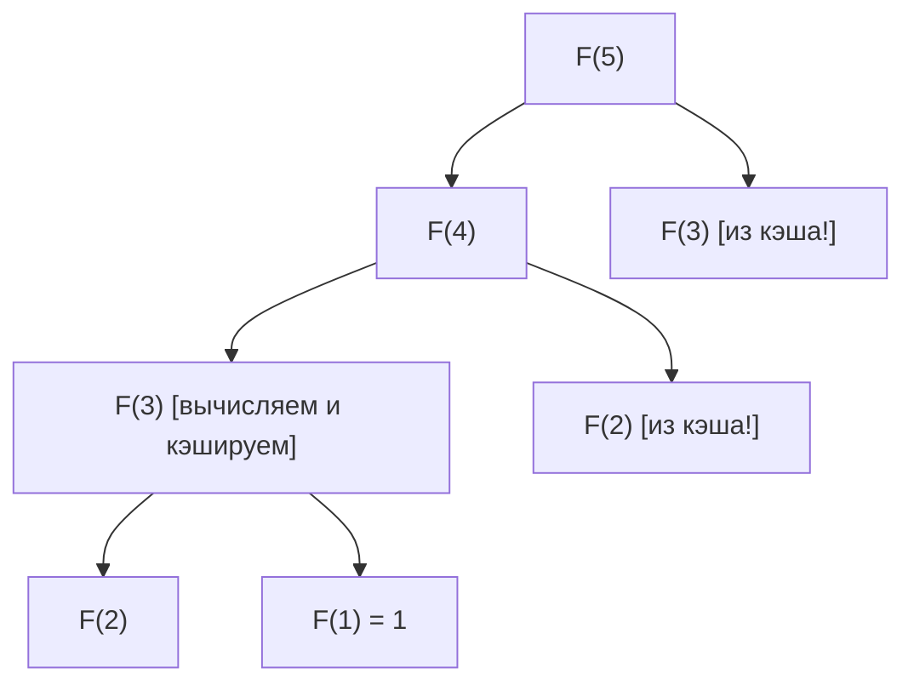
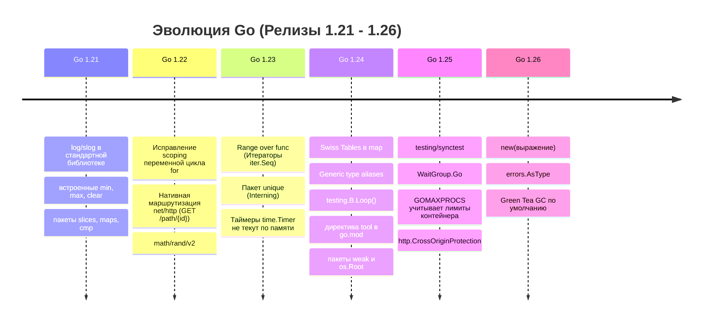
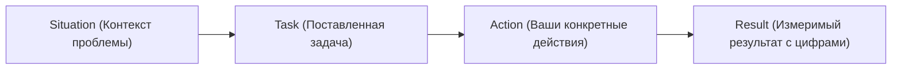
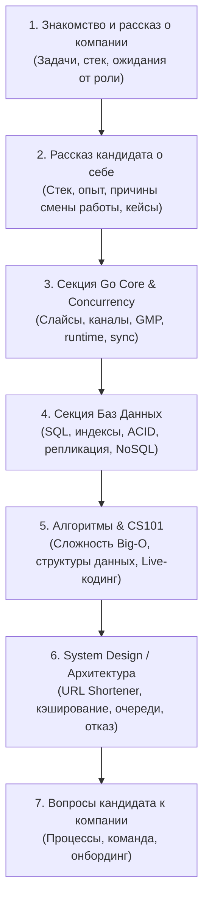

# Том 6: Алгоритмы, Структуры данных, Низкоуровневый Go и Собеседования

> [!TIP]
> 📚 **Навигация:** [⬅️ Назад: Том 5](05-go-core-testing-arch.md) | [📖 Главное оглавление](README.md)

> [!IMPORTANT]
> 💻 **Практика, примеры кода и домашние задания к этому тому:**
> - 📂 **Код лекций:** [03-algorithms](file:///Users/user/workspace/golang_projects/go-core-4/go_course_4/03-algorithms) (Бинарный поиск, сортировки, бенчмарки $O(N)$), [04-datastructs](file:///Users/user/workspace/golang_projects/go-core-4/go_course_4/04-datastructs) (Двусвязный список, BST-дерево, стек, очередь), [21-interview](file:///Users/user/workspace/golang_projects/go-core-4/go_course_4/21-interview) (Вопросы и алгоритмические задачи с собеседований).
> - 🎯 **Задачник:** [homework-tasks.md (Занятия 3, 4, 7)](file:///Users/user/workspace/golang_projects/go-core-4/go_course_4/go-documentation/homework-tasks.md#занятие-3-быстрый-поисковый-индекс-инвертированный-индекс-и-бинарный-поиск).
> - 🛠️ **Решения домашних заданий:**
>   - [homework-03](file:///Users/user/workspace/golang_projects/go-core-4/go_course_4/homework-03) — Инвертированный хэш-индекс (`map[string][]int`) и бинарный поиск документов `sort.Search` за $O(\log N)$.
>   - [homework-04](file:///Users/user/workspace/golang_projects/go-core-4/go_course_4/homework-04) — Циклический двусвязный список со сторожевым элементом Sentinel (`Pop`, `Reverse`).
>   - [homework-07](file:///Users/user/workspace/golang_projects/go-core-4/go_course_4/homework-07) — Реализация алгоритмов быстрой сортировки QuickSort и MergeSort с бенчмарками.
> - 💡 **Специализированные гайды к интервью:**
>   - 💻 [go-livecoding-guide.md (Live-Coding: 43 задачи)](file:///Users/user/workspace/golang_projects/go-core-4/go_course_4/go-documentation/go-livecoding-guide.md)
>   - 🗄️ [sql-livecoding-guide.md (Live SQL: 28 задач)](file:///Users/user/workspace/golang_projects/go-core-4/go_course_4/go-documentation/sql-livecoding-guide.md)
>   - 🗄️ [go-database-interview-guide.md (Собеседование по БД)](file:///Users/user/workspace/golang_projects/go-core-4/go_course_4/go-documentation/go-database-interview-guide.md)
> - 🗺️ **Сквозной путеводитель:** [course-codebase-guide.md (Экспресс-подготовка к собеседованию)](file:///Users/user/workspace/golang_projects/go-core-4/go_course_4/go-documentation/course-codebase-guide.md#-экспресс-маршрут-подготовки-к-собеседованию-за-1-день-до-интервью).

---

## 26. Базовые Алгоритмы и O-нотация в Go

> 🔗 **Практика и примеры кода:** [03-algorithms](file:///Users/user/workspace/golang_projects/go-core-4/go_course_4/03-algorithms) | 🛠️ **Домашнее задание:** [homework-03](file:///Users/user/workspace/golang_projects/go-core-4/go_course_4/homework-03) (Бинарный поиск $O(\log N)$) | 🎯 **Задачи:** [homework-tasks.md (Занятие 3)](file:///Users/user/workspace/golang_projects/go-core-4/go_course_4/go-documentation/homework-tasks.md#занятие-3-быстрый-поисковый-индекс-инвертированный-индекс-и-бинарный-поиск) | 💻 **Live-Coding:** [go-livecoding-guide.md](file:///Users/user/workspace/golang_projects/go-core-4/go_course_4/go-documentation/go-livecoding-guide.md)

### 26.1. Оценка сложности алгоритмов (Big-O Notation)

> [!NOTE]
> **Что такое $O$-нотация?**  
> $O(f(N))$ показывает, как растет время работы (или память) алгоритма при увеличении объема входных данных $N$.

| Сложность         | Название                | Пример в Go                                         | Скорость при $N=1\,000\,000$      |
| :---------------- | :---------------------- | :-------------------------------------------------- | :-------------------------------- |
| **$O(1)$**        | Константная             | Доступ по индексу слайса `s[i]`, чтение из `map[k]` | $\sim 1$ операция                 |
| **$O(\log N)$**   | Логарифмическая         | Бинарный поиск `slices.BinarySearch`, поиск в BST   | $\approx 20$ операций             |
| **$O(N)$**        | Линейная                | Простой цикл `for _, v := range slice`              | $1\,000\,000$ операций            |
| **$O(N \log N)$** | Линейно-логарифмическая | Быстрая сортировка `slices.Sort`                    | $\approx 20\,000\,000$ операций   |
| **$O(N^2)$**      | Квадратичная            | Вложенный цикл в цикле (пузырьковая сортировка)     | $1\,000\,000\,000\,000$ (виснет!) |

---

### 26.2. Бинарный поиск: ручной, `sort.Search` и `slices.BinarySearch`

> [!IMPORTANT]
> **Главное условие:** Бинарный поиск работает **только на предварительно отсортированном слайсе**!
> Сложность поиска — $O(\log N)$. При выборке из $1\,000\,000$ элементов линейный поиск требует до $1\,000\,000$ итераций, а бинарный — не более 20 сравнений (на практике это десятки наносекунд против сотен микросекунд — разница на несколько порядков; точные цифры зависят от железа и данных).

#### 1. Ручная реализация (классический алгоритм)

```go
func binarySearch(nums []int, target int) int {
    left, right := 0, len(nums)-1

    for left <= right {
        // Защита от переполнения int: mid = left + (right-left)/2 вместо (left+right)/2
        mid := left + (right-left)/2

        if nums[mid] == target {
            return mid // найден индекс
        } else if nums[mid] < target {
            left = mid + 1
        } else {
            right = mid - 1
        }
    }
    return -1 // не найден
}
```

#### 2. Классический способ стандартной библиотеки: `sort.Search`

Функция `sort.Search(n int, f func(int) bool) int` находит **наименьший индекс `i` в диапазоне `[0, n)`**, для которого предикат `f(i)` возвращает `true`.

> [!WARNING]
> **Коварная ловушка `sort.Search`:**  
> Если элемент отсутствует в слайсе, `sort.Search` вернет не `-1`, а **индекс `i` (в диапазоне `[0, n]`), куда этот элемент следовало бы вставить** для сохранения порядка сортировки!  
> Поэтому **всегда обязательна проверка**: `idx < len(slice) && slice[idx] == target`.

```go
import "sort"

func searchInt(nums []int, target int) int {
    // Предикат nums[i] >= target делит отсортированный массив на false...false...true...true
    idx := sort.Search(len(nums), func(i int) bool {
        return nums[i] >= target
    })

    if idx < len(nums) && nums[idx] == target {
        return idx // найден точный индекс
    }
    return -1 // элемент отсутствует
}

// Бинарный поиск по срезу структур (например, документов по ID):
type Document struct {
    ID    int
    Title string
}

func findDocByID(docs []Document, targetID int) *Document {
    idx := sort.Search(len(docs), func(i int) bool {
        return docs[i].ID >= targetID
    })

    if idx < len(docs) && docs[idx].ID == targetID {
        return &docs[idx]
    }
    return nil
}
```

#### 3. Современный подход Go 1.21+: пакет `slices`

```go
import (
    "cmp"
    "slices"
)

// 1. Для базовых типов:
nums := []int{10, 20, 30, 40, 50}
idx, found := slices.BinarySearch(nums, 30) // idx = 2, found = true

// 2. Для структур через функцию сравнения:
docs := []Document{{ID: 1, Title: "A"}, {ID: 5, Title: "B"}, {ID: 10, Title: "C"}}
idx, found = slices.BinarySearchFunc(docs, 5, func(doc Document, target int) int {
    return cmp.Compare(doc.ID, target) // пакет cmp: возвращает -1, 0 или +1
})
```

> ⚠️ В функциях сравнения вместо вычитания (`doc.ID - target`) используйте `cmp.Compare(a, b)`: вычитание может **переполниться** (например, `math.MaxInt - (-1)`) и дать неверный знак. Для простых небольших значений вычитание работает, но привычка использовать `cmp.Compare` безопаснее.

---

### 26.3. Алгоритмы сортировки и стандартный пакет `sort` (QuickSort, `pdqsort`, `sort.Interface`)

- **QuickSort (Быстрая сортировка):** Выбирается опорный элемент (_pivot_), массив делится на элементы меньше и больше pivot, затем рекурсивно сортируется. В среднем $O(N \log N)$, но в худшем случае при неудачном pivot — $O(N^2)$.
- **MergeSort (Сортировка слиянием):** Массив рекурсивно делится пополам до единичных элементов, затем сливается обратно в отсортированном порядке. Гарантированно $O(N \log N)$, но требует $O(N)$ дополнительной памяти под вспомогательный буфер.
- **Что под капотом в Go (`slices.Sort` / `sort.Sort`):** Начиная с Go 1.19 используется алгоритм **pdqsort (Pattern-defeating quicksort)**. Он сочетает скорость QuickSort на случайных данных, безопасность HeapSort ($O(N \log N)$ в худшем случае при превышении глубины рекурсии `maxDepth`) и скорость InsertionSort ($O(N)$) на почти отсортированных данных.

#### 1. Классический интерфейс `sort.Interface` (до эры дженериков)

Для сортировки кастомных типов через `sort.Sort` тип должен реализовать 3 метода:

```go
type Interface interface {
    Len() int
    Less(i, j int) bool
    Swap(i, j int)
}
```

Пример реализации для пользовательского среза документов:

```go
type DocsByID []Document

func (d DocsByID) Len() int           { return len(d) }
func (d DocsByID) Less(i, j int) bool { return d[i].ID < d[j].ID }
func (d DocsByID) Swap(i, j int)      { d[i], d[j] = d[j], d[i] }

// Вызов:
sort.Sort(DocsByID(docs))
```

#### 2. Удобная сортировка срезов `sort.Slice` и `sort.SliceStable`

Если не хочется объявлять отдельный именованный тип, используют функцию с замыканием:

```go
// Нестабильная быстрая сортировка (порядок равных элементов может измениться):
sort.Slice(docs, func(i, j int) bool {
    return docs[i].ID < docs[j].ID
})

// Стабильная сортировка (сохраняет относительный порядок элементов с одинаковыми ключами):
sort.SliceStable(docs, func(i, j int) bool {
    return docs[i].Title < docs[j].Title
})
```

#### 3. Современная сортировка Go 1.21+ (`slices.Sort` и `slices.SortFunc`)

Обычно работает быстрее `sort.Slice`: `sort.Slice` использует рефлексию (`reflect.Swapper`) для перестановки элементов и вызывает функцию сравнения по индексам, а `slices.Sort`/`slices.SortFunc` — обобщённый код без рефлексии, который работает напрямую со значениями:

```go
import "slices"

// 1. Примитивные типы:
slices.Sort([]int{5, 2, 8, 1})

// 2. Срез структур по полю:
slices.SortFunc(docs, func(a, b Document) int {
    return cmp.Compare(a.ID, b.ID) // -1 если a < b, 0 если a == b, +1 если a > b
})

// 3. Стабильная сортировка (равные элементы сохраняют исходный порядок):
slices.SortStableFunc(docs, func(a, b Document) int {
    return strings.Compare(a.Title, b.Title)
})
```

---

### 26.4. Рекурсия и Стек вызовов (Call Stack & Stack Overflow)

**Рекурсия** — метод решения задачи, при котором функция вызывает саму себя для решения подзадачи меньшего размера.

#### Анатомия рекурсивной функции:

1. **Базовый случай (Base Case / Терминальное условие):** критерий остановки, предотвращающий бесконечные вызовы.
2. **Шаг рекурсии (Recursive Step):** сведение текущей задачи к более простой подзадаче.

```go
// 1. Вычисление факториала (линейная глубина рекурсии O(N)):
func Factorial(n int) int {
    if n <= 1 { // Базовый случай
        return 1
    }
    return n * Factorial(n-1) // Шаг рекурсии
}

// 2. Быстрое возведение в степень x^y за O(log y) («Разделяй и властвуй»):
func PowFast(x, y int) int {
    if y == 0 {
        return 1
    }
    if y%2 == 0 {
        half := PowFast(x, y/2)
        return half * half
    }
    return x * PowFast(x, y-1)
}
```

#### Стек вызовов (Call Stack) в Go Runtime

Каждый вызов функции выделяет фрейм на **стеке горутины** (адрес возврата, переданные параметры, локальные переменные).

- В обычных языках (C, Java, Python) поток ОС имеет фиксированный стек (обычно 1–8 МБ).
- В Go каждая горутина стартует с ультра-легкого стека всего в **2 КБ**. При необходимости среда исполнения динамически аллоцирует новый кусок памяти большего размера и копирует туда старый стек (механизм _contiguous stack_).
- **Максимальный лимит стека в Go:** по умолчанию составляет **1 ГБ** на 64-битных ОС (250 МБ на 32-битных).

> [!CAUTION]
> **Stack Overflow невозможно перехватить через `recover()`!**  
> Если в рекурсивной функции отсутствует базовый случай или глубина превысила 1 ГБ памяти, Go Runtime немедленно аварийно завершает весь процесс:
>
> ```text
> runtime: goroutine stack exceeds 1000000000-byte limit
> fatal error: stack overflow
> ```
>
> В production-коде для глубоких вычислений (обход деревьев, графов, парсинг) всегда отдают предпочтение **итеративным алгоритмам со своим срезом-стеком** вместо глубокой системной рекурсии.

---

### 26.5. Парадигмы алгоритмов: Разделяй и властвуй, Динамическое программирование и Жадные алгоритмы

#### 1. «Разделяй и властвуй» (Divide and Conquer, D&C)

Техника построения алгоритмов, состоящая из трех этапов:

1. **Разделение (Divide):** задача разбивается на независимые подзадачи того же типа меньшего размера.
2. **Властвование (Conquer):** подзадачи решаются рекурсивно (достигая базового случая).
3. **Объединение (Combine):** решения подзадач склеиваются в решение исходной задачи.

_Алгоритм эффективен тогда, когда процедура слияния решений выполняется быстрее, чем исходное решение._  
**Примеры D&C:** MergeSort ($O(N \log N)$), QuickSort, Бинарный поиск ($O(\log N)$).

#### 2. Динамическое программирование (DP) и Мемоизация

Динамическое программирование применяется, когда задача обладает двумя свойствами:

1. **Оптимальная подструктура:** оптимальное решение задачи строится из оптимальных решений ее подзадач.
2. **Перекрывающиеся подзадачи (Overlapping Subproblems):** одни и те же подзадачи решаются многократно.

##### Мемоизация (Memoization — Top-Down DP)

Чтобы избежать повторного пересчета одинаковых подзадач, результаты однажды вычисленных функций сохраняются в кэш (хэш-таблицу `map` или срез).



**Сравнение подходов: Рекурсия с мемоизацией vs Итеративный подход (без рекурсии)**

Числа Фибоначчи ($F_0 = 0, F_1 = 1, F_n = F_{n-1} + F_{n-2}$) решаются двумя классическими путями динамического программирования:

| Подход                                  | Временная сложность       | Пространственная сложность | Риск Stack Overflow          | Описание                                                                                  |
| :-------------------------------------- | :------------------------ | :------------------------- | :--------------------------- | :---------------------------------------------------------------------------------------- |
| **1. Наивная рекурсия**                 | **$O(2^N)$** (катастрофа) | $O(N)$ (глубина стека)     | ⚠️ Высокий                   | Дерево повторных вызовов, уже при $N=50$ виснет.                                          |
| **2. Рекурсия + Мемоизация (Top-Down)** | **$O(N)$**                | **$O(N)$** (стек + `map`)  | ⚠️ Только при очень больших $N$ (миллионы вызовов глубины; лимит стека Go — 1 ГБ) | Идем сверху вниз, сохраняя результат каждой подзадачи в кэш.                              |
| **3. Итеративный цикл (Bottom-Up)**     | **$O(N)$**                | **$O(1)$** (константа!)    | 🛡️ **Полностью отсутствует** | Идем снизу вверх от 0 и 1, храня только два последних числа. **Идеальный выбор в проде!** |

---

#### Реализация на Go: 2 пути

```go
// ПУТЬ 1: Рекурсивный с мемоизацией (Top-Down) — O(N) времени, O(N) памяти
func FibMemo(n int, cache map[int]int) int {
    if val, exists := cache[n]; exists {
        return val // отдаем из кэша за O(1)
    }
    if n <= 1 {
        return n // базовый случай
    }
    cache[n] = FibMemo(n-1, cache) + FibMemo(n-2, cache)
    return cache[n]
}

// ПУТЬ 2: Итеративный без рекурсии (Bottom-Up) — O(N) времени, O(1) памяти!
func FibIterative(n int) int {
    if n <= 1 {
        return n
    }
    a, b := 0, 1
    for i := 2; i <= n; i++ {
        a, b = b, a+b // параллельный сдвиг окна из двух чисел
    }
    return b
}
```

> ⚠️ Тип `int` (64 бита) переполняется уже на `F(93)`: результат «обернётся» в отрицательное число без ошибки. Для больших `n` используйте `math/big` (`*big.Int`).

---

#### Реализация на Ruby: 2 пути

В Ruby (динамическом языке со ссылочной моделью) оба подхода выглядят особенно элегантно:

```ruby
# ==========================================================
# ПУТЬ 1: Рекурсивный подход
# ==========================================================

# 1.1. Наивный (без мемоизации) — O(2^N), виснет при n >= 40:
def fib_naive(n)
  return n if n <= 1
  fib_naive(n - 1) + fib_naive(n - 2)
end

# 1.2. С мемоизацией (Top-Down) через Hash с блоком инициализации:
# Hash.new { |h, k| h[k] = ... } автоматически вычисляет и кэширует значение при первом обращении!
FIB_CACHE = Hash.new do |cache, n|
  cache[n] = n <= 1 ? n : cache[n - 1] + cache[n - 2]
end

def fib_memo(n)
  FIB_CACHE[n] # O(N) времени, мгновенный результат для n = 100
end

# Вариант мемоизации внутри метода/класса:
def fib_memo_local(n, cache = {})
  return cache[n] if cache.key?(n)
  return n if n <= 1

  cache[n] = fib_memo_local(n - 1, cache) + fib_memo_local(n - 2, cache)
end

# ==========================================================
# ПУТЬ 2: Итеративный подход без рекурсии (Bottom-Up)
# ==========================================================
# O(N) времени, O(1) памяти, нет опасности SystemStackError (переполнения стека)
def fib_iterative(n)
  return n if n <= 1

  a, b = 0, 1
  (n - 1).times do
    a, b = b, a + b # параллельное присваивание в Ruby
  end
  b
end

# Проверка:
puts fib_memo(50)       # => 12586269025
puts fib_iterative(50)  # => 12586269025
```

#### 3. Жадные алгоритмы (Greedy Algorithms)

**Жадный алгоритм** на каждом шаге делает локально-оптимальный выбор в расчете на то, что итоговое глобальное решение окажется оптимальным.

- **Компромисс:** Жадные алгоритмы жертвуют гарантией идеального глобального оптимума ради колоссальной скорости.
- **Сфера применения:**
  - NP-трудные задачи (задача коммивояжера, задача о покрытии множества аудиторий в маркетинге).
  - Задачи, для которых жадный выбор математически доказано дает точный оптимум:
    - Размен монет в банкомате (выдача максимальными купюрами для стандартных номиналов).
    - Алгоритм Дейкстры (поиск кратчайшего пути во взвешенном графе с **неотрицательными** весами рёбер).
    - Алгоритмы Прима и Краскала (построение минимального остовного дерева).
    - Алгоритм Хаффмана (сжатие данных).

---

### 26.6. Поисковый обратный индекс (Inverted Index) и быстрая выборка документов

**Обратный (инвертированный) индекс** — фундаментальная структура данных поисковых движков (GoSearch, Apache Lucene, Elasticsearch, Bleve).

#### Проблема прямого поиска (Linear Scan)

Если хранить $1\,000\,000$ веб-страниц в срезе и искать слово прямым перебором каждого текста, каждый поисковый запрос потребует полного сканирования всех текстов ($O(D \cdot L)$), что убьет процессор и приведет к задержкам в секунды.

#### Архитектура Inverted Index:

Вместо связки `Документ -> Текст` строится обратное отображение: **`Слово (Term) -> [ID документов]`**.

```mermaid
flowchart LR
    subgraph Исходные документы
        D0["Doc 0: Go fast concurrency"]
        D1["Doc 1: Go microservices"]
    end

    subgraph Inverted Index map[string][]int
        W1["go"] --> L1["[0, 1]"]
        W2["fast"] --> L2["[0]"]
        W3["concurrency"] --> L3["[0]"]
        W4["microservices"] --> L4["[1]"]
    end
```

#### Идиоматичная реализация на Go:

```go
package index

import (
    "cmp"
    "slices"
    "sort"
    "strings"
)

// Document представляет найденную поисковым роботом страницу.
type Document struct {
    ID    int
    URL   string
    Title string
}

// Index хранит обратный индекс слов и отсортированный срез документов.
type Index struct {
    docs  []Document       // отсортированы строго по возрастанию ID!
    index map[string][]int // слово -> срез ID документов (без дублей)
}

func New() *Index {
    return &Index{
        docs:  make([]Document, 0),
        index: make(map[string][]int),
    }
}

// Add индексирует пачку документов, полученных поисковым роботом (Crawler).
func (idx *Index) Add(docs []Document) {
    idx.docs = append(idx.docs, docs...)

    // 1. Обязательно сортируем документы по возрастанию ID для будущего бинарного поиска:
    slices.SortFunc(idx.docs, func(a, b Document) int {
        return cmp.Compare(a.ID, b.ID)
    })

    // 2. Индексируем каждое слово из заголовка (Title):
    for _, doc := range docs {
        words := strings.Fields(strings.ToLower(doc.Title))
        seenInDoc := make(map[string]bool)

        for _, word := range words {
            // Исключаем дублирование ID одного и того же документа для одного слова:
            if !seenInDoc[word] {
                idx.index[word] = append(idx.index[word], doc.ID)
                seenInDoc[word] = true
            }
        }
    }
}

// Search выполняет полнотекстовый поиск:
// 1. Находит IDs документов в мапе за O(1).
// 2. Извлекает полные документы с помощью БИНАРНОГО ПОИСКА за O(log N).
func (idx *Index) Search(term string) []Document {
    term = strings.ToLower(term)
    ids, exists := idx.index[term]
    if !exists {
        return nil
    }

    results := make([]Document, 0, len(ids))
    for _, id := range ids {
        // Бинарный поиск документа по ID в отсортированном срезе idx.docs:
        docIdx := sort.Search(len(idx.docs), func(i int) bool {
            return idx.docs[i].ID >= id
        })

        if docIdx < len(idx.docs) && idx.docs[docIdx].ID == id {
            results = append(results, idx.docs[docIdx])
        }
    }

    return results
}
```

---

## 27. Классические Структуры Данных (Data Structures в Go)

> 🔗 **Практика и примеры кода:** [04-datastructs](file:///Users/user/workspace/golang_projects/go-core-4/go_course_4/04-datastructs) | 🛠️ **Домашнее задание:** [homework-04](file:///Users/user/workspace/golang_projects/go-core-4/go_course_4/homework-04) (Двусвязный список Sentinel) | 🎯 **Задачи:** [homework-tasks.md (Занятие 4)](file:///Users/user/workspace/golang_projects/go-core-4/go_course_4/go-documentation/homework-tasks.md#занятие-4-структуры-данных--циклический-двусвязный-список-со-сторожевым-элементом-pop-и-reverse)

### 27.1. Связные списки (`container/list` vs Slice)

> [!IMPORTANT]
> **Классический вопрос на собеседовании (Middle / Senior):**  
> _«Зачем в Go нужен пакет `container/list` (двусвязный список), если есть срезы (`slice`)? Почему на практике связные списки почти никогда не используют и когда они действительно незаменимы?»_

#### 1. Что такое `container/list` в стандартной библиотеке:

Пакет `container/list` реализует классический **двусвязный кольцевой список (Doubly Linked List)** с фиктивным сторожевым элементом (**Sentinel Node**).

```go
// Внутреннее устройство узла (container/list):
type Element struct {
    next, prev *Element     // Указатели на следующий и предыдущий элементы
    list       *List        // Указатель на список, которому принадлежит элемент
    Value      any          // Полезная нагрузка любого типа (interface{})
}

// Внутреннее устройство самого списка:
type List struct {
    root Element // Сторожевой элемент (root.next = голова, root.prev = хвост)
    len  int     // Текущее количество элементов за O(1)
}
```

Сторожевой элемент `root` замыкает список в кольцо (`root.prev` указывает на последний элемент, а `root.next` — на первый). Это элегантное инженерное решение избавляет рантайм от постоянных проверок на `nil` при добавлении и удалении краевых элементов.

```go
package main

import (
    "container/list"
    "fmt"
)

func main() {
    l := list.New() // Создание пустого двусвязного списка

    elem1 := l.PushBack("первый")          // Добавление в конец
    l.PushFront("нулевой")                 // Добавление в начало
    elem2 := l.InsertAfter("между", elem1) // Вставка после узла за O(1)
    l.MoveToFront(elem2)                   // Перемещение узла в начало за O(1)
    l.Remove(elem1)                        // Удаление узла за O(1)

    // Итерация по двусвязному списку:
    for e := l.Front(); e != nil; e = e.Next() {
        fmt.Println(e.Value.(string)) // Требуется Type Assertion, т.к. Value имеет тип any
    }
}
```

#### 2. ЗАЧЕМ нужен `container/list`: 4 случая, когда он незаменим

1. **Гарантированная вставка и удаление в произвольном месте за строгое $O(1)$:**
   Если у вас уже есть указатель на узел `*list.Element`, вставка нового узла перед ним/после него (`InsertBefore`/`InsertAfter`) или его удаление (`Remove`) сводится к простой перестановке 4 указателей.  
   В срезе (`slice`) удаление или вставка в начало/середину требует вызова `copy()` / `memmove` со сдвигом всего правого хвоста массива в памяти — это трудоёмкая операция $O(N)$.
2. **Неинвалидируемые указатели (Stable Pointers):**
   При добавлении элементов в `list` адреса ранее созданных узлов `*Element` **в памяти никогда не меняются**.  
   В срезе (`slice`), когда количество элементов превышает емкость (`len > cap`), Go выделяет новый непрерывный массив в куче большего размера и копирует данные туда. При этом **все ранее сохраненные указатели на элементы старого массива инвалидируются** и указывают на устаревшие данные.
3. **Классический LRU-кэш (Least Recently Used Cache):**
   Это главный архитектурный пример применения связного списка в Go. В LRU-кэше хеш-мапа хранит соответствие `map[K]*list.Element`. При каждом чтении `Get(key)` найденный узел мгновенно переносится в голову списка вызовом `order.MoveToFront(elem)` за **строгое $O(1)$**, а при переполнении кэша самый старый элемент удаляется из хвоста `order.Remove(order.Back())` также за **$O(1)$**. Реализовать подобное на слайсе без деградации до $O(N)$ невозможно.
4. **Очереди без скрытых утечек памяти емкости (Capacity Leaks):**
   В очереди на срезе при сдвиге `queue = queue[1:]` головной элемент удаляется лишь логически, но физически базовый массив остается в памяти в полном объеме, пока не будет выполнен принудительный реслайсинг или сборка мусора. В связном списке удаленный узел `*Element` мгновенно отвязывается и становится доступен GC.

#### 3. ПОЧЕМУ в подавляющем большинстве задач выбирают Слайс, а не Связный список (Топ-вопрос Middle/Senior):

Несмотря на теоретическое преимущество списка в $O(1)$ при вставках, в большинстве сценариев срезы (`slice`) в Go **в разы быстрее связного списка**. Причины кроются в архитектуре современного процессора:

| Критерий                                        | Срез (`slice`)                                                                                                                      | Двусвязный список (`container/list`)                                                                                                                     | Победитель                                      |
| :---------------------------------------------- | :---------------------------------------------------------------------------------------------------------------------------------- | :------------------------------------------------------------------------------------------------------------------------------------------------------- | :---------------------------------------------- |
| **CPU Cache Locality (Локальность данных)**     | Элементы лежат в RAM **строго непрерывно**. Аппаратный префетчер процессора загружает кэш-линию L1/L2 (64 байта) целиком за 1 такт. | Узлы хаотично раскиданы по всей куче (Heap). Каждый переход `e.Next()` — это потенциальный **CPU Cache Miss** (штраф ~200 тактов CPU на чтение из RAM).  | 🏆 **Slice** (в 10-50 раз быстрее на итерациях) |
| **Давление на Garbage Collector (GC Pressure)** | **1 аллокация** на весь массив из $N$ элементов. GC сканирует один непрерывный блок памяти.                                         | **$N$ отдельных аллокаций** в куче на каждый узел `Element` + boxing в `any`. Сборщик мусора вынужден отслеживать миллионы мелких объектов и указателей. | 🏆 **Slice** (минимальный STW и оверхед)        |
| **Расход памяти (Memory Footprint)**            | Для `int64`: ровно **8 байт** на элемент.                                                                                           | Для `int64`: сам `Element` (`next` 8Б + `prev` 8Б + `list` 8Б + `Value any` 16Б = 40Б, округляется аллокатором до размера 48Б) + отдельная аллокация под упакованный в `any` `int64` (8Б) ≈ **~56 байт на элемент**! (в 7 раз больше)        | 🏆 **Slice** (в 7 раз компактнее)               |
| **Доступ по индексу `[i]`**                     | $O(1)$ мгновенно по формуле `base + i*elemSize`                                                                                     | $O(N)$ последовательный проход по указателям                                                                                                             | 🏆 **Slice**                                    |
| **Типобезопасность**                            | Строгая компиляторная типизация `[]T` без приведений типов.                                                                         | Хранит `Value any`, требуя runtime Type Assertion `.(T)` при каждом извлечении.                                                                          | 🏆 **Slice**                                    |
| **Вставка/удаление в начало/середину**          | $O(N)$ — требует копирования элементов через `memmove`.                                                                             | $O(1)$ — простая перестановка 4 указателей.                                                                                                              | 🏆 **List** (при наличии указателя на узел)     |

> [!TIP]
> **Парадокс производительности на реальном процессоре:**  
> Из-за колоссальной скорости аппаратной инструкции `memmove` процессора и кэшей L1/L2 сдвиг 10 000 чисел в непрерывном срезе выполняется быстрее, чем аллокация нового узла `Element` в куче и обход разрозненных указателей связного списка!

#### 4. Резюме для ответа на интервью:

- **Когда нужен `slice`:** в подавляющем большинстве случаев (коллекции данных, стеки, очереди с циклическим буфером, потоковая обработка, вычисления).
- **Когда нужен `container/list`:** только в специализированных алгоритмических структурах с частым перемещением узлов за $O(1)$ и стабильными указателями (LRU/LFU кэши, графовые списки смежности с постоянными ссылками).

---

### 27.2. Стек (LIFO) и Очередь (FIFO)

> [!IMPORTANT]
> **Принципиальное отличие Стека от Очереди (Топ-вопрос для любого грейда):**  
> Стек и Очередь — это фундаментальные абстрактные структуры данных с диаметрально противоположной дисциплиной обслуживания элементов:
>
> - **Стек (Stack / LIFO — Last-In, First-Out):** «Последним пришёл — первым обслужен». Добавление и извлечение производятся **строго с одного конца (вершина / Top)**.
> - **Очередь (Queue / FIFO — First-In, First-Out):** «Первым пришёл — первым обслужен». Добавление происходит в **конец (хвост / Tail)**, а извлечение — из **начала (голова / Head)**.

#### 📊 Сравнительная таблица отличий Стека и Очереди:

| Критерий                  | Стек (Stack)                                                                         | Очередь (Queue)                                                                               |
| :------------------------ | :----------------------------------------------------------------------------------- | :-------------------------------------------------------------------------------------------- |
| **Дисциплина доступа**    | **LIFO** (Last-In, First-Out)                                                        | **FIFO** (First-In, First-Out)                                                                |
| **Ментальная модель**     | Стопка чистых тарелок, магазин пистолета, колода карт                                | Живая очередь в кассу магазина, конвейер на заводе                                            |
| **Точки доступа**         | **1 точка** — вершина (`Top`)                                                        | **2 точки** — голова (`Head`) и хвост (`Tail`)                                                |
| **Базовые операции**      | `Push` (положить наверх), `Pop` (взять сверху), `Peek`                               | `Enqueue` / `Push` (в хвост), `Dequeue` / `Pop` (из головы)                                   |
| **Алгоритмы обхода**      | Поиск в глубину (**DFS** — Depth-First Search)                                       | Поиск в ширину (**BFS** — Breadth-First Search)                                               |
| **Применение в системах** | Стек вызовов функций (Call Stack), отмена действий (Ctrl+Z), парсинг скобок/AST, RPN | Очереди фоновых задач (RabbitMQ, Kafka, Asynq), буферизация TCP, планировщик задач, каналы Go |
| **Поведение памяти в Go** | Срез `s[:len-1]` **не течет**, емкость сохраняется стабильной                        | Срез `q[1:]` вызывает **утечку памяти** (Memory Leak), удерживая старый массив                |

---

#### 1. Стек (Stack: LIFO — Last-In, First-Out)

В Go стек идеально реализуется на обычном срезе: операция `append()` добавляет в конец за амортизированное $O(1)$, а взятие последнего элемента `s[:len-1]` уменьшает срез за $O(1)$ без аллокаций.

```go
type Stack[T any] struct {
    items []T
}

func NewStack[T any]() *Stack[T] {
    return &Stack[T]{items: make([]T, 0, 16)}
}

// Push добавляет элемент на вершину стека: O(1)
func (s *Stack[T]) Push(v T) {
    s.items = append(s.items, v)
}

// Pop снимает и возвращает элемент с вершины стека: O(1)
func (s *Stack[T]) Pop() (T, bool) {
    if len(s.items) == 0 {
        var zero T
        return zero, false
    }
    lastIdx := len(s.items) - 1
    top := s.items[lastIdx]

    // Предотвращение утечки памяти для указателей/ссылочных типов:
    var zero T
    s.items[lastIdx] = zero // GC может освободить объект, если это указатель
    s.items = s.items[:lastIdx]

    return top, true
}

// Peek возвращает значение с вершины стека без его удаления: O(1)
func (s *Stack[T]) Peek() (T, bool) {
    if len(s.items) == 0 {
        var zero T
        return zero, false
    }
    return s.items[len(s.items)-1], true
}
```

---

#### 2. Очередь (Queue: FIFO — First-In, First-Out)

> [!WARNING]
> **Опасная ловушка очередей на срезах в Go:**  
> Если удалять элемент из начала простым срезом `q.items = q.items[1:]`, смещается только указатель заголовка слайса. **Элементы физически остаются в базовом массиве**, и сборщик мусора не может их освободить. Если через такую очередь проходят миллионы сообщений, базовый массив никогда не сожмется, вызывая скрытую утечку оперативной памяти!

##### Безопасная реализация очереди со сжатием памяти (Amortized Zero-Leak Queue):

```go
type Queue[T any] struct {
    items []T
    head  int // Индекс текущей головы очереди
}

func NewQueue[T any]() *Queue[T] {
    return &Queue[T]{items: make([]T, 0, 16)}
}

// Push (Enqueue) добавляет элемент в хвост очереди: O(1)
func (q *Queue[T]) Push(v T) {
    q.items = append(q.items, v)
}

// Pop (Dequeue) извлекает элемент из головы очереди: O(1)
func (q *Queue[T]) Pop() (T, bool) {
    if q.head >= len(q.items) {
        var zero T
        return zero, false
    }

    item := q.items[q.head]
    var zero T
    q.items[q.head] = zero // Зануляем для GC
    q.head++

    // Оптимизация памяти: когда отработанная голова превышает половину среза,
    // сдвигаем оставшиеся элементы в начало и освобождаем хвост:
    if q.head > 64 && q.head*2 >= len(q.items) {
        n := copy(q.items, q.items[q.head:])
        clear(q.items[n:]) // зануляем «хвост» после сдвига, иначе там останутся ссылки, мешающие GC (Go 1.21+)
        q.items = q.items[:n]
        q.head = 0
    }

    return item, true
}

func (q *Queue[T]) Len() int {
    return len(q.items) - q.head
}
```

> [!TIP]
> 💡 **Каналы в Go как встроенная потокобезопасная FIFO-очередь:**  
> В Go буферизованный канал `ch := make(chan T, N)` представляет собой готовую потокобезопасную FIFO-очередь. В рантайме структура `hchan` содержит кольцевой циклический буфер элементов (`buf`), индексы записи/чтения (`sendx`, `recvx`), собственный `mutex` и две очереди заблокированных горутин (`waitq.sendq` и `waitq.recvq`).
>
> ⚠️ **Очереди сообщений (RabbitMQ / Apache Kafka) vs Классический FIFO:**  
> В реальных распределенных системах очереди сообщений не всегда ведут себя как строгий FIFO:
>
> 1. **Apache Kafka:** строгий FIFO гарантируется **только внутри одной партиции (Partition)**. На уровне всего топика глобального порядка нет.
> 2. **RabbitMQ:** при конкурентной обработке несколькими воркерами (Competing Consumers) или при повторной отправке сообщений (Nack / Dead Letter Exchange) порядок неизбежно перемешивается.

---

### 27.3. Бинарные деревья поиска (BST: Binary Search Tree)

> [!IMPORTANT]
> **Принципиальная разница на собеседованиях (Обычное дерево vs BST):**
>
> 1. **Произвольное бинарное дерево (Binary Tree):** элементы не отсортированы. Чтобы найти значение, необходимо обойти дерево целиком (поиск в глубину DFS или в ширину BFS). Сложность поиска **всегда $O(N)$** по времени и $O(H)$ по памяти стека (где $H$ — высота дерева).
> 2. **Бинарное дерево поиска (Binary Search Tree, BST):** для любого узла все элементы в левом поддереве **меньше** значения узла, а в правом — **больше** (если допускаются дубликаты, то договариваются, в какую сторону они уходят: в реализации ниже равные значения отправляются в правое поддерево). Поиск направленный, как в бинарном поиске по массиву, с отсечением ненужной ветки.

#### 📊 Сводная таблица алгоритмической сложности:

| Тип дерева / Операция                          | Поиск (Search)  | Вставка (Insert)  | Удаление (Delete) | Доп. память (стек рекурсии) |
| :--------------------------------------------- | :-------------- | :---------------- | :---------------- | :------------- |
| **Произвольное бинарное дерево**               | **$O(N)$**      | $O(1)$ или $O(N)$ | $O(N)$            | $O(H)$         |
| **Сбалансированный BST (Средний случай)**      | **$O(\log N)$** | **$O(\log N)$**   | **$O(\log N)$**   | $O(\log N)$    |
| **Вырожденный BST (Худший случай — "бамбук")** | **$O(N)$**      | **$O(N)$**        | **$O(N)$**        | $O(N)$         |
| **Самобалансирующийся BST (AVL / Red-Black)**  | **$O(\log N)$** | **$O(\log N)$**   | **$O(\log N)$**   | $O(\log N)$    |

```text
        8
       / \
      3   10
     / \    \
    1   6    14
       / \   /
      4   7 13
```

#### 💡 Что такое «несбалансированное дерево» (Unbalanced Tree) в Computer Science:

В теории алгоритмов понятия **сбалансированного** и **несбалансированного** дерева являются базовыми:

1. **Сбалансированное по высоте дерево (Height-Balanced Tree):**  
   Для каждого узла дерева глубина (высота) его левого и правого поддеревьев отличается **не более чем на 1** ($|H_{\text{left}} - H_{\text{right}}| \le 1$).  
   Высота такого дерева минимальна и равна $H = O(\log_2 N)$. Поиск, вставка и удаление выполняются за логарифмическое время **$O(\log N)$**.

2. **Несбалансированное дерево (Unbalanced Tree):**  
   Дерево, у которого нарушен баланс высот ветвей ($|H_{\text{left}} - H_{\text{right}}| > 1$). Глубина дерева начинает расти быстрее логарифма ($H \gg \log_2 N$), из-за чего операции поиска деградируют к линейному времени.

3. **Крайняя степень: Вырожденное дерево (Degenerate / Pathological Tree):**  
   Максимально несбалансированное дерево, в котором у каждого узла есть **ровно один потомок** (только левый или только правый).  
   Такое дерево физически превращается в **односвязный список** («бамбук» или «виноградную лозу»). Его высота равна числу элементов ($H = N$), а сложность поиска падает до худшего значения **$O(N)$**.

```text
Сбалансированное дерево (H = 3, N = 7):
        4
      /   \
     2     6
    / \   / \
   1   3 5   7
Поиск любого числа: не более 3 шагов [O(log N)]

Несбалансированное / Вырожденное дерево (H = 5, N = 5):
   1
    \
     2
      \
       3
        \
         4
          \
           5
Поиск числа 5: 5 шагов [O(N)] (как в обычном связном списке!)
```

#### 🔍 Причины разбалансировки и способы решения:

- **Причина возникновения:** если в наивный BST вставлять уже отсортированные данные (например, `[1, 2, 3, 4, 5]`), каждый следующий элемент всегда больше текущего и уходит строго вправо, создавая длинный вырожденный хвост.
- **Как бороться с разбалансировкой:**
  1. **Самобалансирующиеся деревья (AVL-деревья):** после каждой вставки/удаления пересчитывают фактор баланса ($BF = H_L - H_R$). При $|BF| > 1$ выполняются локальные **малые и большие повороты (Rotations)** за $O(1)$, сохраняя высоту $O(\log N)$.
  2. **Красно-черные деревья (Red-Black Trees):** узлы красятся в красный/черный цвет, поддерживая 5 инвариантов. Требуют меньше поворотов при частых вставках (используются в `std::map` в C++ и `TreeMap` в Java).
  3. **B-деревья и B+ деревья:** многопутевые сбалансированные деревья с десятками/сотнями ключей на страницу, оптимизированные под дисковые блоки в базах данных (PostgreSQL, SQLite, MySQL InnoDB).

#### 💻 Проверка сбалансированности дерева на Go (LeetCode #110):

```go
// IsBalanced проверяет, является ли бинарное дерево сбалансированным по высоте.
// Сложность: Time O(N), Space O(H)
func IsBalanced(root *TreeNode) bool {
    return checkHeight(root) != -1
}

// checkHeight возвращает высоту поддерева или -1, если поддерево несбалансировано.
func checkHeight(node *TreeNode) int {
    if node == nil {
        return 0 // Высота пустого дерева равна 0
    }

    leftH := checkHeight(node.Left)
    if leftH == -1 {
        return -1 // Левое поддерево уже несбалансировано
    }

    rightH := checkHeight(node.Right)
    if rightH == -1 {
        return -1 // Правое поддерево уже несбалансировано
    }

    // Если разница высот больше 1 — дерево несбалансировано:
    diff := leftH - rightH
    if diff < 0 {
        diff = -diff
    }
    if diff > 1 {
        return -1
    }

    // Возвращаем реальную высоту текущего узла:
    if leftH > rightH {
        return leftH + 1
    }
    return rightH + 1
}
```

#### ⚖️ BST vs Отсортированный массив (`slices.BinarySearch`):

- **Отсортированный массив:** поиск за $O(\log N)$ с идеальной кэш-локальностью процессора (L1/L2 Cache Lines). Однако вставка нового элемента требует сдвига массива за $O(N)$.
- **Двоичное дерево поиска (BST):** вставка нового узла выполняется за $O(\log N)$ (для сбалансированного дерева) без сдвига существующих данных, что делает его выгодным для сценариев с частыми динамическими вставками/удалениями.

> В стандартной библиотеке Go **нет** готовых сбалансированных деревьев (AVL/красно-чёрных) — в продакшене используют сторонние реализации (например, B-дерево `github.com/google/btree`) либо БД/встроенные индексы.

```go
type TreeNode struct {
    Val   int
    Left  *TreeNode
    Right *TreeNode
}

// Вставка элемента в дерево BST:
func Insert(root *TreeNode, val int) *TreeNode {
    if root == nil {
        return &TreeNode{Val: val}
    }
    if val < root.Val {
        root.Left = Insert(root.Left, val)
    } else {
        root.Right = Insert(root.Right, val)
    }
    return root
}

// Поиск значения в BST: O(log N) в среднем, O(N) в худшем
func Search(root *TreeNode, val int) bool {
    if root == nil {
        return false
    }
    if root.Val == val {
        return true
    }
    if val < root.Val {
        return Search(root.Left, val)
    }
    return Search(root.Right, val)
}

// Симметричный обход (In-Order Traversal) — печатает все элементы строго по возрастанию!
func InOrder(root *TreeNode) {
    if root == nil {
        return
    }
    InOrder(root.Left)
    fmt.Printf("%d ", root.Val)
    InOrder(root.Right)
}
```

---

### 27.4. Графы и алгоритмы обхода (Представление в Go, BFS, DFS и остовные деревья)

**Граф** — совокупность вершин (узлов, Vertices) и соединяющих их ребер (связей, Edges).  
Граф не является встроенной структурой данных — в Go он моделируется через пользовательские типы.

#### 1. Способы представления графов в Go

- **Список смежности (Adjacency List):** отображение `вершина -> список соседей`. Наиболее идиоматичный и экономный по памяти способ для большинства разреженных графов ($O(V + E)$).
- **Матрица смежности (Adjacency Matrix):** двумерная матрица `[][]bool` или `[][]int`. Позволяет за $O(1)$ проверить наличие ребра между любыми $u$ и $v$, но требует $O(V^2)$ памяти.

```go
// 1. Список смежности через map (для строк/произвольных меток):
type Graph struct {
    adj map[string][]string
}

func NewGraph() *Graph {
    return &Graph{adj: make(map[string][]string)}
}

func (g *Graph) AddEdge(from, to string, undirected bool) {
    g.adj[from] = append(g.adj[from], to)
    if undirected {
        g.adj[to] = append(g.adj[to], from) // ненаправленное ребро
    }
}
```

#### 2. Поиск в ширину (BFS: Breadth-First Search)

BFS обходит граф послойно («волной»), используя структуру **Очередь (FIFO)**.

- **Для чего используется:** поиск кратчайшего пути в невзвешенном графе (минимальное число переходов/рукопожатий), волновой алгоритм.
- **Сложность:** $O(V + E)$.

```go
// BFS обходит все достижимые вершины от start и печатает их по порядку уровней:
func (g *Graph) BFS(start string) {
    visited := make(map[string]bool)
    queue := []string{start}
    visited[start] = true

    for len(queue) > 0 {
        // Извлекаем первый элемент из очереди (FIFO)
        // (для учебного примера достаточно среза; про скрытую утечку памяти при queue[1:] см. раздел 27.2)
        curr := queue[0]
        queue = queue[1:]
        fmt.Printf("%s ", curr)

        // Добавляем непосещенных соседей в очередь
        for _, neighbor := range g.adj[curr] {
            if !visited[neighbor] {
                visited[neighbor] = true
                queue = append(queue, neighbor)
            }
        }
    }
}
```

#### 3. Поиск в глубину (DFS: Depth-First Search)

DFS углубляется по ветке до упора, после чего возвращается назад (backtracking). Реализуется через **рекурсию** (стек вызовов) либо через явный стек.

- **Для чего используется:** топологическая сортировка (порядок сборки задач/пакетов в DAG), поиск циклов, связных компонент и лабиринтов.
- **Сложность:** $O(V + E)$.

```go
func (g *Graph) DFS(start string) {
    visited := make(map[string]bool)
    g.dfsRecursive(start, visited)
}

func (g *Graph) dfsRecursive(curr string, visited map[string]bool) {
    visited[curr] = true
    fmt.Printf("%s ", curr)

    for _, neighbor := range g.adj[curr] {
        if !visited[neighbor] {
            g.dfsRecursive(neighbor, visited)
        }
    }
}
```

#### 4. Минимальное покрывающее дерево (MST) и Кратчайшие пути

- **Минимальное покрывающее (остовное) дерево (Minimum Spanning Tree, MST):** подграф, который соединяет все вершины взвешенного графа без циклов и имеет минимальный суммарный вес всех ребер (пример: прокладка оптоволокна между городами с минимальной стоимостью).
  - Алгоритмы: **Прима-Дейкстры** и **Краскала** (оба относятся к классу _жадных алгоритмов_).
- **Алгоритм Дейкстры:** находит кратчайшие пути от стартовой вершины ко всем остальным во взвешенном графе с неотрицательными весами. Реализуется на основе приоритетной очереди (`container/heap`) со сложностью $O((V + E) \log V)$.

---

### 27.5. Кольцевой список (Пакет `container/ring`: Round-Robin и циклический буфер)

Пакет `container/ring` реализует циклический двусвязный список фиксированного размера. В отличие от обычного списка, у кольцевого списка нет начала и конца (`nil`): каждый элемент всегда указывает на следующий и предыдущий элемент по кругу.

#### 1. Структура и базовые методы:

- `ring.New(n int) *Ring` — создает кольцо из $n$ пустых элементов.
- `r.Next() *Ring` / `r.Prev() *Ring` — переход к следующему / предыдущему элементу.
- `r.Move(n int) *Ring` — перемещение курсора на $n$ шагов вперед (если $n > 0$) или назад (если $n < 0$).
- `r.Link(s *Ring) *Ring` — соединяет два кольца в одно или разъединяет их.
- `r.Unlink(n int) *Ring` — удаляет следующие $n$ элементов из кольца.
- `r.Do(f func(any))` — выполняет функцию `f` для каждого элемента кольца в прямом порядке.

#### 2. Практический пример: Балансировщик нагрузки Round-Robin на `container/ring`

> 💡 Для простого Round-Robin по фиксированному списку часто достаточно среза и атомарного счётчика (`idx := counter.Add(1) % uint64(len(hosts))`, где `counter` — `atomic.Uint64`): это проще и быстрее, чем мьютекс + кольцо. `container/ring` полезен, когда состав кольца нужно менять на лету (`Link`/`Unlink`) или нужен циклический буфер последних N значений.

```go
package main

import (
    "container/ring"
    "fmt"
    "sync"
)

// RoundRobinBalancer циклически распределяет запросы по списку backend-серверов
type RoundRobinBalancer struct {
    mu      sync.Mutex
    servers *ring.Ring
}

func NewRoundRobinBalancer(hosts []string) *RoundRobinBalancer {
    if len(hosts) == 0 {
        return nil
    }

    r := ring.New(len(hosts))
    for _, host := range hosts {
        r.Value = host
        r = r.Next()
    }

    return &RoundRobinBalancer{servers: r}
}

// NextServer возвращает адрес следующего бэкенда потокобезопасно за O(1)
func (b *RoundRobinBalancer) NextServer() string {
    b.mu.Lock()
    defer b.mu.Unlock()

    host := b.servers.Value.(string)
    b.servers = b.servers.Next() // сдвигаем курсор по кольцу
    return host
}

func main() {
    balancer := NewRoundRobinBalancer([]string{
        "api-srv-1:8080",
        "api-srv-2:8080",
        "api-srv-3:8080",
    })

    // Имитация 6 входящих HTTP-запросов:
    for i := 1; i <= 6; i++ {
        fmt.Printf("Запрос #%d отправлен на -> %s\n", i, balancer.NextServer())
    }
}
```

---

### 27.6. Двоичная куча и Очередь с приоритетами (Пакет `container/heap`)

> ℹ️ Расширенный разбор (указатели, обновление приоритета через `heap.Fix`, отличие «кучи данных» от «кучи памяти») — в разделе [32](#32-приоритетная-очередь-containerheap).

Куча (Heap) — дерево, удовлетворяющее свойству кучи: в **Min-Heap** корень каждого поддерева содержит наименьший элемент ($\text{parent} \le \text{child}$), поэтому минимальный элемент всегда доступен на вершине за $O(1)$.

Пакет `container/heap` в стандартной библиотеке Go работает поверх любого слайса, реализующего интерфейс `heap.Interface`:

```go
type Interface interface {
    sort.Interface // Len(), Less(i, j int) bool, Swap(i, j int)
    Push(x any)    // Добавление элемента в конец слайса (ресивер обязан быть указателем!)
    Pop() any      // Удаление последнего элемента из слайса (ресивер обязан быть указателем!)
}
```

#### 💡 Временная сложность операций:

- `heap.Init(h)`: $O(N)$ — преобразование произвольного слайса в кучу (Heapify).
- `heap.Push(h, x)`: $O(\log N)$ — добавление элемента с просеиванием вверх (sift-up).
- `heap.Pop(h)`: $O(\log N)$ — извлечение минимального элемента с просеиванием вниз (sift-down).
- `heap.Fix(h, i)`: $O(\log N)$ — перебалансировка после изменения приоритета элемента с индексом `i`.

#### 💻 Практическая реализация: Очередь задач с приоритетами (Priority Queue)

```go
package main

import (
    "container/heap"
    "fmt"
)

// Task представляет задачу с приоритетом (чем меньше priority, тем важнее)
type Task struct {
    Name     string
    Priority int // 1 — критический, 10 — фоновый
}

// PriorityQueue реализует heap.Interface
type PriorityQueue []Task

func (pq PriorityQueue) Len() int           { return len(pq) }
func (pq PriorityQueue) Less(i, j int) bool { return pq[i].Priority < pq[j].Priority } // Min-Heap
func (pq PriorityQueue) Swap(i, j int)      { pq[i], pq[j] = pq[j], pq[i] }

// Ресивер Push и Pop ОБЯЗАН быть указателем (*PriorityQueue),
// иначе слайс не сможет изменить свою длину len!
func (pq *PriorityQueue) Push(x any) {
    *pq = append(*pq, x.(Task))
}

func (pq *PriorityQueue) Pop() any {
    old := *pq
    n := len(old)
    item := old[n-1]
    *pq = old[0 : n-1]
    return item
}

func main() {
    pq := &PriorityQueue{}
    heap.Init(pq)

    // Добавляем задачи в произвольном порядке:
    heap.Push(pq, Task{Name: "Генерация отчета за месяц", Priority: 5})
    heap.Push(pq, Task{Name: "Падение базы данных (Incident P0)", Priority: 1})
    heap.Push(pq, Task{Name: "Отправка email уведомления", Priority: 3})
    heap.Push(pq, Task{Name: "Очистка временных файлов", Priority: 10})

    fmt.Println("=== Порядок выполнения задач (по приоритету): ===")
    for pq.Len() > 0 {
        task := heap.Pop(pq).(Task)
        fmt.Printf("[Приоритет %2d] %s\n", task.Priority, task.Name)
    }
}
```

---


---

## 30. Рефлексия: пакет `reflect`

> [!CAUTION]
> **«Clear is better than clever.»** — Роб Пайк  
> Рефлексию используют **только** в библиотечном коде (JSON/ORM/валидация). В бизнес-логике она снижает читаемость, производительность и типобезопасность.

### 30.1. `reflect.TypeOf` и `reflect.ValueOf`

```go
import "reflect"

x := 42
t := reflect.TypeOf(x)  // int
v := reflect.ValueOf(x) // 42

fmt.Println(t.Kind()) // reflect.Int
fmt.Println(v.Int())  // 42

// Изменение значения через рефлексию (требуется указатель!):
y := 100
rv := reflect.ValueOf(&y).Elem() // Elem() разыменовывает указатель
rv.SetInt(200)
fmt.Println(y) // 200
```

### 30.2. Инспекция полей структур и тегов

Именно так работают `encoding/json`, `go-playground/validator` и `sqlx` под капотом:

```go
type User struct {
    Name  string `json:"name" validate:"required"`
    Email string `json:"email" validate:"email"`
    Age   int    `json:"age,omitempty"`
}

func inspectStruct(v any) {
    t := reflect.TypeOf(v)
    val := reflect.ValueOf(v)

    for i := 0; i < t.NumField(); i++ {
        field := t.Field(i)
        value := val.Field(i)

        jsonTag := field.Tag.Get("json")
        validateTag := field.Tag.Get("validate")

        // Внимание: value.Interface() вызовет панику для неэкспортируемых (с маленькой буквы) полей —
        // перед этим проверяют field.IsExported()
        fmt.Printf("Поле: %s, Тип: %s, Значение: %v, JSON: %s, Validate: %s\n",
            field.Name, field.Type, value.Interface(), jsonTag, validateTag)
    }
}

inspectStruct(User{Name: "Alex", Email: "a@b.com", Age: 25})
// Поле: Name, Тип: string, Значение: Alex, JSON: name, Validate: required
// Поле: Email, Тип: string, Значение: a@b.com, JSON: email, Validate: email
// Поле: Age, Тип: int, Значение: 25, JSON: age,omitempty, Validate:
```

### 30.3. Почему рефлексия медленная?

| Операция                      | Стоимость                                                       |
| :---------------------------- | :-------------------------------------------------------------- |
| Прямой доступ к полю `u.Name` | порядка 1 нс (обычная инструкция чтения памяти)                 |
| `reflect.ValueOf(u).Field(0)` | как правило, на один-два порядка медленнее (упаковка в `interface{}`, проверки типов, возможные аллокации) |

> [!TIP]
> **Оптимизация:** Библиотеки вроде `encoding/json` кэшируют результаты рефлексии (`reflect.Type` → таблица полей) при первом вызове, используя `sync.Map`.

---

## 31. Низкоуровневый доступ: `unsafe.Pointer`

> [!CAUTION]
> Пакет `unsafe` обходит **все** гарантии типобезопасности Go. Его использование допустимо **только** в высокопроизводительных библиотеках (runtime, `strings.Builder`, `sync.Pool`) и требует глубокого понимания модели памяти.

### 31.1. Три правила преобразования `unsafe.Pointer`

```go
import "unsafe"

// 1. Любой указатель *T можно привести к unsafe.Pointer и обратно:
var x int = 42
ptr := unsafe.Pointer(&x)
y := (*int)(ptr)
fmt.Println(*y) // 42

// 2. unsafe.Pointer можно привести к uintptr для арифметики, но ТОЛЬКО в одном выражении:
type Data struct {
    A int32 // offset 0
    B int64 // offset 8 (с учётом выравнивания)
}

d := Data{A: 1, B: 2}
// Получаем указатель на поле B через смещение:
bPtr := (*int64)(unsafe.Pointer(uintptr(unsafe.Pointer(&d)) + unsafe.Offsetof(d.B)))
fmt.Println(*bPtr) // 2

// Современная (Go 1.17+) и более читаемая форма той же операции — unsafe.Add:
bPtr2 := (*int64)(unsafe.Add(unsafe.Pointer(&d), unsafe.Offsetof(d.B)))
fmt.Println(*bPtr2) // 2

// 3. unsafe.Sizeof / Alignof / Offsetof:
fmt.Println(unsafe.Sizeof(d))    // 16 байт (с padding)
fmt.Println(unsafe.Alignof(d.B)) // 8 (выравнивание int64)
fmt.Println(unsafe.Offsetof(d.B)) // 8 (смещение поля B от начала структуры)
```

### 31.2. Практический пример: Zero-Copy конверсия `[]byte` и `string`

Вот как `strings.Builder.String()` возвращает строку **без аллокации и копирования**:

```go
// ⚠️ ОПАСНО: Нарушает иммутабельность строк! Использовать только в read-only сценариях.
func bytesToString(b []byte) string {
    return unsafe.String(unsafe.SliceData(b), len(b)) // Go 1.20+
}

func stringToBytes(s string) []byte {
    return unsafe.Slice(unsafe.StringData(s), len(s)) // Go 1.20+
}
// ⚠️ Полученный []byte НЕЛЬЗЯ изменять: строковые литералы лежат в памяти только для чтения,
// запись приведёт к аварийному завершению процесса (segmentation fault), а для остальных строк — к нарушению
// гарантии неизменяемости. Используйте только для чтения (например, передать в функцию, не меняющую данные).
```

> [!WARNING]
> **Вопрос на собеседовании:** Почему нельзя сохранять `uintptr` в переменную и использовать позже? `uintptr` — это просто число: сборщик мусора не считает его ссылкой на объект, поэтому объект может быть **освобождён**, а если он лежит на стеке горутины — **перемещён** при росте стека (объекты кучи Go не перемещает, но стеки копируются). Тогда `uintptr` превратится в висячий адрес. Поэтому преобразование `unsafe.Pointer → uintptr → unsafe.Pointer` **должно происходить в одном выражении**, а лучше использовать `unsafe.Add`.

---

## 32. Приоритетная очередь: `container/heap`

> [!IMPORTANT]
> **Терминологическая разница на собеседованиях («Куча данных» vs «Куча памяти»):**
>
> 1. **Двоичная куча (`container/heap`):** структура данных (полное бинарное дерево на срезе) для извлечения минимума (Min-Heap) или максимума (Max-Heap) за логарифмическое время $O(\log N)$ и просмотра экстремума за $O(1)$.
> 2. **Куча оперативной памяти (Heap Memory):** динамическая область памяти процесса, управляемая Garbage Collector, куда компилятор отправляет переменные после Escape-анализа (подробно см. в [14.2. Сборщик мусора (Том 3)](03-go-core-concurrency.md#142-сборщик-мусора-garbage-collector-tri-color-mark--sweep-освобождение-памяти-и-scavenger) и [14.3. Escape-анализ и устройство стека (Том 3)](03-go-core-concurrency.md#143-escape-анализ-и-устройство-стека-горутины)).

Пакет `container/heap` реализует структуру данных **Двоичная куча (Binary Heap)** — основу приоритетных очередей и алгоритма Дейкстры.

### 32.1. Реализация интерфейса `heap.Interface`

> [!WARNING]
> **Главная практическая ошибка при использовании `container/heap`:**  
> Никогда не вызывайте методы `h.Push()` или `h.Pop()` напрямую у вашего типа данных!  
> Методы `Push` и `Pop` вашего типа нужны **только для внутреннего вызова пакетом `heap`**. В прикладном коде разработчик обязан вызывать внешние функции **`heap.Push(h, val)`** и **`heap.Pop(h)`**, которые после изменения среза выполняют перебалансировку кучи (просеивание вверх `sift-up` или вниз `sift-down`). Прямой вызов `h.Push()` просто добавит элемент в срез без перестроения дерева, разрушив инвариант кучи!

Для использования кучи пользовательский тип должен реализовать 5 методов: `Len`, `Less`, `Swap` (из `sort.Interface`), а также `Push` и `Pop`:

```go
import "container/heap"

type Task struct {
    Name     string
    Priority int // чем меньше число, тем выше приоритет
}

type TaskQueue []*Task

func (q TaskQueue) Len() int            { return len(q) }
func (q TaskQueue) Less(i, j int) bool  { return q[i].Priority < q[j].Priority } // Min-Heap
func (q TaskQueue) Swap(i, j int)       { q[i], q[j] = q[j], q[i] }

func (q *TaskQueue) Push(x any) {
    *q = append(*q, x.(*Task))
}

func (q *TaskQueue) Pop() any {
    old := *q
    n := len(old)
    item := old[n-1]
    old[n-1] = nil // предотвращаем утечку памяти
    *q = old[:n-1]
    return item
}
```

### 32.2. Использование приоритетной очереди (Min-Heap)

```go
func main() {
    q := &TaskQueue{}
    heap.Init(q)

    heap.Push(q, &Task{Name: "низкий", Priority: 10})
    heap.Push(q, &Task{Name: "критический", Priority: 1})
    heap.Push(q, &Task{Name: "средний", Priority: 5})

    // Извлекаем задачи в порядке приоритета (Min-Heap):
    for q.Len() > 0 {
        task := heap.Pop(q).(*Task)
        fmt.Printf("→ %s (priority: %d)\n", task.Name, task.Priority)
    }
    // → критический (priority: 1)
    // → средний (priority: 5)
    // → низкий (priority: 10)
}
```

#### Обновление приоритета: `heap.Fix` и хранение индекса

Чтобы изменить приоритет уже лежащего в куче элемента (например, в алгоритме Дейкстры), нужно знать его текущий индекс в срезе — для этого элемент хранит собственный индекс, а `Swap` его обновляет:

```go
type Item struct {
    Name     string
    Priority int
    index    int // текущая позиция элемента в куче (поддерживается методами Swap/Push/Pop)
}

type ItemQueue []*Item

func (q ItemQueue) Len() int           { return len(q) }
func (q ItemQueue) Less(i, j int) bool { return q[i].Priority < q[j].Priority }
func (q ItemQueue) Swap(i, j int) {
    q[i], q[j] = q[j], q[i]
    q[i].index, q[j].index = i, j // ОБЯЗАТЕЛЬНО обновляем индексы при обмене
}
func (q *ItemQueue) Push(x any) {
    it := x.(*Item)
    it.index = len(*q)
    *q = append(*q, it)
}
func (q *ItemQueue) Pop() any {
    old := *q
    n := len(old)
    it := old[n-1]
    old[n-1] = nil // помогаем GC
    it.index = -1  // элемент больше не в куче
    *q = old[:n-1]
    return it
}

// Изменение приоритета и восстановление свойства кучи за O(log N):
func (q *ItemQueue) Update(it *Item, newPriority int) {
    it.Priority = newPriority
    heap.Fix(q, it.index)
}
```

Для удаления произвольного элемента используется `heap.Remove(q, it.index)`.

> [!TIP]
> **Сложность операций:** `Push` и `Pop` работают за $O(\log N)$, `Init` — за $O(N)$. Используется в планировщиках задач, алгоритмах поиска кратчайшего пути (Dijkstra) и системах приоритезации запросов.

---

## 33. Эрудиция Go-разработчика: Новинки Go 1.21, 1.22, 1.23, 1.24 и новее

На собеседованиях уровня Middle+ и Senior знание последних релизов языка демонстрирует насмотренность, интерес к экосистеме и готовность к внедрению современных идиом.

### 33.1. Хронология ключевых изменений в релизах Go



| Версия Go   | Главные фичи                                                                                                           | Практическая польза в продакшене                                                                                                         |
| :---------- | :--------------------------------------------------------------------------------------------------------------------- | :--------------------------------------------------------------------------------------------------------------------------------------- |
| **Go 1.21** | `log/slog`, `slices`, `maps`, `min()`, `max()`, `clear()`                                                              | Структурированные логи «из коробки» (во многих проектах можно обойтись без `zap`/`logrus`), безопасная очистка слайсов и мап без циклов. |
| **Go 1.22** | **Новый scope переменной цикла `for`**, маршрутизация `net/http` (`"GET /users/{id}"`), `math/rand/v2`                 | Ликвидация главной ловушки языка (гонки при замыкании переменной цикла `v := v`), отказ от роутеров вроде `chi` в простых микросервисах. |
| **Go 1.23** | **Итераторы (Range-over-func: `iter.Seq`, `iter.Seq2`)**, пакет `unique` (interning), исправление GC для `time.Timer`  | Единый стандарт обхода кастомных коллекций (деревьев, страниц БД), экономия памяти при дублирующихся строках.                            |
| **Go 1.24** | **Swiss Tables в `map`**, generic type aliases (`type List[T] = ...`), `testing.B.Loop()`, директива `tool` в `go.mod`, `weak`, `os.Root` | Ускорение операций с мапами и снижение потребления памяти (в микробенчмарках до десятков процентов), запуск утилит (линтеры, кодогенераторы) строго фиксированных версий через `go.mod`. |
| **Go 1.25** | `testing/synctest` (стабильный), `sync.WaitGroup.Go`, `GOMAXPROCS` учитывает лимит CPU контейнера (cgroup), `net/http.CrossOriginProtection`, `runtime/trace.FlightRecorder`; экспериментально — GC «Green Tea» и `encoding/json/v2` | Детерминированные тесты с таймерами, меньше ошибок с `WaitGroup`, корректная работа в Kubernetes без ручной настройки `GOMAXPROCS`. |
| **Go 1.26** | Встроенная `new` принимает выражение (`new(42)`), `errors.AsType[T]` (типобезопасная замена `errors.As`), сборщик «Green Tea» включён по умолчанию | Короче код с указателями на литералы и без промежуточных переменных для `errors.As`. |

> Список составлен по релиз-нотам; при подготовке к собеседованию всегда сверяйтесь с актуальной страницей <https://go.dev/doc/devel/release> — новые версии выходят раз в полгода (февраль и август).

---

### 33.2. Зачем разработчику следить за релизами и как отвечать на собеседовании

Когда интервьюер спрашивает: _«Что нового появилось в Go за последнее время?»_, идеальный ответ строится по формуле: **Фича $\to$ Какую проблему решала $\to$ Как мы это применили**:

> _«В Go 1.22 исправили классическую проблему замыкания переменной цикла `for`, где переменная создавалась один раз на весь цикл. Раньше для горутин приходилось писать `val := val`, теперь каждая итерация создает независимую переменную. А в Go 1.24 полностью переписали внутренности `map` на алгоритм Swiss Tables, что ускорило многие операции с мапами и снизило потребление памяти за счет метаданных в контрольных байтах — без изменения нашего кода»_.

---

### 33.3. Глубокий разбор ключевых новинок: `math/rand/v2`, `unique`, `weak` и директива `tool`

Знание этих 5 технологий демонстрирует интервьюеру, что вы не просто «знаете синтаксис», а находитесь на переднем крае экосистемы Go.

#### 1. Пакет `math/rand/v2` (Go 1.22) — Первый v2 в стандартной библиотеке:
* **Проблема старого `math/rand`:** Исторически глобальный генератор защищался глобальным `sync.Mutex` (деградация при вызовах из сотен горутин) и требовал явного `rand.Seed(time.Now().UnixNano())` (без него последовательность была одинаковой при каждом запуске). С Go 1.20 глобальный генератор засеивается автоматически, но у API v1 остались недостатки: неудачные имена, ограниченные алгоритмы, нет дженерик-функций.
* **Решение в v2:**
  - Глобальные функции не требуют блокировок и `rand.Seed()` (его в v2 нет).
  - Алгоритмы генерации заменены на ультрабыстрые `PCG` (Permuted Congruential Generator) и `ChaCha8`.
  - Появилась универсальная дженерик-функция `rand.N(n)`:
    ```go
    import "math/rand/v2"

    num := rand.N(100)                     // случайное число [0, 100)
    delay := rand.N(5 * time.Second)       // работает напрямую с time.Duration!
    ```

#### 2. Пакет `unique` (Go 1.23) — Интернирование значений (Value Interning):
* **Проблема:** Если сервис хранит в памяти миллионы структур (например, кэш сетевых пакетов с повторяющимися IP-адресами или заголовками), миллионы одинаковых строк `192.168.1.1` раздувают кучу и нагружают GC. Кроме того, сравнение двух длинных строк требует $O(N)$ побайтовой проверки.
* **Решение:** Пакет `unique` канонизирует значения через глобальную дедупликационную таблицу:
  ```go
  import "unique"

  h1 := unique.Make("https://example.com/api")
  h2 := unique.Make("https://example.com/api")

  // Сравнение h1 == h2 работает за O(1) (сравнение двух указателей в памяти)!
  if h1 == h2 {
      fmt.Println("Значения идентичны")
  }
  // Доступ к исходному значению:
  val := h1.Value()
  ```

#### 3. Пакет `weak` (Go 1.24) — Слабые указатели (Weak Pointers):
* **Проблема:** Обычный указатель `*T` удерживает объект в куче: пока жив хоть один указатель, Garbage Collector не может его освободить. Это мешает строить эффективные In-Memory кэши (приходится городить сложные схемы с LRU).
* **Решение:** Слабый указатель `weak.Pointer[T]` ссылается на объект, **но не мешает сборщику мусора удалить его**, если на него больше нет сильных ссылок:
  ```go
  import "weak"

  type BigData struct { payload [1024]byte }

  obj := &BigData{}
  wptr := weak.Make(obj)

  // Попытка получить сильный указатель:
  if strong := wptr.Value(); strong != nil { // Value() возвращает *T или nil, если объект уже собран
      fmt.Println("Объект еще жив в куче")
  } else {
      fmt.Println("GC уже освободил объект!")
  }
  ```

#### 4. Директива `tool` в `go.mod` (Go 1.24):
* **Проблема:** До Go 1.24 версионирование CLI-инструментов команды (`golangci-lint`, `mockery`, `sqlc`) требовало костыля — создания файла `tools.go` с фиктивным импортом и тегом сборки `//go:build tools`.
* **Решение:** Go 1.24 ввёл официальную директиву `tool` прямо в `go.mod`:
  ```bash
  go get -tool github.com/golangci/golangci-lint/cmd/golangci-lint@latest   # версия зафиксируется в go.mod
  ```
  В `go.mod` появится запись `tool github.com/golangci/golangci-lint/cmd/golangci-lint` (для golangci-lint v2 путь модуля содержит `/v2`, см. документацию инструмента).
  Запуск строго зафиксированной версии утилиты всеми членами команды и на CI:
  ```bash
  go tool golangci-lint run
  ```

#### 5. Метод `testing.B.Loop()` (Go 1.24) в бенчмарках:
* Новый метод `for b.Loop() { ... }` заменяет традиционный цикл `for i := 0; i < b.N; i++`. Он автоматически управляет сбросом таймера, исключая время долгой подготовки перед циклом без необходимости явно писать `b.ResetTimer()`.

---

## 34. Стайлгайды, Чистый Код и Культура Code Review (Uber & Google Style Guides)

### 34.1. Золотые правила идиоматичного Go (по мотивам Uber Go Style Guide, Google Style Guide и Effective Go)

1. **Именование получателей методов (Receiver Names):**  
   Никогда не используйте `self`, `this` или общие имена (`obj`). Ресивер должен быть кратким сокращением типа (1–2 буквы):
   ```go
   func (u *User) FullName() string // ✅ Идиоматично
   func (self *User) FullName() string // ❌ Антипаттерн!
   ```
2. **Избегайте «загрязнения» интерфейсами (Interface Pollution):**  
   Не создавайте интерфейс «на всякий случай» для каждой структуры. Создавайте интерфейс **на стороне потребителя**, когда появляется реальная необходимость в полиморфизме или мокировании.
3. **Не паникуйте в библиотеках (`Don't Panic`):**  
   Функции должны возвращать `error`, а не вызывать `panic()`. Паника допустима только при фатальной ошибке старта приложения в `main()`.
4. **Happy Path — слева (Left-Align Success):**  
   Минимизируйте вложенность кода. Проверяйте ошибки первыми и делайте ранний возврат:
   ```go
   // ✅ Чисто и читаемо:
   if err != nil {
       return err
   }
   // Основной код не сдвинут вправо
   ```
5. **Длина имен переменных зависит от области видимости (Scope-dependent Naming):**
   - Переменные с **узкой локальной областью видимости** (в цикле или короткой функции) должны быть максимально короткими: `i, j, n, s, ch, err, ok`. Длинные имена в коротких циклах лишь ухудшают читаемость.
   - Переменные с **широкой областью видимости** (поля структур, переменные пакета, параметры длинных функций) должны быть выразительными: `requestTimeout`, `activeConnections`, `userRepo`.
6. **Именование геттеров без префикса `Get` (Effective Go):**  
   В идиоматичном Go для геттеров **не используют префикс `Get`**:
   - ✅ `user.Name()` / `config.Timeout()` / `cache.Value(key)`
   - ❌ `user.GetName()` / `config.GetTimeout()`
   - Префикс `Get` оправдан только тогда, когда метод выполняет сетевой HTTP GET-запрос (`client.Get(url)`).
7. **Запрет заикания пакетов (Package Stuttering):**  
   Имя экспортируемого идентификатора никогда не должно повторять имя пакета при вызове:
   - ✅ `http.Client`, `html.Page`, `json.Decoder`, `index.Service`
   - ❌ `http.HTTPClient`, `html.HTMLPage`, `json.JSONDecoder`, `index.IndexService`
   - Имена пакетов всегда пишутся в **одно простое слово в нижнем регистре** (`net`, `http`, `strconv`, `dns`), без camelCase и знаков подчеркивания.
   - Избегайте пакетов-свалок `utils`, `common`, `helpers` — они нарушают связность и приводят к циклическим импортам.

---

### 34.2. Простота vs Избыточность (Пример рефакторинга кода)

Сравнение наивного кода новичка и экспертного идиоматичного кода:

```go
// ❌ Пример начинающего: избыточный ручной цикл, лишние аллокации строк:
func ProcessCSVBeginner(input string) ([]string, error) {
    if input == "" {
        return nil, fmt.Errorf("пустой вход")
    }
    var result []string
    var temp string
    for i := 0; i < len(input); i++ {
        if input[i] != ',' {
            temp += string(input[i]) // аллокация на каждой итерации!
        } else {
            if temp != "" {
                result = append(result, temp)
                temp = ""
            }
        }
    }
    if temp != "" {
        result = append(result, temp)
    }
    return result, nil
}

// ✅ Пример опытного разработчика: стандартная библиотека, одна аллокация под результат:
func ProcessCSVExpert(input string) ([]string, error) {
    if input == "" {
        return nil, errors.New("пустой вход")
    }
    return strings.Split(input, ","), nil
}
```

> ⚠️ Обратите внимание: версии **не полностью эквивалентны** — «начинающий» вариант отбрасывает пустые поля (`"a,,b"` → `[a b]`), а `strings.Split` сохраняет их (`[a "" b]`). Прежде чем «упрощать» код, убедитесь, что поведение осталось прежним (или зафиксируйте его тестом). Для настоящего CSV (кавычки, запятые внутри полей) нужен пакет `encoding/csv`, а не `Split`.

---

### 34.3. Практики Code Review в распределенной команде

1. **Разделение задач:** Спецификацию, бизнес-логику и архитектуру проверяет человек, а форматирование, безопасность и простые ошибки доверяют автоматике (`golangci-lint`, `govet`).
2. **Размер PR:** Не более 200–400 строк. Большие PR ревьюятся поверхностно.
3. **Культура комментариев:** Конструктивные замечания с обоснованием (_«Предлагаю вынести `db.Query` за цикл, так как при 1000 элементов мы получим N+1 проблему с сетью»_).

---

## 35. Production-Ready сборка, Dockerfile и CI/CD линтинг

### 35.1. Идиоматичный Multi-Stage Dockerfile (Alpine -> Scratch, 15 MB)

> [!IMPORTANT]
> **Золотой стандарт контейнеризации в Go:**  
> Образ в продакшене не должен содержать тулчейн Go, компилятор, пакетный менеджер `apk`/`apt` или лишние утилиты ОС (curl, bash). Итоговый образ строится в пустом контейнере **`scratch`** и весит всего **10-18 МБ**, что снижает время деплоя и многократно уменьшает поверхность атаки (нет оболочки и системных утилит; сам ваш код и его зависимости при этом остаются потенциальной целью).

```dockerfile
# ==========================================
# Этап 1: Сборка бинарника (Builder)
# ==========================================
FROM golang:1.24-alpine AS builder

# Установка необходимых утилит для SSL-сертификатов и таймзон
RUN apk update && apk add --no-cache ca-certificates tzdata && update-ca-certificates

# Создаем непривилегированного пользователя appuser (UID 10001)
RUN adduser -D -g '' -u 10001 appuser

WORKDIR /app

# Кэширование слоя зависимостей
COPY go.mod go.sum ./
RUN go mod download && go mod verify

# Копируем исходный код
COPY . .

# Сборка статически слинкованного бинарника без CGO:
# -ldflags="-s -w" удаляет таблицу символов и DWARF отладочную информацию (-30% веса)
# -trimpath удаляет абсолютные пути файлов хостовой машины из бинарника
RUN CGO_ENABLED=0 GOOS=linux GOARCH=amd64 go build \
    -trimpath \
    -ldflags="-s -w -X 'main.version=1.0.0' -X 'main.buildTime=$(date -u +%Y-%m-%dT%H:%M:%SZ)'" \
    -o /bin/server ./cmd/server

# ==========================================
# Этап 2: Финальный легковесный контейнер (Scratch)
# ==========================================
FROM scratch

# Импорт корневых SSL-сертификатов для защищенных исходящих HTTPS-запросов
COPY --from=builder /etc/ssl/certs/ca-certificates.crt /etc/ssl/certs/

# Импорт часовых поясов для работы time.LoadLocation (например, "Europe/Moscow")
COPY --from=builder /usr/share/zoneinfo /usr/share/zoneinfo

# Импорт непривилегированного пользователя
COPY --from=builder /etc/passwd /etc/passwd
COPY --from=builder /etc/group /etc/group

# Копируем исполняемый файл
COPY --from=builder /bin/server /server

# Запуск от непривилегированного пользователя (НЕ root!)
USER appuser:appuser

EXPOSE 8080

ENTRYPOINT ["/server"]
```

---

### 35.2. Флаги компиляции и оптимизация бинарника

| Флаг компилятора   | Назначение                                                                      | Эффект для продакшена                                                                           |
| :----------------- | :------------------------------------------------------------------------------ | :---------------------------------------------------------------------------------------------- |
| `CGO_ENABLED=0`    | Отключает зависимость от системного `libc`.                                     | Бинарник становится **полностью статическим** и запускается в чистом `scratch`.                 |
| `-ldflags="-s -w"` | `-s` удаляет таблицу символов, `-w` удаляет DWARF отладочные символы.           | Уменьшает вес бинарного файла на **25-35%** без потери скорости.                                |
| `-trimpath`        | Удаляет абсолютные пути локальной файловой системы разработчика из стектрейсов. | Улучшает безопасность (не светит структуру директорий) и обеспечивает reproducible builds.      |
| `-race`            | Включает runtime Race Detector.                                                 | **ТОЛЬКО для тестов и staging!** В проде замедляет код в 2–20 раз и увеличивает потребление памяти в 5–10 раз. |

---

### 35.3. Настройка golangci-lint и топ-10 линтеров

`golangci-lint` — де-факто стандарт линтинга кода в Go-сообществе.

Конфигурационный файл `.golangci.yml` в корне репозитория (формат **golangci-lint v1**; о различиях формата v2 и расширенной конфигурации см. раздел [24.5 (Том 5)](05-go-core-testing-arch.md#245-золотой-стандарт-конфигурации-golangciyml)):

```yaml
run:
  timeout: 5m
  tests: true

linters:
  disable-all: true
  enable:
    - errcheck # Проверяет, что ни одна возвращаемая ошибка не проигнорирована
    - govet # Официальный анализатор Go (Shadowing, неверные форматы fmt.Printf)
    - staticcheck # Мощнейший набор статических проверок (баги, устаревшие API)
    - unused # Находит неиспользуемые константы, переменные, функции и типы
    - ineffassign # Находит бесполезные присваивания переменным
    - typecheck # Проверка синтаксиса и совместимости типов
    - revive # Быстрая современная замена устаревшему golint
    - gosec # Анализатор уязвимостей (SQL Injection, хардкод паролей, слабый rand)
    - bodyclose # Проверяет, что resp.Body всегда закрывается через defer Close()
    - noctx # Находит HTTP-запросы, отправленные без context.Context

linters-settings:
  govet:
    enable:
      - shadow # Ловит опасное перекрытие переменных через короткое :=
  errcheck:
    check-type-assertions: true
    check-blank: false
```

---

## 36. Экспресс-подготовка к собеседованию и Поведенческая секция (STAR)

> 🔗 **Практика и вопросы:** [21-interview](file:///Users/user/workspace/golang_projects/go-core-4/go_course_4/21-interview) | 💻 **Live-coding:** [go-livecoding-guide.md](file:///Users/user/workspace/golang_projects/go-core-4/go_course_4/go-documentation/go-livecoding-guide.md) | 🗄️ **SQL-задачи:** [sql-livecoding-guide.md](file:///Users/user/workspace/golang_projects/go-core-4/go_course_4/go-documentation/sql-livecoding-guide.md) | 🗺️ **Экспресс-маршрут:** [course-codebase-guide.md](file:///Users/user/workspace/golang_projects/go-core-4/go_course_4/go-documentation/course-codebase-guide.md#-экспресс-маршрут-подготовки-к-собеседованию-за-1-день-до-интервью)

> [!NOTE]
> 📚 **Первоисточники и база вопросов:**  
> Раздел составлен на базе анализа реальных собеседований российских и зарубежных бигтех-компаний, а также материалов открытой базы интервью-вопросов [yakomisar/golang-questions](https://github.com/yakomisar/golang-questions).

### 36.1. Топ-25 ключевых вопросов и ответов технического собеседования

Перечитайте эти 25 пунктов за полчаса до технического интервью:

1. **Что копируется при передаче параметров в функцию в Go?**  
   _Ответ:_ В Go **ВСЁ передаётся по значению** (копируется). При передаче среза копируется заголовок из 24 байт (`ptr`, `len`, `cap`), мапы — 8-байтовый указатель `*hmap`, интерфейса — 16 байт (`tab/type`, `data`).
2. **Почему у `map` есть `len()`, но нет `cap()`?**  
   _Ответ:_ Хеш-таблица динамически растет бесконечно через переаллокацию бакетов и эвакуацию. Понятия непрерывной фиксированной емкости у неё нет.
3. **Что произойдет при чтении и записи в `nil`-мапу?**  
   _Ответ:_ Чтение вернет `zero-value` и `ok = false`. Запись вызовет **панику** `panic: assignment to entry in nil map`.
4. **Что произойдет с `nil`-каналом?**  
   _Ответ:_ Чтение и запись — **вечная блокировка** (горутина засыпает навсегда в `gopark`). Закрытие `close(nil)` — **паника**.
5. **Что произойдет при повторном закрытии закрытого канала или записи в него?**  
   _Ответ:_ И то, и другое вызовет **панику** (`panic: close of closed channel` / `panic: send on closed channel`).
6. **Почему проверка `err != nil` может быть `true`, даже если объект ошибки равен `nil`?**  
   _Ответ:_ Интерфейс `(type, value)` равен `nil` **только тогда, когда и тип, и значение равны `nil`**. Если вернуть типизированный указатель `(*MyError)(nil)`, интерфейс получит тип `*MyError`, и `err != nil` вернет `true`!
7. **В чем разница между `make()` и `new()`?**  
   _Ответ:_ `new(T)` выделяет зануленную память под тип `T` и возвращает указатель `*T`. `make()` используется **только для 3 типов** (`slice`, `map`, `chan`) и инициализирует их внутренние структуры данных.
8. **Каков размер пустой структуры `struct{}`?**  
   _Ответ:_ **0 байт**. Но если она последнее поле структуры, компилятор добавит 8 байт padding для защиты от выхода указателя за границы объекта в куче.
9. **Зачем нужен `sync.Once` и как он устроен?**  
   _Ответ:_ Для однократной потокобезопасной инициализации (Singleton). Под капотом использует быстрый атомик `atomic.LoadUint32` для быстрого пути без блокировок и `sync.Mutex` для инициализации.
10. **Что такое выравнивание памяти (Struct Alignment)?**  
    _Ответ:_ 64-битный CPU читает память словами по 8 байт. Порядок полей от большего к меньшему экономит десятки байт памяти на каждую структуру за счет минимизации padding.
11. **В чем разница между буферизованным и небуферизованным каналом?**  
    _Ответ:_ В небуферизованном канале запись блокируется до тех пор, пока получатель не будет готов считать (рантайм копирует данные напрямую стек-в-стек). В буферизованном запись идет в кольцевой буфер без блокировки, пока есть свободный `cap`.
12. **Как работает сборщик мусора в Go?**  
    _Ответ:_ Непоколенческий (non-generational) параллельный трехцветный (Tri-color: white, grey, black) алгоритм Mark & Sweep с барьером записи (Write Barrier). Минимальный STW (обычно < 1 миллисекунды).
13. **Что делает модель GMP в планировщике Go?**  
    _Ответ:_ $G$ (горутина со своим стеком), $M$ (системный поток ОС), $P$ (логический процессор/контекст выполнения со своей локальной очередью LRQ). Поддерживает Work Stealing и асинхронный Network Poller на базе `epoll`/`kqueue`.
14. **Как избежать утечки горутин при работе с `context.WithTimeout`?**  
    _Ответ:_ Всегда писать `defer cancel()`, чтобы таймер и узел контекста отвязались от дерева родителей при досрочном выходе из функции.
15. **Какова сложность поиска в BST?**  
    _Ответ:_ В сбалансированном дереве — **$O(\log N)$**. В вырожденном несбалансированном («бамбук») — **$O(N)$**.
16. **Освободится ли память после взятия под-среза `sub := largeSlice[:5]`?**  
    _Ответ:_ **Нет!** Пока жив мелкий срез `sub`, GC не сможет освободить весь огромный базовый массив в куче, так как `sub.Data` удерживает ссылку на него. Решение: скопировать данные в новый независимый срез: `newSlice := make([]T, 5); copy(newSlice, largeSlice[:5])`.
17. **Почему выражение `m[key].Field = 10` не компилируется для мапы структур?**  
    _Ответ:_ Значения по ключу мапы в Go **неадресуемы** (`cannot assign to struct field in map`), так как в процессе роста мапы и эвакуации бакетов их физический адрес в RAM меняется. Решение: хранить мапу указателей `map[string]*User` или перезаписывать структуру целиком.
18. **Безопасно ли удалять элементы из `map` во время итерации `for k := range m`?**  
    _Ответ:_ **Да, абсолютно безопасно.** Спецификация языка Go гарантирует, что вызов `delete(m, k)` прямо внутри цикла `for ... range` не ломает итератор и не приводит к гонкам или панике.
19. **В чем разница между `nil slice` и пустым срезом `[]int{}`?**  
    _Ответ:_ У `nil`-слайса `Data == nil`, а у пустого среза `Data` указывает на специальный адрес `zerobase`. Оба имеют `len=0, cap=0`, но при сериализации в JSON: `nil`-срез превращается в `null`, а пустой — в `[]`.
20. **Что произойдет при передаче `sync.WaitGroup` в функцию по значению?**  
    _Ответ:_ Произойдет копирование структуры, включая её внутренние счетчики. Вызов `Done()` в горутине уменьшит счетчик копии, а исходная `wg.Wait()` в `main` заблокируется навсегда, вызвав фатальный **Deadlock**. `sync.WaitGroup` **всегда передается только по указателю (`*sync.WaitGroup`)**.
21. **Как узнать количество элементов в буферизованном канале и безопасно ли это?**  
    _Ответ:_ Встроенная функция `len(ch)` возвращает текущее число сообщений в буфере, а `cap(ch)` — его емкость. Однако использовать `len(ch)` для логики синхронизации в конкурентном коде нельзя, так как к моменту следующей инструкции другая горутина может изменить состояние канала.
22. **В чем разница между `len(s)` и `utf8.RuneCountInString(s)`?**  
    _Ответ:_ `len(s)` возвращает **число байт**. Для строки `"Привет"` `len` вернет 12 (по 2 байта на кириллическую букву в UTF-8). `utf8.RuneCountInString` возвращает реальное **число Unicode-символов (рун)** — 6. Индексация `s[0]` вернет байт `uint8`, а не руну.
23. **Как наиболее производительно объединять большое число строк?**  
    _Ответ:_ Использовать **`strings.Builder`** с вызовом `builder.Grow(totalLen)`. Конкатенация через оператор `+` в цикле создает новую строку и копирует уже накопленные данные на каждом шаге ($N$ аллокаций и $O(N^2)$ копируемых байт), перегружая Garbage Collector.
24. **Что такое `GOGC` и `GODEBUG=gctrace=1`?**  
    _Ответ:_ `GOGC` задает процент роста размера кучи до следующего цикла GC (по умолчанию 100 — куча может вырасти в 2 раза). `GODEBUG=gctrace=1` включает подробный вывод логов работы GC в `stderr` (время STW-пауз, освобожденная память, утилизация ядер CPU).
25. **Как оптимизировать медленный SQL-запрос, найденный в Slowlog?**  
    _Ответ:_ 1) Запустить `EXPLAIN (ANALYZE, BUFFERS)` для выявления `Seq Scan`. 2) Добавить B-Tree индекс по полям `WHERE` / `JOIN` / `ORDER BY`. 3) Убрать `SELECT *`, оставив только нужные колонки (Covering Index). 4) Избегать функций над колонками в `WHERE` (иначе индекс отключается, требуя Functional Index).

---

### 36.2. Каверзные задачи Live-кодинга и квизы (Code Snippet Puzzles)

#### Квиз 1: Утечка памяти при срезе (Sub-slice Memory Leak)
```go
func getFirstThree() []byte {
    large := make([]byte, 100*1024*1024) // 100 MB в куче
    return large[:3]
}
```
*Вопрос:* Освободит ли GC 100 MB памяти после выхода из функции?  
*Ответ:* **Нет!** Возвращенный срез из 3 байт продолжает ссылаться на 100-мегабайтный массив. GC не освободит его, пока жив этот срез.  
*Правильное решение:*
```go
res := make([]byte, 3)
copy(res, large[:3])
return res
```

#### Квиз 2: Передача WaitGroup в горутину
```go
func worker(wg sync.WaitGroup) { // ❌ Ошибка: передача по значению!
    defer wg.Done()
}
func main() {
    var wg sync.WaitGroup
    wg.Add(1)
    go worker(wg)
    wg.Wait() // 💥 Deadlock!
}
```
*Ответ:* `wg` скопирован, `Done()` вызван на копии, главный поток ждет вечно. Нужно `func worker(wg *sync.WaitGroup)`.

#### Квиз 3: Неадресуемость мапы
```go
type User struct { Age int }
m := map[string]User{"alice": {Age: 20}}
m["alice"].Age = 21 // ❌ Ошибка компиляции: cannot assign to struct field in map
```
*Ответ:* Элементы мапы неадресуемы. Исправление: `map[string]*User` или временная переменная:
```go
u := m["alice"]
u.Age = 21
m["alice"] = u
```

#### Квиз 4: Чтение из закрытого канала (Comma-ok)
```go
ch := make(chan int, 1)
ch <- 0
close(ch)

val1 := <-ch
val2 := <-ch
fmt.Println(val1, val2) // 0 0. Как понять, какое значение было реальным?
```
*Ответ:* Использовать `comma-ok`: `v, ok := <-ch`. Для первого `ok == true`, для второго `ok == false`.

---

### 36.3. Топ-5 смертельных ловушек в Live-кодинге

1. **Замыкание переменной цикла в горутине (Pre-Go 1.22):**
   ```go
   // До Go 1.22 все горутины читали один и тот же адрес &v, печатая последний элемент:
   for _, v := range items {
       go func() { fmt.Println(v) }() // ⚠️ Data Race
   }
   // В Go 1.22+ область видимости v создается на каждой итерации, поэтому копия v := v больше не нужна
   // (но в коде для старых версий Go, и на некоторых собеседованиях, её всё ещё ждут):
   for _, v := range items {
       v := v
       go func() { fmt.Println(v) }()
   }
   ```
2. **`time.After` внутри бесконечного `select`:**
   ```go
   for {
       select {
       case data := <-ch:
           process(data)
       case <-time.After(1 * time.Second): // ⚠️ На каждой итерации создается НОВЫЙ таймер (до Go 1.23 он висел в памяти до срабатывания — «утечка»)
       }
   }
   // Решение: использовать time.NewTimer / time.Reset() или context.WithTimeout
   // (с Go 1.23 неиспользуемые таймеры собирает GC, но лишние аллокации остаются)
   ```
3. **Модификация среза из другого среза (Aliasing):**
   Если сделать `b := a[:2]` и вызвать `append(b, 99)`, то при наличии запаса емкости (`cap > len`) перетрется элемент `a[2]`. Используйте full slice expression `a[:2:2]`.
4. **Конкурентная запись в обычную мапу (`concurrent map writes`):**
   Обычная мапа Go не потокобезопасна. При параллельной записи рантайм аварийно роняет процесс с неуловимой через `recover` фатальной ошибкой `fatal error: concurrent map writes`. Защищайте через `sync.RWMutex`.
5. **Забытый `defer resp.Body.Close()` и отсутствие дренажа `io.Copy(io.Discard, resp.Body)`:**
   Приводит к исчерпанию файловых дескрипторов и невозможности переиспользовать Keep-Alive TCP-соединения в пуле.

---

### 36.4. Поведенческое интервью (Behavioral) и методология STAR

На собеседованиях уровня Middle / Senior / Lead треть времени отводится оценке зрелости кандидата.  
Используйте международный стандарт ответов **STAR**:



#### Готовые шаблоны ответов для Go-бэкендера:

##### Вопрос 1: «Расскажите о самом сложном факапе в продакшене и как вы его решили?»

- **S (Situation):** «В черную пятницу на сервисе заказов с нагрузкой 5 000 RPS внезапно взлетели задержки p99 с 40 мс до 4 секунд, а поды в Kubernetes начали падать по OOMKilled.»
- **T (Task):** «Мне нужно было локализовать причину падения, стабилизировать прод за 15 минут и предотвратить повторение проблемы.»
- **A (Action):** «Я оперативно снял pprof heap и goroutine профили с живого пода. Выяснилось, что при сбое внешнего сервиса эквайринга горутины зависали на `http.DefaultClient`, у которого не было таймаута (`Timeout: 0`). Стек горутин раздул память. Я временно включил Circuit Breaker для отсечения зависших платежей, раскатил фикс с жестким таймаутом на `http.Client` и дренажем `io.Copy(io.Discard, resp.Body)` и добавил мониторинг открытых TCP-сокетов.»
- **R (Result):** «Сервис стабилизировался в течение 10 минут. Мы внедрили правило линтера `noctx` и `bodyclose` в CI/CD, чтобы полностью исключить неконтролируемые HTTP-запросы.»

##### Вопрос 2: «Как вы разрешали технический спор в команде о выборе инструмента/архитектуры?»

- **S (Situation):** «Команда проектировала новый сервис рассылки уведомлений. Коллега настаивал на использовании RabbitMQ, так как имел с ним опыт, а я предлагал Apache Kafka.»
- **T (Task):** «Нужно было принять обоснованное техническое решение без эмоций и конфликта, соответствующее бизнес-требованиям.»
- **A (Action):** «Я не стал спорить на словах, а составил матрицу сравнения на основе требований продукта: нам требовалось хранение истории событий за 14 дней для повторной отправки (Replay) и пиковая нагрузка до 80 000 событий/сек с упорядочиванием по `user_id`. RabbitMQ не поддерживает Replay из коробки и при накоплении очереди в миллионы сообщений деградирует по памяти. Я провел бенчмарк и презентовал команде архитектуру с партиционированием Kafka по `user_id`.»
- **R (Result):** «Команда единогласно поддержала аргументированное решение. Сервис успешно выдержал пик распродажи без единой потери сообщения, а возможность Replay спасла нас через месяц при падении SMS-провайдера.»

---

### 36.5. Структура собеседования Go-разработчика и методология прохождения (Вебинар Дмитрия Титова, ВК)

> [!IMPORTANT]
> **Главный инсайт вебинара:**  
> **«Вопросы повторяются!»** Из года в год 80% технических вопросов на собеседованиях Go-бэкендеров покрывают одни и те же фундаментальные темы: слайсы и нарезка, устройство каналов и селектов, модель планировщика GMP, потокобезопасность мап, индексы и транзакции в БД, масштабирование (репликация/шардирование) и System Design типовых сервисов (URL Shortener, YouTube).

#### 1. Из каких секций состоит собеседование:



#### 2. Повторяющиеся фундаментальные темы собеседований:

1. **Go Core & Runtime:**
   - **Слайсы:** внутренний заголовок (`ptr`, `len`, `cap`), переаллокация при `append`, опасность утечки памяти через sub-slice, полная форма среза `a[low:high:max]`.
   - **Строки и руны:** UTF-8 кодирование, `len(s)` (байты) vs `utf8.RuneCountInString` (руны), неизменяемость строк, срез `string` без копирования данных.
   - **Указатели и структуры:** передача по значению, семантика указателей, escape-анализ (стек vs куча), выравнивание полей структуры (padding).
   - **Интерфейсы:** контракт, `iface` (с методами) vs `eface` (any), ловушка `nil != nil`, Type Assertion и Type Switch.
   - **Каналы:** внутренняя структура `hchan`, `sudog`, небуферизованные (синхронное рандеву) vs буферизованные (кольцевой буфер), операции с закрытым и `nil`-каналом, мультиплексирование через `select`.
   - **Планировщик GMP:** отличие горутин (2 КБ стек) от потоков ОС (1-8 МБ), сущности $G$, $M$, $P$, локальные (LRQ) и глобальная (GRQ) очереди, Work Stealing, Syscall вытеснение, Network Poller (`epoll`/`kqueue`).
2. **Базы данных (SQL, NoSQL, Scaling):**
   - **SQL и оптимизация:** DDL, DML, `JOIN` (Nested Loop, Hash, Merge Join), `HAVING` vs `WHERE`, подзапросы, `EXPLAIN ANALYZE`.
   - **Индексы:** B-Tree (диапазонный поиск $O(\log N)$), Hash (равенство $O(1)$), GIN/GiST (полнотекстовый поиск, JSONB).
   - **ACID и CAP:** уровни изоляции транзакций, аномалии (грязное чтение, фантомы), CAP-теорема (выбор между CP и AP).
   - **Масштабирование БД:**
     - *Вертикальное (Scale-Up)*: увеличение CPU/RAM/NVMe (быстро, но имеет аппаратный потолок стоимости).
     - *Репликация*: Master-Slave (Master принимает запись, реплики разгружают чтение, задержка репликации Replication Lag).
     - *Шардирование (Sharding)*: горизонтальное разделение данных по узлам через Shard Key (Hash-based / Range-based, сложность распределенных транзакций и кросс-шардовых JOIN).
   - **SQL vs NoSQL:** ограничения табличной модели (sparse-данные, сотни NULL-столбцов), документные БД (MongoDB), Key-Value кэш (Redis), колоночные хранилища (ClickHouse).
3. **Алгоритмы и CS101:**
   - Структуры данных: динамический массив, связный список (`container/list`), хэш-таблица (`map`), деревья поиска (BST), куча (`container/heap`), стек, очередь.
   - Алгоритмы: бинарный поиск, сортировки ($O(N \log N)$), обход графов (BFS, DFS).
   - Тактика на LeetCode: фокус на задачах уровня **Easy** и **Medium** (задачи Hard на стандартных интервью для бэкендеров практически не спрашивают).

#### 3. Live-кодинг: эталонный паттерн решения Two Sum на Go:

Классическая задача с LeetCode [1. Two Sum](https://leetcode.com/problems/two-sum/), проверяющая умение оптимизировать квадратичный перебор $O(N^2)$ до линейного времени $O(N)$ за счет памяти:

```go
// TwoSum находит индексы двух чисел, дающих в сумме target.
// Временная сложность: O(N) — один проход по слайсу.
// Пространственная сложность: O(N) — хранение хэш-таблицы complement -> index.
func twoSum(nums []int, target int) []int {
    seen := make(map[int]int, len(nums)) // число -> его индекс

    for i, num := range nums {
        complement := target - num
        if idx, exists := seen[complement]; exists {
            return []int{idx, i}
        }
        seen[num] = i
    }

    return nil
}
```

#### 4. Тактика поведения кандидата и Soft Skills:

> [!TIP]
> **«Hard Skills открывают дверь, Soft Skills определяют оффер и грейд»**
> 
> - **Озвучивайте ход мыслей («Thinking Out Loud»):** интервьюеру важен не только конечный код, но и ход рассуждений. Начните с наивного решения ($O(N^2)$), объясните его узкие места и переходите к оптимизации через хэш-таблицу или два указателя.
> - **Если не знаете точного ответа:**
>   - ❌ *Нельзя:* придумывать несуществующие факты или замыкаться в молчании.
>   - ✅ *Нужно:* спокойно сказать: «Точно не помню деталь реализации, но предполагаю, исходя из архитектуры рантайма, что...» и логически дойти до ответа.
> - **Спокойствие и уверенность:** собеседование — это партнерский технический диалог двух инженеров, а не экзамен.

#### 5. Что делать, если собеседование не пройдено:
1. Обязательно вежливо запросить развернутую обратную связь: в каких темах не хватило глубины (Go Core, SQL, System Design).
2. Зафиксировать все вопросы, вызвавшие затруднение, и разобрать их в кодовой базе.
3. Помнить: отказ в одной компании — это нормальная статистика воронки поиска (даже TeamLead ВК Дмитрий Титов проходил десятки интервью).

#### 6. Первые недели после получения оффера:
- Заранее узнать используемый стек (библиотеки, брокеры, версии Go, архитектурные гайды).
- Не паниковать от объема кодовой базы: начинать с чтения тестов, документации и маленьких багфиксов.
- Постепенно изучать внутренние стандарты команды (CI/CD пайплайны, линтеры, процесс код-ревью).

---

### 36.6. Золотая библиотека первоисточников и ресурсов Go-разработчика

Комплексный каталог рекомендованных первоисточников (из лекций курса и вебинара):

#### 📘 Язык Go и Computer Science:
- 🌐 [Effective Go (Официальное руководство по идиоматичному коду)](https://go.dev/doc/effective_go)
- 📖 [Книга Алана Донована и Брайана Кернигана: «Язык программирования Go» (GOPL)](https://www.gopl.io/)
- 💻 [Интерактивный тур A Tour of Go](https://go.dev/tour/welcome/1)
- ⚙️ [William Kennedy (Ardan Labs): Scheduling In Go (Механика планировщика GMP)](https://www.ardanlabs.com/blog/2018/08/scheduling-in-go-part2.html)
- 🧵 [Книга: Effective Concurrency in Go (O'Reilly)](https://www.oreilly.com/library/view/effective-concurrency-in/9781804619070/)
- 🧠 [GeeksforGeeks: Базовые структуры данных и алгоритмы](https://www.geeksforgeeks.org/data-structures/)
- 🎯 [LeetCode: Каталог задач](https://leetcode.com/problemset/all/)
- 🏆 [LeetCode Top Interview 150 (Топ-150 задач для технических интервью)](https://leetcode.com/studyplan/top-interview-150/)

#### 🗄️ Базы данных (PostgreSQL, NoSQL) и масштабирование:
- 📚 [Книги по PostgreSQL на русском от PostgresPro](https://www.postgrespro.ru/education/books)
- 🔍 [GeeksforGeeks: Типы индексов в PostgreSQL (B-Tree, Hash, GIN, GiST)](https://www.geeksforgeeks.org/postgresql-index-types/)
- 📖 [PostgreSQL Tutorial (Практическое руководство по SQL)](https://www.postgresqltutorial.com/)
- 🛡️ [PostgresPro: Отказоустойчивость и высокие нагрузки (High Availability)](https://postgrespro.ru/docs/postgrespro/15/high-availability)
- 🌐 [Yandex Cloud: Архитектура шардирования баз данных](https://cloud.yandex.ru/docs/glossary/sharding)
- 🍃 [MongoDB: Сравнение NoSQL и SQL архитектур](https://www.mongodb.com/nosql-explained/nosql-vs-sql)
- ⚡ [Redis Documentation (Официальная документация по структурам данных)](https://redis.io/docs/latest/develop/data-types/)

#### 🏛️ Архитектура систем и System Design:
- 🏛️ [Robert Martin: «Чистая архитектура» (Clean Architecture)](https://www.amazon.com/Clean-Architecture-Craftsmans-Software-Structure/dp/0134494164)
- 📐 [Alex Xu: «System Design Interview – An Insider's Guide» (Том 1 и 2)](https://www.amazon.com/System-Design-Interview-insiders-Second/dp/B08CMF2CQF)
- 🌟 [The System Design Primer (Главный репозиторий по проектированию масштабируемых систем)](https://github.com/donnemartin/system-design-primer)
---

> [!TIP]
> 📚 **Навигация:** [⬅️ Назад: Том 5 (Тестирование и Архитектура)](05-go-core-testing-arch.md) | [📖 Главное оглавление](README.md)
