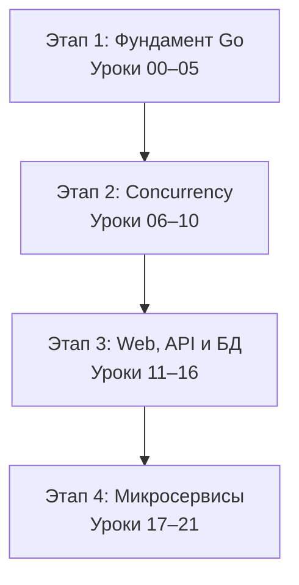
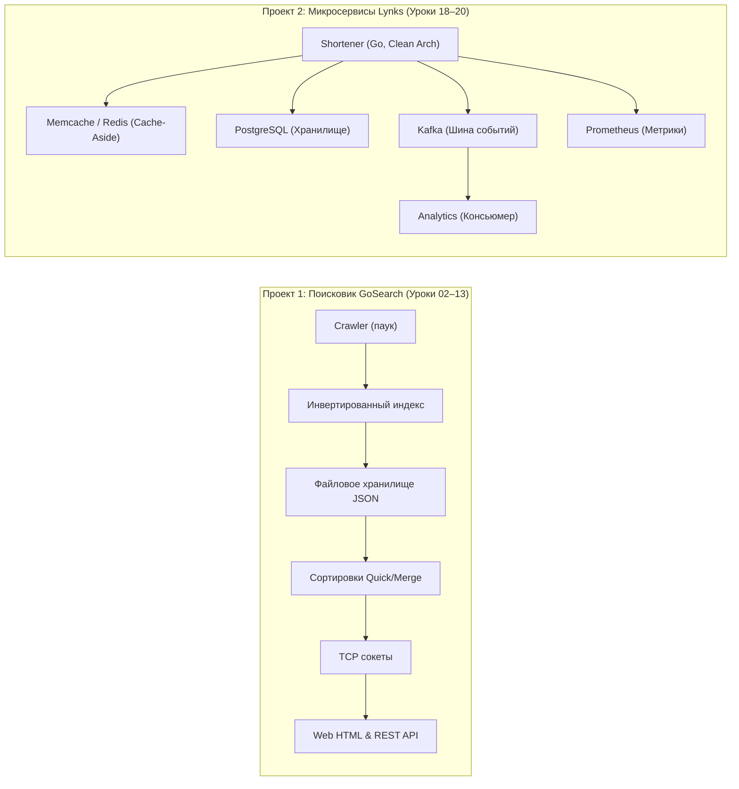

# Путеводитель студента по курсу Go: От нуля до Production

> [!IMPORTANT]
> 🧭 **Как пользоваться этим путеводителем:**  
> Данный документ — это ваш **главный пошаговый навигатор** по курсу. Все материалы объединены в **4 последовательных этапа** от базового синтаксиса до распределенных систем.  
> 
> На каждом шаге соблюдайте единое правило трех действий:
> 1. 📖 **Изучите теорию** в соответствующем томе энциклопедии [go-documentation](file:///Users/user/workspace/golang_projects/go-core-4/go_course_4/go-documentation).
> 2. 💻 **Разберите и запустите лекционный код** из демонстрационной директории (`00-docs` — `21-interview`).
> 3. 🛠️ **Решите практическое задание** в соответствующей папке `homework-XX` и проверьте его тестами.

---

## 🗺️ Карта этапов обучения (Roadmap)



| Этап | Уроки | Уровень | Ключевой результат этапа |
| :--- | :--- | :--- | :--- |
| **[🟢 Этап 1](#-этап-1-фундамент-go-синтаксис-память-и-структуры-данных-уроки-0005)** | 00 — 05 | **Junior** | Владение синтаксисом, памятью срезов/мап, алгоритмами поиска, списками и потоковым I/O. |
| **[🟡 Этап 2](#-этап-2-проектирование-качество-кода-и-конкурентность-уроки-0610)** | 06 — 10 | **Middle** | Идиоматичное ООП (композиция/DIP), Table-driven тесты, профилирование `pprof` и конкурентность без гонок (`-race`). |
| **[🟠 Этап 3](#-этап-3-сети-web-разработка-api-и-базы-данных-уроки-1116)** | 11 — 16 | **Middle+** | Разработка клиент-серверных веб-приложений, RESTful API, gRPC сервисов и работа с PostgreSQL через пул соединений. |
| **[🔴 Этап 4](#-этап-4-распределенные-системы-микросервисы-и-интервью-уроки-1721)** | 17 — 21 | **Senior** | Проектирование Clean Architecture, упаковка в Docker/K8s, шина Kafka, кэширование в Redis, решение задач на собеседованиях. |

---

## 🟢 Этап 1. Фундамент Go: Синтаксис, память и структуры данных (Уроки 00–05)

На этом этапе вы знакомитесь с тулчейном Go, учитесь мыслить категориями модели памяти (стек, куча, устройство слайсов и хэш-таблиц), реализуете базовые алгоритмы и запускаете первый сквозной проект — поисковик **GoSearch**.

---

### [Урок 00: Стандарты разработки и Go Modules](file:///Users/user/workspace/golang_projects/go-core-4/go_course_4/00-docs)
* 📖 **Теория:** [Том 1: Раздел 0.8 (Структура проекта и тулчейн Go)](file:///Users/user/workspace/golang_projects/go-core-4/go_course_4/go-documentation/01-go-core-basics.md#08-структура-проекта-и-cli-команды-тулчейна-go).
* 💻 **Код лекции:** Директория [00-docs](file:///Users/user/workspace/golang_projects/go-core-4/go_course_4/00-docs):
  * [Modules.MD](file:///Users/user/workspace/golang_projects/go-core-4/go_course_4/00-docs/Modules.MD) — команды `go mod init`, `go mod tidy`, версионирование.
  * [Recommendations-and-rules.MD](file:///Users/user/workspace/golang_projects/go-core-4/go_course_4/00-docs/Recommendations-and-rules.MD) — разделение на `cmd/` и `pkg/`, отказ от `os.Exit`/`log.Fatal` в библиотечных пакетах.
* 🛠️ **Практика:** Создайте и инициализируйте собственный модуль: `go mod init <name>`.
* ⚠️ **Главное правило:** Библиотечные пакеты в `pkg/` никогда не прерывают выполнение программы аварийно — они возвращают ошибку `error` вызывающей стороне.

---

### [Урок 01: Первая программа и структура приложения](file:///Users/user/workspace/golang_projects/go-core-4/go_course_4/01-intro)
* 📖 **Теория:** [Том 1: Разделы 0.1–0.7 (Старт с нуля, компиляция, fmt)](file:///Users/user/workspace/golang_projects/go-core-4/go_course_4/go-documentation/01-go-core-basics.md#0-основы-языка-go-старт-с-нуля).
* 💻 **Код лекции:** Директория [01-intro](file:///Users/user/workspace/golang_projects/go-core-4/go_course_4/01-intro):
  * `hello/main.go` — минимальная программа "Hello World".
  * `demoapp/` — каноническая двухуровневая структура: точка входа `cmd/app/main.go` и переиспользуемый пакет `pkg/stringutils/stringutils.go`.
* 🚀 **Команды запуска:**
  ```bash
  go run ./01-intro/hello/main.go
  go test -v ./01-intro/demoapp/pkg/stringutils/...
  ```
* 🛠️ **Практика:** [homework-tasks.md (Урок 1: Ввод-вывод fmt)](file:///Users/user/workspace/golang_projects/go-core-4/go_course_4/go-documentation/homework-tasks.md#урок-1-первая-программа-и-базовый-ввод-вывод-fmt).

---

### [Урок 02: Фундаментальный синтаксис и модель памяти](file:///Users/user/workspace/golang_projects/go-core-4/go_course_4/02-syntax)
* 📖 **Теория:** [Том 1: Разделы 1–8 (Типы, срезы, структуры, указатели, ошибки)](file:///Users/user/workspace/golang_projects/go-core-4/go_course_4/go-documentation/01-go-core-basics.md).
* 💻 **Код лекции:** Директория [02-syntax](file:///Users/user/workspace/golang_projects/go-core-4/go_course_4/02-syntax):
  * `1-basic/` — типы, константы, цикл `for range`.
  * `3-array_slice_map/` — массивы vs срезы (`SliceHeader`: pointer, len, cap, механика `append`), словари `map`.
  * `4-pointers/` — указатели `&` и `*`, отсутствие адресной арифметики.
  * `6-errors/` — модель ошибок через возврат значения `error`.
* 🛠️ **Домашнее задание:** **[homework-02](file:///Users/user/workspace/golang_projects/go-core-4/go_course_4/homework-02)** — Реализация поискового робота (краулера) для проекта `GoSearch`.
  * Точка входа: [homework-02/cmd/gosearch/main.go](file:///Users/user/workspace/golang_projects/go-core-4/go_course_4/homework-02/cmd/gosearch/main.go)
  * Пакет сканера: [homework-02/pkg/crawler/spider/spider.go](file:///Users/user/workspace/golang_projects/go-core-4/go_course_4/homework-02/pkg/crawler/spider/spider.go)
* ⚠️ **Подводный камень:** Слайс-потомок `s2 := s1[1:3]` ссылается на тот же массив, что и `s1`. Изменение `s2[0]` неявно мутирует `s1[1]`, пока емкость (`cap`) не превышена.

---

### [Урок 03: Алгоритмы и вычислительная сложность](file:///Users/user/workspace/golang_projects/go-core-4/go_course_4/03-algorithms)
* 📖 **Теория:** [Том 6: Разделы 26–27 (Асимптотическая сложность, бинарный поиск)](file:///Users/user/workspace/golang_projects/go-core-4/go_course_4/go-documentation/06-go-core-algorithms-interview.md).
* 💻 **Код лекции:** Директория [03-algorithms](file:///Users/user/workspace/golang_projects/go-core-4/go_course_4/03-algorithms):
  * `1-search/` — линейный ($O(N)$) и бинарный ($O(\log N)$) поиск, безопасное вычисление середины `mid := low + (high-low)/2`.
  * `2-recursion/` — факториал и числа Фибоначчи.
  * `3-dynamic/` — основы динамического программирования и мемоизация.
  * `4-graph/` — графы, списки смежности, обход в ширину (BFS) и глубину (DFS).
* 🚀 **Команды запуска:**
  ```bash
  go test -v ./03-algorithms/...
  go test -bench=. ./03-algorithms/1-search
  ```
* 🛠️ **Домашнее задание:** **[homework-03](file:///Users/user/workspace/golang_projects/go-core-4/go_course_4/homework-03)** — Построение инвертированного индекса (`map[string][]int`) и бинарный поиск документов в `GoSearch`.
  * Реализация индекса: [homework-03/pkg/index/index.go](file:///Users/user/workspace/golang_projects/go-core-4/go_course_4/homework-03/pkg/index/index.go)
  * Поиск документов: [homework-03/pkg/index/search.go](file:///Users/user/workspace/golang_projects/go-core-4/go_course_4/homework-03/pkg/index/search.go)

---

### [Урок 04: Классические структуры данных](file:///Users/user/workspace/golang_projects/go-core-4/go_course_4/04-datastructs)
* 📖 **Теория:** [Том 6: Разделы 30–31 (Связные списки, бинарные деревья поиска)](file:///Users/user/workspace/golang_projects/go-core-4/go_course_4/go-documentation/06-go-core-algorithms-interview.md).
* 💻 **Код лекции:** Директория [04-datastructs](file:///Users/user/workspace/golang_projects/go-core-4/go_course_4/04-datastructs):
  * `0-arrays/` — память массивов фиксированной длины.
  * `1-list/` — двусвязный кольцевой список на указателях (`list.go`: `Push`, `Pop`, `Reverse`).
  * `2-bst/` — бинарное дерево поиска (BST: рекурсивная вставка и поиск).
* 🛠️ **Домашнее задание:** **[homework-04](file:///Users/user/workspace/golang_projects/go-core-4/go_course_4/homework-04)** — Реализация собственного двусвязного списка со сторожевым элементом для истории поисковых запросов.
  * Реализация: [homework-04/pkg/list/list.go](file:///Users/user/workspace/golang_projects/go-core-4/go_course_4/homework-04/pkg/list/list.go)
  * Тесты: [homework-04/pkg/list/list_test.go](file:///Users/user/workspace/golang_projects/go-core-4/go_course_4/homework-04/pkg/list/list_test.go)

---

### [Урок 05: Потоковый ввод-вывод, файлы и JSON](file:///Users/user/workspace/golang_projects/go-core-4/go_course_4/05-io)
* 📖 **Теория:** [Том 2: Раздел 10 (Интерфейсы io.Reader, io.Writer, bufio, сериализация)](file:///Users/user/workspace/golang_projects/go-core-4/go_course_4/go-documentation/02-go-core-oop-methods.md).
* 💻 **Код лекции:** Директория [05-io](file:///Users/user/workspace/golang_projects/go-core-4/go_course_4/05-io):
  * `2-writer-example/`, `3-bufio_example/` — буферизация ввода-вывода `bufio.Scanner`, `bufio.Writer`.
  * `4-files/` — открытие файлов `os.Open`, `os.Create`, закрытие через `defer`.
  * `6-flags/` — парсинг аргументов командной строки через пакет `flag`.
  * `7-json_serialize/` — потоковый JSON (`json.NewDecoder`, `json.NewEncoder`, теги структур).
* 🛠️ **Домашнее задание:** **[homework-05](file:///Users/user/workspace/golang_projects/go-core-4/go_course_4/homework-05)** — Сохранение просканированных документов `GoSearch` на диск в файл и загрузка кэша при старте.
  * Хранилище: [homework-05/pkg/storage/storage.go](file:///Users/user/workspace/golang_projects/go-core-4/go_course_4/homework-05/pkg/storage/storage.go)
* ⚠️ **Подводный камень:** `defer f.Close()` внутри длинного цикла не закрывает файл до окончания всей функции, что приводит к исчерпанию файловых дескрипторов ОС (`too many open files`).

---

## 🟡 Этап 2. Проектирование: ООП, качество кода и конкурентность (Уроки 06–10)

На этом этапе вы осваиваете архитектурную философию Go: замена наследования композицией, инверсия зависимостей (DIP), промышленное тестирование (Table-Driven), отладка узких мест с `pprof` и модель конкурентности CSP (горутины, каналы, контекст).

---

### [Урок 06: ООП в Go: методы, композиция и DIP](file:///Users/user/workspace/golang_projects/go-core-4/go_course_4/06-oop)
* 📖 **Теория:** [Том 2: Раздел 9 (Методы, получатели, встраивание, DIP)](file:///Users/user/workspace/golang_projects/go-core-4/go_course_4/go-documentation/02-go-core-oop-methods.md).
* 💻 **Код лекции:** Директория [06-oop](file:///Users/user/workspace/golang_projects/go-core-4/go_course_4/06-oop):
  * `1-methods/` — получатели по значению (`val receiver`) и по указателю (`pointer receiver`).
  * `2-dip/` — интерфейс логера `Logger`, мок-логер `MemLogger`, инверсия зависимостей.
  * `3-embedding/` — встраивание структур и интерфейсов.
  * `4-constructor/` — идиоматичный паттерн конструктора `New()`.
  * `5-hw/` — сущности `Point`, `Geom`, расчет евклидова расстояния и бенчмарк.
* 🛠️ **Домашнее задание:** **[homework-06](file:///Users/user/workspace/golang_projects/go-core-4/go_course_4/homework-06)** — Выделение слоя поискового движка `engine` с инъекцией зависимостей (индекса и хранилища).
  * Движок: [homework-06/pkg/engine/engine.go](file:///Users/user/workspace/golang_projects/go-core-4/go_course_4/homework-06/pkg/engine/engine.go)
  * Геометрия: [homework-06/pkg/geom/geom.go](file:///Users/user/workspace/golang_projects/go-core-4/go_course_4/homework-06/pkg/geom/geom.go)

---

### [Урок 07: Промышленное тестирование и TDD](file:///Users/user/workspace/golang_projects/go-core-4/go_course_4/07-testing)
* 📖 **Теория:** [Том 5: Разделы 17–19 (Тестирование, TestMain, TDD)](file:///Users/user/workspace/golang_projects/go-core-4/go_course_4/go-documentation/05-go-core-testing-arch.md).
* 💻 **Код лекции:** Директория [07-testing](file:///Users/user/workspace/golang_projects/go-core-4/go_course_4/07-testing):
  * `2-testmain/` — инициализация и teardown тестов через `TestMain(m *testing.M)`.
  * `3-table/` — идиоматичные табличные тесты с анонимными структурами и `t.Run()`.
  * `4-refactoring/` — изоляция сетевых вызовов и пропуск тестов через `t.Skip()`.
  * `6-handler/` — тестирование HTTP-обработчиков через `httptest.NewRecorder` и `httptest.NewRequest`.
  * `7-tdd/` — цикл разработки Red-Green-Refactor.
  * `8-benchmarks/` — замеры производительности (`b.N`, `b.ResetTimer`, `b.ReportAllocs`).
* 🛠️ **Домашнее задание:** **[homework-07](file:///Users/user/workspace/golang_projects/go-core-4/go_course_4/homework-07)** — Реализация и тестирование алгоритмов сортировки (QuickSort, MergeSort) для ранжирования документов поисковика.
  * Пакет сортировок: [homework-07/pkg/sorts/sorts.go](file:///Users/user/workspace/golang_projects/go-core-4/go_course_4/homework-07/pkg/sorts/sorts.go)
  * Табличные тесты и бенчмарки: [homework-07/pkg/sorts/sorts_test.go](file:///Users/user/workspace/golang_projects/go-core-4/go_course_4/homework-07/pkg/sorts/sorts_test.go)

---

### [Урок 08: Профилирование, бенчмарки и трейсинг](file:///Users/user/workspace/golang_projects/go-core-4/go_course_4/08-prof_debug)
* 📖 **Теория:** [Том 5: Раздел 20 (Профилирование pprof, gc, execution tracer)](file:///Users/user/workspace/golang_projects/go-core-4/go_course_4/go-documentation/05-go-core-testing-arch.md).
* 💻 **Код лекции:** Директория [08-prof_debug](file:///Users/user/workspace/golang_projects/go-core-4/go_course_4/08-prof_debug):
  * `1-bench_profile/` — снятие CPU и Memory профилей (`-cpuprofile`, `-memprofile`).
  * `2-app_profile/` — профилирование работающего веб-сервиса через `net/http/pprof`.
  * `4-trace/` — визуализация работы планировщика рантайма через `go tool trace`.
* 🚀 **Команды запуска:**
  ```bash
  go test -bench=. -cpuprofile=cpu.out -memprofile=mem.out ./08-prof_debug/1-bench_profile
  go tool pprof -http=:8080 cpu.out
  ```
* 🛠️ **Домашнее задание:** **[homework-08](file:///Users/user/workspace/golang_projects/go-core-4/go_course_4/homework-08)** — Анализ узких мест алгоритма Two Sum, снятие профилей и ускорение поиска документов в `GoSearch`.
  * Оптимизированный поиск: [homework-08/pkg/search/search.go](file:///Users/user/workspace/golang_projects/go-core-4/go_course_4/homework-08/pkg/search/search.go)
  * Профили: [cpu.out](file:///Users/user/workspace/golang_projects/go-core-4/go_course_4/homework-08/cpu.out), [mem.out](file:///Users/user/workspace/golang_projects/go-core-4/go_course_4/homework-08/mem.out), [trace.out](file:///Users/user/workspace/golang_projects/go-core-4/go_course_4/homework-08/trace.out)

---

### [Урок 09: Интерфейсы, полиморфизм и дженерики](file:///Users/user/workspace/golang_projects/go-core-4/go_course_4/09-interfaces)
* 📖 **Теория:** [Том 2 (Раздел 9)](file:///Users/user/workspace/golang_projects/go-core-4/go_course_4/go-documentation/02-go-core-oop-methods.md) и [Том 3 (Раздел 15)](file:///Users/user/workspace/golang_projects/go-core-4/go_course_4/go-documentation/03-go-core-concurrency.md).
* 💻 **Код лекции:** Директория [09-interfaces](file:///Users/user/workspace/golang_projects/go-core-4/go_course_4/09-interfaces):
  * `1-polymorph/` — полиморфизм через утиную типизацию (duck typing).
  * `2-quiz/` — главная ловушка интерфейсов: `nil` интерфейс со значением `nil`-указателя не равен `nil`!
  * `3-assertion/`, `4-type_switch/` — приведение типов и ветвление по типам.
  * `6-generics/` — обобщенное программирование (type parameters, constraints `any`, `comparable`).
* 🛠️ **Домашнее задание:** **[homework-09](file:///Users/user/workspace/golang_projects/go-core-4/go_course_4/homework-09)** — Проектирование гибкой системы сущностей пользователей через интерфейсные контракты.
  * Пакет пользователей: [homework-09/pkg/users/users.go](file:///Users/user/workspace/golang_projects/go-core-4/go_course_4/homework-09/pkg/users/users.go)

---

### [Урок 10: Модель конкурентности Go: горутины и каналы](file:///Users/user/workspace/golang_projects/go-core-4/go_course_4/10-concurrency)
* 📖 **Теория:** [Том 3: Конкурентное программирование (Разделы 11, 14–16)](file:///Users/user/workspace/golang_projects/go-core-4/go_course_4/go-documentation/03-go-core-concurrency.md).
* 💻 **Код лекции:** Директория [10-concurrency](file:///Users/user/workspace/golang_projects/go-core-4/go_course_4/10-concurrency):
  * `1-goroutine/` — стек горутин (2 КБ), планировщик GMP.
  * `2-chan/`, `3-chan_select/` — каналы, неблокирующий `select`, таймауты.
  * `4-waitgroup/`, `5-shared_mem/` — `sync.WaitGroup`, `sync.Mutex`, `sync.RWMutex`.
  * `6-common_errors/` — гонки данных (Data Race), утечки горутин (Goroutine Leak).
  * `7-atomic/` — бесконфликтные атомарные операции `sync/atomic`.
  * `8-pattern-fan-out/`, `9-pattern-fan-in/`, `10-pattern-pipeline/` — паттерны параллельной обработки данных.
  * `11-context/` — отмена операций и дедлайны (`context.WithTimeout`, `context.WithCancel`).
* 🚀 **Команды запуска с детектором гонок:**
  ```bash
  go test -race -v ./10-concurrency/...
  ```
* 🛠️ **Домашнее задание:** **[homework-10](file:///Users/user/workspace/golang_projects/go-core-4/go_course_4/homework-10)** — Реализация состязания двух игроков Ping-Pong через синхронизацию каналов.
  * Движок игры: [homework-10/pkg/pingpong/pingpong.go](file:///Users/user/workspace/golang_projects/go-core-4/go_course_4/homework-10/pkg/pingpong/pingpong.go)

---

## 🟠 Этап 3. Сети, Web-разработка, API и Базы данных (Уроки 11–16)

На этом этапе вы выходите за пределы локальных утилит и создаете полноценные сетевые сервисы: TCP-демоны, веб-интерфейсы с роутингом, RESTful API, контракты gRPC и интеграцию со слоем реляционных баз данных (PostgreSQL).

---

### [Урок 11: Сетевые протоколы, TCP и дедлайны](file:///Users/user/workspace/golang_projects/go-core-4/go_course_4/11-network)
* 📖 **Теория:** [Том 4: Раздел 29 (Сетевое программирование сокетов)](file:///Users/user/workspace/golang_projects/go-core-4/go_course_4/go-documentation/04-go-core-backend-web.md).
* 💻 **Код лекции:** Директория [11-network](file:///Users/user/workspace/golang_projects/go-core-4/go_course_4/11-network):
  * `1-daytime/` — сетевой сервер и клиент точного времени по протоколу TCP (`net.Listen`, `net.Dial`).
  * `2-echo/` — параллельный TCP эхо-сервер с отдельной горутиной на каждое соединение.
  * `3-deadline/` — предотвращение зависания соединений через `conn.SetDeadline()`.
* 🛠️ **Домашнее задание:** **[homework-11](file:///Users/user/workspace/golang_projects/go-core-4/go_course_4/homework-11)** — Создание сетевой TCP-службы для поисковой системы `GoSearch` и консольного сетевого клиента `netclient`.
  * TCP-сервер: [homework-11/pkg/netsrv/netsrv.go](file:///Users/user/workspace/golang_projects/go-core-4/go_course_4/homework-11/pkg/netsrv/netsrv.go)
  * Сетевой клиент: [homework-11/cmd/netclient/main.go](file:///Users/user/workspace/golang_projects/go-core-4/go_course_4/homework-11/cmd/netclient/main.go)

---

### [Урок 12: Веб-приложения, роутинг и HTML-шаблоны](file:///Users/user/workspace/golang_projects/go-core-4/go_course_4/12-web-apps)
* 📖 **Теория:** [Том 4: Раздел 12 (net/http, маршрутизаторы, html/template)](file:///Users/user/workspace/golang_projects/go-core-4/go_course_4/go-documentation/04-go-core-backend-web.md).
* 💻 **Код лекции:** Директория [12-web-apps](file:///Users/user/workspace/golang_projects/go-core-4/go_course_4/12-web-apps):
  * `1-http/` — базовые клиент и сервер на стандартном `net/http`.
  * `2-custom_server/` — тонкая настройка `http.Server` (таймауты чтения/записи, защита от атак Slowloris).
  * `3-gorilla_mux/` — маршрутизация с параметрами путей через `gorilla/mux`.
  * `4-template/` — рендеринг HTML с автоматическим экранированием XSS через `html/template`.
* 🛠️ **Домашнее задание:** **[homework-12](file:///Users/user/workspace/golang_projects/go-core-4/go_course_4/homework-12)** — Полноценный Web-интерфейс для поисковика `GoSearch` с HTML-формами поиска.
  * Веб-хэндлеры: [homework-12/pkg/webapp/webapp.go](file:///Users/user/workspace/golang_projects/go-core-4/go_course_4/homework-12/pkg/webapp/webapp.go)

---

### [Урок 13: Проектирование REST API и Middleware](file:///Users/user/workspace/golang_projects/go-core-4/go_course_4/13-api)
* 📖 **Теория:** [Том 4: Раздел 12 (REST архитектура, JSON, Middleware)](file:///Users/user/workspace/golang_projects/go-core-4/go_course_4/go-documentation/04-go-core-backend-web.md).
* 💻 **Код лекции:** Директория [13-api](file:///Users/user/workspace/golang_projects/go-core-4/go_course_4/13-api):
  * `1-api/` — CRUD эндпоинты, цепочки Middleware (логирование, CORS, авторизация), graceful shutdown.
  * `2-api/` — разделение на `cmd/server` и чистый библиотечный пакет `pkg/api`.
* 🛠️ **Домашнее задание:** **[homework-13](file:///Users/user/workspace/golang_projects/go-core-4/go_course_4/homework-13)** — Проектирование промышленного REST API для `GoSearch` (добавление, обновление, удаление и поиск документов по API).
  * Контроллеры и роутинг: [homework-13/pkg/api/api.go](file:///Users/user/workspace/golang_projects/go-core-4/go_course_4/homework-13/pkg/api/api.go)

---

### [Урок 14: Удаленный вызов процедур: net/rpc и gRPC](file:///Users/user/workspace/golang_projects/go-core-4/go_course_4/14-RPC)
* 📖 **Теория:** [Том 5: Раздел 23 (Сравнение RPC vs REST, Protocol Buffers, gRPC)](file:///Users/user/workspace/golang_projects/go-core-4/go_course_4/go-documentation/05-go-core-testing-arch.md).
* 💻 **Код лекции:** Директория [14-RPC](file:///Users/user/workspace/golang_projects/go-core-4/go_course_4/14-RPC):
  * `1-Go-RPC/` — встроенный механизм `net/rpc` в Go (клиент и сервер каталога книг).
  * `2-gRPC/` — Google Protocol Buffers + gRPC: описание контракта `.proto`, сгенерированные структуры, gRPC сервер и клиент со стримингом.
* 🛠️ **Домашнее задание:** **[homework-14](file:///Users/user/workspace/golang_projects/go-core-4/go_course_4/homework-14)** — Создание сетевой RPC-службы передачи сообщений.
  * Сервис и клиент: [homework-14/pkg/rpcservice/rpcservice.go](file:///Users/user/workspace/golang_projects/go-core-4/go_course_4/homework-14/pkg/rpcservice/rpcservice.go)
* ⚠️ **Подводный камень:** Сгенерированные структуры Protobuf содержат внутренний `sync.Mutex`. Передавать их нужно **только по указателю** (`*pb.Book`), избегая копирования lock-значений по значению.

---

### [Урок 15: Реляционные базы данных и язык SQL](file:///Users/user/workspace/golang_projects/go-core-4/go_course_4/15-sql)
* 📖 **Теория:** [Том 4: Раздел 13 (Реляционные БД)](file:///Users/user/workspace/golang_projects/go-core-4/go_course_4/go-documentation/04-go-core-backend-web.md) и практический задачник [sql-livecoding-guide.md](file:///Users/user/workspace/golang_projects/go-core-4/go_course_4/go-documentation/sql-livecoding-guide.md).
* 💻 **Код лекции:** Директория [15-sql](file:///Users/user/workspace/golang_projects/go-core-4/go_course_4/15-sql):
  * `books_db/1-schema.sql` — DDL создания таблиц, внешние ключи (Foreign Keys), индексы, связи многие-ко-многим.
  * `books_db/2-data.sql` — наполнение тестовыми данными и написание сложных выборок с `JOIN` и `GROUP BY`.
* 🛠️ **Домашнее задание:** **[homework-15](file:///Users/user/workspace/golang_projects/go-core-4/go_course_4/homework-15)** — Проектирование полной реляционной схемы базы данных кинотеатра (фильмы, залы, сеансы, билеты, заказы).
  * Схема БД: [homework-15/schema.sql](file:///Users/user/workspace/golang_projects/go-core-4/go_course_4/homework-15/schema.sql)
  * Аналитические SQL-запросы: [homework-15/queries.sql](file:///Users/user/workspace/golang_projects/go-core-4/go_course_4/homework-15/queries.sql)

---

### [Урок 16: Работа с СУБД из Go и паттерн Репозиторий](file:///Users/user/workspace/golang_projects/go-core-4/go_course_4/16-db-apps)
* 📖 **Теория:** [go-database-interview-guide.md](file:///Users/user/workspace/golang_projects/go-core-4/go_course_4/go-documentation/go-database-interview-guide.md) (Вопросы собеседований по SQL, пулу соединений и транзакциям).
* 💻 **Код лекции:** Директория [16-db-apps](file:///Users/user/workspace/golang_projects/go-core-4/go_course_4/16-db-apps):
  * `1-database-sql/` — стандартный интерфейс `database/sql` и пул соединений `sql.DB`.
  * `2-pgx/` — высокопроизводительный драйвер PostgreSQL `pgxpool.Pool`.
  * `pkg/db/` — паттерн **Repository**: интерфейс `Storage`, продакшн-реализация для PostgreSQL (`pgsql`) и легковесный мок в оперативной памяти (`memsql`) для быстрых тестов.
* 🛠️ **Домашнее задание:** **[homework-16](file:///Users/user/workspace/golang_projects/go-core-4/go_course_4/homework-16)** — Интеграция базы данных кинотеатра с REST-сервером через паттерн Репозиторий.
  * Слой БД: [homework-16/pkg/db/db.go](file:///Users/user/workspace/golang_projects/go-core-4/go_course_4/homework-16/pkg/db/db.go)
  * Сервер: [homework-16/cmd/server/main.go](file:///Users/user/workspace/golang_projects/go-core-4/go_course_4/homework-16/cmd/server/main.go)
* ⚠️ **Подводный камень:** **Никогда** не конкатенируйте строки в SQL-запросах! Всегда используйте параметризованные плейсхолдеры (`$1, $2`), чтобы гарантировать защиту от SQL Injection.

---

## 🔴 Этап 4. Распределенные системы, микросервисы и интервью (Уроки 17–21)

Финальный этап обучения, формирующий квалификацию Senior-разработчика: проектирование по принципам Чистой Архитектуры, микросервисы в Docker и Kubernetes, шины событий Apache Kafka, кэширование в Redis/Memcached (итоговый проект **lynks**) и подготовка к собеседованиям.

---

### [Урок 17: Архитектура: SOLID и Clean Architecture](file:///Users/user/workspace/golang_projects/go-core-4/go_course_4/17-system-design)
* 📖 **Теория:** [Том 5: Разделы 21–22 (SOLID, Hexagonal, Clean Architecture)](file:///Users/user/workspace/golang_projects/go-core-4/go_course_4/go-documentation/05-go-core-testing-arch.md).
* 💻 **Код лекции:** Директория [17-system-design](file:///Users/user/workspace/golang_projects/go-core-4/go_course_4/17-system-design):
  * `SOLID/` — изолированные примеры всех 5 принципов на Go (SRP, OCP, LSP, ISP, DIP).
  * `app/` — каноническая реализация сервиса по Чистой Архитектуре с защищенным каталогом `internal/` (models, api, db, server).
* 🛠️ **Домашнее задание:** **[homework-17](file:///Users/user/workspace/golang_projects/go-core-4/go_course_4/homework-17)** — Реализация слоистой архитектуры приложения и модульные тесты для всех принципов SOLID.
  * Пакет Clean Architecture: [homework-17/cleanarch/cleanarch_test.go](file:///Users/user/workspace/golang_projects/go-core-4/go_course_4/homework-17/cleanarch/cleanarch_test.go)
  * SOLID пакеты: [homework-17/solid/](file:///Users/user/workspace/golang_projects/go-core-4/go_course_4/homework-17/solid)

---

### [Урок 18: Микросервисы, контейнеризация и 12 Factor App](file:///Users/user/workspace/golang_projects/go-core-4/go_course_4/18-microservices)
* 📖 **Теория:** [Том 5: Раздел 23 (12 Factor App, Docker, Kubernetes)](file:///Users/user/workspace/golang_projects/go-core-4/go_course_4/go-documentation/05-go-core-testing-arch.md).
* 💻 **Код лекции:** Директория [18-microservices](file:///Users/user/workspace/golang_projects/go-core-4/go_course_4/18-microservices):
  * `microservice/build/Dockerfile` — многоэтапная сборка (Multi-stage build) с компиляцией в `golang:alpine` и финальным образом на `scratch` (размер бинарника ~15 МБ).
  * `microservice/build/deployment.yaml`, `service.yaml` — Kubernetes манифесты с Liveness и Readiness пробами.
* 🛠️ **Домашнее задание:** **[homework-18](file:///Users/user/workspace/golang_projects/go-core-4/go_course_4/homework-18)** — Старт итогового микросервисного проекта **lynks**: сервис `shortener` (сокращение ссылок), переменные окружения, Dockerfile и docker-compose.
  * API сервиса: [homework-18/pkg/api/api.go](file:///Users/user/workspace/golang_projects/go-core-4/go_course_4/homework-18/pkg/api/api.go)
  * Контейнеризация: [homework-18/Dockerfile](file:///Users/user/workspace/golang_projects/go-core-4/go_course_4/homework-18/Dockerfile)

---

### [Урок 19: Очереди сообщений: Apache Kafka и Event-Driven](file:///Users/user/workspace/golang_projects/go-core-4/go_course_4/19-queue)
* 📖 **Теория:** [Том 5: Раздел 24 (Очереди сообщений, Kafka, Consumer Groups)](file:///Users/user/workspace/golang_projects/go-core-4/go_course_4/go-documentation/05-go-core-testing-arch.md).
* 💻 **Код лекции:** Директория [19-queue](file:///Users/user/workspace/golang_projects/go-core-4/go_course_4/19-queue):
  * `1-kafka/kafka.go` — публикация событий продюсером (Producer) и асинхронное чтение консьюмером (Consumer).
  * `docker-compose.yml` — запуск локального кластера Kafka и Zookeeper.
* 🛠️ **Домашнее задание:** **[homework-19](file:///Users/user/workspace/golang_projects/go-core-4/go_course_4/homework-19)** — Реализация асинхронного сервиса аналитики переходов по ссылкам в проекте `lynks` через топик Kafka.
  * Сервис аналитики: [homework-19/cmd/analytics/main.go](file:///Users/user/workspace/golang_projects/go-core-4/go_course_4/homework-19/cmd/analytics/main.go)
  * Событийная модель: [homework-19/pkg/event/event.go](file:///Users/user/workspace/golang_projects/go-core-4/go_course_4/homework-19/pkg/event/event.go)

---

### [Урок 20: NoSQL, кэширование Cache-Aside и метрики Prometheus](file:///Users/user/workspace/golang_projects/go-core-4/go_course_4/20-NoSQL)
* 📖 **Теория:** [Том 4: Раздел 13 (NoSQL)](file:///Users/user/workspace/golang_projects/go-core-4/go_course_4/go-documentation/04-go-core-backend-web.md) и [go-database-interview-guide.md](file:///Users/user/workspace/golang_projects/go-core-4/go_course_4/go-documentation/go-database-interview-guide.md).
* 💻 **Код лекции:** Директория [20-NoSQL](file:///Users/user/workspace/golang_projects/go-core-4/go_course_4/20-NoSQL):
  * `1-mongo/` — MongoDB: подключение, коллекции, документы BSON.
  * `2-KVStore/` — собственная Key-Value база данных в памяти на `sync.RWMutex`.
  * `3-redis/` — кэширование в Redis: команды `SET`, `GET`, TTL и `EXPIRE`.
* 🛠️ **Домашнее задание:** **[homework-20](file:///Users/user/workspace/golang_projects/go-core-4/go_course_4/homework-20)** — **Финальный проект Lynks**:
  * Реализация сервиса кэширования `memcache` по паттерну Cache-Aside.
  * Сбор Prometheus метрик (`http_requests_total`, `cache_hits_total`, `cache_misses_total`).
  * Полный сквозной прогон интеграционных тестов: [homework-20/e2e_test.go](file:///Users/user/workspace/golang_projects/go-core-4/go_course_4/homework-20/e2e_test.go).
  * Оркестрация: [homework-20/docker-compose.yml](file:///Users/user/workspace/golang_projects/go-core-4/go_course_4/homework-20/docker-compose.yml).

---

### [Урок 21: Подготовка к собеседованиям и лайвкодинг](file:///Users/user/workspace/golang_projects/go-core-4/go_course_4/21-interview)
* 📖 **Теория:** [Том 6: Разделы 32–36 (Вопросы собеседований, внутренняя структура)](file:///Users/user/workspace/golang_projects/go-core-4/go_course_4/go-documentation/06-go-core-algorithms-interview.md).
* 💻 **Код лекции:** Директория [21-interview](file:///Users/user/workspace/golang_projects/go-core-4/go_course_4/21-interview):
  * [01-basics.go](file:///Users/user/workspace/golang_projects/go-core-4/go_course_4/21-interview/01-basics.go) — мутации и реалокация срезов при `append`, кодирование строк UTF-8, захват переменных цикла горутинами.
  * [02-channels.go](file:///Users/user/workspace/golang_projects/go-core-4/go_course_4/21-interview/02-channels.go) — неблокирующий `select`, паттерн «Поставщик-Потребитель» (закрытие канала), обобщенный мультиплексор `FanIn`.
* 🎯 **Практические гайды для подготовки:**
  * 💻 **[go-livecoding-guide.md (43 задачи с разбором)](file:///Users/user/workspace/golang_projects/go-core-4/go_course_4/go-documentation/go-livecoding-guide.md)** — топ livecoding-задач с собеседований.
  * 🏛️ **[go-system-design-guide.md](file:///Users/user/workspace/golang_projects/go-core-4/go_course_4/go-documentation/go-system-design-guide.md)** — архитектурные вопросы масштабирования.
  * ⚡ **[go-core-cheatsheet.md](file:///Users/user/workspace/golang_projects/go-core-4/go_course_4/go-documentation/go-core-cheatsheet.md)** — экспресс-шпаргалка по синтаксису и командам.

---

## 🔎 Сквозные проекты курса

В курсе реализованы 2 сквозных проекта, которые объединяют полученные знания в единую систему:



1. **[GoSearch](file:///Users/user/workspace/golang_projects/go-core-4/go_course_4/GoSearch)**:
   - Проходит эволюцию от простого консольного скрипта до распределенной поисковой службы с инвертированным индексом, бинарным поиском, TCP-сокетами, веб-интерфейсом и REST API.
2. **[lynks](file:///Users/user/workspace/golang_projects/go-core-4/go_course_4/lynks)**:
   - Комплексный микросервисный сервис сокращения ссылок: архитектура Cache-Aside с Redis и PostgreSQL, асинхронный сбор аналитики через Kafka, сбор метрик хитов/промахов для Prometheus и E2E тесты в Docker Compose.

---

## 🛠️ Шпаргалка команд разработчика

### 1. Тестирование и статический анализ
```bash
# Прогон абсолютно всех тестов проекта (должно быть 100% PASS)
go test ./...

# Прогон статического анализатора кода
go vet ./...

# Прогон тестов конкретного этапа или ДЗ с проверкой гонок данных
go test -v -race ./homework-10/...
go test -v -race ./homework-20/...
```

### 2. Бенчмарки и профилирование (pprof)
```bash
# Запуск бенчмарков с замером аллокаций памяти
go test -bench=. -benchmem ./03-algorithms/1-search

# Снятие профилей CPU и памяти
go test -bench=. -cpuprofile=cpu.out -memprofile=mem.out ./08-prof_debug/1-bench_profile

# Интерактивный просмотр профиля в браузере (граф вызовов и флеймграф)
go tool pprof -http=:8080 cpu.out
```

### 3. Запуск инфраструктуры (Docker Compose)
```bash
# Запуск итогового микросервисного проекта (PostgreSQL, Redis, Memcache, Shortener)
cd homework-20 && docker compose up -d --build

# Запуск E2E интеграционных тестов
go test -v ./homework-20/e2e_test.go

# Остановка контейнеров
docker compose down -v
```
