# Базы Данных для Go-разработчика: Полное руководство к собеседованиям и продакшену

> [!TIP]
> 📚 **Связанные материалы базы знаний и практический код:**
> - 📖 **[README.md (Главное оглавление базы знаний по Go)](README.md)** — 6 томов: типы данных, конкурентность, память, рантайм и архитектура; краткая справка — [go-core-cheatsheet.md](go-core-cheatsheet.md).
> - 💻 **[go-livecoding-guide.md (Live-Coding на Go)](go-livecoding-guide.md)** — 43 задачи по многопоточности, структурам данных и алгоритмам в Go (Junior, Middle, Senior).
> - 🗄️ **[sql-livecoding-guide.md (Live SQL Задачник)](sql-livecoding-guide.md)** — 28 практических задач на SQL-запросы, JOINs, EXPLAIN ANALYZE и оконные функции.
> - 🏛️ **[go-system-design-guide.md (System Design для Go)](go-system-design-guide.md)** — 4-шаговый фреймворк, расчеты и 4 кейса архитектуры.
> - 🎯 **[homework-tasks.md (Практический задачник Goflex)](homework-tasks.md)** — постановка и детальный разбор всех 32 домашних заданий.
> - 🗺️ **[course-codebase-guide.md (Путеводитель по кодовой базе)](course-codebase-guide.md)** — сквозная карта курса, лекционные примеры (00–21), проекты GoSearch и Lynks, ДЗ (homework-02–20).
> - 💻 **Код лекций:** [15-sql](file:///Users/user/workspace/golang_projects/go-core-4/go_course_4/15-sql) (проектирование реляционных схем), [16-db-apps](file:///Users/user/workspace/golang_projects/go-core-4/go_course_4/16-db-apps) (драйверы pgx/sql, репозитории), [20-NoSQL](file:///Users/user/workspace/golang_projects/go-core-4/go_course_4/20-NoSQL) (Redis, кэширование).
> - 📁 **Решения ДЗ:** [homework-15](file:///Users/user/workspace/golang_projects/go-core-4/go_course_4/homework-15) (схема БД кинотеатра), [homework-16](file:///Users/user/workspace/golang_projects/go-core-4/go_course_4/homework-16) (PostgreSQL репозиторий фильмов), [homework-20](file:///Users/user/workspace/golang_projects/go-core-4/go_course_4/homework-20) (проект Lynks: Postgres + Redis Cache-Aside).

---

## 📑 Оглавление

1. [Архитектура работы с БД в Go: database/sql vs pgx](#1-архитектура-работы-с-бд-в-go-databasesql-vs-pgx)
   - [1.1. Внутреннее устройство пула соединений (Connection Pool)](#11-внутреннее-устройство-пула-соединений-connection-pool)
   - [1.2. Почему pgx быстрее database/sql: Бинарный протокол PostgreSQL](#12-почему-pgx-быстрее-databasesql-бинарный-протокол-postgresql)
   - [1.3. Тюнинг параметров пула в Production (MaxConns, IdleTime, Lifetime)](#13-тюнинг-параметров-пула-в-production-maxconns-idletime-lifetime)
   - [1.4. Типичные утечки соединений и памяти (Resource Leaks)](#14-типичные-утечки-соединений-и-памяти-resource-leaks)
2. [ACID, Транзакции и Конкурентность](#2-acid-транзакции-и-конкурентность)
   - [2.1. Анатомия транзакции в Go: Безопасный паттерн с defer Rollback](#21-анатомия-транзакции-в-go-безопасный-паттерн-с-defer-rollback)
   - [2.2. Уровни изоляции транзакций и 4 Аномалии данных](#22-уровни-изоляции-транзакций-и-4-аномалии-данных)
   - [2.3. Механизм MVCC в PostgreSQL: xmin, xmax, VACUUM и Bloat](#23-механизм-mvcc-в-postgresql-xmin-xmax-vacuum-и-bloat)
   - [2.4. Пессимистические блокировки: SELECT FOR UPDATE, SKIP LOCKED, NOWAIT](#24-пессимистические-блокировки-select-for-update-skip-locked-nowait)
   - [2.5. Оптимистические блокировки (Optimistic Concurrency Control)](#25-оптимистические-блокировки-optimistic-concurrency-control)
   - [2.6. Распределенные транзакции: 2PC, Saga и Transactional Outbox Pattern](#26-распределенные-транзакции-2pc-saga-и-transactional-outbox-pattern)
3. [Индексы и Внутреннее устройство СУБД](#3-индексы-и-внутреннее-устройство-субд)
   - [3.1. Устройство B-Tree индекса: Почему поиск работает за O(log N)](#31-устройство-b-tree-индекса-почему-поиск-работает-за-olog-n)
   - [3.2. Составные индексы и Правило левого префикса](#32-составные-индексы-и-правило-левого-префикса)
   - [3.3. Специализированные индексы: GIN, GiST, BRIN и HASH](#33-специализированные-индексы-gin-gist-brin-и-hash)
   - [3.4. Частичные индексы (Partial Index) и Покрывающие индексы (INCLUDE)](#34-частичные-индексы-partial-index-и-покрывающие-индексы-include)
4. [Анализ и Оптимизация запросов: EXPLAIN ANALYZE и JOINs](#4-анализ-и-оптимизация-запросов-explain-analyze-и-joins)
   - [4.1. Разница между EXPLAIN и EXPLAIN ANALYZE (Buffers, Cost)](#41-разница-между-explain-и-explain-analyze-buffers-cost)
   - [4.2. Анатомия реального вывода EXPLAIN (ANALYZE, BUFFERS): чтение плана](#42-анатомия-реального-вывода-explain-analyze-buffers-чтение-плана)
   - [4.3. Типы сканирования: Seq Scan, Index Scan, Index Only Scan, Bitmap Scan](#43-типы-сканирования-seq-scan-index-scan-index-only-scan-bitmap-scan)
   - [4.4. Все виды соединений (JOIN): Логические типы и физические алгоритмы](#44-все-виды-соединений-join-логические-типы-и-физические-алгоритмы)
   - [4.5. Коварная ловушка собеседований: ON vs WHERE при LEFT JOIN](#45-коварная-ловушка-собеседований-on-vs-where-при-left-join)
   - [4.6. Декартово произведение и искажение агрегатов при связях 1:N](#46-декартово-произведение-и-искажение-агрегатов-при-связях-1n)
   - [4.7. Статистика планировщика и почему индекс может игнорироваться](#47-статистика-планировщика-и-почему-индекс-может-игнорироваться)
   - [4.8. Практический кейс: Оптимизация запроса от А до Я (1200ms -> 0.4ms)](#48-практический-кейс-оптимизация-запроса-от-а-до-я-1200ms---04ms)
5. [Продвинутый SQL для Go-разработчика](#5-продвинутый-sql-для-go-разработчика)
   - [5.1. Оконные функции (Window Functions): нумерация, ранжирование, LAG и LEAD](#51-оконные-функции-window-functions-нумерация-ранжирование-lag-и-lead)
   - [5.2. CTE и Рекурсивные запросы (WITH RECURSIVE)](#52-cte-и-рекурсивные-запросы-with-recursive)
   - [5.3. Работа с JSONB: Индексация и операторы поиска в Go](#53-работа-с-jsonb-индексация-и-операторы-поиска-в-go)
   - [5.4. Партиционирование таблиц (Range, List, Hash Partitioning)](#54-партиционирование-таблиц-range-list-hash-partitioning)
6. [In-Memory БД и NoSQL: Redis & MongoDB](#6-in-memory-бд-и-nosql-redis--mongodb)
   - [6.0. Классификация NoSQL и ограничения реляционной модели](#60-классификация-nosql-и-ограничения-реляционной-модели)
   - [6.1. Структуры данных Redis и сценарии применения в Go](#61-структуры-данных-redis-и-сценарии-применения-в-go)
   - [6.2. Паттерны кэширования: Cache-Aside, Write-Through, Write-Behind](#62-паттерны-кэширования-cache-aside-write-through-write-behind)
   - [6.3. Аварии кэша: Cache Stampede (Thundering Herd), Avalanche, Penetration](#63-аварии-кэша-cache-stampede-thundering-herd-avalanche-penetration)
   - [6.4. Распределенные блокировки (Distributed Lock: SET NX EX и Redlock)](#64-распределенные-блокировки-distributed-lock-set-nx-ex-и-redlock)
   - [6.5. Ограничения горизонтального масштабирования реляционных СУБД: фундаментальные причины и архитектурные решения](#65-ограничения-горизонтального-масштабирования-реляционных-субд-фундаментальные-причины-и-архитектурные-решения)
7. [Миграции, Zero-Downtime и Библиотеки в Go](#7-миграции-zero-downtime-и-библиотеки-в-go)
   - [7.1. Сравнение инструментов: goose vs golang-migrate](#71-сравнение-инструментов-goose-vs-golang-migrate)
   - [7.2. Zero-Downtime миграции (Safe Schema Changes в Production)](#72-zero-downtime-миграции-safe-schema-changes-в-production)
   - [7.3. Выбор драйвера и абстракций: pgx vs sqlc vs squirrel vs GORM](#73-выбор-драйвера-и-абстракций-pgx-vs-sqlc-vs-squirrel-vs-gorm)
8. [Колоночные СУБД: ClickHouse в экосистеме Go и Highload-батчинг](#8-колоночные-субд-clickhouse-в-экосистеме-go-и-highload-батчинг)
   - [8.1. Зачем Go-разработчику ClickHouse: OLTP vs OLAP](#81-зачем-go-разработчику-clickhouse-oltp-vs-olap)
   - [8.2. Главная ошибка новичков: Почему одиночные INSERT убивают ClickHouse](#82-главная-ошибка-новичков-почему-одиночные-insert-убивают-clickhouse)
   - [8.3. Паттерн Production Batcher в Go (clickhouse-go/v2)](#83-паттерн-production-batcher-в-go-clickhouse-gov2)
9. [Топ-30 вопросов с собеседований по Базам Данных (Junior, Middle, Senior)](#9-топ-30-вопросов-с-собеседований-по-базам-данных-junior-middle-senior)
   - [9.1. Вопросы уровня Junior](#91-вопросы-уровня-junior)
   - [9.2. Вопросы уровня Middle](#92-вопросы-уровня-middle)
   - [9.3. Вопросы уровня Senior и TechLead](#93-вопросы-уровня-senior-и-techlead)

---

## 1. Архитектура работы с БД в Go: database/sql vs pgx

Стандартный пакет `database/sql` в Go предоставляет обобщенный интерфейс поверх реляционных баз данных. Драйверы (например, `github.com/lib/pq` или `github.com/jackc/pgx/v5/stdlib`) регистрируются через `blank import`:

```go
import (
    "database/sql"
    _ "github.com/jackc/pgx/v5/stdlib"
)
```

Однако в современном production-коде на Go стандартом де-факто стал **`github.com/jackc/pgx/v5/pgxpool`** — нативный клиент PostgreSQL, работающий в обход абстракций `database/sql`.

---

### 1.1. Внутреннее устройство пула соединений (Connection Pool)

Взаимодействие с базой данных по TCP требует дорогостоящего рукопожатия (3-way handshake, аутентификация, SSL/TLS negotiation, чтение параметров сессии). Открывать соединение на каждый входящий HTTP-запрос — катастрофа для производительности.

**Пул соединений** держит заранее открытый набор физических сокетов и выдает их горутинам во временную аренду.

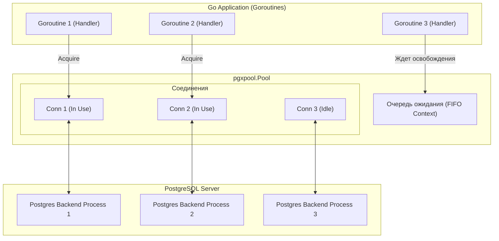

#### Жизненный цикл соединения в пуле:
1. **`Acquire()`:** Горутина запрашивает соединение. Если есть свободное (`Idle`), оно отдаётся. Если все заняты, но лимит `MaxConns` не достигнут — пул открывает новый TCP-сокет. Если лимит достигнут — горутина засыпает в очереди до освобождения или истечения таймаута контекста (`ctx`).
2. **`Query() / Exec()`:** Выполнение SQL-запроса через арендованное соединение.
3. **`Release()`:** Соединение возвращается обратно в пул. **Сокет НЕ закрывается**, а помечается как `Idle` для следующей горутины.

---

### 1.2. Почему pgx быстрее database/sql: Бинарный протокол PostgreSQL

| Критерий | `database/sql` (`lib/pq`) | `pgx/v5` (`pgxpool`) |
| :--- | :--- | :--- |
| **Сетевой протокол** | Текстовый протокол (Text Format) | **Бинарный протокол (Binary Format)** |
| **Сериализация типов** | Все значения передаются строками (`"2026-09-09"` $\rightarrow$ парсинг в память) | Байтовое представление (`int32`, `timestamptz`, `uuid` передаются как сырые байты) |
| **Рефлексия (`reflect`)** | Интенсивное использование `reflect` при сканировании (`rows.Scan`) | Оптимизированные кодеки (`pgtype`) без аллокаций в куче |
| **Подготовленные выражения** | Нужно управлять вручную (`db.Prepare()` и повторное использование `*sql.Stmt`) | Автоматический кэш стейтментов (`Statement Cache`) включен по умолчанию |
| **Массивы и JSONB** | Требуют сторонних адаптеров (`pq.Array`) | Нативная поддержка массивов Go (`[]int64`, `[]string`) и `json.RawMessage` |
| **Производительность** | Базовая | Обычно выше (по бенчмаркам авторов pgx — заметно меньше аллокаций и выше пропускная способность; реальный выигрыш зависит от нагрузки, всегда измеряйте на своих запросах) |

---

### 1.3. Тюнинг параметров пула в Production (MaxConns, IdleTime, Lifetime)

```go
package main

import (
	"context"
	"time"

	"github.com/jackc/pgx/v5/pgxpool"
)

func NewPool(ctx context.Context, dsn string) (*pgxpool.Pool, error) {
	config, err := pgxpool.ParseConfig(dsn)
	if err != nil {
		return nil, err
	}

	// 1. Максимальное количество активных соединений (значение для примера; подбирайте по формуле ниже)
	config.MaxConns = 50

	// 2. Минимальное количество "прогретых" резервных соединений
	config.MinConns = 10

	// 3. Время жизни неактивного (idle) соединения до его уничтожения
	config.MaxConnIdleTime = 5 * time.Minute

	// 4. Максимальное время жизни соединения (защита от утечек памяти на стороне Postgres)
	config.MaxConnLifetime = 1 * time.Hour

	// 5. Джиттер для размазывания закрытия соединений по времени (защита от шторма переподключений)
	config.MaxConnLifetimeJitter = 5 * time.Minute

	// 6. Период фоновой проверки здоровья соединений в пуле
	// (а таймаут ожидания свободного соединения задаётся через context, переданный в Acquire/Query)
	config.HealthCheckPeriod = 1 * time.Minute

	return pgxpool.NewWithConfig(ctx, config)
}
```

> [!IMPORTANT]
> **Золотая формула расчета `MaxConns`:**  
> Часто новички ставят `MaxConns = 500`, надеясь ускорить API. Это приводит к деградации!
> Каждый процесс в PostgreSQL — это отдельный процесс ОС, потребляющий 5–10 МБ RAM и конкурирующий за ядра CPU.
> Эмпирическая формула, которую часто приводят со ссылкой на опыт сообщества PostgreSQL (например, в руководстве HikariCP по размеру пула):
> $$\text{Connections} = (\text{CPU Cores} \times 2) + \text{Spindle (число независимых дисков)}$$
> Для 8-ядерного сервера БД оптимально **16–30 соединений на инстанс**. Если сервисов несколько — суммарный пул не должен превышать лимит `max_connections` в `postgresql.conf` (за вычетом резерва суперпользователя).

---

### 1.4. Типичные утечки соединений и памяти (Resource Leaks)

#### Ловушка 1: Забытый `rows.Close()`
```go
// ❌ КАТАСТРОФА: Утечка соединения из пула!
rows, err := pool.Query(ctx, "SELECT id, name FROM movies")
if err != nil {
    return err
}
// Если функция завершится по ошибке внутри цикла, rows НЕ закроется, 
// и соединение НАВСЕГДА останется заблокированным в статусе "In Use".

// ✅ ПРАВИЛЬНО:
rows, err := pool.Query(ctx, "SELECT id, name FROM movies")
if err != nil {
    return err
}
defer rows.Close() // Гарантированный возврат соединения в пул!
```

#### Ловушка 2: Игнорирование `rows.Err()`
```go
for rows.Next() {
    if err := rows.Scan(&id, &name); err != nil {
        return err
    }
}
// ❌ ОШИБКА: Если сетевой сбой произошел в середине чтения строк, 
// цикл Next() просто вернет false! Вы вернете клиенту неполные данные без ошибки.

// ✅ ПРАВИЛЬНО:
if err := rows.Err(); err != nil {
    return fmt.Errorf("ошибка чтения потока строк: %w", err)
}
```

---

## 2. ACID, Транзакции и Конкурентность

ACID — это фундамент надежности транзакционных СУБД:
- **Atomicity (Атомарность):** Всё или ничего. Если одна операция упала, откатываются все.
- **Consistency (Согласованность):** Переход из одного валидного состояния в другое с соблюдением всех ограничений (`CHECK`, `FOREIGN KEY`, `UNIQUE`).
- **Isolation (Изолированность):** Параллельные транзакции не должны влиять на результат друг друга.
- **Durability (Надежность / Долговечность):** После `COMMIT` данные гарантированно сохранены в WAL-логе на диске даже при внезапном отключении питания.

---

### 2.1. Анатомия транзакции в Go: Безопасный паттерн с defer Rollback

В Go каноничный паттерн выполнения транзакции защищает код от паник и утечек:

```go
// amount — сумма в минимальных единицах (копейки/центы) в виде целого числа: float для денег использовать нельзя (см. Том 1, раздел 0.3)
func TransferMoney(ctx context.Context, pool *pgxpool.Pool, fromID, toID int64, amount int64) error {
	tx, err := pool.Begin(ctx)
	if err != nil {
		return fmt.Errorf("ошибка начала транзакции: %w", err)
	}
	// Золотое правило: defer Rollback безопасен!
	// Если дойдет до tx.Commit(), последующий Rollback вернет pgx.ErrTxClosed —
	// мы эту ошибку намеренно не проверяем, и она ни на что не влияет.
	defer tx.Rollback(ctx)

	// 1. Списание
	_, err = tx.Exec(ctx, "UPDATE accounts SET balance = balance - $1 WHERE id = $2", amount, fromID)
	if err != nil {
		return fmt.Errorf("ошибка списания: %w", err)
	}

	// 2. Зачисление
	_, err = tx.Exec(ctx, "UPDATE accounts SET balance = balance + $1 WHERE id = $2", amount, toID)
	if err != nil {
		return fmt.Errorf("ошибка зачисления: %w", err)
	}

	// 3. Фиксация транзакции:
	if err := tx.Commit(ctx); err != nil {
		return fmt.Errorf("ошибка коммита: %w", err)
	}

	return nil
}
```

> ⚠️ В боевом коде нужно ещё: (1) проверять, что на счёте достаточно средств (обычно `UPDATE ... WHERE id = $2 AND balance >= $1` и проверка `RowsAffected()`); (2) избегать взаимоблокировок при встречных переводах (A→B и B→A одновременно): блокируйте строки в **одном и том же порядке**, например по возрастанию `id` (`SELECT ... WHERE id IN ($1,$2) ORDER BY id FOR UPDATE`).

---

### 2.2. Уровни изоляции транзакций и 4 Аномалии данных

Стандарт SQL-92 определяет 4 уровня изоляции и защищенность от аномалий:

| Уровень изоляции | Грязное чтение (*Dirty Read*) | Неповторяемое чтение (*Non-Repeatable Read*) | Фантомное чтение (*Phantom Read*) | Аномалия сериализации (*Serialization Anomaly*) |
| :--- | :---: | :---: | :---: | :---: |
| **Read Uncommitted** *(в PostgreSQL ведёт себя как Read Committed — грязное чтение невозможно)* | ❌ Возможен | ❌ Возможен | ❌ Возможен | ❌ Возможен |
| **Read Committed** *(дефолт в PostgreSQL)* | ✅ Защищен | ❌ Возможен | ❌ Возможен | ❌ Возможен |
| **Repeatable Read** | ✅ Защищен | ✅ Защищен | ✅ Защищен *(в PG)* | ❌ Возможен *(Write Skew)* |
| **Serializable** | ✅ Защищен | ✅ Защищен | ✅ Защищен | ✅ Защищен *(SSI)* |

#### Что означают эти аномалии:
1. **Грязное чтение (Dirty Read):** Транзакция $A$ прочитала данные, которые изменила транзакция $B$, но $B$ затем сделала `ROLLBACK`. Транзакция $A$ работала с «галлюцинацией».
2. **Неповторяемое чтение (Non-Repeatable Read):** Транзакция $A$ читает строку дважды. Между чтениями транзакция $B$ изменила строку и сделала `COMMIT`. Транзакция $A$ видит разные значения одной и той же строки.
3. **Фантомное чтение (Phantom Read):** Транзакция $A$ делает `SELECT WHERE age > 18` и получает 10 строк. Транзакция $B$ вставляет новую запись с `age = 20` и делает `COMMIT`. При повторном `SELECT` в транзакции $A$ появляется 11-я «строка-фантом».
4. **Перекос записи (Write Skew):** Две транзакции одновременно проверяют баланс ($A + B \ge 0$). Первая уменьшает $A$, вторая — $B$. По отдельности обе корректны, но вместе нарушают общее бизнес-правило. Решается только уровнем `Serializable` или `FOR UPDATE`.

> [!IMPORTANT]
> **Ловушка собеседования — PostgreSQL vs Стандарт SQL-92 на уровне `Repeatable Read`:**
> По стандарту SQL-92 уровень `Repeatable Read` **не обязан** защищать от Phantom Read — это гарантия только уровня `Serializable`. Однако PostgreSQL реализует `Repeatable Read` через **Snapshot Isolation (MVCC)**: транзакция видит только снимок данных на момент старта, поэтому новые строки, вставленные параллельной транзакцией, остаются невидимыми. Это **более строгая** гарантия, чем требует стандарт, поэтому в таблице выше стоит пометка *(в PG)*.
> При этом `Repeatable Read` в PostgreSQL **не защищает** от **Write Skew** — эта аномалия устраняется только уровнем `Serializable` (SSI — Serializable Snapshot Isolation).

#### Как задать уровень изоляции в Go:
```go
opts := pgx.TxOptions{
    IsoLevel: pgx.RepeatableRead,
    AccessMode: pgx.ReadWrite,
}
tx, err := pool.BeginTx(ctx, opts)
```

---

### 2.3. Механизм MVCC в PostgreSQL: xmin, xmax, VACUUM и Bloat

В отличие от СУБД, использующих тяжелые блокировки чтения (как ранние версии SQL Server), PostgreSQL использует **MVCC (Multi-Version Concurrency Control)**.

> **Главный девиз MVCC:**  
> *«Писатели не блокируют читателей, а читатели не блокируют писателей».*

Каждая строка (*tuple*) в PostgreSQL на диске содержит скрытые системные поля:
- **`xmin`:** ID транзакции, которая создала (INSERT) эту версию строки.
- **`xmax`:** ID транзакции, которая удалила или обновила (DELETE/UPDATE) эту версию строки (0, если строка жива).

```text
-- Когда выполняется UPDATE users SET balance = 200 WHERE id = 1:
PostgreSQL НЕ перезаписывает старую ячейку на диске!
1. Старая строка: [id=1, balance=100] -> xmax устанавливается в ID текущей транзакции (помечается мертвой).
2. Новая строка:  [id=1, balance=200] -> записывается в новое место диска с xmin = ID текущей транзакции.
```

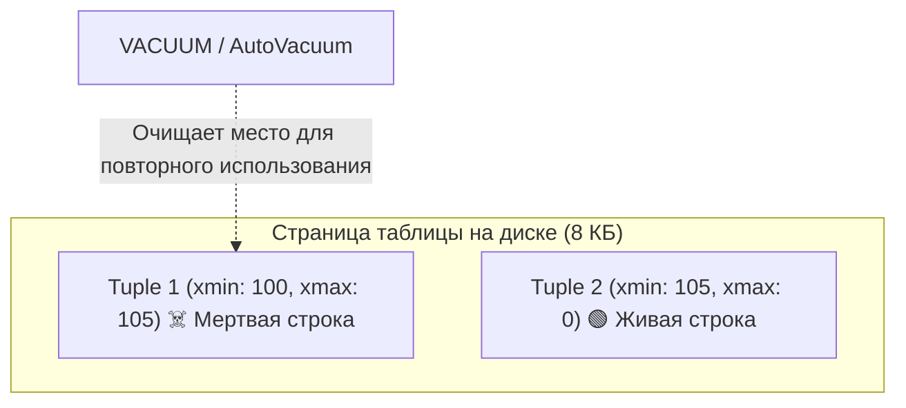

#### Проблема Bloat (Раздувание таблиц) и роль `VACUUM`:
- Мертвые строки остаются на диске до тех пор, пока их видит хотя бы одна старая активная транзакция.
- Если в приложении зависает транзакция (`idle in transaction`), фоновый процесс `AutoVacuum` не может очистить мертвые строки. Таблица и индексы раздуваются в размерах (**Table Bloat**), запросы начинают тормозить.

---

### 2.4. Пессимистические блокировки: SELECT FOR UPDATE, SKIP LOCKED, NOWAIT

Когда необходимо защитить критические финансовые данные от гонок на уровне базы данных:

```sql
-- Блокирует строку: другие транзакции встанут в очередь и будут ждать Commit/Rollback
SELECT balance FROM accounts WHERE id = 1 FOR UPDATE;
```

#### Модификаторы для очередей задач:
1. **`NOWAIT`:** Если строка уже кем-то заблокирована, запрос не висит в ожидании, а моментально падает с ошибкой `55P03 (lock_not_available)`.
2. **`SKIP LOCKED`:** Идеально для паттерна **Worker Pool / Message Queue на PostgreSQL**. Воркер пропускает заблокированные строки и забирает следующую свободную задачу без конкуренции:

```sql
-- Воркер забирает строго 1 задачу, которую еще никто не обрабатывает
-- (выполняется ВНУТРИ транзакции: блокировка держится до её COMMIT/ROLLBACK):
SELECT id, payload 
FROM task_queue 
WHERE status = 'PENDING' 
ORDER BY priority DESC 
LIMIT 1 
FOR UPDATE SKIP LOCKED;
```

---

### 2.5. Оптимистические блокировки (Optimistic Concurrency Control)

Применяется, когда конфликты редки, а блокировать базу через `FOR UPDATE` дорого (высокий RPS).  
Реализуется через версионирование (`version` или `updated_at`):

```sql
-- Таблица имеет поле version INT DEFAULT 1
-- 1. Считываем данные в приложении:
SELECT id, balance, version FROM accounts WHERE id = 1; -- Получили version = 3

-- 2. Обновляем со строгим условием:
UPDATE accounts 
SET balance = 500, version = version + 1 
WHERE id = 1 AND version = 3;
```

В коде на Go проверяется количество затронутых строк (`RowsAffected()`):
```go
tag, err := pool.Exec(ctx, "UPDATE accounts SET balance = $1, version = version + 1 WHERE id = $2 AND version = $3", newBalance, id, oldVersion)
if err != nil {
    return err
}
if tag.RowsAffected() == 0 {
    // Конфликт! Кто-то успел обновить запись раньше нас.
    return ErrOptimisticLockConflict // Повторяем операцию (Retry)
}
```

---

### 2.6. Распределенные транзакции: 2PC, Saga и Transactional Outbox Pattern

В микросервисной архитектуре одна бизнес-операция затрагивает несколько независимых БД.

#### 1. Двухфазный коммит (2PC - Two-Phase Commit)
- Координатор опрашивает узлы: *«Готовы закоммитить?» (Prepare)*. Если все сказали «Да» $\rightarrow$ отправляет команду *«Коммитьте» (Commit)*.
- **Минусы:** Блокирующий протокол, единая точка отказа, крайне медленный для современных распределенных систем.

#### 2. Паттерн Saga (Хореография и Оркестрация)
Серия локальных транзакций. Если один из шагов упал, запускается цепочка **компенсирующих транзакций (Compensating Transactions)**:
- *Пример:* 1. Списали деньги $\rightarrow$ 2. Не удалось забронировать билет $\rightarrow$ Компенсация: возвращаем деньги на счет.

#### 3. Паттерн Transactional Outbox (Решение Dual Write)
Гарантия надежной отправки события в Kafka/RabbitMQ при сохранении в PostgreSQL в рамках **одной локальной транзакции**:

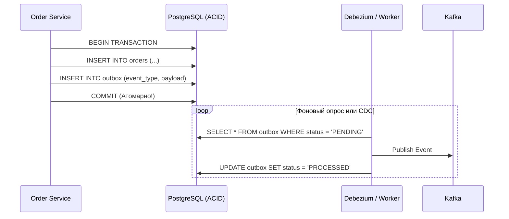

---

## 3. Индексы и Внутреннее устройство СУБД

Индекс — это отдельная от таблицы структура данных на диске, ускоряющая поиск за счет поддержания элементов в отсортированном порядке, ценой замедления операций записи (`INSERT`, `UPDATE`, `DELETE`).

---

### 3.1. Устройство B-Tree индекса: Почему поиск работает за O(log N)

Стандартным индексом в PostgreSQL является **B-Tree (сбалансированное дерево)**:

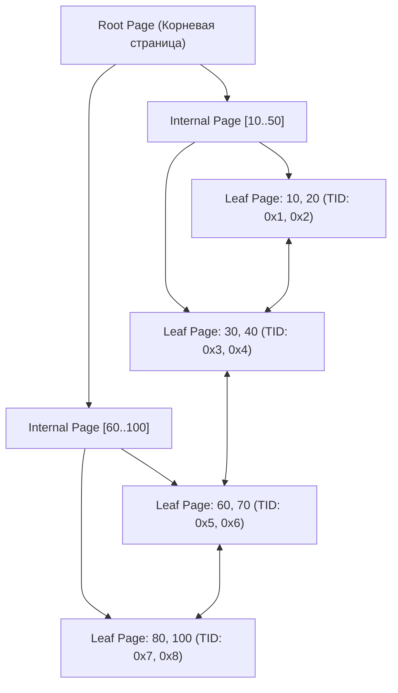

- **Коэффициент ветвления (Fan-Out):** Каждая страница индекса (8 КБ) вмещает сотни ключей.
- **Глубина (Depth):** Даже при 100 миллионах записей глубина B-Tree дерева составляет всего **3–4 уровня**.
- Чтобы найти строку среди 100 000 000 записей, диску требуется выполнить всего **3–4 чтения страниц**!
- Листовые страницы (*Leaf Pages*) связаны между собой двусвязным списком, что делает сканирование диапазонов (`BETWEEN`, `>`, `<`) исключительно быстрым.

---

### 3.2. Составные индексы и Правило левого префикса

Составной индекс строится по нескольким столбцам:
```sql
CREATE INDEX idx_users_status_created ON users (status, created_at);
```

#### Как B-Tree сортирует данные:
Данные сначала сортируются строго по `status`. Внутри одинаковых значений `status` данные сортируются по `created_at`.

```text
(status, created_at)
('ACTIVE',   '2026-01-01')
('ACTIVE',   '2026-01-02')
('ACTIVE',   '2026-01-03')
('BLOCKED',  '2025-12-01')
```

#### Правило левого префикса:
1. `WHERE status = 'ACTIVE'` $\rightarrow$ ✅ **Индекс работает (Index Scan)**.
2. `WHERE status = 'ACTIVE' AND created_at > '2026-01-01'` $\rightarrow$ ✅ **Индекс работает максимально эффективно**.
3. `WHERE created_at > '2026-01-01'` $\rightarrow$ ❌ **Индекс, как правило, не помогает** (в лучшем случае планировщик выполнит неэффективный полный просмотр индекса), так как ведущий столбец `status` пропущен!

> [!TIP]
> **Порядок столбцов в составном индексе:**  
> Сначала столбцы, по которым в запросах есть условия **равенства** (`=`), затем столбец с диапазоном (`>`, `BETWEEN`) или сортировкой (`ORDER BY`). При прочих равных ставьте раньше столбец с большей селективностью (большим числом уникальных значений). Ориентируйтесь на реальные запросы и `EXPLAIN`, а не на одно универсальное правило.

---

### 3.3. Специализированные индексы: GIN, GiST, BRIN и HASH

| Тип индекса | Принцип работы | Сложность | Когда использовать |
| :--- | :--- | :--- | :--- |
| **B-Tree** | Сбалансированное дерево поиска | $O(\log N)$ | Числа, строки, даты, сравнения `=`, `<`, `>`, `BETWEEN`, `ORDER BY` |
| **HASH** | Динамическая хэш-таблица на диске | $O(1)$ | Только строгое равенство (`=`) по длинным ключам (UUID, токены, URL) |
| **GIN** *(Inverted Index)* | Список соответствий: «элемент $\rightarrow$ ID строк (TID)» | $O(\log N)$ | Массивы `int[]`, полнотекстовый поиск (FTS), документы `JSONB` |
| **GiST** | Обобщенное дерево поиска с иерархией пересечений | $O(\log N)$ | Геоданные (PostGIS), координаты, диапазоны дат (`daterange`) |
| **BRIN** | Хранит только `(MIN, MAX)` значения для блоков страниц | $O(\text{pages})$ | Огромные таблицы (логи, Time-Series), отсортированные по времени |

---

#### 1. Хеш-индекс (HASH Index)

##### Как устроен под капотом:
1. **Хеш-функция:** При вставке значения колонка пропускается через 32-битную хеш-функцию, вычисляя 4-байтный хеш-код.
2. **Бакеты (Buckets) и динамическое хеширование:** Индекс состоит из страниц-корзин (buckets). Номер бакета определяется младшими битами хеш-кода. При переполнении страниц бакета СУБД выделяет страницы переполнения (*overflow pages*). Используется алгоритм линейного хеширования: при росте таблицы корзины расщепляются по одной без блокировки всего индекса.
3. **Хранение данных:** В бакетах хранятся пары `(32-bit hash value, ItemPointer/TID)` — указатели на физическое положение строки в Heap.

```sql
-- Создание Hash-индекса в PostgreSQL:
CREATE INDEX idx_sessions_token ON user_sessions USING HASH (token);

-- Планировщик использует Bitmap Index Scan / Index Scan по равенству:
SELECT user_id, expires_at FROM user_sessions WHERE token = 'a8f9c2d1e0...long_token';
```

##### Преимущества перед B-Tree:
* **Компактность при длинных ключах:** В B-Tree на каждом уровне дерева хранится сам ключ (например, длинный URL или SHA-256 строка на 64+ байт). В Hash-индексе всегда хранится только 4-байтный хеш, поэтому для очень широких колонок Hash-индекс занимает заметно меньше места на диске и в буферном пуле RAM.
* **Константная скорость $O(1)$:** Время поиска не зависит от глубины дерева (в B-Tree это 3–4 чтения страниц, здесь в среднем 1–2).

##### Недостатки и почему на собеседованиях говорят «B-Tree почти всегда лучше»:
1. **Только операция равенства (`=`):** Не поддерживает `>`, `<`, `BETWEEN`, `LIKE 'abc%'`, `IS NULL`.
2. **Не поддерживает сортировку:** Хеш перемешивает данные случайным образом, поэтому `ORDER BY` всегда потребует отдельного узла `Sort` в памяти или на диске.
3. **Только одна колонка:** Нельзя создать составной индекс (`USING HASH (user_id, status)` вызовет синтаксическую ошибку).
4. **Не поддерживает Index Only Scan:** Из-за возможных коллизий 32-битного хеша (разные строки дают одинаковый хеш) СУБД **обязана** перейти в таблицу (Heap) и сверить оригинальное строковое значение.
5. **Исторический фактор (до PostgreSQL 10):** До 10-й версии Hash-индексы не писались в журнал предзаписи (WAL) — при падении сервера требовался полный `REINDEX`, а на Read-реплики такие индексы не передавались. С PG 10 поддержка WAL добавлена, но B-Tree остался стандартом де-факто.

---

#### 2. GIN-индекс (Generalized Inverted Index)
Хранит пары «элемент $\rightarrow$ список строк, где он встречается». Незаменим для поиска внутри `JSONB` и массивов:

```sql
CREATE INDEX idx_movies_metadata ON movies USING GIN (metadata jsonb_path_ops);

-- Запрос выполнится мгновенно через GIN индекс:
SELECT * FROM movies WHERE metadata @> '{"director": "Christopher Nolan"}';
```

---

#### 3. GiST и BRIN индексы
* **GiST (Generalized Search Tree):** Используется для пространственных данных (PostGIS) и исключающих ограничений (`EXCLUDE USING gist`) — например, проверка отсутствия пересекающихся бронирований отеля:
  ```sql
  -- Запрет пересечения интервалов дат для одного номера:
  ALTER TABLE bookings ADD CONSTRAINT no_overlap 
  EXCLUDE USING gist (room_id WITH =, booking_period WITH &&);
  ```
* **BRIN (Block Range Index):** Идеален для миллиардов строк временных рядов (Time-Series / логи), которые вставляются последовательно по `created_at`. Хранит только диапазон `[MIN, MAX]` для блока из 128 страниц таблицы, занимая в сотни раз меньше места, чем B-Tree.

---

### 3.4. Частичные индексы (Partial Index) и Покрывающие индексы (INCLUDE)

#### 1. Частичный индекс (Partial Index)
Индексирует не всю таблицу, а только ее часть с условием `WHERE`. Может существенно сэкономить место на диске и ускорить запись:

```sql
-- Индексируем только активных пользователей (которых в базе всего 2%):
CREATE INDEX idx_active_users ON users (email) WHERE is_active = true;
```

#### 2. Покрывающий индекс (Covering Index с `INCLUDE`)
Позволяет базе данных выполнить **Index Only Scan** — вернуть все запрошенные колонки прямо из самого индекса, вообще **не обращаясь к основной таблице (Heap)**:

```sql
CREATE INDEX idx_orders_user_date ON orders (user_id) INCLUDE (total_amount, status);

-- Запрос достанет total_amount и status прямо из индекса B-Tree:
SELECT user_id, total_amount, status FROM orders WHERE user_id = 42;
```

---

## 4. Анализ и Оптимизация запросов: EXPLAIN ANALYZE и JOINs

### 4.1. Разница между EXPLAIN и EXPLAIN ANALYZE (Buffers, Cost)

- **`EXPLAIN`:** Показывает теоретический план выполнения, рассчитанный оптимизатором на основе статистики распределения данных (запрос **не выполняется физически**). Безопасен для запуска на продакшене даже для `DELETE/UPDATE`.
- **`EXPLAIN (ANALYZE, BUFFERS)`:** **Реально выполняет запрос** на сервере, замеряет точное время каждого узла и считает чтение страниц памяти из системного кэша и диска.
  > [!CAUTION]
  > Никогда не запускайте `EXPLAIN ANALYZE DELETE FROM ...` на продакшене без транзакции с `ROLLBACK`, иначе данные будут реально удалены!

```sql
EXPLAIN (ANALYZE, BUFFERS, COSTS, VERBOSE, TIMING)
SELECT u.name, o.total_amount
FROM users u
JOIN orders o ON u.id = o.user_id
WHERE u.status = 'ACTIVE' AND o.created_at >= '2026-01-01';
```

---

### 4.2. Анатомия реального вывода EXPLAIN (ANALYZE, BUFFERS): чтение плана

План выполнения в PostgreSQL представляет собой **дерево узлов (Node Tree)**. Читать его нужно **снизу вверх (от самых глубоких отступов к корневому узлу)**: сначала выполняются дочерние операции (сканирование таблиц), затем промежуточные (сортировка, соединение), и в конце — результат.

#### Реальный листинг с медленного продакшен-запроса:
```text
Sort  (cost=42315.42..42318.92 rows=1400 width=72) (actual time=142.315..142.420 rows=1250 loops=1)
  Sort Key: o.created_at DESC
  Sort Method: quicksort  Memory: 185kB
  Buffers: shared hit=412 read=12408
  ->  Hash Join  (cost=1850.00..42240.50 rows=1400 width=72) (actual time=24.120..140.050 rows=1250 loops=1)
        Hash Cond: (o.user_id = u.id)
        Buffers: shared hit=412 read=12408
        ->  Seq Scan on orders o  (cost=0.00..38500.00 rows=15200 width=40) (actual time=0.045..128.850 rows=15000 loops=1)
              Filter: (created_at >= '2026-01-01'::date)
              Rows Removed by Filter: 985000
              Buffers: shared hit=102 read=12398
        ->  Hash  (cost=1600.00..1600.00 rows=20000 width=36) (actual time=23.850..23.850 rows=20000 loops=1)
              Buckets: 32768  Batches: 1  Memory Usage: 1350kB
              Buffers: shared hit=310 read=10
              ->  Index Scan using idx_users_status on users u  (cost=0.42..1600.00 rows=20000 width=36) (actual time=0.035..18.200 rows=20000 loops=1)
                    Index Cond: (status = 'ACTIVE'::text)
                    Buffers: shared hit=310 read=10
Planning Time: 0.354 ms
Execution Time: 142.580 ms
```

#### Расшифровка ключевых параметров:

| Параметр | Значение в примере | Что означает и как интерпретировать |
| :--- | :--- | :--- |
| **`cost=A..B`** | `cost=0.00..38500.00` | Оценка планировщика в условных единицах дискового ввода-вывода (`seq_page_cost = 1.0`). $A$ — цена получения первой строки, $B$ — цена завершения всего узла. |
| **`rows=1400`** | `rows=1400` | **Ожидаемое** число строк (по статистике). Если сильно отличается от `actual rows` — статистика устарела, нужен `ANALYZE`. |
| **`actual time=A..B`** | `0.045..128.850` | Реальное время в миллисекундах: старт узла и полное завершение. |
| **`actual rows=15000`** | `rows=15000` | **Фактическое** количество строк, возвращенных узлом. |
| **`loops=1`** | `loops=1` | Сколько раз узел выполнялся. **Внимание:** если `loops=100`, то реальное время узла равно $\text{actual time} \times 100$! |
| **`Rows Removed by Filter`** | **`985 000`** | 🚨 **Главное бутылочное горлышко!** База прочитала 1 000 000 строк и выкинула 985 000, потому что нет индекса по `created_at`. |
| **`Buffers: shared hit`** | `hit=412` | Страницы памяти размером 8 КБ, прочитанные из ОЗУ (`shared_buffers`). Время доступа ~100 наносекунд. |
| **`Buffers: shared read`** | **`read=12408`** | 🚨 Страницы, которых не было в `shared_buffers` и которые пришлось запросить у ОС (с диска или из кэша ОС) ($12408 \times 8\text{ КБ} \approx 97\text{ МБ}$). Это главная причина лагов запроса. |
| **`Sort Method`** | `quicksort Memory` | Сортировка уместилась в памяти (`work_mem`). Если там `external merge Disk` — запрос пишет во временные файлы на диск! |

---

### 4.3. Типы сканирования: Seq Scan, Index Scan, Index Only Scan, Bitmap Scan

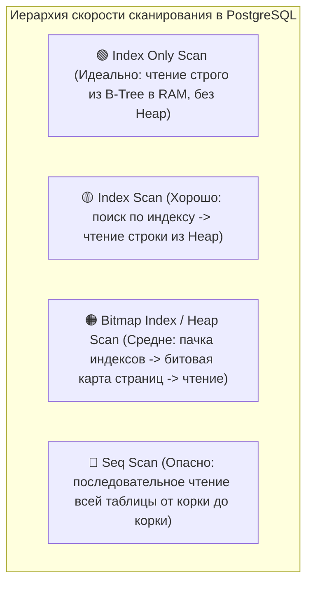

1. **`Seq Scan` (Sequential Scan):** Полное последовательное чтение всей таблицы с диска. Оправдано только для маленьких справочников (<1000 строк) или когда запрос выбирает >30-40% всех строк таблицы.
2. **`Index Scan`:** Поиск адреса строки (`ItemPointer` / `TID`: страница + смещение) по B-Tree индексу, после чего выполняется физическое чтение самой строки из таблицы (`Heap Table`).
3. **`Index Only Scan`:** Все запрашиваемые столбцы (`SELECT` и `WHERE`) уже содержатся в самом индексе (или добавлены через `INCLUDE`). Таблица на диске не читается вовсе (если `Visibility Map` подтверждает актуальность страниц).
4. **`Bitmap Index Scan` + `Bitmap Heap Scan`:** Применяется, когда строк много или комбинируются два разных индекса через `OR/AND`. Движок строит битовую карту номеров страниц в RAM, сортирует их по физическому порядку на диске и считывает страницы последовательно, избегая случайного скакания по диску.

---

### 4.4. Все виды соединений (JOIN): Логические типы и физические алгоритмы

#### 1. Логические типы JOIN:

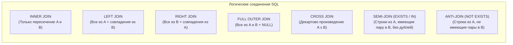

| Тип JOIN | Описание поведения | Результат при отсутствии пары |
| :--- | :--- | :--- |
| **`INNER JOIN`** | Возвращает строки, для которых условие соединения истинно в **обеих** таблицах. | Строка исключается из результата. |
| **`LEFT [OUTER] JOIN`** | Возвращает **все** строки из левой таблицы. Если в правой совпадений нет — заполняет её поля `NULL`. | Поля правой таблицы становятся `NULL`. |
| **`RIGHT [OUTER] JOIN`** | Зеркален к `LEFT JOIN` (на практике почти всегда заменяется на `LEFT JOIN` для читаемости). | Поля левой таблицы становятся `NULL`. |
| **`FULL [OUTER] JOIN`** | Возвращает все строки из обеих таблиц. Если совпадения нет с любой стороны — ставит `NULL`. | Поля отсутствующей стороны становятся `NULL`. |
| **`CROSS JOIN`** | Декартово произведение: каждая строка таблицы $A$ соединяется с каждой строкой таблицы $B$ ($N \times M$ строк). | Возвращает $N \times M$ строк (условие `ON` отсутствует). |
| **`SELF JOIN`** | Таблица соединяется сама с собой (например, сотрудник и его начальник через `manager_id`). | Зависит от используемого типа (`INNER` или `LEFT`). |
| **`SEMI-JOIN`** | Внутренняя оптимизация PostgreSQL для `WHERE EXISTS (...)` или `WHERE id IN (...)`. Возвращает строку левой таблицы при первом же совпадении и **не раздувает строки**. | Строка исключается. |
| **`ANTI-JOIN`** | Внутренняя оптимизация для `WHERE NOT EXISTS (...)`. Быстрее `NOT IN` и устойчива к `NULL`. | Возвращает только те строки левой таблицы, у которых нет пары. |

#### 2. Физические алгоритмы соединения движка:

| Алгоритм соединения | Принцип работы | Временная сложность | Когда выбирается оптимизатором |
| :--- | :--- | :--- | :--- |
| **Nested Loop** | Для каждой строки внешней таблицы ищется совпадение во внутренней (обычно по B-Tree индексу). | $O(N \cdot \log M)$ с индексом, $O(N \cdot M)$ без | Одна таблица очень маленькая (<100 строк), а у второй есть эффективный индекс. |
| **Hash Join** | По меньшей таблице строится хэш-таблица в памяти `work_mem`. Вторая таблица сканируется и сверяется по хэшу. | $O(N + M)$ | Обе таблицы средние/большие, условий по индексу нет, памяти `work_mem` хватает. |
| **Merge Join** | Обе таблицы предварительно сортируются по ключу соединения, после чего сливаются двумя бегущими указателями. | $O(N \log N + M \log M)$ или $O(N + M)$, если уже отсортированы | Большие таблицы, предварительно отсортированные по B-Tree индексам. |

---

### 4.5. Коварная ловушка собеседований: ON vs WHERE при LEFT JOIN

Это один из самых частых вопросов на Middle/Senior собеседованиях.

#### 🎯 В чем разница между:
```sql
-- Запрос 1: Условие в секции ON
SELECT u.id, u.name, o.id as order_id, o.status
FROM users u
LEFT JOIN orders o ON u.id = o.user_id AND o.status = 'COMPLETED';

-- Запрос 2: Условие перенесено в секцию WHERE
SELECT u.id, u.name, o.id as order_id, o.status
FROM users u
LEFT JOIN orders o ON u.id = o.user_id
WHERE o.status = 'COMPLETED';
```

#### 💥 В чем ловушка:
* **Запрос 1 (`AND o.status = 'COMPLETED'` в `ON`):**  
  Фильтрация применяется **до** объединения таблиц. Если у пользователя нет заказов со статусом `COMPLETED`, пользователь **всё равно попадет в итоговую выборку**, а поля `order_id` и `status` будут равны `NULL`. Это истинный `LEFT JOIN`.
* **Запрос 2 (`WHERE o.status = 'COMPLETED'`):**  
  Сначала выполняется `LEFT JOIN` (для пользователей без заказов генерируются строки с `o.status = NULL`). Затем срабатывает блок `WHERE`. Условие `NULL = 'COMPLETED'` возвращает `UNKNOWN` (ложь в булевой логике SQL), и **все пользователи без заказов отфильтровываются**!  
  👉 **Запрос 2 молча превратился в `INNER JOIN`**, сломав бизнес-логику!

---

### 4.6. Декартово произведение и искажение агрегатов при связях 1:N

Частая архитектурная ошибка при составлении отчетов — объединение одной сущности сразу с двумя независимыми дочерними таблицами «один-ко-многим».

#### Проблема (Fan-Out / Cartesian Explosion):
У пользователя 2 заказа (`orders`) и 3 привязанных адреса (`addresses`).
```sql
-- ❌ КАТАСТРОФА: Сумма заказа умножится на количество адресов!
SELECT u.id, SUM(o.amount) as total_spent, COUNT(a.id) as total_addresses
FROM users u
LEFT JOIN orders o ON u.id = o.user_id
LEFT JOIN addresses a ON u.id = a.user_id
GROUP BY u.id;
```
В результате `LEFT JOIN` сгенерирует $2 \times 3 = 6$ строк! `SUM(o.amount)` посчитает каждый заказ **трижды**, а `COUNT(a.id)` вернет 6 вместо 3.

#### ✅ Правильное решение (через предварительную агрегацию в CTE):
```sql
WITH UserOrders AS (
    SELECT user_id, SUM(amount) AS total_spent
    FROM orders
    GROUP BY user_id
),
UserAddresses AS (
    SELECT user_id, COUNT(*) AS total_addresses
    FROM addresses
    GROUP BY user_id
)
SELECT 
    u.id,
    COALESCE(uo.total_spent, 0) AS total_spent,
    COALESCE(ua.total_addresses, 0) AS total_addresses
FROM users u
LEFT JOIN UserOrders uo ON u.id = uo.user_id
LEFT JOIN UserAddresses ua ON u.id = ua.user_id;
```

---

### 4.7. Статистика планировщика и почему индекс может игнорироваться

Частая жалоба на собеседовании: *«Я создал индекс, а база всё равно делает Seq Scan. Почему?»*

#### 5 главных причин:
1. **Низкая селективность данных:** Если условию `WHERE status = 'ACTIVE'` соответствует >20-30% таблицы, PostgreSQL знает, что случайное чтение страниц по индексу будет медленнее, чем последовательное чтение всей таблицы (`Seq Scan`).
2. **Использование функций над колонками:**  
   `WHERE LOWER(email) = 'alex@example.com'` **НЕ использует** индекс на `email`. Нужен функциональный индекс: `CREATE INDEX ON users (LOWER(email))`.
3. **Несовпадение типов данных:**  
   Если тип условия не совпадает с типом колонки, СУБД может привести к нужному типу **значение колонки** (для каждой строки), и индекс перестанет использоваться. Классический пример в MySQL — `WHERE phone = 79991234567` для строкового поля `phone` (число сравнивается со строкой). В PostgreSQL такое сравнение `varchar` с числом вообще вызовет ошибку, но похожая проблема возникает, например, при сравнении `timestamp` с `timestamptz` или `int` с `numeric`, а также при неверном типе параметра, передаваемого драйвером.
4. **Устаревшая статистика планировщика:**  
   Планировщик строит предположения на основе гистограмм таблицы `pg_statistic`. Если в таблицу только что залили миллион строк, нужно выполнить команду: `ANALYZE users;`.
5. **Таблица слишком мала:**  
   Если таблица занимает меньше 10–20 страниц (до 1000 строк), планировщик всегда выберет `Seq Scan`, так как чтение индекса потребует лишних операций ввода-вывода.

---

### 4.8. Практический кейс: Оптимизация запроса от А до Я (1200ms -> 0.4ms)

#### Исходная задача:
В таблице `orders` (5 000 000 строк) нужно выбрать последние 10 оплаченных заказов клиента:
```sql
SELECT id, total_amount, created_at
FROM orders
WHERE user_id = 42 AND status = 'PAID'
ORDER BY created_at DESC
LIMIT 10;
```

#### Исходный план без индексов:
```text
Limit  (cost=105230.00..105230.03 rows=10 width=24) (actual time=1180.450..1180.455 rows=10 loops=1)
  ->  Sort  (cost=105230.00..105231.10 rows=440 width=24) (actual time=1180.448..1180.451 rows=10 loops=1)
        Sort Key: created_at DESC
        Sort Method: top-N heapsort  Memory: 26kB
        ->  Seq Scan on orders  (cost=0.00..102450.00 rows=440 width=24) (actual time=0.080..1175.200 rows=450 loops=1)
              Filter: ((user_id = 42) AND (status = 'PAID'::text))
              Rows Removed by Filter: 4999550
              Buffers: shared hit=1200 read=48500
Planning Time: 0.150 ms
Execution Time: 1180.520 ms
```
* **Диагноз:** `Seq Scan` по 5 млн строк, `Rows Removed by Filter: 4 999 550`, чтение 48 500 блоков с диска. Время: **1.18 секунды**.

#### Решение: Построение покрывающего составного индекса
Для идеального удовлетворения условий `WHERE`, `ORDER BY` и отсутствия обращения к Heap (`Index Only Scan`):
```sql
CREATE INDEX idx_orders_user_status_created 
ON orders (user_id, status, created_at DESC) 
INCLUDE (id, total_amount);
```

> `INCLUDE (id, total_amount)` нужен потому, что запрос выбирает `id, total_amount, created_at`: чтобы получился именно `Index Only Scan`, все выбираемые столбцы должны быть либо ключами индекса, либо в `INCLUDE`. (А чтобы `Heap Fetches` были равны 0, таблица должна быть недавно обработана `VACUUM`.)

#### Оптимизированный план `EXPLAIN (ANALYZE, BUFFERS)`:
```text
Limit  (cost=0.43..1.25 rows=10 width=24) (actual time=0.032..0.045 rows=10 loops=1)
  Buffers: shared hit=4 read=0
  ->  Index Only Scan using idx_orders_user_status_created on orders  (cost=0.43..36.50 rows=440 width=24) (actual time=0.031..0.042 rows=10 loops=1)
        Index Cond: ((user_id = 42) AND (status = 'PAID'::text))
        Heap Fetches: 0
        Buffers: shared hit=4 read=0
Planning Time: 0.120 ms
Execution Time: 0.065 ms
```

#### Результат оптимизации:
* Метод доступа сменился с `Seq Scan` на **`Index Only Scan`**.
* Доступ к таблице (`Heap Fetches`): **0**.
* Чтения с диска (`shared read`): сменились с 48 500 на **0** (всего 4 чтения страниц из буфера ОЗУ `shared hit=4`).
* Время выполнения: **снизилось с 1180 мс до 0.065 мс (ускорение более чем в 18 000 раз!)**.

---

## 5. Продвинутый SQL для Go-разработчика

### 5.1. Оконные функции (Window Functions): нумерация, ранжирование, LAG и LEAD

Оконная функция выполняет вычисления над набором связанных строк **без группировки (`GROUP BY`) и без сжатия строк**.

#### Синтаксис:
$$\text{FUNCTION()} \quad \textbf{OVER} \quad (\textbf{PARTITION BY} \dots \quad \textbf{ORDER BY} \dots)$$

```sql
-- Задача: Получить Топ-3 самых кассовых фильма в каждом жанре:
WITH ranked_movies AS (
    SELECT 
        id,
        title,
        genre,
        box_office,
        ROW_NUMBER() OVER(PARTITION BY genre ORDER BY box_office DESC) as rank
    FROM movies
)
SELECT title, genre, box_office, rank 
FROM ranked_movies 
WHERE rank <= 3;
```

#### Популярные оконные функции:
* `ROW_NUMBER()`: Строгая сквозная нумерация (1, 2, 3, 4).
* `RANK()`: Одинаковые значения получают одинаковый ранг с пропуском последующих (1, 2, 2, 4).
* `DENSE_RANK()`: Одинаковые значения без пропуска рангов (1, 2, 2, 3).
* `LAG(col, 1)`: Значение из предыдущей строки (например, чтобы вычислить разницу с предыдущим месяцем).
* `LEAD(col, 1)`: Значение из следующей строки.

---

### 5.2. CTE и Рекурсивные запросы (WITH RECURSIVE)

Обычный CTE (*Common Table Expression*) повышает читаемость сложных запросов.  
А с `WITH RECURSIVE` можно обходить иерархии (деревья категорий, организационные структуры, комментарии с ответами):

```sql
-- Рекурсивный обход дерева категорий сверху вниз:
WITH RECURSIVE category_tree AS (
    -- Базовая часть (Anchor member): корень дерева
    SELECT id, name, parent_id, 1 as level
    FROM categories
    WHERE parent_id IS NULL

    UNION ALL

    -- Рекурсивная часть (Recursive member): присоединяем дочерние узлы
    SELECT c.id, c.name, c.parent_id, ct.level + 1
    FROM categories c
    JOIN category_tree ct ON c.parent_id = ct.id
)
SELECT * FROM category_tree ORDER BY level, name;
```

---

### 5.3. Работа с JSONB: Индексация и операторы поиска в Go

PostgreSQL поддерживает `JSONB` — декомпозированный бинарный формат хранения JSON с поддержкой быстрой индексации:

```sql
-- Оператор @> (содержит ли JSON заданную пару ключ-значение):
SELECT * FROM users WHERE settings @> '{"theme": "dark"}';

-- Извлечение скалярного значения оператором ->> (текст):
SELECT settings->>'language' FROM users WHERE id = 1;
```

#### Обработка JSONB в Go:
```go
type UserSettings struct {
	Theme    string `json:"theme"`
	Language string `json:"language"`
}

var settings UserSettings
err := pool.QueryRow(ctx, "SELECT settings FROM users WHERE id = $1", userID).Scan(&settings)
// pgx автоматически сериализует/десериализует структуры в JSONB поля!
```

---

### 5.4. Партиционирование таблиц (Range, List, Hash Partitioning)

Когда таблица превышает сотни гигабайт или миллиарды строк, B-Tree перестает помещаться в оперативную память.  
Решение: **Декларативное секционирование (Partitioning)**.

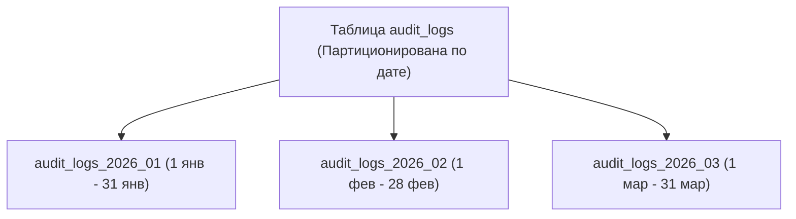

```sql
CREATE TABLE audit_logs (
    id BIGINT GENERATED ALWAYS AS IDENTITY,
    created_at TIMESTAMPTZ NOT NULL,
    payload TEXT,
    PRIMARY KEY (id, created_at) -- в партиционированной таблице ключ обязан содержать столбец партиционирования
) PARTITION BY RANGE (created_at);

-- Дочерняя секция за Январь 2026:
CREATE TABLE audit_logs_2026_01 PARTITION OF audit_logs
    FOR VALUES FROM ('2026-01-01') TO ('2026-02-01');
```

> [!NOTE]
> **Partition Pruning:**  
> Если запрос содержит `WHERE created_at >= '2026-01-10' AND created_at < '2026-01-20'`, PostgreSQL на этапе планирования исключит все остальные секции и будет читать строго одну партицию `audit_logs_2026_01`.

---

## 6. In-Memory БД и NoSQL: Redis & MongoDB

### 6.0. Классификация NoSQL и ограничения реляционной модели

> [!NOTE]
> **Ограничения табличной реляционной модели:**
> 1. **Разреженность данных (Sparse Data):** В e-commerce каталогах с тысячами разнородных товаров (электроника, одежда, книги) реляционная модель вынуждает создавать сотни столбцов, большинство из которых заполнены `NULL`.
> 2. **Негибкость схемы (Schema Rigidity):** Добавление новых динамических атрибутов требует миграции `ALTER TABLE`, что на терабайтных базах приводит к блокировкам.
> 3. **Горизонтальное масштабирование:** Строгие ACID-гарантии (особенно распределенные транзакции) крайне сложно и дорого масштабировать горизонтально на сотни узлов шардинга.

#### Четыре класса NoSQL баз данных:

| Тип NoSQL | Принцип организации данных | Типовое применение | Представители |
| :--- | :--- | :--- | :--- |
| **Документные (Document)** | Слабоструктурированные иерархические документы (JSON/BSON) | Каталоги товаров, профили пользователей, CMS, блоги | **MongoDB**, CouchDB |
| **Ключ-значение (Key-Value)** | Ассоциативный массив (хэш-таблица: ключ -> произвольное значение) | Кэш ответов, сессии, корзины покупок, токены | **Redis**, DynamoDB |
| **Колоночные (Column-Family)** | Хранение данных не по строкам, а по столбцам таблицы | OLAP аналитика, сбор логов, временные ряды, метрики | **ClickHouse**, Cassandra |
| **Графовые (Graph)** | Узлы (Nodes), ребра (Edges) и их свойства | Социальные графы, рекомендации, системы безопасности | **Neo4j**, OrientDB |

#### Соответствие терминов: PostgreSQL vs MongoDB

| Концепция RDBMS (PostgreSQL) | Концепция NoSQL (MongoDB) | Описание |
| :--- | :--- | :--- |
| База данных (`Database`) | База данных (`Database`) | Логическая группировка данных |
| Таблица (`Table`) | **Коллекция (`Collection`)** | Множество документов без жесткой фиксированной схемы |
| Строка (`Row`) | **Документ (`Document` в BSON)** | Самодостаточная запись со своими полями и типами |
| Столбец (`Column`) | **Ключ / Поле (`Field / Key`)** | Атрибут внутри документа |
| Индекс (`B-Tree Index`) | Индекс (`Index`) | Структура для быстрого поиска |
| Запрос `SELECT` | Метод `collection.Find()` | Поиск документов по фильтру-шаблону |
| `INSERT INTO` | `InsertOne()` / `InsertMany()` | Вставка документов |
| `UPDATE` | `UpdateOne()` / `UpdateMany()` | Модификация полей через операторы `$set`, `$inc` |
| `DELETE` | `DeleteOne()` / `DeleteMany()` | Удаление документов |

---

### 6.1. Структуры данных Redis и сценарии применения в Go

| Тип данных | Внутренняя структура | Сценарий применения в Go |
| :--- | :--- | :--- |
| **String** | SDS (Simple Dynamic String) | Кэш JSON-ответов, счетчики (`INCRBY`), JWT сессии с TTL |
| **Hash** | ListPack (ранее ZipList) / HashTable | Хранение профилей пользователей (доступ к отдельному полю `HGET user:1 name`) |
| **List** | QuickList (двусвязный список компактных блоков listpack) | Очередь сообщений (`LPUSH` / `RPOP`), лента событий |
| **Set** | IntSet / HashTable | Уникальные IP-адреса, теги, проверка членства (`SISMEMBER`) |
| **Sorted Set (ZSET)** | **SkipList (Список с пропусками) + Hash** | Лидерборды игроков, Rate Limiter со скользящим окном |
| **Bitmap** | Битовые массивы | Учет ежедневного онлайна (1 бит на ID пользователя: 10 млн пользователей = 1.2 МБ RAM) |

---

### 6.2. Паттерны кэширования: Cache-Aside, Write-Through, Write-Behind

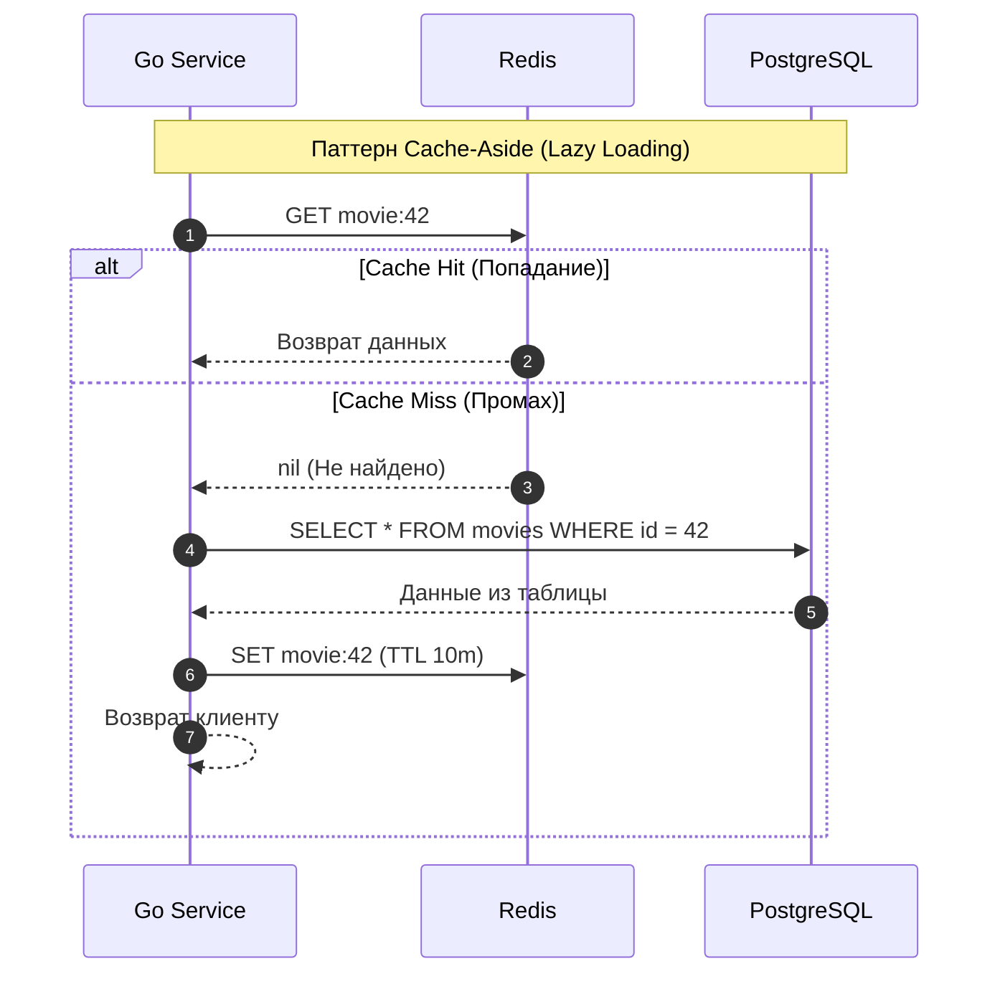

1. **Cache-Aside (Самый популярный):** Сервис сам проверяет кэш. При промахе читает БД и заполняет кэш.
2. **Write-Through:** Сервис пишет в кэш, а кэш синхронно записывает в БД.
3. **Write-Behind (Write-Back):** Сервис пишет в кэш с подтверждением за 1 мс, а фоновый воркер асинхронно пачками сбрасывает данные в PostgreSQL.

---

### 6.3. Аварии кэша: Cache Stampede (Thundering Herd), Avalanche, Penetration

#### 1. Cache Stampede / Thundering Herd (Шторм промахов)
* **Сценарий:** Кэш популярного фильма с высоким трафиком (10 000 RPS) истек по TTL.
* **Катастрофа:** Все 10 000 параллельных горутин одновременно получили промах и пошли делать тяжелый запрос в PostgreSQL. База падает от перегрузки CPU.
* **Решение:** Библиотека `singleflight` (`golang.org/x/sync/singleflight`) в Go «схлопывает» параллельные запросы к одному ключу:

```go
import "golang.org/x/sync/singleflight"

var g singleflight.Group

func GetMovie(ctx context.Context, id int64) (*Movie, error) {
    key := fmt.Sprintf("movie:%d", id)
    
    // Пробуем взять из кэша
    if m, err := getFromRedis(ctx, key); err == nil {
        return m, nil
    }

    // singleflight гарантирует: только ОДНА горутина пойдет в БД,
    // остальные 9 999 подождут ее результата и разделят его!
    // (Нюанс: функция выполняется с ctx первого вызвавшего — если он отменится, ошибку получат и все ожидающие;
    // поэтому для загрузки в кэш иногда берут отдельный контекст с таймаутом.)
    data, err, _ := g.Do(key, func() (any, error) {
        m, err := getFromPostgres(ctx, id)
        if err != nil {
            return nil, err
        }
        _ = saveToRedis(ctx, key, m, 10*time.Minute)
        return m, nil
    })

    if err != nil {
        return nil, err
    }
    return data.(*Movie), nil
}
```

#### 2. Cache Avalanche (Лавина кэша)
* **Сценарий:** 1 000 000 ключей кэша были записаны ночью одновременно с одинаковым TTL в 1 час. Через ровно 1 час все они одномоментно удаляются.
* **Решение:** **Рандомизация TTL (Jitter)**: `ttl := baseTTL + time.Duration(rand.Intn(300)) * time.Second`.

#### 3. Cache Penetration (Пробитие кэша)
* **Сценарий:** Злоумышленник целенаправленно запрашивает несуществующие ID (`id = -99999`). Кэш пуст, база тоже ничего не находит, каждый запрос бьет в диск.
* **Решение:** 1. Кэшировать пустой результат на 1 минуту (`SET key "nil" EX 60`). 2. Фильтр Блума (*Bloom Filter*) перед базой.

---

### 6.4. Распределенные блокировки (Distributed Lock: SET NX EX и Redlock)

Когда у сервиса 10 реплик в Kubernetes, обычный `sync.Mutex` работает только внутри одного пода. Для межсервисной блокировки используют Redis:

```go
package main

import (
	"context"
	"crypto/rand"
	"encoding/hex"
	"fmt"
	"time"

	"github.com/redis/go-redis/v9"
)

type Locker struct {
	rdb *redis.Client
}

// Захват блокировки:
func (l *Locker) AcquireLock(ctx context.Context, key string, ttl time.Duration) (string, bool, error) {
	// Генерируем уникальный random token владельца блокировки
	b := make([]byte, 16)
	if _, err := rand.Read(b); err != nil {
		return "", false, fmt.Errorf("ошибка генерации токена: %w", err)
	}
	token := hex.EncodeToString(b)

	// SET key token NX EX ttl (Атомарно: только если ключа не было)
	ok, err := l.rdb.SetNX(ctx, key, token, ttl).Result()
	return token, ok, err
}

// Безопасный релиз через Lua-скрипт (Атомарная проверка, что токен наш):
const releaseScript = `
if redis.call("get", KEYS[1]) == ARGV[1] then
    return redis.call("del", KEYS[1])
else
    return 0
end
`

func (l *Locker) ReleaseLock(ctx context.Context, key, token string) error {
	return l.rdb.Eval(ctx, releaseScript, []string{key}, token).Err()
}
```

> [!CAUTION]
> **Почему нельзя просто вызвать `DEL key` без Lua?**  
> Если операция выполнялась дольше TTL, блокировка истекла, и ее захватил *Сервис B*. Если *Сервис A* вызовет `DEL`, он снимет **чужую блокировку**, что приведет к состоянию гонки!

#### Redlock и границы применимости

Блокировка `SET NX EX` на **одном** экземпляре Redis теряет гарантии при его отказе (реплика может не успеть получить ключ, и лок будет выдан дважды). **Redlock** — алгоритм из документации Redis: клиент пытается захватить лок на **N ≥ 3 (обычно 5) независимых** узлах и считает лок полученным, только если захвачено большинство узлов за время, меньшее TTL. В Go его реализует библиотека `github.com/go-redsync/redsync`.

У Redlock есть известная критика (Мартин Клеппман): он зависит от предположений о часах и паузах процессов, и **не даёт гарантии взаимного исключения** при задержках (GC, сеть). Если нарушение взаимного исключения приведёт к порче данных, а не просто к лишней работе, используют **fencing token** (растущий номер, который проверяет само защищаемое хранилище), либо блокировки в самой БД (`pg_advisory_lock`), либо консенсус-системы (etcd, ZooKeeper).

---

### 6.5. Ограничения горизонтального масштабирования реляционных СУБД: фундаментальные причины и архитектурные решения

> [!IMPORTANT]
> **Классический вопрос Senior/Lead собеседования:**  
> *«Почему реляционные базы данных (PostgreSQL, MySQL) не могут масштабироваться горизонтально без ограничений, как это делают Cassandra или Kafka? В какие физические и теоретические пределы они упираются и как эти проблемы решаются на практике?»*

#### 1. Фундаментальные причины, почему реляционные БД не масштабируются горизонтально «из коробки»:

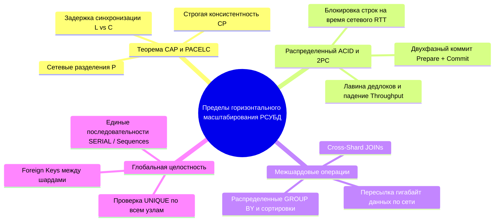

##### 1. Теорема CAP и компромисс PACELC:
- **CAP-теорема:** в любой распределенной системе при разделении сети (**P**artition Tolerance) необходимо жертвовать либо доступностью (**A**vailability), либо строгой согласованностью (**C**onsistency). Традиционные РСУБД спроектированы для одиночных серверов как строгие $CA$-системы, а в кластере становятся $CP$. Для сохранения строгой консистентности кластер обязан отклонять запись, если связь между узлами нарушена.
- **PACELC-теорема:** расширяет CAP, утверждая: если есть разделение сети ($P$), выбираем между $A$ и $C$; **иначе ($E$ - Else)**, когда сеть в порядке, выбираем между **задержкой ($L$ - Latency)** и **согласованностью ($C$ - Consistency)**. Чтобы несколько реплик гарантированно имели абсолютно идентичные данные в один момент времени, запись на Master блокируется до подтверждения от всех реплик. Каждая миллисекунда сетевого $RTT$ между датацентрами напрямую увеличивает задержку любого `INSERT/UPDATE`.

##### 2. Сверхвысокая стоимость распределенного ACID и протокол 2PC (Two-Phase Commit):
- На одном сервере ACID обеспечивается локальным журналом упреждающей записи (WAL), легковесными блокировками строк и защелками (Latches) в RAM за микросекунды ($< 0.5\text{ ms}$).
- При распределении одной транзакции на $N$ шардов требуется двухфазный коммит (**2PC**):
  1. *Фаза 1 (Prepare):* Координатор опрашивает все узлы: «Готовы зафиксировать данные?». Узлы блокируют строки, пишут в локальный лог и отвечают «Да».
  2. *Фаза 2 (Commit):* Координатор получает все ответы и шлет команду «Коммитьте!».
- **Почему это ломает горизонтальное масштабирование:**
  - Время удержания блокировок на строки удлиняется на **несколько сетевых раундов** ($10-100\text{ ms}$).
  - В сотни раз возрастает вероятность взаимоблокировок (**Deadlocks**).
  - Если координатор падает посреди фазы коммита — все шарды остаются заблокированными на неопределенный срок.
  - Пропускная способность (Throughput) при росте числа узлов $N$ не растет, а **катастрофически падает**.

##### 3. Межшардовые операции (Cross-Shard JOINs и Агрегации):
- В рамках одного сервера `JOIN` выполняется эффективно в RAM через Nested Loop, Hash Join или Merge Join с доступом к индексам.
- Если таблицы распределены по разным серверам (например, `users` на Шарде 1, а `orders` на Шарде 2), выполнение `SELECT u.name, o.total FROM users u JOIN orders o ON ...` требует пересылки гигабайтов строк по локальной сети между серверами для слияния. Сеть мгновенно становится узким местом (Network I/O Bottleneck).

##### 4. Глобальные ограничения целостности (Global Constraints & Foreign Keys):
- Проверка `UNIQUE(email)` на одном сервере занимает $O(\log N)$ времени через локальное B-Tree дерево.
- В горизонтально распределенной БД при вставке новой записи сервер вынужден выполнять синхронный опрос всех остальных $N-1$ шардов, чтобы убедиться в уникальности email, что делает запись экстремально медленной.
- Внешние ключи (`FOREIGN KEY`) требуют блокировки родительской строки на удаленном шарде при каждой вставке в дочернюю таблицу.

##### 5. Глобальные автоинкременты и генераторы последовательностей:
- `SERIAL` / `AUTO_INCREMENT` требуют централизованного счетчика. Один сервер генерации последовательностей становится единой точкой отказа (SPOF) и бутылочным горлышком при десятках тысяч вставок в секунду.

---

#### 2. Как эти ограничения решаются на практике (Архитектурные паттерны):

| Проблема | Архитектурное решение | Компромисс / Цена решения |
| :--- | :--- | :--- |
| **Высокая нагрузка на чтение** | **Read-Реплики** (Streaming Replication, CQRS) | **Replication Lag:** возможность прочитать устаревшие данные («чтение собственного изменения»). |
| **Высокая нагрузка на запись** | **Шардирование** (Citus, Vitess, Application-level) | Необходимость выбора идеального Shard Key; отказ от кросс-шардовых JOIN. |
| **Cross-Shard JOINs** | **Co-located Tables & Денормализация** | Дублирование данных; таблицы шардируются по одному ключу (напр. `user_id` и все его заказы на одном узле). |
| **Foreign Keys / Уникальность** | **Co-location по шард-ключу + перенос части проверок на уровень приложения** | Внешние ключи работают только внутри шарда; глобальную уникальность (например, email) обеспечивают отдельной таблицей-справочником `email → user_id`, шардированной по самому email, либо сервисом уникальности. Проверка «через Redis перед записью» ненадёжна без атомарности с записью в БД. |
| **2PC в распределенных транзакциях** | **Eventual Consistency: Saga Pattern & Outbox** | Отказ от строгой мгновенной консистентности в пользу гарантированной доставки в конечном счете. |
| **Глобальные ID** | **UUIDv4 / UUIDv7 / Snowflake ID** | ID занимают 16 байт вместо 4/8 байт; UUIDv7 сохраняет сортируемость по времени. |
| **Полноценный горизонтальный SQL** | **NewSQL СУБД (CockroachDB, YugabyteDB, Spanner)** | Высокие аппаратные требования; задержки записи выше, чем у одиночного PostgreSQL. |

##### Подробный разбор ключевых решений:

1. **Масштабирование чтения: Master-Replica + CQRS:**
   - Сервис разделяет пулы соединений: запись идет строго на Master, тяжелые аналитические и пользовательские выборки — на Read-реплики.
   - Для борьбы с Replication Lag: критические операции (например, показ созданного профиля сразу после регистрации) читаются с Master, либо клиент проверяет LSN (Log Sequence Number).
2. **Шардирование на уровне приложения (Application-Level Sharding):**
   - Простейший способ выбора шарда — хэш по модулю: $\text{ShardID} = \text{CRC32}(\text{user\_id}) \pmod N$. Его недостаток — при изменении $N$ почти все ключи переезжают на другие шарды; поэтому в реальных системах применяют **консистентное хэширование** либо заранее создают много логических шардов (например, 1024) и распределяют их по физическим узлам.
   - **Co-location:** связанные таблицы (`users`, `user_settings`, `orders`) физически хранятся на одном и том же шарде, что позволяет выполнять внутри шардовые `JOIN` с максимальной скоростью.
3. **Паттерн Saga вместо распределенного 2PC:**
   - Бизнес-транзакция разбивается на цепочку локальных транзакций в каждом микросервисе/шарде.
   - Взаимодействие происходит асинхронно через брокеры сообщений (Kafka). При сбое на промежуточном этапе инициируются **компенсирующие транзакции** (откат денег, снятие брони).
4. **NewSQL базы данных нового поколения:**
   - **CockroachDB / YugabyteDB:** автоматический шардинг на диапазоны (Ranges размером порядка сотен мегабайт), репликация консенсусом **Raft** на уровне каждого диапазона, поддержка стандартного протокола PostgreSQL wire protocol.
   - **Google Cloud Spanner:** глобально распределенная реляционная СУБД со строгой сериализуемостью (External Consistency) за счет использования атомных часов и GPS-приемников в датацентрах (**TrueTime API**), исключающих рассинхронизацию времени.

---

## 7. Миграции, Zero-Downtime и Библиотеки в Go

### 7.1. Сравнение инструментов: goose vs golang-migrate

| Критерий | `pressly/goose` | `golang-migrate/migrate` |
| :--- | :--- | :--- |
| **Формат файлов** | **Один файл** с секциями `-- +goose Up` и `-- +goose Down` | **2 отдельных файла**: `.up.sql` и `.down.sql` |
| **Миграции на Go** | ✅ Поддерживает чистый Go-код для сложной трансформации данных | ❌ Только SQL файлы |
| **Популярность** | 🌟 Стандарт современного русскоязычного и мирового Go-сообщества | Исторический стандарт, много звезд |
| **Встраивание (`embed`)** | Отличная поддержка `//go:embed` | Требует отдельного драйвера `iofs` |

---

### 7.2. Zero-Downtime миграции (Safe Schema Changes в Production)

В Highload-сервисах недопустимо вешать блокировку на всю таблицу при накате миграции (`ACCESS EXCLUSIVE LOCK`), так как это остановит весь бизнес.

#### 3 Золотых правила безопасных миграций:

1. **Создание индексов — ТОЛЬКО `CONCURRENTLY`:**
   ```sql
   -- ❌ ОПАСНО: Заблокирует всю таблицу на запись на несколько минут/часов!
   CREATE INDEX idx_users_email ON users(email);

   -- ✅ БЕЗОПАСНО: Строит индекс в фоновом режиме без блокировки входящих записей
   CREATE INDEX CONCURRENTLY idx_users_email ON users(email);
   ```
   ⚠️ `CREATE INDEX CONCURRENTLY` **нельзя выполнять внутри транзакции**, а инструменты миграций по умолчанию оборачивают каждую миграцию в транзакцию. Для `goose` добавьте в файл `-- +goose NO TRANSACTION`, для `golang-migrate` — размещайте такую команду в отдельном файле миграции без явных `BEGIN`/`COMMIT` (в зависимости от драйвера).
2. **Добавление столбцов с дефолтным значением:**
   - Начиная с **PostgreSQL 11**, команда `ALTER TABLE ADD COLUMN col INT DEFAULT 0;` выполняется **практически мгновенно** для константных (неизменчивых) значений по умолчанию: значение сохраняется в метаданных каталога, строки на диске не перезаписываются. (Для значений вроде `DEFAULT random()` или `DEFAULT now()` по-прежнему возможна перезапись таблицы.)
   - В старых версиях PostgreSQL это приводило к полной перезаписи таблицы.
3. **Удаление столбцов в 3 этапа (Expand and Contract):**
   - *Этап 1:* Выкатываем Go-код, который больше не читает и не пишет в старую колонку.
   - *Этап 2:* Убеждаемся по мониторингу и логам, что никакой сервис (включая старые версии, отчёты и фоновые задачи) больше не обращается к колонке.
   - *Этап 3:* Удаляем колонку через `DROP COLUMN`.

---

### 7.3. Выбор драйвера и абстракций: pgx vs sqlc vs squirrel vs GORM

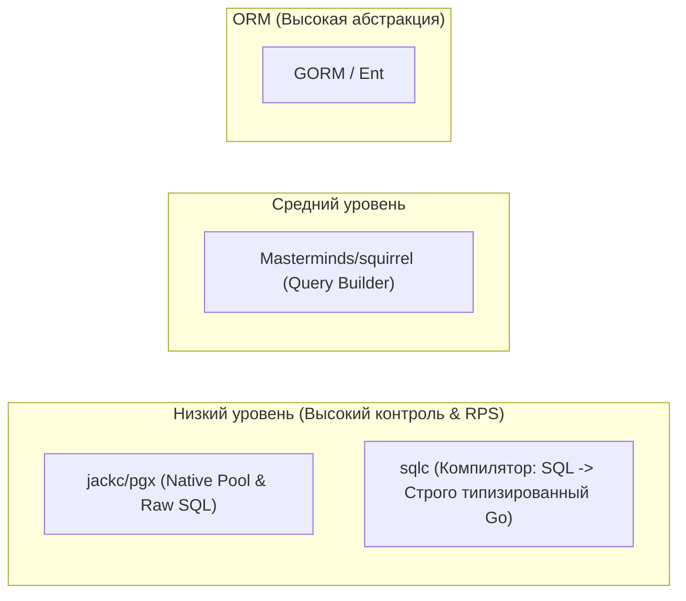

#### Рекомендация для собеседования:
* **`sqlc` + `pgx`:** **Выбор №1 в современной Enterprise-разработке на Go.** Вы пишете чистый SQL в `.sql` файлах, компилятор `sqlc` проверяет синтаксис против схемы БД и генерирует типобезопасные структуры без опечаток и без тяжелой рефлексии.
* **`squirrel`:** Незаменим, когда в API есть сложные динамические фильтры с 15 опциональными полями.
* **Почему избегают `GORM` в Highload:** Магические `interface{}`, неявные `Preload` (проблема $N+1$), скрытые аллокации в куче и сложности с анализом реального `EXPLAIN ANALYZE`.

---

## 8. Колоночные СУБД: ClickHouse в экосистеме Go и Highload-батчинг

### 8.1. Зачем Go-разработчику ClickHouse: OLTP vs OLAP

Реляционные СУБД (PostgreSQL, MySQL) спроектированы для **OLTP (Online Transaction Processing)**:
- Данные хранятся построчно (Row-oriented).
- Быстрые точечные вставки, обновления и выборки отдельных записей по индексу (`WHERE id = 42`).
- При попытке выполнить аналитический запрос по 100 миллионам строк (`SELECT AVG(duration), count() WHERE event_date = ...`) сервер вынужден вычитывать с диска все поля каждой строки в память, упираясь в I/O диска.

**ClickHouse — это колоночная СУБД для OLAP (Online Analytical Processing):**
- Значения каждой колонки хранятся в отдельных сжатых файлах на диске (`LZ4`, `ZSTD`).
- Если запрос читает только 2 колонки из 50, ClickHouse физически считывает с диска **только эти 2 файла**.
- Векторизованный движок вычислений обрабатывает данные блоками с использованием инструкций процессора SIMD (SSE, AVX). Скорость агрегации достигает сотен миллионов строк в секунду на ядро.

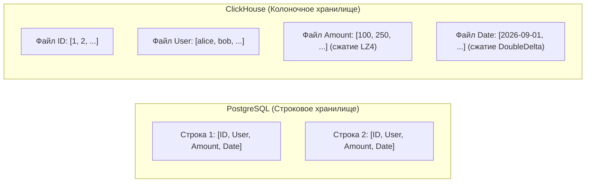

---

### 8.2. Главная ошибка новичков: Почему одиночные `INSERT` убивают ClickHouse

> [!CAUTION]
> **ClickHouse не предназначен для частых одиночных вставок (Single-row INSERTs)!**  
> Каждый `INSERT` создает на диске новую физическую директорию с партом данных (_Part_). Фоновый процесс _MergeTree_ фоново объединяет мелкие парты в крупные. Если ваше Go-приложение отправляет по 1000 одиночных INSERT в секунду, база мгновенно падает с ошибкой:  
> `Code: 252. DB::Exception: Too many parts in all data parts in table (300). Merges are processing significantly slower than inserts.`

#### Золотое правило работы с ClickHouse:
> **Вставлять данные строго пакетами (Batches) размером от 10 000 до 100 000 строк либо не чаще 1 раза в 1–2 секунды.**

---

### 8.3. Паттерн Production Batcher в Go (`clickhouse-go/v2`)

Для сбора аналитики, логов и метрик в памяти сервиса на Go организуют накопительный буфер с таймером сброса:

```go
package main

import (
    "context"
    "log/slog"
    "time"

    "github.com/ClickHouse/clickhouse-go/v2/lib/driver"
)

type AnalyticsEvent struct {
    EventID   string
    UserID    uint64
    EventType string
    Duration  float64
    CreatedAt time.Time
}

type ClickHouseBatcher struct {
    conn      driver.Conn
    buffer    []AnalyticsEvent
    eventChan chan AnalyticsEvent
    batchSize int
    flushTick time.Duration
}

func NewBatcher(conn driver.Conn, batchSize int, flushTick time.Duration) *ClickHouseBatcher {
    return &ClickHouseBatcher{
        conn:      conn,
        buffer:    make([]AnalyticsEvent, 0, batchSize),
        eventChan: make(chan AnalyticsEvent, batchSize*2),
        batchSize: batchSize,
        flushTick: flushTick,
    }
}

// Push добавляет событие в очередь. Канал буферизован (2×batchSize), поэтому обычно вызов не блокируется,
// но при переполнении (ClickHouse не успевает) Push будет ждать — в проде здесь выбирают политику: блокировать, отбрасывать или считать метрику потерь.
func (b *ClickHouseBatcher) Push(event AnalyticsEvent) {
    b.eventChan <- event
}

// Start запускает фоновый воркер накопления и сброса пачки
func (b *ClickHouseBatcher) Start(ctx context.Context) {
    ticker := time.NewTicker(b.flushTick)
    defer ticker.Stop()

    for {
        select {
        case <-ctx.Done():
            // Сброс остатка при Graceful Shutdown (упрощённо: события, оставшиеся в eventChan,
            // в этом примере не вычитываются — в реальном коде их нужно вычитать перед выходом)
            b.flush()
            return

        case event := <-b.eventChan:
            b.buffer = append(b.buffer, event)
            if len(b.buffer) >= b.batchSize {
                b.flush()
                ticker.Reset(b.flushTick)
            }

        case <-ticker.C:
            if len(b.buffer) > 0 {
                b.flush()
            }
        }
    }
}

func (b *ClickHouseBatcher) flush() {
    if len(b.buffer) == 0 {
        return
    }

    ctx, cancel := context.WithTimeout(context.Background(), 10*time.Second)
    defer cancel()

    batch, err := b.conn.PrepareBatch(ctx, "INSERT INTO events (event_id, user_id, event_type, duration, created_at)")
    if err != nil {
        slog.Error("failed to prepare batch", "err", err)
        return
    }

    for _, e := range b.buffer {
        if err := batch.Append(e.EventID, e.UserID, e.EventType, e.Duration, e.CreatedAt); err != nil {
            slog.Error("failed to append to batch", "err", err)
        }
    }

    if err := batch.Send(); err != nil {
        slog.Error("failed to send batch to ClickHouse", "err", err)
        return
    }

    // Очищаем буфер, сохраняя выделенную емкость (Capacity) для предотвращения аллокаций:
    b.buffer = b.buffer[:0]
}
```

---

## 9. Топ-30 вопросов с собеседований по Базам Данных (Junior, Middle, Senior)

### 9.1. Вопросы уровня Junior

#### 1. В чем разница между `db.Query()` и `db.Exec()`?
> **Ответ:** `Query()` используется для запросов, возвращающих строки (`SELECT`), и возвращает объект `Rows`, который необходимо закрыть через `rows.Close()`. `Exec()` используется для команд, не возвращающих выборку данных (`INSERT`, `UPDATE`, `DELETE`), и возвращает `Result` со счетчиком затронутых строк (`RowsAffected`).

#### 2. Зачем нужен пул соединений? Почему нельзя открывать коннект на каждый запрос?
> **Ответ:** Установка TCP-соединения, SSL-рукопожатие и авторизация в БД занимают десятки миллисекунд и тратят процессорное время. Пул держит готовые соединения открытыми и переиспользует их между горутинами, обеспечивая минимальную задержку (Latency).

#### 3. Что произойдет, если забыть закрыть `rows.Close()`?
> **Ответ:** Соединение не вернется обратно в пул и останется заблокированным. При высоком трафике пул очень быстро исчерпает свободные соединения (`MaxConns`), и все последующие запросы приложения зависнут в ожидании таймаута.

#### 4. Что такое первичный ключ (Primary Key)?
> **Ответ:** Ограничение таблицы, уникально идентифицирующее каждую строку. Сочетает в себе `UNIQUE` и `NOT NULL`. По первичному ключу автоматически строится B-Tree индекс.

#### 5. Что такое внешний ключ (Foreign Key) и ON DELETE CASCADE?
> **Ответ:** Поле, ссылающееся на первичный ключ другой таблицы для поддержания ссылочной целостности. `ON DELETE CASCADE` означает, что при удалении родительской записи СУБД автоматически удалит все связанные дочерние записи.

#### 6. Как защититься от SQL-инъекций в Go?
> **Ответ:** Никогда не конкатенировать строки через `fmt.Sprintf("SELECT ... " + id)`. Всегда использовать параметризованные плейсхолдеры (`$1`, `$2` в PostgreSQL или `?` в MySQL): `pool.Query(ctx, "SELECT ... WHERE id = $1", id)`.

#### 7. Что такое транзакция простыми словами?
> **Ответ:** Группа SQL-команд, выполняющихся как единое неделимое целое. Если хотя бы одна команда падает, все изменения отменяются (`ROLLBACK`), гарантируя сохранность данных.

#### 8. В чем разница между `WHERE` и `HAVING`?
> **Ответ:** `WHERE` фильтрует строки **до** их группировки (`GROUP BY`). `HAVING` фильтрует результаты агрегации **после** группировки (например, `HAVING COUNT(*) > 5`).

#### 9. Что делает команда `COUNT(*)` vs `COUNT(column)`?
> **Ответ:** `COUNT(*)` считает общее количество строк в выборке (включая NULL). `COUNT(column)` считает количество строк, где значение указанной колонки **не равно NULL**.

#### 10. Зачем нужен `context.Context` в методах `pool.Query(ctx, ...)`?
> **Ответ:** Позволяет прервать выполнение тяжелого запроса на сервере БД, если клиент разорвал HTTP-соединение или истек таймаут (`context.WithTimeout`), предотвращая бессмысленную нагрузку на СУБД.

---

### 9.2. Вопросы уровня Middle

#### 11. Как устроен B-Tree индекс? Почему сложность поиска $O(\log N)$?
> **Ответ:** Это сбалансированное многолучевое дерево поиска с высоким коэффициентом ветвления. Каждая страница отсортирована. Переход от корня к листу отсекает подавляющее большинство вариантов на каждом шаге. Глубина дерева редко превышает 3–4 уровня даже на сотнях миллионов строк.

#### 12. Что такое правило левого префикса в составных индексах?
> **Ответ:** Данные в составном индексе `(A, B)` отсортированы по `A`, а внутри одинаковых `A` — по `B`. Поиск по `WHERE A = 1` или `WHERE A = 1 AND B = 2` использует индекс. Поиск только по `WHERE B = 2` индекс, как правило, эффективно использовать не может, так как без `A` порядок нарушен.

#### 13. Чем `Index Scan` отличается от `Index Only Scan`?
> **Ответ:** При `Index Scan` база находит адрес строки в индексе, а затем идет на страницу таблицы в памяти/диске (Heap), чтобы прочитать остальные поля. При `Index Only Scan` все запрашиваемые столбцы уже присутствуют в самом индексе, и обращение к Heap не требуется (самый быстрый сценарий).

#### 14. Как работает MVCC в PostgreSQL? Зачем нужен `VACUUM`?
> **Ответ:** При `UPDATE` старая версия строки помечается мертвой (`xmax = tx_id`), а новая записывается рядом (`xmin = tx_id`). Читатели видят снимок данных на момент старта транзакции. `VACUUM` очищает страницы от мертвых строк, освобождая место для новых записей, чтобы таблица не раздувалась (Bloat).

#### 15. Чем пессимистическая блокировка отличается от оптимистической?
> **Ответ:** Пессимистическая (`SELECT ... FOR UPDATE`) физически блокирует строки в БД, заставляя параллельные транзакции ждать. Оптимистическая не блокирует строки, а при обновлении проверяет инкремент поля `version` (`WHERE version = 3`). Если версия изменилась — транзакция откатывается и повторяется в приложении.

#### 16. Что такое аномалия фантомного чтения (Phantom Read)?
> **Ответ:** Ситуация, когда транзакция дважды выполняет запрос с фильтром по диапазону (`WHERE age > 18`), и во второй выборке появляются новые строки, которые только что вставила и закоммитила параллельная транзакция.

#### 17. Что такое `EXPLAIN (ANALYZE, BUFFERS)`? На что обращать внимание в плане?
> **Ответ:** Команда реального выполнения запроса с замером времени и страниц. Обращают внимание на: 1. Наличие `Seq Scan` на больших таблицах. 2. `Buffers read` (чтение с диска вместо кэша `hit`). 3. Сильное расхождение между расчетными (`rows=10`) и фактическими строками (`actual rows=100000`) — признак устаревшей статистики.

#### 18. Как устроен паттерн Singleflight и какую проблему кэша он решает?
> **Ответ:** Он решает проблему Cache Stampede (Thundering Herd). Когда ключ кэша истекает, тысячи одновременных запросов блокируются структурой `singleflight.Group`. Ровно одна горутина идет в БД, а остальные ждут ее завершения и получают копию ответа, защищая БД от падения.

#### 19. Как устроен Redis под капотом? Почему он однопоточный, но быстрый?
> **Ответ:** Исполнение команд выполняется в одном потоке (сетевой ввод-вывод в новых версиях Redis может обслуживаться дополнительными потоками) поверх неблокирующего мультиплексирования ввода-вывода (`epoll`/`kqueue`). Быстрота достигается за счет: 1. Все данные лежат в RAM. 2. Нет накладных расходов на переключение контекста потоков и захват мьютексов. 3. Оптимизированные структуры данных (SkipList, SDS, ListPack).

#### 20. Как безопасно реализовать распределенный лок в Redis?
> **Ответ:** Командой `SET resource_key token NX EX 10`. Снятие лока выполняется строго через Lua-скрипт, который атомарно проверяет `GET resource_key == token`, чтобы не снять блокировку, перехваченную другим сервисом после истечения TTL.

---

### 9.3. Вопросы уровня Senior и TechLead

#### 21. Как работает паттерн Transactional Outbox? Какую фундаментальную проблему он решает?
> **Ответ:** Решает проблему "Dual Write" (невозможность атомарно записать данные в PostgreSQL и опубликовать событие в Kafka без распределенных транзакций). Сервис в одной локальной транзакции сохраняет бизнес-сущность и событие в таблицу `outbox`. Отдельный процесс (Relay / Debezium CDC) вычитывает `outbox` и гарантированно отправляет события в брокер с семантикой At-Least-Once.

#### 22. Как выполнить Zero-Downtime миграцию по переименованию или удалению колонки?
> **Ответ:** Паттерном Expand-Contract (Параллельное сосуществование). 1. Добавить новую колонку. 2. Обновить приложение так, чтобы оно писало в обе колонки, но читало из старой. 3. Скриптом перелить исторические данные. 4. Переключить чтение на новую колонку. 5. Отключить запись в старую. 6. Удалить старую колонку.

#### 23. Почему `COUNT(*)` в PostgreSQL работает медленно на больших таблицах?
> **Ответ:** Из-за MVCC. PostgreSQL не хранит счетчик строк в заголовке таблицы, потому что в каждый момент времени разным транзакциям видно разное количество строк (часть удалена, часть еще не закоммичена). База вынуждена сканировать всю таблицу или индекс для проверки видимости каждой строки. Решение: триггерные счетчики, приблизительный подсчет через `reltuples` в `pg_class` или Redis.

#### 24. Что такое Write Skew в уровне изоляции Repeatable Read?
> **Ответ:** Аномалия конкурентности, при которой две транзакции одновременно читают пересекающиеся данные, но обновляют разные строки, нарушая общее бизнес-ограничение (например, дежурство врачей: хотя бы один врач должен оставаться на смене; оба одновременно смотрят, что на смене 2 врача, и оба уходят). Защищает уровень `Serializable` или явная блокировка через `FOR UPDATE`.

#### 25. Что такое SSI (Serializable Snapshot Isolation)?
> **Ответ:** Алгоритм реализации уровня `Serializable` в PostgreSQL без полной блокировки таблиц. База отслеживает зависимости чтения и записи (*rw-antidependencies*) между транзакциями (SIREAD locks). При обнаружении опасного цикла зависимостей транзакция-нарушитель принудительно прерывается с ошибкой `40001 (serialization_failure)`.

#### 26. Чем GIN отличается от GiST? Что использовать для JSONB и полнотекстового поиска?
> **Ответ:** GIN — это инвертированный индекс: он разбивает значение на элементы (ключи и значения JSONB, элементы массива, лексемы `tsvector`) и хранит для каждого список строк; идеален для поиска включений (`@>`), тегов и полнотекстового поиска, быстро читает, но медленнее обновляется. Для **JSONB** в ядре PostgreSQL штатно используется именно GIN (`jsonb_ops` или компактный `jsonb_path_ops`) — GiST-класса операторов для `jsonb` в ядре нет. GiST — это сбалансированное дерево для «пространственных» и «диапазонных» данных (геометрия PostGIS, `daterange`, поиск ближайших соседей); для `tsvector` он тоже возможен: обновляется быстрее GIN и занимает меньше места, но поиск медленнее и даёт ложноположительные срабатывания, требующие перепроверки строк в таблице.

#### 27. Что такое TOAST в PostgreSQL?
> **Ответ:** Механизм *The Oversized-Attribute Storage Technique*. Размер страницы в PostgreSQL фиксирован (8 КБ), и строка не может пересекать границы страницы. Если размер поля (например, длинный текст или `JSONB`) превышает ~2 КБ, PostgreSQL автоматически сжимает его и выносит в специальную скрытую таблицу TOAST, оставляя в основной строке лишь 18-байтный указатель.

#### 28. В каких случаях `CREATE INDEX CONCURRENTLY` может завершиться статусом `INVALID`? Что делать?
> **Ответ:** Если во время второй фазы построения индекса произошел сбой (дедлок, нарушение уникальности `UNIQUE`, отмена транзакции по таймауту). Индекс помечается как `INVALID` — он занимает место на диске и обновляется при вставках, но не используется планировщиком. Решение: удалить невалидный индекс `DROP INDEX CONCURRENTLY` и запустить команду заново.

#### 29. Как архитектурно организовать масштабирование базы данных на чтение и запись?
> **Ответ:**
> 1. **Чтение:** Настройка Read-реплик через асинхронную/полусинхронную потоковую репликацию (Streaming Replication). В коде на Go инициализируют 2 пула: `masterPool` для записи и `replicaPool` для чтения.
> 2. **Запись:** Вертикальное масштабирование (RAM/NVMe), шардирование данных (Application-level Sharding или Citus) по ключу шардирования (`tenant_id`, `user_id`), вынос тяжелых аналитических задач в колоночные СУБД (ClickHouse).

#### 30. Каковы компромиссы между согласованностью и задержкой при репликации в PostgreSQL?
> **Ответ:**
> - **Асинхронная репликация (`synchronous_commit = off/local`):** Максимальный RPS и минимальный Latency записи. Компромисс: риск потери последних транзакций (RPO > 0) при физической аварии мастера (Failover).
> - **Синхронная репликация (`synchronous_commit = on/remote_apply`):** Гарантия нулевой потери данных (RPO = 0). Компромисс: задержка каждого коммита увеличивается на время сетевого RTT до реплики, а при недоступности реплики мастер полностью останавливает прием любых записей.
