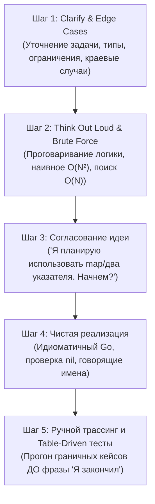

# 💻 Задачник по Live-Coding на Go (Топ-43 задачи с реальных собеседований: Junior, Middle, Senior)

Практическое руководство для подготовки к секции живого программирования (Live-Coding / Coding Interview) на позиции Junior, Middle и Senior Go Developer.

> [!NOTE]
> **Как пользоваться задачником.** Сначала попробуйте решить задачу самостоятельно (условие + «Ловушки»), и только потом сверяйтесь с эталонным решением. Каждое решение — самостоятельный фрагмент `package livecoding`; при желании запускать их вместе в одном пакете учтите, что некоторые имена (`Merge`, `TreeNode`, `Tree`, `ListNode`) встречаются в нескольких задачах — кладите такие задачи в разные пакеты/каталоги.
> 
> 💡 **Рекомендация по уровню подготовки:**
> - Если вы **начинающий Go-разработчик** или **переходите на Go с другого языка** (Python, Java, PHP, C#), начните с **[Раздела 6 (Junior / Middle Практикум)](#6-базовые-алгоритмы-и-фундамент-языка-junior--middle-практикум)** и **[Раздела 3 (Слайсы, Мапы и Строки)](#3-слайсы-мапы-строки-и-алгоритмы)** — они закрепляют фундаментальные идиомы языка, работу с памятью и простые горутины.
> - Если вы готовитесь на уровень **Middle / Senior**, особое внимание уделите **[Разделу 1 (Паттерны Многопоточности)](#1-паттерны-многопоточности-и-каналы-concurrency-patterns)** и **[Разделу 5 (Продвинутые Алгоритмы LeetCode)](#5-продвинутые-алгоритмы-leetcode-advanced-algorithmic-problems)**.

> [!TIP]
> 📚 **Связанные материалы базы знаний и практический код:**
>
> - 📖 **[README.md (Главное оглавление базы знаний по Go)](README.md)** — теория языка, память, рантайм GMP, GC и архитектура; краткая справка — [go-core-cheatsheet.md](go-core-cheatsheet.md).
> - 📖 **Теория тем:** [Том 3: Конкурентность и каналы](03-go-core-concurrency.md) | [Том 6: Алгоритмы и структуры данных](06-go-core-algorithms-interview.md).
> - 🗄️ **[go-database-interview-guide.md (Гайд по Базам Данных)](go-database-interview-guide.md)** — PostgreSQL, `pgxpool`, транзакции, индексы и Redis.
> - 🗄️ **[sql-livecoding-guide.md (Live SQL Задачник)](sql-livecoding-guide.md)** — 28 практических задач на SQL-запросы, JOINs, EXPLAIN ANALYZE и оконные функции.
> - 🏛️ **[go-system-design-guide.md (System Design для Go)](go-system-design-guide.md)** — 4-шаговый фреймворк, расчеты и 4 кейса архитектуры.
> - 🎯 **[homework-tasks.md (Практический задачник Goflex)](homework-tasks.md)** — постановка и разбор всех 32 домашних заданий.
> - 🗺️ **[course-codebase-guide.md (Путеводитель по кодовой базе)](course-codebase-guide.md)** — сквозная карта курса, лекционные примеры (00–21), проекты GoSearch и Lynks, ДЗ (homework-02–20).
> - 💻 **Код лекций:** [03-algorithms](file:///Users/user/workspace/golang_projects/go-core-4/go_course_4/03-algorithms), [04-datastructs](file:///Users/user/workspace/golang_projects/go-core-4/go_course_4/04-datastructs), [10-concurrency](file:///Users/user/workspace/golang_projects/go-core-4/go_course_4/10-concurrency), [21-interview](file:///Users/user/workspace/golang_projects/go-core-4/go_course_4/21-interview).
> - 📁 **Решения ДЗ:** [homework-03](file:///Users/user/workspace/golang_projects/go-core-4/go_course_4/homework-03) (бинарный поиск), [homework-04](file:///Users/user/workspace/golang_projects/go-core-4/go_course_4/homework-04) (список и BST дерево), [homework-10](file:///Users/user/workspace/golang_projects/go-core-4/go_course_4/homework-10) (пинг-понг на горутинах и каналах).

---

## 📑 Оглавление

1. [Паттерны Многопоточности и Каналы (Concurrency Patterns)](#1-паттерны-многопоточности-и-каналы-concurrency-patterns)
   - [Задача 1: Fan-In / Merge Channels (Объединение N каналов)](#задача-1-fan-in--merge-channels-объединение-n-каналов)
   - [Задача 2: Worker Pool с отменой через context.Context](#задача-2-worker-pool-с-отменой-через-contextcontext)
   - [Задача 3: Rate Limiter (Алгоритм Token Bucket на тикерах)](#задача-3-rate-limiter-алгоритм-token-bucket-на-тикерах)
   - [Задача 4: Семафор на буферизованном канале](#задача-4-семафор-на-буферизованном-канале)
   - [Задача 5: Конвейер (Pipeline Pattern) с остановкой](#задача-5-конвейер-pipeline-pattern-с-остановкой)
   - [Задача 6: Graceful Batcher (Сброс по размеру или таймауту)](#задача-6-graceful-batcher-сброс-по-размеру-или-таймауту)
   - [Задача 7: Таймаут для медленной функции без утечки горутин](#задача-7-таймаут-для-медленной-функции-без-утечки-горутин)
   - [Задача 8: Кастомный Once (Double-Checked Locking на atomic)](#задача-8-кастомный-once-double-checked-locking-на-atomic)
2. [Структуры Данных на Go (Data Structures)](#2-структуры-данных-на-go-data-structures)
   - [Задача 9: Потокобезопасный LRU Cache](#задача-9-потокобезопасный-lru-cache)
   - [Задача 10: Разворот односвязного списка (Reverse Linked List)](#задача-10-разворот-односвязного-списка-reverse-linked-list)
   - [Задача 11: Стек и Очередь на слайсах с защитой от утечек памяти](#задача-11-стек-и-очередь-на-слайсах-с-защитой-от-утечек-памяти)
   - [Задача 12: Валидация скобочных последовательностей (Valid Parentheses)](#задача-12-валидация-скобочных-последовательностей-valid-parentheses)
   - [Задача 13: Шардированная конкурентная Map (Stripe Locking)](#задача-13-шардированная-конкурентная-map-stripe-locking)
3. [Слайсы, Мапы, Строки и Алгоритмы](#3-слайсы-мапы-строки-и-алгоритмы)
   - [Задача 14: Two Sum за O(N)](#задача-14-two-sum-за-on)
   - [Задача 15: Палиндром и Анаграмма с поддержкой UTF-8 рун](#задача-15-палиндром-и-анаграмма-с-поддержкой-utf-8-рун)
   - [Задача 16: Пересечение двух слайсов (Intersection of Slices)](#задача-16-пересечение-двух-слайсов-intersection-of-slices)
   - [Задача 17: Сжатие строки RLE (Run-Length Encoding)](#задача-17-сжатие-строки-rle-run-length-encoding)
   - [Задача 18: Группировка анаграмм (Group Anagrams)](#задача-18-группировка-анаграмм-group-anagrams)
   - [Задача 19: Слияние двух отсортированных слайсов за O(N + M)](#задача-19-слияние-двух-отсортированных-слайсов-за-on--m)
   - [Задача 20: Первый уникальный символ в строке](#задача-20-первый-уникальный-символ-в-строке)
   - [Задача 21: Методы реверса с двумя указателями (Two-Pointer Reverse)](#задача-21-методы-реверса-с-двумя-указателями-two-pointer-reverse)
4. [Классические задачи с Собеседований и Tour of Go](#4-классические-задачи-с-собеседований-и-tour-of-go)
   - [Задача 22: Числа Фибоначчи — с замыканием и без (Fibonacci Closure & Bottom-Up)](#задача-22-числа-фибоначчи--с-замыканием-и-без-fibonacci-closure--bottom-up)
   - [Задача 23: Эквивалентные бинарные деревья (Equivalent Binary Trees)](#задача-23-эквивалентные-бинарные-деревья-equivalent-binary-trees)
   - [Задача 24: Потоковый шифратор rot13Reader (Декоратор io.Reader)](#задача-24-потоковый-шифратор-rot13reader-декоратор-ioreader)
   - [Задача 25: Конкурентный Web Crawler (Краулер с защитой от циклов)](#задача-25-конкурентный-web-crawler-краулер-с-защитой-от-циклов)
   - [Задача 26: Скользящее окно (Sliding Window Rate Limiter) с мокированием времени](#задача-26-скользящее-окно-sliding-window-rate-limiter-с-мокированием-времени)
   - [Задача 27: Конкурентная Сортировка Слиянием (Concurrent Merge Sort)](#задача-27-конкурентная-сортировка-слиянием-concurrent-merge-sort)
5. [Продвинутые Алгоритмы LeetCode (Advanced Algorithmic Problems)](#5-продвинутые-алгоритмы-leetcode-advanced-algorithmic-problems)
   - [Задача 28: Подмассив с максимальной суммой — Алгоритм Кадане (LeetCode #53)](#задача-28-подмассив-с-максимальной-суммой--алгоритм-кадане-leetcode-53)
   - [Задача 29: Размен монет минимальным числом — Coin Change (LeetCode #322)](#задача-29-размен-монет-минимальным-числом--coin-change-leetcode-322)
   - [Задача 30: Поуровневый обход бинарного дерева — BFS Level Order (LeetCode #102)](#задача-30-поуровневый-обход-бинарного-дерева--bfs-level-order-leetcode-102)
   - [Задача 31: Топ-K частых элементов через Min-Heap (LeetCode #347)](#задача-31-топ-k-частых-элементов-через-min-heap-leetcode-347)
   - [Задача 32: Сбор дождевой воды — Два указателя (LeetCode #42)](#задача-32-сбор-дождевой-воды--два-указателя-leetcode-42)
   - [Задача 33: Проверка валидности бинарного дерева поиска — Validate BST (LeetCode #98)](#задача-33-проверка-валидности-бинарного-дерева-поиска--validate-bst-leetcode-98)
   - [Задача 34: Слияние пересекающихся интервалов — Merge Intervals (LeetCode #56)](#задача-34-слияние-пересекающихся-интервалов--merge-intervals-leetcode-56)
   - [Задача 35: Количество островов на двумерной сетке — DFS Sink (LeetCode #200)](#задача-35-количество-островов-на-двумерной-сетке--dfs-sink-leetcode-200)
6. [Базовые алгоритмы и фундамент языка (Junior / Middle Практикум)](#6-базовые-алгоритмы-и-фундамент-языка-junior--middle-практикум)
   - [Задача 36: Бинарный поиск — O(log N), границы дубликатов и slices.BinarySearch (LeetCode #704)](#задача-36-бинарный-поиск--olog-n-границы-дубликатов-и-slicesbinarysearch-leetcode-704)
   - [Задача 37: Удаление дубликатов из отсортированного слайса на месте (LeetCode #26)](#задача-37-удаление-дубликатов-из-отсортированного-слайса-на-месте-leetcode-26)
   - [Задача 38: Параллельное суммирование слайса (Parallel Sum via Goroutines & Atomic)](#задача-38-параллельное-суммирование-слайса-parallel-sum-via-goroutines--atomic)
   - [Задача 39: Синхронизация горутин: Ping-Pong через небуферизованный канал (Concurrency Ping-Pong)](#задача-39-синхронизация-горутин-ping-pong-через-небуферизованный-канал-concurrency-ping-pong)
   - [Задача 40: Определение цикла в связном списке — Алгоритм Флойда «Черепаха и заяц» (LeetCode #141)](#задача-40-определение-цикла-в-связном-списке--алгоритм-флойда-черепаха-и-заяц-leetcode-141)
   - [Задача 41: Самый длинный общий префикс (Longest Common Prefix, LeetCode #14)](#задача-41-самый-длинный-общий-префикс-longest-common-prefix-leetcode-14)
   - [Задача 42: Потокобезопасный In-Memory TTL-кэш с фоновой очисткой (TTL Cache with Background Cleaner)](#задача-42-потокобезопасный-in-memory-ttl-кэш-с-фоновой-очисткой-ttl-cache-with-background-cleaner)
   - [Задача 43: Поиск пропущенного числа — Трюк с XOR и сумма Гаусса (LeetCode #268)](#задача-43-поиск-пропущенного-числа--трюк-с-xor-и-сумма-гаусса-leetcode-268)
7. [Стратегия Live-Coding и Топ-10 каверзных вопросов с подвохом](#7-стратегия-live-coding-и-топ-10-каверзных-вопросов-с-подвохом)
   - [7.1. Пошаговый 5-шаговый фреймворк поведения на лайвкодинге](#71-пошаговый-5-шаговый-фреймворк-поведения-на-лайвкодинге)
   - [7.2. Шаблон табличных тестов (Table-Driven Tests) прямо на интервью](#72-шаблон-табличных-тестов-table-driven-tests-прямо-на-интервью)
   - [7.3. Топ-10 каверзных вопросов с подвохом по Go с объяснениями](#73-топ-10-каверзных-вопросов-с-подвохом-по-go-с-объяснениями)

---

## 1. Паттерны Многопоточности и Каналы (Concurrency Patterns)

### Задача 1: Fan-In / Merge Channels (Объединение N каналов)

#### 🎯 Условие:

Напишите функцию `Merge[T any](channels ...<-chan T) <-chan T`, которая принимает произвольное количество входных каналов на чтение, мультиплексирует все приходящие из них данные в один выходной канал и **гарантированно закрывает** выходной канал тогда и только тогда, когда закроются **все** входные каналы.

#### 💡 Ловушки и частые ошибки:

1. **Преждевременное закрытие выходного канала:** Закрытие `out` до того, как завершились все горутины чтения.
2. **Паника `send on closed channel`:** Если закрыть выходной канал, пока хотя бы один воркер ещё пишет в него.
3. **Deadlock:** Запуск `wg.Wait()` в текущей горутине блокирует возврат `<-chan T`. Ожидание и закрытие `close(out)` **обязательно** должны выполняться в отдельной фоновой горутине!
4. **Неправильный счетчик `wg.Add(1)`:** Вызов `wg.Add(1)` внутри горутины вместо внешней функции приводит к состоянию гонки (race condition).

#### 💻 Эталонное решение:

```go
package livecoding

import "sync"

// Merge объединяет произвольное число входных каналов в один выходной.
func Merge[T any](channels ...<-chan T) <-chan T {
	out := make(chan T)
	var wg sync.WaitGroup

	// Функция-читатель для каждого отдельного канала
	multiplex := func(c <-chan T) {
		defer wg.Done()
		for val := range c {
			out <- val
		}
	}

	wg.Add(len(channels))
	for _, ch := range channels {
		go multiplex(ch)
	}

	// Отдельная координирующая горутина для безопасного закрытия:
	go func() {
		wg.Wait()
		close(out) // Закрываем строго ПОСЛЕ того, как все горутины вычитали свои каналы
	}()

	return out
}
```

- **Сложность:** Time $O(\sum K_i)$ (по числу сообщений), Space $O(1)$ дополнительной памяти (не считая горутин $O(N)$).

---

### Задача 2: Worker Pool с отменой через context.Context

#### 🎯 Условие:

Реализуйте пул воркеров фиксированного размера `numWorkers`, который считывает задачи из канала `jobs`, обрабатывает их и отправляет результаты в канал `results`. При отмене `ctx.Done()` все воркеры должны немедленно прекратить взятие новых задач, а ресурсы должны быть корректно освобождены без утечек горутин.

#### 💡 Ловушки:

- Зависание на записи в `results`, если потребитель перестал читать при отмене контекста.
- Попытка отправить результат в закрытый канал.
- Пропуск проверки `ctx.Done()` перед чтением/обработкой.

#### 💻 Эталонное решение:

```go
package livecoding

import (
	"context"
	"sync"
)

type Job struct {
	ID   int
	Data string
}

type Result struct {
	JobID  int
	Output string
	Err    error
}

func WorkerPool(ctx context.Context, numWorkers int, jobs <-chan Job) <-chan Result {
	results := make(chan Result)
	var wg sync.WaitGroup

	worker := func() {
		defer wg.Done()
		for {
			select {
			case <-ctx.Done():
				return // Завершаем воркер при отмене контекста
			case job, ok := <-jobs:
				if !ok {
					return // Входящий канал закрыт, работы больше нет
				}

				// Имитация полезной работы
				res := Result{JobID: job.ID, Output: "processed " + job.Data}

				// Безопасная отправка результата с учетом возможной отмены контекста:
				select {
				case <-ctx.Done():
					return
				case results <- res:
				}
			}
		}
	}

	wg.Add(numWorkers)
	for i := 0; i < numWorkers; i++ {
		go worker()
	}

	go func() {
		wg.Wait()
		close(results) // Закрываем results строго после завершения всех воркеров
	}()

	return results
}
```

---

### Задача 3: Rate Limiter (Алгоритм Token Bucket на тикерах)

#### 🎯 Условие:

Напишите структуру `RateLimiter`, позволяющую ограничить частоту выполнения операций до $R$ запросов в секунду с поддержкой всплесков (burst) до $B$ токенов, используя стандартные средства Go.

#### 💻 Эталонное решение:

```go
package livecoding

import (
	"context"
	"time"
)

type RateLimiter struct {
	tokens chan struct{}
	ticker *time.Ticker
	stop   chan struct{}
}

// rps должен быть > 0 (иначе деление на ноль при расчёте интервала), burst > 0.
func NewRateLimiter(rps int, burst int) *RateLimiter {
	rl := &RateLimiter{
		tokens: make(chan struct{}, burst),
		ticker: time.NewTicker(time.Second / time.Duration(rps)),
		stop:   make(chan struct{}),
	}

	// Изначально ведро заполнено до лимита burst
	for i := 0; i < burst; i++ {
		rl.tokens <- struct{}{}
	}

	// Фоновый процесс пополнения токенов
	go func() {
		for {
			select {
			case <-rl.stop:
				rl.ticker.Stop()
				return
			case <-rl.ticker.C:
				select {
				case rl.tokens <- struct{}{}:
				default:
					// Ведро полно, токен сгорает
				}
			}
		}
	}()

	return rl
}

// Wait ожидает разрешения на выполнение или прерывается по контексту
func (rl *RateLimiter) Wait(ctx context.Context) error {
	select {
	case <-ctx.Done():
		return ctx.Err()
	case <-rl.tokens:
		return nil
	}
}

func (rl *RateLimiter) Stop() {
	close(rl.stop)
}
```

---

### Задача 4: Семафор на буферизованном канале

#### 🎯 Условие:

Реализуйте потокобезопасный `Semaphore` для ограничения параллелизма (например, не более 5 одновременных сетевых соединений), поддерживающий контекст.

#### 💻 Эталонное решение:

```go
package livecoding

import "context"

type Semaphore struct {
	sem chan struct{}
}

func NewSemaphore(maxLimit int) *Semaphore {
	return &Semaphore{
		sem: make(chan struct{}, maxLimit),
	}
}

func (s *Semaphore) Acquire(ctx context.Context) error {
	select {
	case <-ctx.Done():
		return ctx.Err()
	case s.sem <- struct{}{}: // Занимаем слот в буфере
		return nil
	}
}

func (s *Semaphore) Release() {
	<-s.sem // Освобождаем слот
}
```

---

### Задача 5: Конвейер (Pipeline Pattern) с остановкой

#### 🎯 Условие:

Создайте конвейер из 3 стадий: `Generator(numbers)` $\to$ `Square(numbers)` $\to$ `FilterOdd(numbers)`. Пайплайн должен немедленно прекращать работу всех этапов при отмене контекста.

#### 💻 Эталонное решение:

```go
package livecoding

import "context"

// 1. Генератор чисел
func Gen(ctx context.Context, nums ...int) <-chan int {
	out := make(chan int)
	go func() {
		defer close(out)
		for _, n := range nums {
			select {
			case <-ctx.Done():
				return
			case out <- n:
			}
		}
	}()
	return out
}

// 2. Возведение в квадрат
func Square(ctx context.Context, in <-chan int) <-chan int {
	out := make(chan int)
	go func() {
		defer close(out)
		for n := range in {
			select {
			case <-ctx.Done():
				return
			case out <- n * n:
			}
		}
	}()
	return out
}

// 3. Фильтр: пропускает только нечётные числа
func FilterOdd(ctx context.Context, in <-chan int) <-chan int {
	out := make(chan int)
	go func() {
		defer close(out)
		for n := range in {
			if n%2 == 0 {
				continue // чётные отбрасываем
			}
			select {
			case <-ctx.Done():
				return
			case out <- n:
			}
		}
	}()
	return out
}

// Сборка конвейера (пример использования):
//
//	ctx, cancel := context.WithCancel(context.Background())
//	defer cancel() // при выходе останавливает все стадии — утечек горутин нет
//	for v := range FilterOdd(ctx, Square(ctx, Gen(ctx, 1, 2, 3, 4, 5))) {
//		fmt.Println(v) // 1, 9, 25
//	}
```

---

### Задача 6: Graceful Batcher (Сброс по размеру или таймауту)

#### 🎯 Условие:

Реализуйте компонент пакетной обработки: элементы накапливаются в буфер и сбрасываются во внешний обработчик `flush(batch []T)` при выполнении **любого** из условий:

1. Буфер достиг максимального размера `maxSize` (например, 100 элементов).
2. С момента последнего сброса прошло время `timeout` (например, 3 секунды).
3. Входящий канал закрылся (финальный сброс остатка).

#### 💻 Эталонное решение:

```go
package livecoding

import "time"

func Batcher[T any](in <-chan T, maxSize int, timeout time.Duration, flush func([]T)) {
	batch := make([]T, 0, maxSize)
	ticker := time.NewTicker(timeout)
	defer ticker.Stop()

	flushBatch := func() {
		if len(batch) > 0 {
			flush(batch)
			batch = make([]T, 0, maxSize) // Выделяем новый чистый слайс
		}
	}

	for {
		select {
		case item, ok := <-in:
			if !ok {
				flushBatch() // Финальный сброс остатка при закрытии канала
				return
			}
			batch = append(batch, item)
			if len(batch) >= maxSize {
				flushBatch()
				ticker.Reset(timeout) // Сбрасываем таймер после заполнения
			}
		case <-ticker.C:
			flushBatch()
		}
	}
}
```

---

### Задача 7: Таймаут для медленной функции без утечки горутин

#### 🎯 Условие:

Напишите обёртку `WithTimeout(fn func() string, timeout time.Duration) (string, error)`, которая запускает синхронную функцию `fn` и прерывается по истечению таймаута.

#### 💡 Ловушка утечки горутины (Goroutine Leak):

Если создать небуферизованный канал `resCh := make(chan string)`, и таймаут сработает раньше завершения `fn`, горутина навечно зависнет на строке `resCh <- fn()`, так как читать из канала уже некому!

#### 💻 Эталонное решение:

```go
package livecoding

import (
	"context"
	"errors"
	"time"
)

var ErrTimeout = errors.New("operation timed out")

func ExecuteWithTimeout(fn func() string, timeout time.Duration) (string, error) {
	// ⚠️ КРИТИЧЕСКИ ВАЖНО: Буфер размером 1 предотвращает зависание горутины при таймауте!
	resCh := make(chan string, 1)

	go func() {
		resCh <- fn()
	}()

	ctx, cancel := context.WithTimeout(context.Background(), timeout)
	defer cancel()

	select {
	case <-ctx.Done():
		return "", ErrTimeout
	case res := <-resCh:
		return res, nil
	}
}
```

> ⚠️ Буфер спасает от **утечки горутины**, но не останавливает саму функцию `fn`: после таймаута она продолжит выполняться до конца (Go не умеет «убивать» горутины извне). Чтобы работу действительно можно было прервать, `fn` должна принимать `context.Context` и сама проверять его отмену — этот нюанс полезно проговорить на собеседовании.

---

### Задача 8: Кастомный Once (Double-Checked Locking на atomic)

#### 🎯 Условие:

Реализуйте аналог `sync.Once` без использования стандартного пакета.

#### 💻 Эталонное решение:

```go
package livecoding

import (
	"sync"
	"sync/atomic"
)

type MyOnce struct {
	done uint32
	mu   sync.Mutex
}

func (o *MyOnce) Do(f func()) {
	// Быстрая атомарная проверка без блокировки мьютекса (Fast-path):
	if atomic.LoadUint32(&o.done) == 0 {
		o.doSlow(f)
	}
}

func (o *MyOnce) doSlow(f func()) {
	o.mu.Lock()
	defer o.mu.Unlock()

	// Double-checked locking: повторная проверка под блокировкой
	if atomic.LoadUint32(&o.done) == 0 {
		defer atomic.StoreUint32(&o.done, 1) // помечаем «выполнено» даже если f() запаникует — так же ведёт себя sync.Once
		f()
	}
}
```

---

## 2. Структуры Данных на Go (Data Structures)

### Задача 9: Потокобезопасный LRU Cache

#### 🎯 Условие:

Реализуйте потокобезопасный LRU-кэш (Least Recently Used) фиксированной емкости с методами `Get(key)` и `Put(key, value)` за время $O(1)$.

#### 💻 Эталонное решение:

```go
package livecoding

import (
	"container/list"
	"sync"
)

type entry[K comparable, V any] struct {
	key   K
	value V
}

type LRUCache[K comparable, V any] struct {
	capacity int
	mu       sync.Mutex // Get тоже меняет порядок списка (MoveToFront), поэтому RWMutex тут бесполезен: нужен обычный Mutex
	items    map[K]*list.Element
	order    *list.List // Двусвязный список для поддержания порядка обращений
}

func NewLRUCache[K comparable, V any](capacity int) *LRUCache[K, V] {
	if capacity < 1 {
		capacity = 1 // защита от некорректной ёмкости
	}
	return &LRUCache[K, V]{
		capacity: capacity,
		items:    make(map[K]*list.Element),
		order:    list.New(),
	}
}

func (c *LRUCache[K, V]) Get(key K) (V, bool) {
	c.mu.Lock()
	defer c.mu.Unlock()

	if elem, ok := c.items[key]; ok {
		c.order.MoveToFront(elem) // Перемещаем элемент в начало списка (Most Recently Used)
		return elem.Value.(*entry[K, V]).value, true
	}

	var zero V
	return zero, false
}

func (c *LRUCache[K, V]) Put(key K, value V) {
	c.mu.Lock()
	defer c.mu.Unlock()

	// Если ключ уже есть — обновляем значение и двигаем в начало:
	if elem, ok := c.items[key]; ok {
		c.order.MoveToFront(elem)
		elem.Value.(*entry[K, V]).value = value
		return
	}

	// Если кэш переполнен — вытесняем самый старый элемент из хвоста:
	if c.order.Len() >= c.capacity {
		oldest := c.order.Back()
		if oldest != nil {
			c.order.Remove(oldest)
			kv := oldest.Value.(*entry[K, V])
			delete(c.items, kv.key)
		}
	}

	// Вставляем новый элемент в начало:
	elem := c.order.PushFront(&entry[K, V]{key: key, value: value})
	c.items[key] = elem
}
```

- **Сложность:** `Get` — $O(1)$, `Put` — $O(1)$. Память — $O(\text{capacity})$.

---

### Задача 10: Разворот односвязного списка (Reverse Linked List)

#### 🎯 Условие:

Разверните односвязный список за один проход за $O(N)$ времени и $O(1)$ памяти.

#### 💻 Эталонное решение:

```go
package livecoding

type ListNode struct {
	Val  int
	Next *ListNode
}

func ReverseList(head *ListNode) *ListNode {
	var prev *ListNode = nil
	curr := head

	for curr != nil {
		nextTemp := curr.Next // Сохраняем ссылку на следующий узел
		curr.Next = prev      // Разворачиваем стрелку назад
		prev = curr           // Сдвигаем prev вперед
		curr = nextTemp       // Сдвигаем curr вперед
	}

	return prev // Новый корень списка
}
```

---

### Задача 11: Стек и Очередь на слайсах с защитой от утечек памяти

#### 🎯 Условие:

Реализуйте Стек (`Push`, `Pop`) и Очередь (`Enqueue`, `Dequeue`) на базе слайса.

#### 💡 Ловушка сборщика мусора (GC Memory Leak):

При выполнении `s = s[:len(s)-1]` элемент визуально удален из длины слайса `len`, но базовый массив всё ещё хранит ссылку на объект в ячейке `cap`! Сборщик мусора **не сможет удалить** этот объект из кучи, пока слайс жив.

#### 💻 Эталонное решение:

```go
package livecoding

import "errors"

type Stack[T any] struct {
	items []T
}

func (s *Stack[T]) Push(val T) {
	s.items = append(s.items, val)
}

func (s *Stack[T]) Pop() (T, error) {
	if len(s.items) == 0 {
		var zero T
		return zero, errors.New("stack is empty")
	}

	lastIdx := len(s.items) - 1
	val := s.items[lastIdx]

	// ⚠️ КРИТИЧНО ДЛЯ ПАМЯТИ: Обнуляем слот перед усечением слайса, чтобы GC собрал объект!
	var zero T
	s.items[lastIdx] = zero
	s.items = s.items[:lastIdx]

	return val, nil
}

// Queue — очередь (FIFO) на слайсе с индексом головы.
type Queue[T any] struct {
	items []T
	head  int
}

func (q *Queue[T]) Enqueue(val T) {
	q.items = append(q.items, val)
}

func (q *Queue[T]) Dequeue() (T, error) {
	if q.head >= len(q.items) {
		var zero T
		return zero, errors.New("queue is empty")
	}

	val := q.items[q.head]
	var zero T
	q.items[q.head] = zero // обнуляем слот, чтобы GC мог освободить объект
	q.head++

	// Когда «мёртвая» часть слайса стала большой — сжимаем, чтобы не держать лишнюю память:
	if q.head > 32 && q.head*2 >= len(q.items) {
		n := copy(q.items, q.items[q.head:])
		clear(q.items[n:])
		q.items = q.items[:n]
		q.head = 0
	}
	return val, nil
}
```

---

### Задача 12: Валидация скобочных последовательностей (Valid Parentheses)

#### 🎯 Условие:

Дана строка `s`, содержащая символы `(`, `)`, `{`, `}`, `[` и `]`. Определите, является ли строка валидной.

#### 💻 Эталонное решение:

```go
package livecoding

func IsValidParentheses(s string) bool {
	pairs := map[rune]rune{
		')': '(',
		'}': '{',
		']': '[',
	}

	stack := make([]rune, 0, len(s))

	for _, char := range s {
		switch char {
		case '(', '{', '[':
			stack = append(stack, char)
		case ')', '}', ']':
			if len(stack) == 0 || stack[len(stack)-1] != pairs[char] {
				return false
			}
			stack = stack[:len(stack)-1] // Pop
		}
	}

	return len(stack) == 0
}
```

---

### Задача 13: Шардированная конкурентная Map (Stripe Locking)

#### 🎯 Условие:

При интенсивной параллельной записи стандартный `sync.RWMutex` над `map` становится узким местом из-за конкуренции за одну блокировку. Реализуйте шардированную мапу (`ShardedMap`).

#### 💻 Эталонное решение:

```go
package livecoding

import (
	"hash/fnv"
	"sync"
)

const DefaultShards = 32

type shard struct {
	sync.RWMutex
	data map[string]any
}

type ConcurrentMap struct {
	shardCount uint32
	shards     []*shard
}

func NewConcurrentMap(shardCount uint32) *ConcurrentMap {
	if shardCount == 0 {
		shardCount = DefaultShards // защита от деления на ноль в getShard
	}
	cm := &ConcurrentMap{
		shardCount: shardCount,
		shards:     make([]*shard, shardCount),
	}
	for i := uint32(0); i < shardCount; i++ {
		cm.shards[i] = &shard{data: make(map[string]any)}
	}
	return cm
}

func (cm *ConcurrentMap) getShard(key string) *shard {
	hasher := fnv.New32a()
	_, _ = hasher.Write([]byte(key))
	return cm.shards[hasher.Sum32()%cm.shardCount]
}

func (cm *ConcurrentMap) Set(key string, val any) {
	s := cm.getShard(key)
	s.Lock()
	s.data[key] = val
	s.Unlock()
}

func (cm *ConcurrentMap) Get(key string) (any, bool) {
	s := cm.getShard(key)
	s.RLock()
	val, ok := s.data[key]
	s.RUnlock()
	return val, ok
}
```

---

## 3. Слайсы, Мапы, Строки и Алгоритмы

### Задача 14: Two Sum за O(N)

#### 🎯 Условие:

Дан массив целых чисел `nums` и число `target`. Найдите индексы двух чисел, сумма которых равна `target`.

#### 💻 Эталонное решение:

```go
package livecoding

func TwoSum(nums []int, target int) []int {
	seen := make(map[int]int, len(nums)) // число -> индекс

	for idx, num := range nums {
		diff := target - num
		if prevIdx, ok := seen[diff]; ok {
			return []int{prevIdx, idx}
		}
		seen[num] = idx
	}

	return nil
}
```

- Time: $O(N)$, Space: $O(N)$.

---

### Задача 15: Палиндром и Анаграмма с поддержкой UTF-8 рун

#### 🎯 Условие:

Проверить, является ли строка палиндромом и являются ли две строки анаграммами с корректной поддержкой кириллицы и эмодзи.

#### 💻 Эталонное решение:

```go
package livecoding

// IsPalindrome проверяет строку на палиндром через два указателя
func IsPalindrome(s string) bool {
	runes := []rune(s) // ⚠️ Обязательно преобразуем в руны для поддержки UTF-8
	left, right := 0, len(runes)-1

	for left < right {
		if runes[left] != runes[right] {
			return false
		}
		left++
		right--
	}
	return true
}

// IsAnagram проверяет две строки на анаграмму через подсчет частоты символов
func IsAnagram(s, t string) bool {
	r1, r2 := []rune(s), []rune(t)
	if len(r1) != len(r2) {
		return false
	}

	counts := make(map[rune]int)
	for _, char := range r1 {
		counts[char]++
	}
	for _, char := range r2 {
		counts[char]--
		if counts[char] < 0 {
			return false
		}
	}

	return true
}
```

---

### Задача 16: Пересечение двух слайсов (Intersection of Slices)

#### 🎯 Условие:

Даны два слайса `a` и `b`. Верните их пересечение без дубликатов за $O(N + M)$.

#### 💻 Эталонное решение:

```go
package livecoding

func Intersection(a, b []int) []int {
	setA := make(map[int]struct{}, len(a))
	for _, val := range a {
		setA[val] = struct{}{}
	}

	result := make([]int, 0)
	for _, val := range b {
		if _, exists := setA[val]; exists {
			result = append(result, val)
			delete(setA, val) // Удаляем, чтобы избежать дубликатов в ответе
		}
	}

	return result
}
```

---

### Задача 17: Сжатие строки RLE (Run-Length Encoding)

#### 🎯 Условие:

Напишите функцию сжатия строки: `"AAABBC"` $\to$ `"A3B2C1"`.

#### 💻 Эталонное решение:

```go
package livecoding

import (
	"strconv"
	"strings"
)

func CompressRLE(s string) string {
	if len(s) == 0 {
		return ""
	}

	runes := []rune(s)
	var sb strings.Builder
	count := 1

	for i := 1; i < len(runes); i++ {
		if runes[i] == runes[i-1] {
			count++
		} else {
			sb.WriteRune(runes[i-1])
			sb.WriteString(strconv.Itoa(count))
			count = 1
		}
	}

	// Записываем последнюю серию
	sb.WriteRune(runes[len(runes)-1])
	sb.WriteString(strconv.Itoa(count))

	return sb.String()
}
```

> ⚠️ Формат `символ + число` необратим, если во входной строке есть цифры (`"a11"` можно разобрать по-разному). На интервью уточните условие: какие символы допустимы.

---

### Задача 18: Группировка анаграмм (Group Anagrams)

#### 🎯 Условие:

Дан массив строк `words`. Сгруппируйте анаграммы вместе (например: `["eat","tea","tan","ate","nat","bat"]` $\to$ `[["bat"],["nat","tan"],["ate","eat","tea"]]`).

#### 💻 Эталонное решение:

```go
package livecoding

func GroupAnagrams(strs []string) [][]string {
	// Сигнатура частотности 26 английских букв [26]byte как уникальный ключ мапы
	groups := make(map[[26]byte][]string)

	for _, s := range strs {
		var key [26]byte
		for i := 0; i < len(s); i++ {
			key[s[i]-'a']++
		}
		groups[key] = append(groups[key], s)
	}

	result := make([][]string, 0, len(groups))
	for _, group := range groups {
		result = append(result, group)
	}

	return result
}
```

- Сложность: $O(N \cdot K)$, где $N$ — число слов, $K$ — длина максимального слова. Без сортировки строк!
- ⚠️ Решение рассчитано на слова из строчных латинских букв `a–z` (как в условии LeetCode #49): для другого символа (`'A'`, кириллица) выражение `s[i]-'a'` выйдет за границы массива и вызовет панику. Для произвольных Unicode-слов ключом делают отсортированную строку рун (`slices.Sort` по `[]rune(s)`) или `map[rune]int`.
- Порядок групп в результате не определён (итерация по мапе случайна) — в тестах сравнивайте группы после сортировки.

---

### Задача 19: Слияние двух отсортированных слайсов за O(N + M)

#### 🎯 Условие:

Даны два отсортированных по возрастанию слайса. Объедините их в один отсортированный слайс без использования `sort.Slice`.

#### 💻 Эталонное решение:

```go
package livecoding

func MergeSortedSlices(a, b []int) []int {
	result := make([]int, 0, len(a)+len(b))
	i, j := 0, 0

	for i < len(a) && j < len(b) {
		if a[i] <= b[j] {
			result = append(result, a[i])
			i++
		} else {
			result = append(result, b[j])
			j++
		}
	}

	// Добавляем оставшиеся хвосты:
	result = append(result, a[i:]...)
	result = append(result, b[j:]...)

	return result
}
```

---

### Задача 20: Первый уникальный символ в строке

#### 🎯 Условие:

Найдите индекс первого неповторяющегося символа в строке. Если такого нет, верните `-1`.

#### 💻 Эталонное решение:

```go
package livecoding

func FirstUniqChar(s string) int {
	counts := make(map[rune]int)
	runes := []rune(s)

	// Первый проход: подсчет частот
	for _, r := range runes {
		counts[r]++
	}

	// Второй проход: поиск первого элемента со счетчиком 1
	for idx, r := range runes {
		if counts[r] == 1 {
			return idx // индекс в РУНАХ (не в байтах); для ASCII-строк они совпадают
		}
	}

	return -1
}
```

- **Сложность:** Time $O(N)$, Space $O(K)$, где $K$ — число уникальных символов.

---

### Задача 21: Методы реверса с двумя указателями (Two-Pointer Reverse)

#### 🎯 Условие:

Паттерн двух указателей (**Two Pointers**) — фундаментальный строительный блок для работы со слайсами, строками и массивами. Реализуйте 5 ключевых методов реверса, регулярно встречающихся на секциях live-coding:

1. **In-place разворот слайса (`ReverseSlice[T any](s []T)`):** развернуть переданный слайс любого типа на месте за $O(N)$ по времени и $O(1)$ по дополнительной памяти.
2. **Разворот строки с поддержкой UTF-8 (`ReverseString(s string) string`):** корректно развернуть строку, содержащую кириллицу, эмодзи и спецсимволы, избегая поломки многобайтовых кодировок.
3. **Разворот диапазона индексов (`ReverseRange[T any](s []T, start, end int)`):** развернуть срез слайса от `start` до `end` включительно как базовый примитив для сложных трансформаций.
4. **Циклический сдвиг массива вправо на $k$ позиций (`RotateRight[T any](nums []T, k int)`):** сдвинуть массив за $O(N)$ времени и $O(1)$ памяти через **алгоритм трёх разворотов** (LeetCode #189).
5. **Разворот слов в предложении (`ReverseWords(s string) string`):** развернуть порядок слов в предложении (например, `"  the sky  is blue "` $\to$ `"blue is sky the"`), удалив лишние пробелы (LeetCode #151).

#### 💡 Ловушки и замечания с собеседований (Senior Insights):

1. **Ловушка с байтами (`[]byte`) vs рунами (`[]rune`):**  
   Строка в Go — это иммутабельный срез байт (`string`). Английские символы ASCII занимают 1 байт, кириллица (например, `'я'` — `0xd1 0x8f`) — 2 байта, эмодзи (например, `🚀` — `0xf0 0x9f 0x9a 0x80`) — 4 байта. Наивный побайтовый реверс меняет порядок байт внутри кодовой точки местами, ломая UTF-8 последовательность и порождая битые символы (`\ufffd`).  
   **Решение:** Обязательно преобразовывать строку в слайс рун `[]rune(s)` перед разворотом.
2. **Графематические кластеры (Grapheme Clusters):**  
   На Senior-интервью важно отметить: преобразование в `[]rune` корректно обрабатывает отдельные Unicode-символы, но не составные графемы (например, эмодзи семьи 👨‍👩‍👧‍👦 или флаги 🇷🇺, состоящие из нескольких рун с модификатором Zero-Width Joiner `\u200d`). Для полного неделимого разделения таких графем в продакшене используется внешняя библиотека `golang.org/x/text`.
3. **Нормализация сдвига $k$ при циклическом вращении:**  
   Сдвиг на $k = N$ эквивалентен отсутствию сдвига. Если $k \ge len(nums)$, необходимо взять остаток от деления: `k = k % n`. Также следует обработать отрицательный $k$: `if k < 0 { k += n }`.
4. **Встроенный `slices.Reverse` (Go 1.21+):**  
   Начиная с Go 1.21, в стандартной библиотеке доступен `slices.Reverse`. На собеседовании обязательно упомяните его наличие, но покажите умение написать реализацию с двумя указателями руками.

#### 💻 Эталонное решение:

```go
package livecoding

import "unicode"

// ReverseSlice разворачивает слайс любого типа на месте за O(N) времени и O(1) памяти.
func ReverseSlice[T any](s []T) {
	left, right := 0, len(s)-1
	for left < right {
		s[left], s[right] = s[right], s[left]
		left++
		right--
	}
}

// ReverseString корректно разворачивает строку с поддержкой многобайтовых символов UTF-8.
func ReverseString(s string) string {
	runes := []rune(s)
	ReverseSlice(runes) // переиспользуем обобщенный разворот
	return string(runes)
}

// ReverseRange разворачивает подмассив в диапазоне индексов [start, end] включительно.
func ReverseRange[T any](s []T, start, end int) {
	for start < end {
		s[start], s[end] = s[end], s[start]
		start++
		end--
	}
}

// RotateRight циклически сдвигает слайс вправо на k позиций за O(N) времени и O(1) памяти.
// Алгоритм 3-х разворотов:
// 1) развернуть весь массив; 2) развернуть первые k элементов; 3) развернуть оставшиеся n-k элементов.
func RotateRight[T any](nums []T, k int) {
	n := len(nums)
	if n <= 1 {
		return
	}
	k = k % n
	if k < 0 {
		k += n
	}
	if k == 0 {
		return
	}

	ReverseRange(nums, 0, n-1)
	ReverseRange(nums, 0, k-1)
	ReverseRange(nums, k, n-1)
}

// ReverseWords разворачивает порядок слов в строке с удалением лишних пробелов (LeetCode #151).
func ReverseWords(s string) string {
	runes := []rune(s)
	n := len(runes)
	cleaned := make([]rune, 0, n)
	i := 0

	// 1. Очистка от ведущих, замыкающих и повторяющихся пробелов
	for i < n {
		for i < n && unicode.IsSpace(runes[i]) {
			i++
		}
		if i >= n {
			break
		}
		if len(cleaned) > 0 {
			cleaned = append(cleaned, ' ')
		}
		for i < n && !unicode.IsSpace(runes[i]) {
			cleaned = append(cleaned, runes[i])
			i++
		}
	}

	if len(cleaned) == 0 {
		return ""
	}

	// 2. Разворачиваем всю строку рун целиком
	ReverseRange(cleaned, 0, len(cleaned)-1)

	// 3. Разворачиваем каждое отдельное слово на месте двумя указателями
	wordStart := 0
	for wordEnd := 0; wordEnd <= len(cleaned); wordEnd++ {
		if wordEnd == len(cleaned) || cleaned[wordEnd] == ' ' {
			ReverseRange(cleaned, wordStart, wordEnd-1)
			wordStart = wordEnd + 1
		}
	}

	return string(cleaned)
}
```

- **Сложность:**
  - `ReverseSlice` / `ReverseString`: Time $O(N)$, Space $O(1)$ (для строки $O(N)$ на срез рун).
  - `RotateRight`: Time $O(N)$, Space $O(1)$ in-place.
  - `ReverseWords`: Time $O(N)$, Space $O(N)$ (для среза рун очищенной строки).

---

## 4. Классические задачи с Собеседований и Tour of Go

### Задача 22: Числа Фибоначчи — с замыканием и без (Fibonacci Closure & Bottom-Up)

#### 🎯 Условие:

Вычисление чисел Фибоначчи ($F_0 = 0, F_1 = 1, F_n = F_{n-1} + F_{n-2}$) — классическая задача, проверяющая понимание сложности алгоритмов, устройства замыканий в Go, Escape Analysis и итераторов Go 1.23.

Требуется реализовать:
1. **Без замыкания (Bottom-Up итеративно):** функция `Fibonacci(n int) int` с константной памятью $O(1)$ и временем $O(N)$.
2. **Без замыкания (Top-Down рекурсивно с мемоизацией):** функция `FibonacciMemo(n int) int` с кэшированием результатов подзадач.
3. **С замыканием (A Tour of Go: Exercise: Fibonacci closure):** генератор `FibonacciClosure() func() int`, возвращающий функцию-замыкание, которая при каждом последующем вызове выдаёт очередное число последовательности ($0, 1, 1, 2, 3, 5, 8, \dots$).
4. **Ленивый итератор Go 1.23+ (`iter.Seq[int]`):** бесконечный генератор `FibonacciSeq() iter.Seq[int]`, поддерживающий синтаксис `for v := range FibonacciSeq() { if v > 100 { break } }`.
5. **Вычисление больших чисел без переполнения (`*big.Int`):** функция `FibonacciBig(n int) *big.Int` для безопасного вычисления $F_n$ при $n \ge 93$.

#### 💡 Ловушки и замечания с собеседований (Senior Insights):

1. **Экспоненциальная сложность наивной рекурсии $O(2^N)$:**  
   Наивный код `return fib(n-1) + fib(n-2)` строит бинарное дерево рекурсивных вызовов глубиной $N$. Количество операций растёт экспоненциально: $F_{50}$ потребует $\approx 2^{50} \approx 10^{15}$ операций и подвесит процесс на долгое время. Это грубая ошибка на live-coding.
2. **Тихое переполнение `int64` при $N \ge 93$:**  
   Значение $F_{92} = 7\,540\,113\,804\,746\,346\,429$ помещается в signed 64-bit int (`math.MaxInt64` $\approx 9.22 \times 10^{18}$). Однако $F_{93} = 12\,200\,160\,415\,121\,876\,738 > \text{MaxInt64}$. В Go целочисленное переполнение не вызывает панику, а приводит к «оборачиванию» в отрицательные числа. Для $N \ge 93$ необходимо использовать `math/big.Int`.
3. **Escape Analysis (Побег в кучу) в замыканиях:**  
   Внутри `FibonacciClosure` переменные состояния `a, b := 0, 1` объявлены локально, но замкнуты возвращаемой функцией. Поскольку возвращаемая функция переживает фрейм стека создавшей её функции, компилятор Go аллоцирует переменные `a` и `b` в куче (`heap`). Каждый вызов конструктора замыкания создаёт независимое изолированное состояние.
4. **Конкурентная непотокобезопасность:**  
   Возвращаемая замыканием функция не защищена мьютексом: одновременный вызов одного и того же экземпляра генератора из нескольких горутин вызовет состояние гонки (Data Race).

#### 💻 Эталонное решение:

```go
package livecoding

import (
	"iter"
	"math/big"
)

// 1. ИТЕРАТИВНЫЙ ПОДХОД (Bottom-Up) — без замыкания
// Сложность: Time O(N), Space O(1)
func Fibonacci(n int) int {
	if n <= 0 {
		return 0
	}
	if n == 1 {
		return 1
	}

	a, b := 0, 1
	for i := 2; i <= n; i++ {
		a, b = b, a+b // сдвигаем окно из двух последних значений
	}
	return b
}

// 2. РЕКУРСИВНЫЙ С МЕМОИЗАЦИЕЙ (Top-Down) — без замыкания
// Сложность: Time O(N), Space O(N) (стек вызовов + хеш-таблица кэша)
func FibonacciMemo(n int) int {
	if n <= 0 {
		return 0
	}
	cache := make(map[int]int)
	var helper func(k int) int
	helper = func(k int) int {
		if k <= 1 {
			return k
		}
		if val, exists := cache[k]; exists {
			return val
		}
		cache[k] = helper(k-1) + helper(k-2)
		return cache[k]
	}
	return helper(n)
}

// 3. ГЕНЕРАТОР ЧЕРЕЗ ЗАМЫКАНИЕ (A Tour of Go: Exercise: Fibonacci closure)
// Захватывает переменные a и b в куче (Escape to Heap).
// При каждом вызове возвращает очередное число последовательности.
func FibonacciClosure() func() int {
	a, b := 0, 1
	return func() int {
		current := a
		a, b = b, a+b
		return current
	}
}

// 4. СОВРЕМЕННЫЙ ИТЕРАТОР Go 1.23+ (iter.Seq)
// Ленивая бесконечная последовательность для использования в цикле for ... range.
func FibonacciSeq() iter.Seq[int] {
	return func(yield func(int) bool) {
		a, b := 0, 1
		for {
			if !yield(a) { // yield вернёт false, если вызывающий цикл выполнил break
				return
			}
			a, b = b, a+b
		}
	}
}

// 5. ДЛЯ БОЛЬШИХ N (math/big — предотвращение переполнения при N >= 93)
func FibonacciBig(n int) *big.Int {
	if n <= 0 {
		return big.NewInt(0)
	}
	if n == 1 {
		return big.NewInt(1)
	}

	a := big.NewInt(0)
	b := big.NewInt(1)
	next := new(big.Int)

	for i := 2; i <= n; i++ {
		next.Add(a, b)
		a.Set(b)
		b.Set(next)
	}
	return b
}
```

- **Сложность:**
  - `Fibonacci`: Time $O(N)$, Space $O(1)$.
  - `FibonacciMemo`: Time $O(N)$, Space $O(N)$.
  - `FibonacciClosure`: Time $O(1)$ на один шаг генерации, Space $O(1)$ (аллокация структуры замыкания в куче).
  - `FibonacciSeq`: Time $O(1)$ на шаг, Space $O(1)$.
  - `FibonacciBig`: Time $O(N \cdot M)$ (где $M$ — число разрядов), Space $O(M)$.

---

### Задача 23: Эквивалентные бинарные деревья (Equivalent Binary Trees)

#### 🎯 Условие:

Бинарное дерево поиска хранит одинаковые значения, но может иметь разную структуру. Напишите функцию `Same(t1, t2 *Tree) bool`, которая определяет, содержат ли два бинарных дерева одинаковую последовательность значений, используя параллельный обход в глубину и каналы.

#### 💡 Ловушки:

- Зависание горутины обхода (Goroutine Leak), если деревья отличаются и функция `Same` выходит досрочно.
- Выходной канал обхода должен закрываться строго после обхода всего поддерева.

#### 💻 Эталонное решение:

```go
package livecoding

type Tree struct {
	Left  *Tree
	Value int
	Right *Tree
}

// Walk рекурсивно обходит дерево (in-order) и отправляет значения в канал.
// Канал done позволяет прервать обход досрочно, чтобы горутина не «зависла» на отправке.
func Walk(t *Tree, ch chan<- int, done <-chan struct{}) {
	defer close(ch) // закрываем канал по окончании (или прерывании) обхода

	var walkImpl func(t *Tree) bool // возвращает false, если обход прерван
	walkImpl = func(t *Tree) bool {
		if t == nil {
			return true
		}
		if !walkImpl(t.Left) {
			return false
		}
		select {
		case ch <- t.Value:
		case <-done:
			return false
		}
		return walkImpl(t.Right)
	}

	walkImpl(t)
}

// Same проверяет эквивалентность двух деревьев
func Same(t1, t2 *Tree) bool {
	done := make(chan struct{})
	defer close(done) // при любом выходе из Same останавливаем обе горутины обхода

	ch1, ch2 := make(chan int), make(chan int)

	go Walk(t1, ch1, done)
	go Walk(t2, ch2, done)

	for {
		v1, ok1 := <-ch1
		v2, ok2 := <-ch2

		// Каналы закрылись одновременно — деревья полностью совпали:
		if !ok1 && !ok2 {
			return true
		}

		// Одно дерево закончилось раньше другого или значения не совпали:
		if ok1 != ok2 || v1 != v2 {
			return false // defer close(done) освободит горутины обхода — утечки нет
		}
	}
}
```

> ℹ️ В оригинальном задании A Tour of Go сигнатура `Walk(t *Tree, ch chan int)` без канала `done`; такая версия при досрочном выходе из `Same` оставляет одну из горутин навсегда заблокированной на отправке — именно эту «ловушку» и исправляет вариант выше.

---

### Задача 24: Потоковый шифратор rot13Reader (Декоратор io.Reader)

#### 🎯 Условие:

Реализуйте структуру `rot13Reader`, реализующую интерфейс `io.Reader` и декодирующую/шифрующую поток данных по алгоритму ROT13 (сдвиг латинских букв на 13 позиций).

#### 💻 Эталонное решение:

```go
package livecoding

import "io"

type rot13Reader struct {
	r io.Reader
}

func NewROT13Reader(r io.Reader) io.Reader {
	return &rot13Reader{r: r}
}

func (rot *rot13Reader) Read(p []byte) (int, error) {
	n, err := rot.r.Read(p)
	for i := 0; i < n; i++ {
		b := p[i]
		switch {
		case b >= 'a' && b <= 'z':
			p[i] = 'a' + (b-'a'+13)%26
		case b >= 'A' && b <= 'Z':
			p[i] = 'A' + (b-'A'+13)%26
		}
	}
	return n, err
}
```

---

### Задача 25: Конкурентный Web Crawler (Краулер с защитой от циклов)

#### 🎯 Условие:

Напишите параллельный обходчик веб-страниц `Crawl(url string, depth int, fetcher Fetcher)`, который рекурсивно загружает ссылки с глубиной `depth`, не запрашивает один и тот же URL дважды и защищен от взаимных блокировок.

#### 💻 Эталонное решение:

```go
package livecoding

import (
	"sync"
)

type Fetcher interface {
	Fetch(url string) (body string, urls []string, err error)
}

type SafeCache struct {
	mu      sync.Mutex
	visited map[string]bool
}

func (c *SafeCache) IsVisitedAndMark(url string) bool {
	c.mu.Lock()
	defer c.mu.Unlock()
	if c.visited[url] {
		return true
	}
	c.visited[url] = true
	return false
}

func ConcurrentCrawl(url string, depth int, fetcher Fetcher) {
	cache := &SafeCache{visited: make(map[string]bool)}
	var wg sync.WaitGroup

	var crawlHelper func(u string, d int)
	crawlHelper = func(u string, d int) {
		defer wg.Done()
		if d <= 0 || cache.IsVisitedAndMark(u) {
			return
		}

		_, urls, err := fetcher.Fetch(u)
		if err != nil {
			return
		}

		// Параллельный запуск дочерних ссылок:
		for _, nextURL := range urls {
			wg.Add(1)
			go crawlHelper(nextURL, d-1)
		}
	}

	wg.Add(1)
	go crawlHelper(url, depth)
	wg.Wait()
}
```

---

### Задача 26: Скользящее окно (Sliding Window Rate Limiter) с мокированием времени

#### 🎯 Условие:

Реализовать потокобезопасный `RateLimiter`, ограничивающий количество входящих запросов за заданный временной интервал `window time.Duration` до `maxReq` запросов (алгоритм Sliding Window Log).
**Критерии оценки:**

1. **Потокобезопасность:** Защита общего состояния через `sync.Mutex`.
2. **Очистка устаревших запросов:** Удаление меток времени, вышедших за границу окна `now - window`.
3. **Детерминированное тестирование:** Возможность инъекции кастомного источника времени (`timeFunc func() time.Time`) без использования нестабильных `time.Sleep`.
4. **Юнит-тест:** Параллельное выполнение запросов с проверкой точного количества разрешенных (`allowed`) и отклоненных (`denied`) запросов.

#### 💡 Ловушки и замечания с собеседований (Senior Insights):

1. **Ловушка с полным устареванием всех запросов:**  
   В наивных реализациях часто пишут:
   ```go
   for i, t := range rl.reqs {
       if t.After(cutoff) {
           rl.reqs = rl.reqs[i:]
           break
       }
   }
   ```
   Если между вызовами прошло много времени и **все** элементы в слайсе устарели (ни один не удовлетворяет `t.After(cutoff)`), цикл завершится без выполнения среза, и устаревшие элементы останутся в памяти! Корректно: найти первый индекс актуального запроса, а если все устарели — сбросить `rl.reqs = rl.reqs[:0]`.
2. **Утечка памяти при сужении слайса (`rl.reqs[i:]`):**  
   Срез сдвигает указатель, но нижележащий массив не усекается. При длительной работе и редких всплесках трафика может удерживаться память. Для продакшена элементы перемещают через `copy` или периодически переаллоцируют слайс.
3. **Flaky-тесты при использовании `time.Sleep`:**  
   На перегруженных раннерах CI/CD тесты со `time.Sleep(100 * time.Millisecond)` падают из-за задержек планировщика ОС. Инъекция функции времени `timeFunc` изолирует тест от физического таймера.

#### 💻 Эталонное решение:

```go
package livecoding

// Учебный пример: реализация и тест показаны вместе. В реальном проекте тест выносят в отдельный файл
// ratelimiter_test.go (package livecoding), а импорт "testing" остаётся только там.
import (
	"sync"
	"testing"
	"time"
)

type RateLimiter struct {
	window   time.Duration
	maxReq   int
	reqs     []time.Time
	mutex    sync.Mutex
	timeFunc func() time.Time
}

func NewRateLimiter(window time.Duration, maxRequests int) *RateLimiter {
	return &RateLimiter{
		window:   window,
		maxReq:   maxRequests,
		reqs:     make([]time.Time, 0, maxRequests),
		timeFunc: time.Now,
	}
}

func (rl *RateLimiter) Allow() bool {
	rl.mutex.Lock()
	defer rl.mutex.Unlock()

	now := rl.timeFunc()
	cutoff := now.Add(-rl.window)

	// Эффективно удаляем устаревшие запросы O(K)
	validIdx := 0
	for validIdx < len(rl.reqs) && !rl.reqs[validIdx].After(cutoff) {
		validIdx++
	}

	if validIdx > 0 {
		// Отбрасываем устаревший префикс. Когда при последующем append ёмкость закончится,
		// Go выделит новый массив и скопирует туда только актуальные метки — старый массив освободится.
		rl.reqs = rl.reqs[validIdx:]
	}

	// Проверяем лимит в текущем окне
	if len(rl.reqs) < rl.maxReq {
		rl.reqs = append(rl.reqs, now)
		return true
	}

	return false
}

// 🧪 Детерминированный конкурентный тест:
func TestRateLimiterDeterministic(t *testing.T) {
	fakeTime := time.Date(2026, 1, 1, 12, 0, 0, 0, time.UTC)

	limiter := &RateLimiter{
		window:   time.Second,
		maxReq:   3,
		reqs:     make([]time.Time, 0),
		timeFunc: func() time.Time { return fakeTime },
	}

	var wg sync.WaitGroup
	var mu sync.Mutex
	allowed := 0
	denied := 0

	// 5 одновременных запросов в один момент времени
	for i := 0; i < 5; i++ {
		wg.Add(1)
		go func() {
			defer wg.Done()
			isAllowed := limiter.Allow()

			mu.Lock()
			defer mu.Unlock()
			if isAllowed {
				allowed++
			} else {
				denied++
			}
		}()
	}

	wg.Wait()

	if allowed != 3 || denied != 2 {
		t.Fatalf("Ожидалось 3 разрешенных и 2 отклоненных, получено: %d allowed, %d denied", allowed, denied)
	}

	// Сдвигаем виртуальное время на 2 секунды вперед (окно очищается)
	fakeTime = fakeTime.Add(2 * time.Second)
	if !limiter.Allow() {
		t.Fatalf("Запрос после истечения окна должен быть разрешен")
	}
}
```

---

### Задача 27: Конкурентная Сортировка Слиянием (Concurrent Merge Sort)

#### 🎯 Условие:

Реализовать параллельную сортировку слиянием (`ConcurrentMergeSort`), которая рекурсивно разделяет входной слайс целых чисел на две половины, сортирует левую и правую части конкурентно с использованием горутин и каналов синхронизации, а затем сливает отсортированные части в единый слайс за $O(N \log N)$.

#### 💡 Ловушки и замечания с собеседований (Senior Insights):

1. **Goroutine Explosion (Взрывное порождение горутин):**  
   При наивной параллелизации на каждый срез размером в 2-4 элемента будет создаваться отдельная горутина. Оверхед на аллокацию стека горутины и переключение контекста в планировщике GMP превысит время выполнения самого алгоритма!  
   **Решение:** Обязательно вводить **порог отсечения (Threshold)**: если `len(data) < 1024`, переключаться на быструю последовательную сортировку `SequentialMergeSort`.
2. **Аллокации памяти при слиянии:**  
   Слайс результата должен аллоцироваться сразу с точной емкостью: `make([]int, 0, len(left)+len(right))` без повторных скрытых расширений.
3. **Синхронизация через сигнальный канал:**  
   Левая ветка сортируется в отдельной горутине, а правая — в текущей горутине (чтобы не простаивать). Ожидание завершения левой ветки выполняется через `<-done` (сигнальный пустой канал `chan struct{}`).

#### 💻 Эталонное решение:

```go
package livecoding

// mergeSorted объединяет два упорядоченных слайса за O(len(left) + len(right))
func mergeSorted(left, right []int) []int {
	merged := make([]int, 0, len(left)+len(right))
	i, j := 0, 0

	for i < len(left) && j < len(right) {
		if left[i] <= right[j] {
			merged = append(merged, left[i])
			i++
		} else {
			merged = append(merged, right[j])
			j++
		}
	}

	merged = append(merged, left[i:]...)
	merged = append(merged, right[j:]...)
	return merged
}

// SequentialMergeSort — классическая последовательная сортировка слиянием
func SequentialMergeSort(data []int) []int {
	if len(data) <= 1 {
		return data
	}

	mid := len(data) / 2
	left := SequentialMergeSort(data[:mid])
	right := SequentialMergeSort(data[mid:])

	return mergeSorted(left, right)
}

// ConcurrentMergeSort — параллельная сортировка слиянием с порогом отсечения
func ConcurrentMergeSort(data []int) []int {
	if len(data) <= 1 {
		return data
	}

	// Порог отсечения: для небольших слайсов оверхед горутин не оправдан
	const threshold = 1024
	if len(data) < threshold {
		return SequentialMergeSort(data)
	}

	mid := len(data) / 2
	var left []int

	// Сигнальный канал для ожидания завершения левой половины
	done := make(chan struct{})

	go func() {
		left = ConcurrentMergeSort(data[:mid])
		close(done) // Закрытие канала сигнализирует о готовности
	}()

	// Правая половина сортируется в текущей горутине
	right := ConcurrentMergeSort(data[mid:])

	// Дожидаемся готовности левой ветки
	<-done

	return mergeSorted(left, right)
}
```

---

## 5. Продвинутые Алгоритмы LeetCode (Advanced Algorithmic Problems)

Классические алгоритмические задачи с LeetCode (Medium / Hard), регулярно встречающиеся на алгоритмических секциях интервью в Big Tech и финтех-компаниях на Go.

---

### Задача 28: Подмассив с максимальной суммой — Алгоритм Кадане (LeetCode #53)

#### 🎯 Условие:

Дан целочисленный массив `nums`. Найти непрерывный непустой подмассив с наибольшей суммой элементов и вернуть эту сумму.

_Пример:_

```text
Вход:  nums = [-2, 1, -3, 4, -1, 2, 1, -5, 4]
Выход: 6
Пояснение: Непрерывный подмассив [4, -1, 2, 1] имеет максимальную сумму = 6.
```

#### 💡 Ловушки и частые ошибки:

1. **Все числа отрицательные:** Если инициализировать `maxSum = 0`, то на массиве `[-5, -1, -3]` ответ будет ошибочно `0`, хотя правильный ответ `-1`. Всегда инициализируйте `currentSum` и `maxSum` значением `nums[0]`.
2. **Наивный перебор $O(N^2)$ или $O(N^3)$:** При $N = 10^5$ вложенные циклы приведут к TLE (Time Limit Exceeded).
3. **Принцип Кадане (DP с памятью $O(1)$):** В каждой точке $i$ мы делаем выбор:
   - начать собирать новый подмассив с `nums[i]`;
   - либо продлить текущий подмассив `currentSum + nums[i]`.
     То есть: `currentSum = max(nums[i], currentSum + nums[i])`.

#### 💻 Эталонное решение:

```go
package livecoding

// MaxSubArray находит максимальную сумму непрерывного подмассива (алгоритм Кадане).
// Сложность: Time O(N), Space O(1)
func MaxSubArray(nums []int) int {
	if len(nums) == 0 {
		return 0
	}

	maxSum := nums[0]
	currentSum := nums[0]

	for i := 1; i < len(nums); i++ {
		// Решаем: начать новый подмассив с nums[i] или присоединить к текущему
		if nums[i] > currentSum+nums[i] {
			currentSum = nums[i]
		} else {
			currentSum += nums[i]
		}

		// Обновляем глобальный максимум
		if currentSum > maxSum {
			maxSum = currentSum
		}
	}

	return maxSum
}
```

- **Сложность:** Time $O(N)$, Space $O(1)$.

---

### Задача 29: Размен монет минимальным числом — Coin Change (LeetCode #322)

#### 🎯 Условие:

Дан массив номиналов монет `coins` и целое число `amount` (целевая сумма). Найти **минимальное количество монет**, необходимое для набора этой суммы. Если сумму набрать невозможно, вернуть `-1`. Каждую монету можно использовать неограниченное число раз.

_Пример:_

```text
Вход:  coins = [1, 2, 5], amount = 11
Выход: 3 (5 + 5 + 1)

Вход:  coins = [2], amount = 3
Выход: -1
```

#### 💡 Ловушки и частые ошибки:

1. **Жадный алгоритм не работает:** Если `coins = [1, 3, 4]`, а `amount = 6`, жадный выбор возьмет `4 + 1 + 1` (3 монеты), в то время как оптимум `3 + 3` (2 монеты). Необходим Bottom-Up DP или BFS.
2. **Переполнение целых чисел при инициализации:** Если заполнить массив `dp` значением `math.MaxInt32`, то выражение `dp[i-coin] + 1` переполнится в отрицательное число. Инициализируйте недостижимым sentinel-значением `amount + 1` (ведь даже при номинале `1` монет не может быть больше `amount`).
3. **Граничный случай `amount == 0`:** Должен возвращать `0` монет.

#### 💻 Эталонное решение:

```go
package livecoding

// CoinChange вычисляет минимальное число монет для набора суммы amount.
// Использует одномерное динамическое программирование (Bottom-Up DP).
// Сложность: Time O(amount * len(coins)), Space O(amount)
func CoinChange(coins []int, amount int) int {
	if amount == 0 {
		return 0
	}

	// dp[i] хранит минимальное число монет для составления суммы i.
	// Инициализируем недостижимым sentinel-значением (amount + 1).
	dp := make([]int, amount+1)
	for i := 1; i <= amount; i++ {
		dp[i] = amount + 1
	}
	dp[0] = 0

	for i := 1; i <= amount; i++ {
		for _, coin := range coins {
			if i >= coin && dp[i-coin]+1 < dp[i] {
				dp[i] = dp[i-coin] + 1
			}
		}
	}

	if dp[amount] > amount {
		return -1 // Невозможно набрать сумму
	}
	return dp[amount]
}
```

- **Сложность:** Time $O(\text{amount} \times \text{len(coins)})$, Space $O(\text{amount})$.

---

### Задача 30: Поуровневый обход бинарного дерева — BFS Level Order (LeetCode #102)

#### 🎯 Условие:

Дано бинарное дерево (`TreeNode`). Вернуть поуровневый обход значений его узлов слева направо в виде двумерного слайса (`[][]int`).

_Пример:_

```text
        3
       / \
      9  20
        /  \
       15   7

Выход: [[3], [9, 20], [15, 7]]
```

#### 💡 Ловушки и частые ошибки:

1. **Разделение по уровням:** Обычный BFS просто достает узлы по одному. Чтобы сохранить уровни в отдельные срезы, в начале каждой итерации нужно зафиксировать длину очереди `levelSize := len(queue)` и обработать ровно `levelSize` элементов.
2. **Пустое дерево:** Если корень `root == nil`, функция должна возвращать пустой слайс `[][]int{}`, а не паниковать с разыменованием nil-указателя.
3. **Очередь на слайсе в Go:** В стандартной библиотеке Go нет структуры `deque`, поэтому очередь реализуется слайсом узлов `queue = queue[1:]`.

#### 💻 Эталонное решение:

```go
package livecoding

// TreeNode представляет узел бинарного дерева.
type TreeNode struct {
	Val   int
	Left  *TreeNode
	Right *TreeNode
}

// LevelOrder выполняет поуровневый обход (BFS) бинарного дерева.
// Сложность: Time O(N), Space O(N)
func LevelOrder(root *TreeNode) [][]int {
	if root == nil {
		return [][]int{}
	}

	var result [][]int
	queue := []*TreeNode{root}

	for len(queue) > 0 {
		levelSize := len(queue)
		currentLevel := make([]int, 0, levelSize)

		// Извлекаем ровно то количество узлов, которое принадлежит данному уровню
		for i := 0; i < levelSize; i++ {
			node := queue[0]
			queue = queue[1:]

			currentLevel = append(currentLevel, node.Val)

			if node.Left != nil {
				queue = append(queue, node.Left)
			}
			if node.Right != nil {
				queue = append(queue, node.Right)
			}
		}

		result = append(result, currentLevel)
	}

	return result
}
```

- **Сложность:** Time $O(N)$, Space $O(N)$, где $N$ — общее число узлов дерева.

---

### Задача 31: Топ-K частых элементов через Min-Heap (LeetCode #347)

#### 🎯 Условие:

Дан целочисленный массив `nums` и целое число `k`. Вернуть `k` наиболее часто встречающихся элементов. Решение должно иметь временную сложность лучше, чем $O(N \log N)$ (например, $O(N \log K)$).

_Пример:_

```text
Вход:  nums = [1, 1, 1, 2, 2, 3], k = 2
Выход: [1, 2]
```

#### 💡 Ловушки и частые ошибки:

1. **Реализация интерфейса `container/heap`:** В Go работа с кучей требует реализации 5 методов: `Len()`, `Less(i, j)`, `Swap(i, j)`, `Push(x any)`, `Pop() any`. Методы `Push` и `Pop` **обязаны принимать указатель на ресивер** (`*minHeap`), иначе срез не сможет изменить свою длину.
2. **Min-Heap vs Max-Heap для Top-K:** Чтобы найти `k` **наиболее частых** элементов за $O(N \log K)$, мы держим **Min-Heap** емкостью $k$. Когда размер кучи превышает $k$, мы делаем `heap.Pop()`, выталкивая элемент с **минимальной** частотой. В итоге в куче останутся только $k$ элементов с наибольшей частотой.
3. **Порядок извлечения:** При последовательном `heap.Pop()` элементы извлекаются от наименее частого к наиболее частому.

#### 💻 Эталонное решение:

```go
package livecoding

import "container/heap"

type itemFreq struct {
	num   int
	count int
}

// minHeap реализует heap.Interface для хранения элементов по возрастанию частоты
type minHeap []itemFreq

func (h minHeap) Len() int           { return len(h) }
func (h minHeap) Less(i, j int) bool { return h[i].count < h[j].count } // Min-heap по полю count
func (h minHeap) Swap(i, j int)      { h[i], h[j] = h[j], h[i] }

func (h *minHeap) Push(x any) {
	*h = append(*h, x.(itemFreq))
}

func (h *minHeap) Pop() any {
	old := *h
	n := len(old)
	item := old[n-1]
	*h = old[0 : n-1]
	return item
}

// TopKFrequent возвращает k наиболее частых элементов за O(N log K).
// Сложность: Time O(N log K), Space O(N + K)
func TopKFrequent(nums []int, k int) []int {
	if len(nums) == 0 || k <= 0 {
		return []int{}
	}

	// 1. Подсчет частот за O(N)
	counts := make(map[int]int)
	for _, num := range nums {
		counts[num]++
	}

	// Если запрошено больше, чем есть уникальных элементов — возвращаем все (иначе Pop из пустой кучи вызовет панику)
	if k > len(counts) {
		k = len(counts)
	}

	// 2. Поддержание Min-Heap размера не более k
	h := &minHeap{}
	heap.Init(h)

	for num, count := range counts {
		heap.Push(h, itemFreq{num: num, count: count})
		if h.Len() > k {
			heap.Pop(h) // Выталкиваем наименее частый
		}
	}

	// 3. Сбор результата (заполняем с конца для красивого порядка)
	result := make([]int, k)
	for i := k - 1; i >= 0; i-- {
		item := heap.Pop(h).(itemFreq)
		result[i] = item.num
	}

	return result
}
```

- **Сложность:** Time $O(N \log K)$, Space $O(N + K)$.

---

### Задача 32: Сбор дождевой воды — Два указателя (LeetCode #42)

#### 🎯 Условие:

Дан массив неотрицательных целых чисел `height`, где каждое число обозначает высоту вертикального блока шириной `1`. Вычислить, сколько единиц воды может удержаться между блоками после дождя.

_Пример:_

```text
Вход:  height = [0, 1, 0, 2, 1, 0, 1, 3, 2, 1, 2, 1]
Выход: 6
```

#### 💡 Ловушки и частые ошибки:

1. **Пространственная сложность $O(N)$ vs $O(1)$:** Решение с двумя массивами префиксных максимумов `leftMax` и `rightMax` требует $O(N)$ памяти. Интервьюеры на уровень Senior просят оптимизировать память до $O(1)$ с помощью техники двух указателей (`Two Pointers`).
2. **Инвариант двух указателей:** Количество удерживаемой воды над позицией $i$ лимитируется величиной $\min(\text{maxLeft}, \text{maxRight}) - \text{height}[i]$. Если `height[left] < height[right]`, это означает, что справа гарантированно есть стена не ниже `height[left]`, а значит, уровень воды над `left` зависит исключительно от `maxLeft`. Можно смело обновлять воду и двигать `left++`. Аналогично при `height[left] >= height[right]` — двигаем `right--`.
3. **Граничный случай:** Если блоков меньше 3, вода удерживаться не может (`len(height) < 3 -> 0`).

#### 💻 Эталонное решение:

```go
package livecoding

// Trap вычисляет объем удерживаемой дождевой воды за один проход с O(1) памяти.
// Сложность: Time O(N), Space O(1)
func Trap(height []int) int {
	if len(height) < 3 {
		return 0 // Вода не может удерживаться между менее чем 3 блоками
	}

	left, right := 0, len(height)-1
	maxLeft, maxRight := 0, 0
	water := 0

	for left < right {
		if height[left] < height[right] {
			if height[left] >= maxLeft {
				maxLeft = height[left]
			} else {
				water += maxLeft - height[left]
			}
			left++
		} else {
			if height[right] >= maxRight {
				maxRight = height[right]
			} else {
				water += maxRight - height[right]
			}
			right--
		}
	}

	return water
}
```

- **Сложность:** Time $O(N)$, Space $O(1)$.

---

### Задача 33: Проверка валидности бинарного дерева поиска — Validate BST (LeetCode #98)

#### 🎯 Условие:

Дано бинарное дерево (`TreeNode`). Определить, является ли оно корректным бинарным деревом поиска (**Binary Search Tree, BST**).

Бинарное дерево поиска валидно тогда и только тогда, когда:
- Левое поддерево узла содержит только узлы со значениями **строго меньше** значения самого узла.
- Правое поддерево узла содержит только узлы со значениями **строго больше** значения самого узла.
- Оба поддерева также являются корректными бинарными деревьями поиска.

_Пример:_

```text
Вход:
    5
   / \
  1   4
     / \
    3   6

Выход: false (узел 4 в правом поддереве меньше корня 5)
```

#### 💡 Ловушки и частые ошибки:

1. **Локальная проверка vs Глобальный инвариант:** Частая ошибка новичков — проверять только непосредственных детей: `node.Left.Val < node.Val && node.Right.Val > node.Val`. Это неверно: каждый узел должен удовлетворять глобальному интервалу значений $(\min, \max)$, ограниченному всеми его предками.
2. **Переполнение и граничные значения `math.MinInt` / `math.MaxInt`:** Если использовать числа `math.MinInt64` и `math.MaxInt64` в качестве начальных границ, решение сломается, если в самом дереве присутствует узел со значением `math.MinInt64`. В Go идиоматично передавать указатели `minVal, maxVal *int`, где `nil` означает отсутствие ограничения (бесконечность).
3. **Строгость неравенства:** В валидном BST дубликаты запрещены (`<=` или `>=` делают дерево невалидным).

#### 💻 Эталонное решение:

```go
package livecoding

// TreeNode представляет узел бинарного дерева.
type TreeNode struct {
	Val   int
	Left  *TreeNode
	Right *TreeNode
}

// IsValidBST проверяет, удовлетворяет ли бинарное дерево свойствам BST.
// Сложность: Time O(N), Space O(H) (глубина стека рекурсии)
func IsValidBST(root *TreeNode) bool {
	return validateBST(root, nil, nil)
}

func validateBST(node *TreeNode, minVal, maxVal *int) bool {
	if node == nil {
		return true // Пустое дерево всегда валидно
	}

	// Проверяем нарушение нижнего и верхнего глобального диапазона:
	if minVal != nil && node.Val <= *minVal {
		return false
	}
	if maxVal != nil && node.Val >= *maxVal {
		return false
	}

	// Для левого поддерева верхняя граница — текущий узел.
	// Для правого поддерева нижняя граница — текущий узел.
	return validateBST(node.Left, minVal, &node.Val) &&
		validateBST(node.Right, &node.Val, maxVal)
}
```

- **Сложность:** Time $O(N)$ (обход каждого узла ровно 1 раз), Space $O(H)$ (память стека вызовов, в худшем вырожденном дереве $O(N)$, в сбалансированном $O(\log N)$).

---

### Задача 34: Слияние пересекающихся интервалов — Merge Intervals (LeetCode #56)

#### 🎯 Условие:

Дан массив интервалов `intervals`, где `intervals[i] = [start_i, end_i]`. Объединить все перекрывающиеся интервалы и вернуть массив непересекающихся интервалов, покрывающих все исходные интервалы.

_Пример:_

```text
Вход:  intervals = [[1, 3], [2, 6], [8, 10], [15, 18]]
Выход: [[1, 6], [8, 10], [15, 18]]
Объяснение: Интервалы [1, 3] и [2, 6] пересекаются, объединяем их в [1, 6].
```

#### 💡 Ловушки и частые ошибки:

1. **Неотсортированный вход:** Интервалы во входном массиве могут идти в произвольном порядке (например, `[[1, 4], [0, 4]]`). Без предварительной сортировки по времени начала (`start`) корректно объединить интервалы за один проход невозможно.
2. **Полное поглощение одного интервала другим:** Интервал может не просто продолжать предыдущий, а полностью лежать внутри него (`[1, 5]` и `[2, 3]`). Поэтому конец объединенного интервала вычисляется как $\max(\text{prev.End}, \text{curr.End})$, а не просто присвоением `curr.End`.
3. **Граничные касания:** Интервалы `[1, 4]` и `[4, 5]` пересекаются в точке 4 и должны быть объединены в `[1, 5]`.

#### 💻 Эталонное решение:

```go
package livecoding

import "sort"

// MergeIntervals объединяет все пересекающиеся интервалы.
// Сложность: Time O(N log N), Space O(N)
func MergeIntervals(intervals [][]int) [][]int {
	if len(intervals) <= 1 {
		return intervals
	}

	// 1. Сортируем интервалы по времени начала (start)
	sort.Slice(intervals, func(i, j int) bool {
		return intervals[i][0] < intervals[j][0]
	})

	// Копируем интервалы, чтобы не менять внутренние слайсы входных данных
	// (иначе расширение границы ниже «испортило» бы исходный массив intervals)
	merged := make([][]int, 0, len(intervals))
	merged = append(merged, []int{intervals[0][0], intervals[0][1]})

	// 2. Линейный проход с расширением или добавлением интервала
	for _, current := range intervals[1:] {
		last := &merged[len(merged)-1]

		// Если текущий интервал начинается раньше или в момент окончания предыдущего:
		if current[0] <= (*last)[1] {
			// Расширяем границу окончания при необходимости
			if current[1] > (*last)[1] {
				(*last)[1] = current[1]
			}
		} else {
			// Интервалы не пересекаются — добавляем как новый (копию)
			merged = append(merged, []int{current[0], current[1]})
		}
	}

	return merged
}
```

- **Сложность:** Time $O(N \log N)$ (определяется сортировкой), Space $O(N)$ (для результирующего среза). Обратите внимание: `sort.Slice` сортирует **входной** слайс на месте — если вызывающему коду важен исходный порядок, сначала скопируйте вход.

---

### Задача 35: Количество островов на двумерной сетке — DFS Sink (LeetCode #200)

#### 🎯 Условие:

Дана двумерная матрица `grid` размера $M \times N$, состоящая из символов `'1'` (суша) и `'0'` (вода). Остров окружен водой и образуется путем соединения соседних клеток суши по горизонтали или вертикали (диагонали не учитываются).

Вернуть общее количество островов на карте.

_Пример:_

```text
Вход: grid = [
  ['1', '1', '0', '0', '0'],
  ['1', '1', '0', '0', '0'],
  ['0', '0', '1', '0', '0'],
  ['0', '0', '0', '1', '1']
]
Выход: 3
```

#### 💡 Ловушки и частые ошибки:

1. **Аллокация матрицы `visited`:** Создание отдельной матрицы `visited [][]bool` требует дополнительно $O(M \times N)$ памяти. На собеседованиях ценится техника **In-Place Sink ("Затопление острова")**: когда при посещении клетки суши мы перезаписываем `'1'` на `'0'` прямо в исходной сетке.
2. **Выход за границы матрицы:** При рекурсивном обходе во все 4 стороны (вверх, вниз, влево, вправо) необходимо строго проверять `r < 0 || r >= rows || c < 0 || c >= cols` до обращения к `grid[r][c]`.
3. **Глубокая рекурсия:** На огромных матрицах ($1000 \times 1000$) рекурсивный DFS может превысить лимит стека горутины, поэтому на Senior-интервью стоит упомянуть альтернативу в виде итеративного BFS с очередью.

#### 💻 Эталонное решение:

```go
package livecoding

// NumIslands подсчитывает количество островов на карте методом DFS-затопления.
// Сложность: Time O(M * N), Space O(M * N) (худший случай стека рекурсии)
func NumIslands(grid [][]byte) int {
	if len(grid) == 0 || len(grid[0]) == 0 {
		return 0
	}

	rows, cols := len(grid), len(grid[0])
	count := 0

	// Рекурсивная функция "затопления" острова
	var sink func(r, c int)
	sink = func(r, c int) {
		// Проверка выхода за границы или встреча воды:
		if r < 0 || r >= rows || c < 0 || c >= cols || grid[r][c] != '1' {
			return
		}

		// "Топим" сушу, чтобы повторно не посещать эту клетку:
		grid[r][c] = '0'

		// Рекурсивно обходим всех 4 соседей:
		sink(r+1, c) // вниз
		sink(r-1, c) // вверх
		sink(r, c+1) // вправо
		sink(r, c-1) // влево
	}

	for r := 0; r < rows; r++ {
		for c := 0; c < cols; c++ {
			if grid[r][c] == '1' {
				count++
				sink(r, c) // затапливаем весь связанный остров
			}
		}
	}

	return count
}
```

- **Сложность:** Time $O(M \times N)$ (каждая клетка посещается константное число раз), Space $O(M \times N)$ (в худшем случае, когда вся карта — суша, глубина стека рекурсии).

---

## 6. Базовые алгоритмы и фундамент языка (Junior / Middle Практикум)

Этот раздел ориентирован на разработчиков, начинающих свой путь в Go или переходящих с других языков (Python, Java, PHP, C#). Задачи проверяют фундаментальное владение базовыми структурами данных (`slices`, `strings`, `pointers`), координацией горутин через каналы и классическими алгоритмами с LeetCode (уровень Easy / Medium-), которые составляют 80% вопросов на собеседованиях уровня Junior и Middle.

---

### Задача 36: Бинарный поиск — O(log N), границы дубликатов и slices.BinarySearch (LeetCode #704)

#### 🎯 Условие:

Дан отсортированный по возрастанию массив целых чисел `nums` и искомое значение `target`.
1. Реализуйте функцию `BinarySearch(nums []int, target int) int`, возвращающую индекс `target` в массиве за $O(\log N)$ времени и $O(1)$ памяти, либо `-1`, если элемент не найден.
2. Реализуйте поиск левой границы (`LowerBound(nums []int, target int) int`) — индекса первого элемента, который $\ge target$ (индекс вставки для сохранения порядка).

#### 💡 Ловушки и частые ошибки:

1. **Целочисленное переполнение при вычислении середины:**  
   Наивная запись `mid = (left + right) / 2` при больших `left` и `right` (близких к `math.MaxInt32` или `MaxInt`) может переполниться в отрицательное число.  
   **Правильная идиома:** `mid = left + (right - left) / 2`.
2. **Условие цикла: `<=` vs `<`:**  
   - Для точного поиска элемента диапазон поиска включает правую границу: `left <= right`, и сдвиги: `left = mid + 1` или `right = mid - 1`.
   - Для поиска границы (Lower Bound / Binary Search по полуинтервалу `[left, right)`): условие `left < right`, и при `nums[mid] >= target` сдвигаем `right = mid`.
3. **Стандартная библиотека Go 1.21+ (`slices.BinarySearch`):**  
   В Go 1.21+ добавлен пакет `slices.BinarySearch(nums, target)` с возвратом `(int, bool)`. Если элемент найден — `(idx, true)`; если нет — `(insertIdx, false)`. На собеседовании знание стандартного пакета выделяет сильного кандидата!

#### 💻 Эталонное решение:

```go
package livecoding

import "slices"

// BinarySearch выполняет классический бинарный поиск за O(log N) времени и O(1) памяти.
func BinarySearch(nums []int, target int) int {
	left, right := 0, len(nums)-1

	for left <= right {
		mid := left + (right-left)/2 // Защита от переполнения int

		if nums[mid] == target {
			return mid
		}
		if nums[mid] < target {
			left = mid + 1
		} else {
			right = mid - 1
		}
	}

	return -1
}

// LowerBound находит индекс первого элемента, большего или равного target (LeetCode #35).
func LowerBound(nums []int, target int) int {
	left, right := 0, len(nums)

	for left < right {
		mid := left + (right-left)/2
		if nums[mid] < target {
			left = mid + 1
		} else {
			right = mid
		}
	}

	return left
}

// Пример использования стандартной библиотеки Go 1.21+:
func StandardBinarySearch(nums []int, target int) (int, bool) {
	return slices.BinarySearch(nums, target)
}
```

- **Сложность:** Time $O(\log N)$, Space $O(1)$.

---

### Задача 37: Удаление дубликатов из отсортированного слайса на месте (LeetCode #26)

#### 🎯 Условие:

Дан отсортированный по возрастанию массив целых чисел `nums`. Удалить дубликаты **на месте** (in-place) так, чтобы каждый уникальный элемент встречался ровно один раз. Вернуть результирующий срез без использования дополнительной памяти ($O(1)$ Space).

#### 💡 Ловушки и частые ошибки:

1. **Неэффективное решение с выделением памяти:**  
   Попытка создать `make(map[int]bool)` или новый слайс через `append` требует $O(N)$ памяти, что нарушает условие `in-place`.
2. **Механика слайсов в Go (Slice Header):**  
   Слайс в Go — это структура `{ array unsafe.Pointer, len int, cap int }`. Перезапись элементов внутри `nums` модифицирует лежащий под слайсом массив, а возврат `nums[:slow+1]` возвращает новый заголовок с уменьшенной длиной `len`, не требуя аллокаций в куче.
3. **Паттерн двух указателей (Fast & Slow):**  
   `slow` отслеживает последний подтвержденный уникальный элемент, а `fast` сканирует массив вперед. При `nums[fast] != nums[slow]` увеличиваем `slow++` и копируем `nums[slow] = nums[fast]`.

#### 💻 Эталонное решение:

```go
package livecoding

// RemoveDuplicates удаляет дубликаты на месте в отсортированном слайсе.
// Сложность: Time O(N), Space O(1)
func RemoveDuplicates(nums []int) []int {
	if len(nums) <= 1 {
		return nums
	}

	slow := 0
	for fast := 1; fast < len(nums); fast++ {
		if nums[fast] != nums[slow] {
			slow++
			nums[slow] = nums[fast]
		}
	}

	// Возвращаем усеченный срез оригинального массива (без аллокаций)
	return nums[:slow+1]
}
```

- **Сложность:** Time $O(N)$, Space $O(1)$ памяти.

---

### Задача 38: Параллельное суммирование слайса (Parallel Sum via Goroutines & Atomic)

#### 🎯 Условие:

Реализуйте функцию `ParallelSum(nums []int, numWorkers int) int64`, которая разбивает входной слайс чисел на `numWorkers` параллельных чанков, суммирует каждый чанк в отдельной горутине и объединяет результаты в единую сумму без гонок данных.

#### 💡 Ловушки и замечания с собеседований (Senior Insights):

1. **Data Race на общей переменной:**  
   Наивная запись `totalSum += localSum` из нескольких горутин вызовет состояние гонки. Решение: использование пакета `sync/atomic` (`atomic.Int64`) либо сбор результатов через канал.
2. **Корректный расчет границ чанков:**  
   Если длина `len(nums)` не делится нацело на `numWorkers`, наивное умножение `i * chunkSize` приведет к выходу за границы слайса (`panic: runtime error: slice bounds out of range`). Правильно: рассчитывать верхнюю границу как `min(i + chunkSize, n)`.
3. **Оверхед на маленьких срезах:**  
   Запуск горутины требует аллокации стека (от 2 КБ) и переключения контекста в планировщике GMP. Если элементов меньше $1000$ или воркер всего один, параллелизация замедлит код по сравнению с простым циклом `for`.

#### 💻 Эталонное решение:

```go
package livecoding

import (
	"sync"
	"sync/atomic"
)

// ParallelSum суммирует элементы среза параллельно в numWorkers горутинах.
func ParallelSum(nums []int, numWorkers int) int64 {
	n := len(nums)
	if n == 0 {
		return 0
	}

	// Порог отсечения: если массив мал или запрошен 1 воркер — считаем последовательно
	if numWorkers <= 1 || n < 1000 {
		var sum int64
		for _, v := range nums {
			sum += int64(v)
		}
		return sum
	}

	// Округление размера чанка вверх
	chunkSize := (n + numWorkers - 1) / numWorkers
	var totalSum atomic.Int64
	var wg sync.WaitGroup

	for i := 0; i < n; i += chunkSize {
		end := i + chunkSize
		if end > n {
			end = n
		}

		wg.Add(1)
		chunk := nums[i:end] // безопасный срез
		go func(subSlice []int) {
			defer wg.Done()
			var localSum int64
			for _, val := range subSlice {
				localSum += int64(val)
			}
			totalSum.Add(localSum)
		}(chunk)
	}

	wg.Wait()
	return totalSum.Load()
}
```

- **Сложность:** Time $O(N / P)$ (где $P$ — число доступных ядер CPU), Space $O(P)$ дополнительной памяти на горутины.

---

### Задача 39: Синхронизация горутин: Ping-Pong через небуферизованный канал (Concurrency Ping-Pong)

#### 🎯 Условие:

Реализуйте классическую игру «Пинг-Понг» на двух конкурирующих горутинах:
- Горутина `"Ping"` и горутина `"Pong"` по очереди передают друг другу мяч через **один небуферизованный канал**.
- Каждый удар увеличивает номер раунда.
- По достижении `maxHits` ударов игра должна корректно остановиться: канал закрывается, обе горутины завершают работу, дедлоки и утечки горутин исключены.

#### 💡 Ловушки:

1. **Deadlock при старте:**  
   Небуферизованный канал блокирует пишущую горутину, пока нет читающей. Если попытаться записать мяч в канал в текущей горутине до запуска читателя, программа немедленно упадет в `fatal error: all goroutines are asleep - deadlock!`.
2. **Паника `send on closed channel`:**  
   Закрывать канал должна та горутина, которая сделала победный последний удар, и больше в канал никто писать не должен.
3. **Синхронизация завершения:**  
   Основная функция обязана дождаться полного завершения обеих горутин через `sync.WaitGroup`.

#### 💻 Эталонное решение:

```go
package livecoding

import (
	"fmt"
	"sync"
)

type Ball struct {
	hits int
}

// PlayPingPong запускает две горутины, играющие в пинг-понг до maxHits ударов.
func PlayPingPong(maxHits int) []string {
	table := make(chan Ball)
	var log []string
	var mu sync.Mutex
	var wg sync.WaitGroup

	player := func(name string) {
		defer wg.Done()
		for ball := range table {
			mu.Lock()
			log = append(log, fmt.Sprintf("%s: hit #%d", name, ball.hits))
			mu.Unlock()

			if ball.hits >= maxHits {
				close(table) // Победный удар: закрываем стол
				return
			}

			ball.hits++
			table <- ball // Возвращаем мяч сопернику
		}
	}

	wg.Add(2)
	go player("Ping")
	go player("Pong")

	// Подаем мяч на стол
	table <- Ball{hits: 1}

	wg.Wait()
	return log
}
```

- **Сложность:** Time $O(N)$ (по числу ударов), Space $O(1)$ (не считая лога истории).

---

### Задача 40: Определение цикла в связном списке — Алгоритм Флойда «Черепаха и заяц» (LeetCode #141)

#### 🎯 Условие:

Дан указатель на начало односвязного списка (`head *ListNode`). Определить, содержит ли список цикл (петлю). Решение должно использовать константную память $O(1)$ без выделения хеш-таблицы посещенных узлов.

#### 💡 Ловушки:

1. **Разыменование nil-указателя:**  
   Быстрый указатель шагает на 2 узла вперед (`fast.Next.Next`). До обращения к `fast.Next.Next` обязательна строгая проверка: `fast != nil && fast.Next != nil`.
2. **Алгоритм «Черепаха и заяц» (Tortoise and Hare):**  
   - `slow` делает 1 шаг за итерацию.
   - `fast` делает 2 шага за итерацию.
   - Если в списке есть цикл, быстрый указатель неизбежно догонит медленный внутри цикла за $O(N)$ шагов. Если цикла нет, быстрый упрется в `nil`.

#### 💻 Эталонное решение:

```go
package livecoding

// HasCycle определяет наличие цикла в односвязном списке алгоритмом Флойда.
// Сложность: Time O(N), Space O(1)
func HasCycle(head *ListNode) bool {
	if head == nil || head.Next == nil {
		return false
	}

	slow := head
	fast := head

	for fast != nil && fast.Next != nil {
		slow = slow.Next      // Черепаха: 1 шаг
		fast = fast.Next.Next // Заяц: 2 шага

		// Если указатели встретились — в списке гарантированно есть цикл
		if slow == fast {
			return true
		}
	}

	return false
}
```

- **Сложность:** Time $O(N)$, Space $O(1)$.

---

### Задача 41: Самый длинный общий префикс (Longest Common Prefix, LeetCode #14)

#### 🎯 Условие:

Напишите функцию `LongestCommonPrefix(strs []string) string`, которая находит наиболее длинный общий префикс среди переданного среза строк. Если общего префикса нет, вернуть пустую строку `""`.

#### 💡 Ловушки:

1. **Пустой срез строк:** При `len(strs) == 0` немедленно возвращаем `""`.
2. **Строка нулевой длины:** Если одна из строк пустая `""`, общий префикс также равен `""`.
3. **Вертикальное сканирование:**  
   Сравниваем символы всех строк колонка за колонкой (по нулевому символу, затем по первому и т.д.). Как только индекс выходит за длину очередной строки или символ не совпадает — префикс найден.
4. **UTF-8 символы:** Для корректной поддержки кириллицы и эмодзи строки преобразуются в срезы рун `[]rune`.

#### 💻 Эталонное решение:

```go
package livecoding

// LongestCommonPrefix находит максимальный общий префикс строк методом вертикального сканирования.
func LongestCommonPrefix(strs []string) string {
	if len(strs) == 0 {
		return ""
	}
	if len(strs) == 1 {
		return strs[0]
	}

	// Берем первую строку как базовый шаблон в виде рун
	first := []rune(strs[0])

	for col, r := range first {
		// Сравниваем символ r с остальными строками на позиции col
		for _, s := range strs[1:] {
			runes := []rune(s)
			if col >= len(runes) || runes[col] != r {
				return string(first[:col])
			}
		}
	}

	return string(first)
}
```

- **Сложность:** Time $O(S)$ (где $S$ — сумма длин всех символов во всех строках), Space $O(L)$ (где $L$ — длина первой строки в рунах).

---

### Задача 42: Потокобезопасный In-Memory TTL-кэш с фоновой очисткой (TTL Cache with Background Cleaner)

#### 🎯 Условие:

Реализуйте структуру `TTLCache`, представляющую собой потокобезопасное in-memory хранилище ключ-значение со временем жизни ключей:
1. `Set(key string, val any, ttl time.Duration)`: сохраняет ключ со сроком истечения.
2. `Get(key string) (any, bool)`: возвращает значение, если ключ существует и не просрочен.
3. Фоновая очистка (Active Eviction): фоновая горутина с `time.Ticker` периодически удаляет просроченные ключи, завершаясь при отмене `context.Context` (graceful shutdown).

#### 💡 Ловушки и замечания с собеседований (Senior Insights):

1. **Fatal Error при конкурентной мапе:**  
   Стандартная `map` в Go не защищена от параллельного чтения и записи. Любое одновременное обращение без `sync.RWMutex` завершит приложение с фатальной ошибкой `fatal error: concurrent map read and map write`.
2. **Пассивная vs Активная инвалидация:**  
   Если проверять срок годности только при `Get()`, ключи, к которым больше никогда не обращаются, навсегда останутся в памяти (утечка памяти!). Обязателен периодический сборщик мусора по таймеру.
3. **Утечка горутин и таймеров:**  
   Фоновая горутина обязана слушать `<-ctx.Done()`, а созданный тикер — освобождаться через `defer ticker.Stop()`.

#### 💻 Эталонное решение:

```go
package livecoding

import (
	"context"
	"sync"
	"time"
)

type cacheEntry struct {
	value     any
	expiresAt time.Time
}

// TTLCache — потокобезопасный кэш с автоматической фоновой очисткой протухших ключей.
type TTLCache struct {
	mu      sync.RWMutex
	items   map[string]cacheEntry
	cleanup time.Duration
}

func NewTTLCache(ctx context.Context, cleanupInterval time.Duration) *TTLCache {
	c := &TTLCache{
		items:   make(map[string]cacheEntry),
		cleanup: cleanupInterval,
	}

	// Запуск фонового сборщика устаревших ключей
	go c.startCleaner(ctx)
	return c
}

func (c *TTLCache) Set(key string, val any, ttl time.Duration) {
	c.mu.Lock()
	defer c.mu.Unlock()
	c.items[key] = cacheEntry{
		value:     val,
		expiresAt: time.Now().Add(ttl),
	}
}

func (c *TTLCache) Get(key string) (any, bool) {
	c.mu.RLock()
	defer c.mu.RUnlock()

	entry, exists := c.items[key]
	if !exists || time.Now().After(entry.expiresAt) {
		return nil, false // Ключ не существует или уже протух
	}
	return entry.value, true
}

func (c *TTLCache) startCleaner(ctx context.Context) {
	ticker := time.NewTicker(c.cleanup)
	defer ticker.Stop()

	for {
		select {
		case <-ctx.Done():
			return // Корректное завершение при отмене контекста без утечки горутины
		case now := <-ticker.C:
			c.mu.Lock()
			for k, entry := range c.items {
				if now.After(entry.expiresAt) {
					delete(c.items, k)
				}
			}
			c.mu.Unlock()
		}
	}
}
```

- **Сложность:** `Get`/`Set` — $O(1)$, фоновая очистка — $O(K)$, где $K$ — текущее число ключей в кэше.

---

### Задача 43: Поиск пропущенного числа — Трюк с XOR и сумма Гаусса (LeetCode #268)

#### 🎯 Условие:

Дан массив `nums`, содержащий $N$ уникальных целых чисел из диапазона $[0, N]$. Так как в диапазоне от $0$ до $N$ содержится $N+1$ число, ровно **одно число пропущено**.  
Найдите и верните это число за $O(N)$ по времени и $O(1)$ по дополнительной памяти.

_Пример:_
```text
Вход: nums = [3, 0, 1] (N = 3, диапазон [0, 3])
Выход: 2
```

#### 💡 Ловушки и замечания с собеседований (Senior Insights):

1. **Арифметическое переполнение формулы Гаусса:**  
   Сумма чисел от 0 до $N$ равна $S = \frac{N(N+1)}{2}$. Ответ: $S - \sum \text{nums}$. Однако при $N = 10^7$ в 32-битных системах $N(N+1)$ переполнит тип `int32`.
2. **Элегантный трюк с побитовым XOR ($\oplus$):**  
   Свойства XOR: $x \oplus x = 0$ и $x \oplus 0 = x$.  
   Если вычислить XOR всех чисел от $0$ до $N$ и XOR всех элементов массива `nums`, то все парные числа взаимоуничтожатся в $0$, а останется ровно пропущенное число! Трюк с XOR работает за $O(N)$ времени, $O(1)$ памяти и **в принципе не подвержен переполнению**.

#### 💻 Эталонное решение:

```go
package livecoding

// MissingNumberXOR находит пропущенное число через побитовое исключающее ИЛИ.
// Сложность: Time O(N), Space O(1). Без риска целочисленного переполнения!
func MissingNumberXOR(nums []int) int {
	res := len(nums)
	for i, num := range nums {
		res ^= i ^ num
	}
	return res
}

// MissingNumberGauss находит пропущенное число через формулу суммы арифметической прогрессии.
// Сложность: Time O(N), Space O(1).
func MissingNumberGauss(nums []int) int {
	n := len(nums)
	expectedSum := n * (n + 1) / 2
	actualSum := 0
	for _, v := range nums {
		actualSum += v
	}
	return expectedSum - actualSum
}
```

- **Сложность:** Time $O(N)$, Space $O(1)$.

---

## 7. Стратегия Live-Coding и Топ-10 каверзных вопросов с подвохом

Секция лайвкодинга оценивает не только способность написать рабочий синтаксис Go, но и **инженерную культуру**, **soft skills**, понимание краевых случаев и умение тестировать собственный код в условиях ограниченного времени.

---

### 7.1. Пошаговый 5-шаговый фреймворк поведения на лайвкодинге

Большинство кандидатов терпят неудачу не из-за незнания алгоритмов, а из-за спешки: бросаются писать код в первые 30 секунд, не уточнив условия и пропустив критические краевые случаи. 

Придерживайтесь строгого **5-шагового алгоритма**:



#### Шаг 1: Уточнение задачи и сбор краевых условий (Clarifying Questions)
Прежде чем написать хоть одну строчку, задайте вопросы интервьюеру:
1. **Типы данных и размер:** «Могут ли числа быть отрицательными?», «Может ли слайс быть пустым или `nil`?», «Каков максимальный размер $N$ — поместится ли в память?».
2. **Строки и кодировка:** «Строка состоит только из ASCII (латиницы) или возможен UTF-8 (русские буквы, эмодзи)?» *(В Go `len(s)` считает байты, а не символы!)*.
3. **Память и мутации:** «Можем ли мы модифицировать входной слайс на месте (in-place) или требуется вернуть новую копию?».
4. **Конкурентность:** «Будет ли функция вызываться из нескольких горутин одновременно? Нужна ли синхронизация (`sync.Mutex`)?».

#### Шаг 2: Проговаривание мыслей вслух (Thinking Out Loud)
- Никогда не молчите дольше 20–30 секунд. Если вы думаете, скажите: *«Я размышляю над двумя подходами: первый — через сортировку за $O(N \log N)$, второй — с использованием хэш-таблицы за $O(N)$ по времени, но с расходом памяти $O(N)$»*.
- **Озвучьте наивное решение (Brute Force):** *«В лоб можно решить двумя вложенными циклами за $O(N^2)$. Давайте оптимизируем это...»*. Это защитит вас от полного провала, если время неожиданно закончится.

#### Шаг 3: Согласование контракта перед кодом
- Зафиксируйте сигнатуру функции: аргументы, возвращаемые значения, возврат ошибок (`error`).
- Спросите: *«Подход понятен, могу приступать к написанию кода?»*. Это вовлекает собеседующего в режим парного программирования.

#### Шаг 4: Написание чистого идиоматичного кода
- Избегайте однобуквенных переменных (кроме стандартных счетчиков индексов `i`, `j` или `k, v := range`).
- Проверяйте входные данные: `if len(nums) == 0 { return ... }`.
- Выделяйте память заранее, если размер известен: `make([]int, 0, len(input))` или `make(map[string]int, len(input))`.

#### Шаг 5: Проверка и тестирование до того, как сказать «Я всё»
- **Главный маркер зрелого разработчика:** не объявлять о готовности сразу после закрытия последней фигурной скобки `}`.
- Проведите **ручной трассинг (Dry Run):** возьмите пример `[2, 7, 11, 15]`, пройдитесь по шагам цикла, записывая значения переменных в комментариях.
- Проверьте краевые случаи: пустой вход `nil`, массив из 1 элемента, все одинаковые элементы, дубликаты.

---

### 7.2. Шаблон табличных тестов (Table-Driven Tests) прямо на интервью

В экосистеме Go написание табличных тестов — общепринятый стандарт. Если вы после решения задачи скажете: *«Давайте я быстро набросаю табличные тесты с граничными кейсами»*, вы мгновенно выделитесь на фоне 90% кандидатов.

#### Эталонный шаблон табличного теста:

```go
package livecoding_test

import (
	"reflect"
	"testing"
)

func TestAlgorithmSolution(t *testing.T) {
	// Структура тестового кейса: говорящее имя, входные данные, ожидаемый результат и ошибка
	tests := []struct {
		name     string
		input    []int
		expected []int
		wantErr  bool
	}{
		{
			name:     "Позитивный стандартный сценарий",
			input:    []int{1, 2, 3, 2, 1},
			expected: []int{1, 2, 3},
			wantErr:  false,
		},
		{
			name:     "Граничный случай: пустой слайс",
			input:    []int{},
			expected: []int{},
			wantErr:  false,
		},
		{
			name:     "Граничный случай: nil слайс",
			input:    nil,
			expected: nil,
			wantErr:  false,
		},
		{
			name:     "Граничный случай: один элемент",
			input:    []int{42},
			expected: []int{42},
			wantErr:  false,
		},
		{
			name:     "Все элементы одинаковые",
			input:    []int{5, 5, 5, 5},
			expected: []int{5},
			wantErr:  false,
		},
	}

	for _, tt := range tests {
		tt := tt // Защита от захвата переменной цикла (для версий Go до 1.22)
		t.Run(tt.name, func(t *testing.T) {
			t.Parallel() // Запуск тестов параллельно для выявления Data Race

			actual, err := YourFunction(tt.input)
			if (err != nil) != tt.wantErr {
				t.Fatalf("YourFunction() error = %v, wantErr = %v", err, tt.wantErr)
			}
			if !reflect.DeepEqual(actual, tt.expected) {
				t.Errorf("YourFunction() = %v, want %v", actual, tt.expected)
			}
		})
	}
}
```

---

### 7.3. Топ-10 каверзных вопросов с подвохом по Go с объяснениями

Эти 10 вопросов регулярно задают в ходе лайвкодинга и теоретических блиц-опросов для проверки глубины понимания рантайма Go.

#### Вопрос 1: В чем подвох `defer` с именованными и безымянными возвращаемыми значениями?

```go
func f1() int {
    x := 5
    defer func() { x += 10 }()
    return x // Что вернет: 5 или 15?
}

func f2() (x int) {
    x = 5
    defer func() { x += 10 }()
    return x // Что вернет: 5 или 15?
}
```
* **Ответ:** `f1()` вернет **`5`**, а `f2()` вернет **`15`**!
* **Объяснение:** `return x` в Go выполняется в два этапа:
  1. Вычисление значения и запись в возвращаемую ячейку памяти.
  2. Вызов функций из стека `defer`.
  В `f1` возвращаемое значение анонимно: значение `5` скопировано в скрытый стек возврата до выполнения `defer`, а замыкание модифицирует локальную переменную `x`. В `f2` переменная `x` — это и есть именованная возвращаемая переменная, и `defer` изменяет именно её напрямую.

---

#### Вопрос 2: Ловушка `nil != nil` в интерфейсах (Typed Nil vs Nil Interface)

```go
type MyError struct{}
func (e *MyError) Error() string { return "boom" }

func getErr() error {
    var err *MyError = nil
    return err // Является ли возвращенное значение nil?
}

func main() {
    if getErr() != nil {
        println("Ошибка есть!") // Напечатается ли это?
    }
}
```
* **Ответ:** Напечатается **`"Ошибка есть!"`**!
* **Объяснение:** Интерфейс в Go под капотом представляется структурой из двух указателей: `(тип, значение)`. Интерфейс равен `nil` **только тогда, когда и тип, и значение равны `nil`**. В данном случае интерфейс содержит тип `*MyError` и значение `nil`. Так как тип не равен `nil`, проверка `getErr() != nil` дает `true`! Чтобы вернуть честный `nil`, функция обязана явно возвращать нетипизированный `nil`: `return nil`.

---

#### Вопрос 3: Что происходит при операциях с `nil`-каналом и закрытым каналом?

Сводная матрица поведения каналов — один из самых частых блиц-вопросов:

| Операция | Открытый канал | Закрытый канал | `nil`-канал |
|---|---|---|---|
| **Чтение (`<-ch`)** | Блокировка / Чтение данных | Возвращает zero-value и `false` (не блокирует!) | **Вечная блокировка (Deadlock!)** |
| **Запись (`ch <- v`)** | Блокировка / Запись данных | **PANIC: send on closed channel** | **Вечная блокировка (Deadlock!)** |
| **Закрытие (`close(ch)`)** | Успешное закрытие | **PANIC: close of closed channel** | **PANIC: close of nil channel** |

* **Лайфхак на интервью:** Чтение из закрытого канала **не паникует**, а возвращает дефолтное значение типа (`0`, `""`, `nil`). Запись же в закрытый канал всегда приводит к немедленной панике!

---

#### Вопрос 4: Изменение емкости слайса через sub-slice и порча памяти

```go
a := []int{1, 2, 3, 4, 5}
b := a[1:3] // len=2, cap=4 (ссылается на тот же базовый массив)
b = append(b, 99)
// Чему равен массив a?
```
* **Ответ:** `a` станет равным `[1, 2, 3, 99, 5]`! Элемент `4` был перезаписан числом `99`!
* **Объяснение:** Срез `b` имел длину 2, но емкость 4 (`cap = 5 - 1 = 4`). Вызов `append` не создал новый массив, так как емкости хватало, а перезаписал следующий элемент базового массива, на который продолжал ссылаться слайс `a`.
* **Как предотвратить:** Использовать **полную форму нарезки (Full Slice Expression)** с ограничением емкости: `b := a[1:3:3]`. Тогда `cap(b) == 2`, и первый же `append` выделит независимый базовый массив в памяти.

---

#### Вопрос 5: Захват переменной цикла в горутинах (Loop Variable Trap)

```go
values := []int{1, 2, 3, 4, 5}
for _, v := range values {
    go func() {
        println(v)
    }()
}
```
* **Ответ:** До версии **Go 1.22** все горутины почти наверняка напечатали бы `5, 5, 5, 5, 5` (или случайные повторения последней итерации).
* **Объяснение:** До Go 1.22 переменная `v` создавалась одна на весь цикл и мутировала на каждой итерации. Горутины запускались асинхронно и замыкали адрес одной и той же переменной.
* **Начиная с Go 1.22:** Поведение изменено спецификацией языка — на каждой итерации цикла создается новая переменная `v`, поэтому код напечатает все числа `1, 2, 3, 4, 5` (в произвольном порядке). **Знание этого отличия версий мгновенно показывает актуальность ваших знаний!**

---

#### Вопрос 6: Почему чтение из `map` не паникует при отсутствии ключа, а конкурентная запись крашит приложение?

* **Чтение несуществующего ключа:** `val := m["unknown"]` возвращает zero-value соответствующего типа (`0`, `""`, `nil`). Чтобы отличить дефолтное значение от реального ключа, используют идиому «comma-ok»: `val, ok := m["unknown"]`.
* **Конкурентная запись:** Если две горутины одновременно пишут в `map` (или одна пишет, а вторая читает), рантайм Go немедленно вызывает фатальный краш: `fatal error: concurrent map writes`. Эту ошибку **невозможно перехватить через `recover()`**, процесс ОС немедленно завершается аварийно. Для безопасности требуется `sync.RWMutex` или `sync.Map`.

---

#### Вопрос 7: Что вернет вызов `recover()` вне deferred функции?

```go
func test() {
    recover() // Сработает ли перехват паники?
    panic("ошибка")
}
```
* **Ответ:** Вернет **`nil`** и ничего не перехватит. При последующем `panic` программа аварийно упадет.
* **Объяснение:** Согласно спецификации Go, функция `recover()` восстанавливает управление **только тогда, когда вызывается непосредственно внутри отложенной функции (`defer`)**, которая выполняется во время раскрутки стека паники.

---

#### Вопрос 8: Можно ли сравнивать структуры через `==` в Go?

* **Ответ:** Зависит от типов полей структуры!
* **Правило:**
  - Если **все поля** структуры сравнимы (числа, строки, булевы флаги, массивы фиксированной длины `[4]int`, указатели, каналы) — структура **сравнима** через `==` и может быть ключом в `map`.
  - Если структура содержит хотя бы одно несравнимое поле (**слайс `[]T`**, **мапу `map[K]V`** или **функцию `func()`**), компилятор выдаст ошибку сборки: `invalid operation: s1 == s2 (struct containing slice cannot be compared)`. Для их сравнения нужно использовать `reflect.DeepEqual()` или писать ручной метод сравнения.

---

#### Вопрос 9: В чем разница между `make` и `new`?

| Характеристика | `new(T)` | `make(T, args...)` |
|---|---|---|
| **Применимость** | К **любому** типу данных (`int`, `struct`, `array`...) | **Только к 3 встроенным типам**: `slice`, `map`, `chan` |
| **Что возвращает** | Указатель `*T` на область памяти, зануленную нулями (`zero-value`) | Инициализированный объект самого типа `T` (не указатель!) |
| **Инициализация** | Не инициализирует внутренние структуры рантайма | Инициализирует внутренние структуры (буфер, хэш-таблицу, hchan) |

* **Пример:** `new([]int)` возвращает `*[]int` (указатель на пустой `nil`-слайс). `make([]int, 0, 10)` возвращает готовый к работе рабочий слайс с аллоцированным базовым массивом на 10 элементов.

---

#### Вопрос 10: Утечка памяти при неаккуратной обрезке слайса (Sub-slice Memory Leak)

```go
func getFirstRecord() []byte {
    hugeData := make([]byte, 100*1024*1024) // 100 МБ данных из файла/сети
    // Читаем данные...
    return hugeData[:8] // Возвращаем всего 8 байт заголовка
}
```
* **В чем проблема:** Возвращенный маленький срез из 8 байт ссылается на базовый массив размером **100 Мегабайт**! Пока жива ссылка на эти 8 байт, сборщик мусора Go (GC) **не сможет освободить все 100 МБ памяти**.
* **Как исправить:** Явно скопировать нужные байты в новый независимый слайс через `copy`:
```go
func getFirstRecordSafe() []byte {
    hugeData := make([]byte, 100*1024*1024)
    res := make([]byte, 8)
    copy(res, hugeData[:8]) // Теперь 100 МБ освободятся сборщиком мусора!
    return res
}
```
