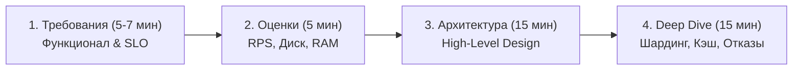
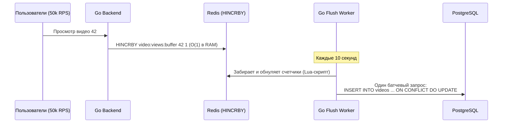
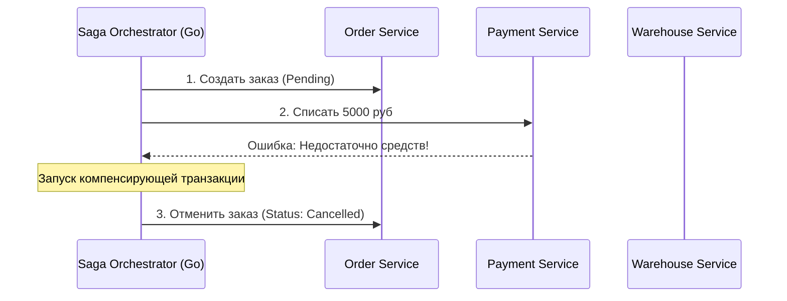

# 🏛️ System Design для Go-разработчика: Руководство и Кейсы с Собеседований

Полное практическое руководство по прохождению секции системного дизайна (System Design Interview) на позиции Middle+, Senior и TechLead Go Developer.

> [!TIP]
> 📚 **Полный комплект подготовки к собеседованиям и практический код:**  
> - 📖 **[README.md (Главное оглавление базы знаний по Go)](README.md)** — 6 томов с глубоким разбором языка, рантайма GMP, памяти и GC; краткая справка — в [go-core-cheatsheet.md](go-core-cheatsheet.md).  
> - 🗄️ **[go-database-interview-guide.md (Гайд по Базам Данных)](go-database-interview-guide.md)** — PostgreSQL, `pgxpool`, транзакции, индексы и Redis.  
> - 💻 **[go-livecoding-guide.md (Live-Coding на Go)](go-livecoding-guide.md)** — 43 задачи по многопоточности, структурам данных и алгоритмам (Junior, Middle, Senior).  
> - 🗄️ **[sql-livecoding-guide.md (Live SQL Задачник)](sql-livecoding-guide.md)** — 28 практических задач на SQL-запросы, JOINs, EXPLAIN ANALYZE и оконные функции.  
> - 🎯 **[homework-tasks.md (Практический задачник Goflex)](homework-tasks.md)** — постановка и разбор всех 32 домашних заданий.  
> - 🗺️ **[course-codebase-guide.md (Путеводитель по кодовой базе)](course-codebase-guide.md)** — сквозная карта курса, лекционные примеры (00–21), проекты GoSearch и Lynks, ДЗ (homework-02–20).  
> - 💻 **Код лекций:** [14-RPC](file:///Users/user/workspace/golang_projects/go-core-4/go_course_4/14-RPC), [17-system-design](file:///Users/user/workspace/golang_projects/go-core-4/go_course_4/17-system-design), [18-microservices](file:///Users/user/workspace/golang_projects/go-core-4/go_course_4/18-microservices), [19-queue](file:///Users/user/workspace/golang_projects/go-core-4/go_course_4/19-queue), [20-NoSQL](file:///Users/user/workspace/golang_projects/go-core-4/go_course_4/20-NoSQL).  
> - 📁 **Решения ДЗ:** [homework-17](file:///Users/user/workspace/golang_projects/go-core-4/go_course_4/homework-17) (Clean Architecture), [homework-18](file:///Users/user/workspace/golang_projects/go-core-4/go_course_4/homework-18) (URL shortener микросервис), [homework-19](file:///Users/user/workspace/golang_projects/go-core-4/go_course_4/homework-19) (Kafka брокер событий), [homework-20](file:///Users/user/workspace/golang_projects/go-core-4/go_course_4/homework-20) (Lynks: PostgreSQL + Redis Cache-Aside).

---

## 📑 Оглавление

1. [Фреймворк прохождения System Design интервью за 45 минут](#1-фреймворк-прохождения-system-design-интервью-за-45-минут)
   - [1.1. Шаг 1: Требования и границы системы (Requirements & Scope)](#11-шаг-1-требования-и-границы-системы-requirements--scope)
   - [1.2. Шаг 2: Расчет мощностей и нагрузок (Capacity Estimations)](#12-шаг-2-расчет-мощностей-и-нагрузок-capacity-estimations)
   - [1.3. Шаг 3: Высокоуровневая архитектура (High-Level Architecture)](#13-шаг-3-высокоуровневая-архитектура-high-level-architecture)
   - [1.4. Шаг 4: Детализация и масштабирование (Deep Dive & Bottlenecks)](#14-шаг-4-детализация-и-масштабирование-deep-dive--bottlenecks)
2. [Архитектурный кейс 1: Сервис сокращения ссылок (URL Shortener типа Bitly)](#2-архитектурный-кейс-1-сервис-сокращения-ссылок-url-shortener-типа-bitly)
   - [2.1. Сбор требований и расчеты (RPS, Storage)](#21-сбор-требований-и-расчеты-rps-storage)
   - [2.2. Генерация коротких ID: Base62 vs KGS (Key Generation Service)](#22-генерация-коротких-id-base62-vs-kgs-key-generation-service)
   - [2.3. Кэширование в Redis и Фильтр Блума (Bloom Filter)](#23-кэширование-в-redis-и-фильтр-блума-bloom-filter)
   - [2.4. Шардирование базы данных PostgreSQL](#24-шардирование-базы-данных-postgresql)
3. [Архитектурный кейс 2: Высоконагруженный сервис уведомлений (Notification Service)](#3-архитектурный-кейс-2-высоконагруженный-сервис-уведомлений-notification-service)
   - [3.1. Топология очередей Kafka и изоляция приоритетов](#31-топология-очередей-kafka-и-изоляция-приоритетов)
   - [3.2. Worker Pool на Go и защита внешних провайдеров (Circuit Breaker)](#32-worker-pool-на-go-и-защита-внешних-провайдеров-circuit-breaker)
   - [3.3. Идемпотентность и дедупликация (Idempotency Keys в Redis)](#33-идемпотентность-и-дедупликация-idempotency-keys-в-redis)
4. [Архитектурный кейс 3: Высоконагруженный счетчик просмотров (High-Load View Counter)](#4-архитектурный-кейс-3-высоконагруженный-счетчик-просмотров-high-load-view-counter)
   - [4.1. Почему прямой UPDATE в PostgreSQL убивает базу при 50k RPS](#41-почему-прямой-update-в-postgresql-убивает-базу-при-50k-rps)
   - [4.2. Буферизация инкрементов в Redis и сброс пачками (Batching в Go)](#42-буферизация-инкрементов-в-redis-и-сброс-пачками-batching-в-go)
   - [4.3. Дедупликация уникальных просмотров через HyperLogLog](#43-дедупликация-уникальных-просмотров-через-hyperloglog)
5. [Архитектурный кейс 4: Обработка заказов в распределенной среде (E-Commerce Saga Pattern)](#5-архитектурный-кейс-4-обработка-заказов-в-распределенной-среде-e-commerce-saga-pattern)
   - [5.1. Почему 2PC неприменим в микросервисах](#51-почему-2pc-неприменим-в-микросервисах)
   - [5.2. Паттерн Saga: Оркестрация на Go против Хореографии](#52-паттерн-saga-оркестрация-на-go-против-хореографии)
   - [5.3. Паттерн Transactional Outbox + Debezium CDC](#53-паттерн-transactional-outbox--debezium-cdc)
   - [5.4. Компенсирующие транзакции при сбоях](#54-компенсирующие-транзакции-при-сбоях)
6. [Топ задач System Design на собеседованиях и рекомендованная литература](#6-топ-задач-system-design-на-собеседованиях-и-рекомендованная-литература-вебинар-дмитрия-титова)

---

## 1. Фреймворк прохождения System Design интервью за 45 минут

System Design — это не проверка знания готовых ответов, а оценка инженерного мышления: умения задавать правильные вопросы, аргументировать компромиссы (trade-offs) и декомпозировать сложные системы.



---

### 1.1. Шаг 1: Требования и границы системы (Requirements & Scope)

Никогда не начинайте рисовать схему сразу. Первые 5 минут посвятите диалогу с интервьюером:

1. **Функциональные требования (Functional Requirements):**
   - Что система *должна* делать? (например: сократить ссылку, перенаправить по ссылке, показать аналитику).
   - Что система делать *НЕ* должна? (Out of scope: не делаем личный кабинет, авторизацию, монетизацию).
2. **Нефункциональные требования (Non-Functional Requirements):**
   - **Доступность (Availability):** 99.99% («четыре девятки» = не более 52 минут простоя в год).
   - **Задержки (Latency):** Редирект $P99 < 20$ мс, создание ссылки $P99 < 100$ мс.
   - **Согласованность (Consistency):** Eventual Consistency (допустимо, если аналитика обновится через несколько секунд).

---

### 1.2. Шаг 2: Расчет мощностей и нагрузок (Capacity Estimations)

Интервьюеру важны порядок цифр и здравый смысл. Используйте удобные округления:  
$$\text{В сутках } 86\,400 \text{ секунд } \approx 100\,000 \text{ секунд (для грубой оценки)}$$

#### Шаблон расчета:
- **Пользователи:** 100M активных пользователей в месяц (MAU), 10M в день (DAU).
- **Соотношение чтение/запись (Read/Write Ratio):** Для большинства сервисов чтений в 10–100 раз больше, чем записей (например, $100:1$).
- **RPS на запись:** $10\,000\,000 \text{ записей в день} / 100\,000 \text{ сек} = 100 \text{ Write RPS}$. В пике $\times 3 \approx 300 \text{ Write RPS}$.
- **RPS на чтение:** $100 \times 100 = 10\,000 \text{ Read RPS}$. Пик $\approx 30\,000 \text{ Read RPS}$.
- **Хранилище на 5 лет:**
  - Размер 1 записи: $500 \text{ байт}$.
  - $100 \text{M новых записей в месяц} \times 12 \times 5 = 6 \text{ миллиардов записей}$.
  - $6 \times 10^9 \times 500 \text{ байт} = 3 \text{ ТБ данных}$. Один сервер справится по диску, но память под индексы потребует шардирования.
- **Память для кэширования (Правило Парето 80/20):**
  - 20% популярных ссылок генерируют 80% трафика.
  - Грубая верхняя оценка: $10\,000 \text{ RPS} \times 86\,400 \text{ сек} \times 500 \text{ байт} \times 0.2 \approx 86 \text{ ГБ RAM}$. Здесь каждый запрос условно считается обращением к новой записи; на практике популярные ссылки повторяются, и реальный «горячий» набор уникальных записей гораздо меньше. Даже 86 ГБ — это объём, который помещается в небольшой кластер Redis из нескольких узлов.

---

### 1.3. Шаг 3: Высокоуровневая архитектура (High-Level Architecture)

Нарисуйте стандартные слои системы:
1. **Клиенты:** Мобильные приложения, браузеры.
2. **DNS & CDN:** Cloudflare/CloudFront для кэширования статики и завершения SSL.
3. **Load Balancer (Nginx / Envoy / AWS ALB):** Балансировка трафика между Go-сервисами (Round Robin / Least Connections).
4. **Stateless Go Application Servers:** Сервисы без локального состояния в памяти (легко масштабируются горизонтально в K8s).
5. **Cache Layer (Redis Cluster):** Чтение горячих данных с задержкой $< 2$ мс.
6. **Primary Storage (PostgreSQL Cluster):** Master для записи, Read-Replicas для чтения.
7. **Message Broker (Kafka / RabbitMQ):** Асинхронная отправка аналитики и тяжелых фоновых задач.

---

### 1.4. Шаг 4: Детализация и масштабирование (Deep Dive & Bottlenecks)

Интервьюер спросит: *«Что сломается первым, если нагрузка вырастет в 10 раз?»*.  
Будьте готовы обсудить:
- Отказ Master-ноды базы данных (Failover через Patroni / Raft).
- Инвалидацию кэша (Cache Stampede, Cache Avalanche).
- Шардирование базы данных по Hash-функции.
- Мониторинг и алерты (Prometheus, Grafana, Jaeger).

---

## 2. Архитектурный кейс 1: Сервис сокращения ссылок (URL Shortener типа Bitly)

### 2.1. Сбор требований и расчеты (RPS, Storage)
- **Функционал:** Сократить длинный URL в строку из 7 символов (`https://clck.ru/Xy7Z1a`). При переходе по короткой ссылке делать HTTP 301/302 редирект.
- **Масштаб:** 100M новых ссылок в месяц (≈ 3,3M в сутки, то есть в среднем около 40 Write RPS, до ≈ 100 в пике). Чтение — порядка $10\,000$ Read RPS.
- **HTTP 301 vs 302:**  
  - `301 Moved Permanently`: Браузер кэширует редирект намертво. Сервер разгружается, но мы теряем возможность собирать аналитику кликов!  
  - `302 Found (Temporary Redirect)`: Браузер каждый раз обращается к нашему сервису. Мы собираем 100% кликов для аналитики.

---

### 2.2. Генерация коротких ID: Base62 vs KGS (Key Generation Service)

Символьный алфавит Base62: `[0-9, a-z, A-Z]` (всего 62 символа).  
Длина строки в 7 символов дает:
$$62^7 = 3.52 \text{ триллиона уникальных комбинаций}$$

#### Почему наивный хэш MD5/SHA-256 — плохая идея?
Если взять `MD5(long_url)` и отрезать первые 7 символов, возникнут **коллизии** (разные длинные URL дадут одинаковые 7 символов). Проверка коллизии в базе данных на каждый `INSERT` порождает огромный `Read-Before-Write` overhead.

#### ✅ Идиоматичное решение: Auto-Increment ID $\to$ Base62
1. Получаем уникальный целочисленный `ID` из СУБД (например, 64-битный счетчик).
2. Преобразуем число в строку в 62-ричной системе счисления:

> ⚠️ Последовательные ID дают **предсказуемые** ссылки (по `abc1` легко угадать `abc2`), что может раскрывать объём сервиса и позволять перебор. Если это важно, ID перемешивают (например, обратимой перестановкой битов) или используют KGS — сервис, заранее генерирующий пул случайных уникальных ключей. При нескольких шардах БД единый счётчик становится узким местом: для распределённой генерации ID применяют Snowflake-подобные схемы или выдачу диапазонов ID каждому серверу.

```go
package main

import "strings"

const alphabet = "0123456789abcdefghijklmnopqrstuvwxyzABCDEFGHIJKLMNOPQRSTUVWXYZ"

func EncodeBase62(id uint64) string {
	if id == 0 {
		return string(alphabet[0])
	}
	var sb strings.Builder
	for id > 0 {
		rem := id % 62
		sb.WriteByte(alphabet[rem])
		id /= 62
	}
	// Разворачиваем полученную строку
	runes := []rune(sb.String())
	for i, j := 0, len(runes)-1; i < j; i, j = i+1, j-1 {
		runes[i], runes[j] = runes[j], runes[i]
	}
	return string(runes)
}
```

---

### 2.3. Кэширование в Redis и Фильтр Блума (Bloom Filter)

При переходе по ссылке:
1. Запрос проверяется через **Фильтр Блума (Bloom Filter)** в памяти:
   - Если фильтр ответил `false` — ссылка **гарантированно не существует** в системе (у фильтра Блума нет ложноотрицательных срабатываний, но возможны ложноположительные). Сразу отвечаем `404 Not Found`, защищая базу данных от атаки перебором (Cache Penetration). Фильтр нужно заполнять при создании каждой ссылки; удалять элементы из классического фильтра нельзя (для этого есть Counting Bloom Filter).
2. Чтение из **Redis**: `GET short_url`. Если кэш-хит — возвращаем `302 Redirect`.
3. Если кэш-мисс — читаем из PostgreSQL, сохраняем в Redis с `TTL = 7 дней` (Cache-Aside).

---

### 2.4. Шардирование базы данных PostgreSQL

Таблица:
```sql
CREATE TABLE urls (
    id BIGINT PRIMARY KEY,
    short_key VARCHAR(10) NOT NULL UNIQUE,
    original_url TEXT NOT NULL,
    user_id BIGINT,
    created_at TIMESTAMP NOT NULL DEFAULT NOW()
);
```

Шардирование по ключу `short_key`:  
$$\text{Shard ID} = \text{MurmurHash3}(\text{short\_key}) \pmod{\text{Количество шардов}}$$  
Это обеспечивает равномерное распределение ссылок по 8–16 независимым нодам PostgreSQL. ⚠️ Схема `hash mod N` плохо переживает изменение числа шардов (при смене `N` почти все ключи «переезжают»). Поэтому на практике используют **консистентное хэширование** или заранее создают много логических шардов (например, 1024) и распределяют их по физическим узлам.

---

## 3. Архитектурный кейс 2: Высоконагруженный сервис уведомлений (Notification Service)

### 3.1. Топология очередей Kafka и изоляция приоритетов

Сервис должен отправлять Push-уведомления (iOS/Android), SMS и Email.  
**Главный риск:** Массовая маркетинговая рассылка («Скидки 50%!») на 10 миллионов пользователей забивает очередь, и критические транзакционные SMS с кодами входа в банк встают в конец очереди на 2 часа!

#### ✅ Решение: Изоляция топиков по приоритетам (Priority Isolation)
1. Топик `notifications.high-priority`: Коды подтверждения 2FA, списания денег, алерты безопасности.
2. Топик `notifications.low-priority`: Маркетинговые акции, дайджесты.
3. Топик `notifications.dlq`: Dead Letter Queue для упавших сообщений после 3 неудачных попыток.

---

### 3.2. Worker Pool на Go и защита внешних провайдеров (Circuit Breaker)

Внешние шлюзы (Twilio для SMS, Apple APNS, Google FCM) имеют жесткие лимиты на RPS и могут временно падать.

```go
// Воркер на Go вычитывает пачку сообщений и отправляет через Circuit Breaker
// (схема упрощена: сигнатуру Execute нужно подгонять под конкретную библиотеку, например sony/gobreaker):
func (w *NotificationWorker) processNotification(ctx context.Context, msg Notification) error {
    return w.circuitBreaker.Execute(func() error {
        // Ограничиваем RPS через Rate Limiter:
        if err := w.rateLimiter.Wait(ctx); err != nil {
            return err
        }
        return w.smsProvider.Send(ctx, msg.Phone, msg.Text)
    })
}
```

Если провайдер SMS начинает отвечать ошибками 500/504, **Circuit Breaker** размыкает цепь (State: `Open`), мгновенно отправляя сообщения в резервный шлюз или откладывая в повторную очередь без перегрузки сети.

---

### 3.3. Идемпотентность и дедупликация (Idempotency Keys в Redis)

Сеть ненадежна. Если шлюз отправил SMS, но упал по таймауту до возврата ответа клиенту, повторная отправка приведет к отправке дубликата.  
**Решение:** Каждый запрос на отправку содержит `idempotency_key` (UUID):
1. Воркер делает: `SET idempotency_key:123 "PROCESSING" NX EX 300`.
2. Если ключ уже существует — сообщение игнорируется (дубликат).
3. После успешной отправки статус меняется на `"COMPLETED"`.

---

## 4. Архитектурный кейс 3: Высоконагруженный счетчик просмотров (High-Load View Counter)

### 4.1. Почему прямой UPDATE в PostgreSQL убивает базу при 50k RPS

Когда популярный блогер выкладывает видео, тысячи пользователей одновременно смотрят его.  
Если выполнять:
```sql
UPDATE videos SET views = views + 1 WHERE id = 42;
```
1. **Row Lock Contention:** Строка с `id = 42` блокируется эксклюзивным локом на время каждой транзакции. 50,000 транзакций встают в очередь ожидания.
2. **MVCC Tuple Bloat:** Каждое обновление создает новую версию строки на диске и генерирует запись в WAL-логе. Диск перегружается операциями ввода-вывода (IOPS).

> Цена решения ниже — **допустимая потеря части счётчика**: если Redis упадёт до очередного сброса, накопленные за последние секунды инкременты пропадут. Для счётчика просмотров это приемлемо; для денег — нет (там нужны транзакции).

---

### 4.2. Буферизация инкрементов в Redis и сброс пачками (Batching в Go)



#### SQL-сброс пачки (один запрос вместо 500,000):
```sql
INSERT INTO video_stats (video_id, views)
VALUES 
    (42, 15420),
    (99, 4320),
    (105, 810)
ON CONFLICT (video_id) 
DO UPDATE SET views = video_stats.views + EXCLUDED.views;
```

---

### 4.3. Дедупликация уникальных просмотров через HyperLogLog

Если требуется считать не просто клики, а **уникальных зрителей**:
- Хранить `SET user_id` для видео с 100M просмотров требует:  
  $100\,000\,000 \times 8 \text{ байт} \approx 800 \text{ МБ RAM на одно видео}$ (катастрофа для памяти).
- **HyperLogLog в Redis:** Занимает ровно **12 Килобайт** памяти независимо от количества зрителей и дает погрешность всего $0.81\%$:
  - Добавление просмотра: `PFADD video:unique:42 user_123`
  - Получение уникальных просмотров: `PFCOUNT video:unique:42`

---

## 5. Архитектурный кейс 4: Обработка заказов в распределенной среде (E-Commerce Saga Pattern)

### 5.1. Почему 2PC неприменим в микросервисах

Двухфазный коммит (Two-Phase Commit / 2PC):
- Блокирует ресурсы (строки в базе) на время сетевого раунда между сервисом Заказов, сервисом Оплаты и Складом.
- Если сервис Оплаты завис или упал, вся система парализована. 2PC заметно снижает доступность (Availability) системы: координатор и участники блокируются при сбое любого из них.

---

### 5.2. Паттерн Saga: Оркестрация на Go против Хореографии



**Оркестратор на Go:**  
Центральный конечный автомат (State Machine), который последовательно вызывает микросервисы через gRPC/Kafka и сохраняет статус саги в БД. При любой ошибке оркестратор вызывает **компенсирующие транзакции** в обратном порядке.

---

### 5.3. Паттерн Transactional Outbox + Debezium CDC

Чтобы гарантировать, что заказ сохранился в PostgreSQL **И** событие гарантированно попало в Kafka (решение проблемы Dual Write):

1. Go-сервис в **одной локальной транзакции** пишет в таблицу `orders` и таблицу `outbox`:
```sql
BEGIN;
INSERT INTO orders (id, user_id, total, status) VALUES (101, 42, 5000, 'NEW');
INSERT INTO outbox (event_id, aggregate_type, aggregate_id, payload) 
VALUES ('uuid-1', 'ORDER', 101, '{"status": "NEW", "total": 5000}');
COMMIT;
```
2. **Debezium CDC (Change Data Capture)** непрерывно читает WAL-лог PostgreSQL и с минимальной задержкой перекладывает записи из `outbox` в топик Kafka `orders.events` с гарантией At-Least-Once (потребители должны быть идемпотентными).

---

### 5.4. Компенсирующие транзакции при сбоях

Каждый шаг саги обязан иметь парную компенсирующую операцию:

| Прямое действие (Forward Action) | Компенсирующее действие (Compensating Action) |
| :--- | :--- |
| Резервирование товара на складе (`quantity - 1`) | Снятие брони (`quantity + 1`) |
| Списание денег с баланса (`balance - 500`) | Возврат денег на баланс (`balance + 500`) |
| Создание заказа со статусом `NEW` | Перевод заказа в статус `CANCELLED` |

Компенсирующие транзакции должны быть строго **идемпотентными** (повторный вызов не должен дважды возвращать деньги).

---

## 6. Топ задач System Design на собеседованиях и рекомендованная литература (Вебинар Дмитрия Титова)

На технических собеседованиях в бигтех-компании задачи на проектирование систем повторяются. Чаще всего кандидатам предлагают спроектировать одну из 4 ключевых систем:

1. **Сервис сокращения ссылок (URL Shortener типа Bitly / Lynks)**:
   - *Фокус секции:* Алгоритм генерации коротких хешей (Base62 vs KGS), двухуровневое кэширование (Redis / In-Memory), паттерн Cache-Aside, шардирование БД по `short_url`.
2. **Видеохостинг и стриминг (YouTube / VK Видео / Netflix)**:
   - *Фокус секции:* Асинхронная транскодировка видео через очереди сообщений (Kafka/RabbitMQ), раздача тяжелого контента через CDN, chunked streaming (HLS/DASH), метаданные в NoSQL/PostgreSQL.
3. **Социальная сеть и лента новостей (Facebook / VK Newsfeed)**:
   - *Фокус секции:* Модель Fan-Out on Write (Push для обычных пользователей) против Fan-Out on Read (Pull для селебрити/каналов-миллионников), кэширование лент в Redis, графы дружбы/подписок.
4. **Мессенджер в реальном времени (WhatsApp / Telegram)**:
   - *Фокус секции:* Полнодуплексные WebSockets-соединения, Session Gateway, шина событий (Kafka/Redis PubSub), синхронизация статусов онлайна и доставки сообщений (Ack).

---

### Рекомендованная литература и первоисточники:

- 📐 **[Alex Xu: System Design Interview – An Insider's Guide (Том 1 и 2)](https://www.amazon.com/System-Design-Interview-insiders-Second/dp/B08CMF2CQF)** — настольная книга с пошаговыми разборами YouTube, URL Shortener, Chat System, Rate Limiter.
- 🌟 **[The System Design Primer (GitHub donnemartin/system-design-primer)](https://github.com/donnemartin/system-design-primer)** — главный открытый интерактивный учебник по масштабируемым архитектурам, расчету емкостей (CAP-теорема, ACID, кэш, шардинг).
- 🏛️ **[Роберт Мартин: «Чистая архитектура» (Clean Architecture)](https://www.amazon.com/Clean-Architecture-Craftsmans-Software-Structure/dp/0134494164)** — разделение ответственности, Dependency Inversion, изоляция бизнес-правил от баз данных и веб-фреймворков.

